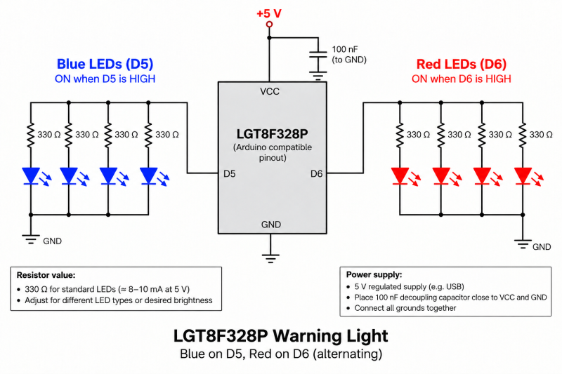
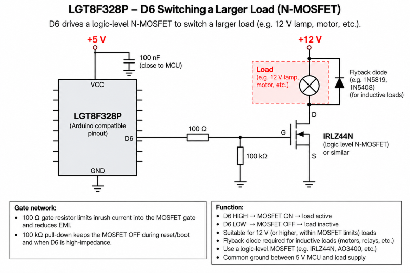
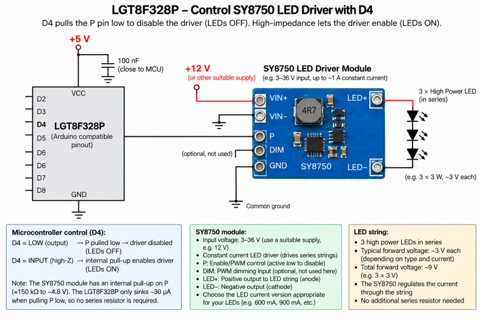

 
# Blink Example for LGT8F328P

> Simple Sketch for LGT8F328P with some Surprises

Enhanced blink sketch that can also drive LEDs, MOSFETs, or LED controllers.

## Overview

This sketch blinks the built-in LED and simultaneously controls four GPIOs in different ways. 


It demonstrates regular push-pull outputs, the LGT8F328P's High Drive (HDR) capability, and GPIOs alternating between an active output state and high impedance.

> [!IMPORTANT]
> If you are using a LGT8F328P board for the first time, it can be challenging to connect it via USB to your PC. If you experience difficulties, [here is a quick check list](https://done.land/components/microcontroller/families/arduino/lgt8f328p/#connection-issues) that may help identify and fix the issue.


## Platform.IO

This is the `platform.io` configuration:

````
[env:LGT8F328P]
platform = lgt8f
board = LGT8F328P
framework = arduino
board_build.f_cpu = 8000000L        ; 8 MHz internal clock
board_build.clock_source = 1         ; 1 = internal, 2 = external
upload_flags = 
    -u
    -V
    -D
upload_speed = 57600
monitor_dtr = 0
monitor_rts = 0
````

## Firmware

A typical blink example for this type of MCU would be as simple as this:

<details><summary>Enhanced Blink Sketch</summary><br/>


````cpp
#include <Arduino.h>

void setup() {
  pinMode(LED_BUILTIN, OUTPUT);
}

void loop() {
  digitalWrite(LED_BUILTIN, HIGH);
  delay(400);
  digitalWrite(LED_BUILTIN, LOW);
  delay(400);
}
````

To better leverage the capabilities of the LGT8F328P MCU, here is an enhanced version:

````c++
#include <Arduino.h>

/*
 * LGT8F328P GPIO Output Test
 * ---------------------------------------------------------------------------
 *
 * Four GPIOs toggle synchronously between two states:
 *
 *   PIN_ACTIVE_HIGH (D5, HDR on)
 *     Phase 1: HIGH
 *     Phase 2: LOW
 *     Push-pull output in both states.
 *
 *   PIN_ACTIVE_LOW (D6, HDR on)
 *     Phase 1: LOW
 *     Phase 2: HIGH
 *     Push-pull output in both states.
 *
 *   PIN_LOW_HIZ (D4, HDR off)
 *     Phase 1: LOW
 *     Phase 2: High impedance (input)
 *     The GPIO actively pulls LOW but never drives HIGH.
 *     Intended for signals such as the SY8750 PWM input:
 *       LOW  = SY8750 disabled / LED OFF
 *       Hi-Z = SY8750 internal pull-up / LED ON
 *
 *   PIN_HIGH_HIZ (D3, HDR off)
 *     Phase 1: HIGH
 *     Phase 2: High impedance (input)
 *     The GPIO actively drives HIGH but never drives LOW.
 *
 * D5 and D6 are configured for LGT8F328P High Drive (HDR):
 *   HDR0 = D5 / PD5
 *   HDR1 = D6 / PD6
 *
 * D3 and D4 use their normal GPIO drive capability.
 *
 * Blink timing is controlled by ON_TIME_MS and OFF_TIME_MS.
 */

// -----------------------------------------------------------------------------
// Configuration
// -----------------------------------------------------------------------------

constexpr uint32_t ON_TIME_MS  = 400;
constexpr uint32_t OFF_TIME_MS = 400;

constexpr uint8_t PIN_ACTIVE_HIGH = 5;  // D5, HDR0
constexpr uint8_t PIN_ACTIVE_LOW  = 6;  // D6, HDR1
constexpr uint8_t PIN_LOW_HIZ     = 4;  // D4, LOW / Hi-Z
constexpr uint8_t PIN_HIGH_HIZ    = 3;  // D3, HIGH / Hi-Z

// -----------------------------------------------------------------------------
// Setup
// -----------------------------------------------------------------------------

void setup()
{
    pinMode(LED_BUILTIN, OUTPUT);

    // Enable LGT8F328P High Drive for D5 (HDR0) and D6 (HDR1).
    HDR |= (1 << HDR0) | (1 << HDR1);

    // D5 and D6 remain push-pull outputs.
    pinMode(PIN_ACTIVE_HIGH, OUTPUT);
    pinMode(PIN_ACTIVE_LOW, OUTPUT);

    // D4 and D3 start electrically disconnected (high impedance).
    pinMode(PIN_LOW_HIZ, INPUT);
    pinMode(PIN_HIGH_HIZ, INPUT);
}

// -----------------------------------------------------------------------------
// Main loop
// -----------------------------------------------------------------------------

void loop()
{
    // -------------------------------------------------------------------------
    // Phase 1
    //
    // D5 / ACTIVE_HIGH : HIGH
    // D6 / ACTIVE_LOW  : LOW
    // D4 / LOW_HIZ     : LOW
    // D3 / HIGH_HIZ    : HIGH
    // -------------------------------------------------------------------------

    digitalWrite(LED_BUILTIN, HIGH);

    digitalWrite(PIN_ACTIVE_HIGH, HIGH);
    digitalWrite(PIN_ACTIVE_LOW, LOW);

    // D4: actively pull LOW.
    // Set the output latch first to prevent a momentary HIGH pulse when the
    // output driver is enabled.
    digitalWrite(PIN_LOW_HIZ, LOW);
    pinMode(PIN_LOW_HIZ, OUTPUT);

    // D3: actively drive HIGH.
    // Set the output latch first before enabling the output driver.
    digitalWrite(PIN_HIGH_HIZ, HIGH);
    pinMode(PIN_HIGH_HIZ, OUTPUT);

    delay(ON_TIME_MS);

    // -------------------------------------------------------------------------
    // Phase 2
    //
    // D5 / ACTIVE_HIGH : LOW
    // D6 / ACTIVE_LOW  : HIGH
    // D4 / LOW_HIZ     : Hi-Z
    // D3 / HIGH_HIZ    : Hi-Z
    // -------------------------------------------------------------------------

    digitalWrite(LED_BUILTIN, LOW);

    digitalWrite(PIN_ACTIVE_HIGH, LOW);
    digitalWrite(PIN_ACTIVE_LOW, HIGH);

    // INPUT without INPUT_PULLUP disables the output drivers, leaving D4 and
    // D3 electrically high-impedance.
    pinMode(PIN_LOW_HIZ, INPUT);
    pinMode(PIN_HIGH_HIZ, INPUT);

    delay(OFF_TIME_MS);
}
````

</details>    


This sketch does not just blink the built-in LED. It also switches four GPIOs with the same timing but using different output modes, so you can most likely use one of these four directly to control your particular load:

* `D2`:   
  HIGH when the built-in LED is ON, otherwise LOW. HDR is enabled for increased source and sink capability.

* `D3`:   
  LOW when the built-in LED is ON, otherwise HIGH. HDR is enabled for increased source and sink capability.

* `D4`:    
  LOW when the built-in LED is ON, otherwise FLOATING (Hi-Z).

* `D5`:    
  HIGH when the built-in LED is ON, otherwise FLOATING (Hi-Z).

## Use Case

Turn this into an emergency light. Many scales are possible:

* **Small LEDs:**   
  Connect small LEDs directly to either of the two HDR GPIOs, provided that the total GPIO current remains within the total 80 mA limit of the HDR mode. Do not forget an appropriate series resistor for each LED.

  

  If you operate standard LEDs at 20 mA each, four LEDs would still fit the total of 80 mA per GPIO in HDR mode. Choose the series resistors according to the LED forward voltage, supply voltage, and desired current.

  If you connect four **blue** LEDs to one GPIO and four **red** LEDs to the other, you get an emergency light that alternates between red and blue.

* **Power-LEDs and other High Current Lamps:**    
  Use a MOSFET or relay controlled by the GPIO(s).

  

* **Control LED Driver:**   
  To run power LEDs with constant-current control, use an LED driver module with PWM control and connect its PWM input appropriately.

  With a particular **SY8750**-based LED driver I am using, the `PWM` control pin needs to be floating for the LEDs to be ON and pulled LOW for them to be OFF. In this case, I'd pick `D4`, which alternates between LOW and FLOATING (Hi-Z).

  


> Tags: LGT8F328P, HDR, Flasher, Emergency Light, Alternating, PWM, SY8750

[Visit Page on Website](https://done.land/components/microcontroller/families/arduino/lgt8f328p/examplecode/blink?225936091921264709) - created 2026-09-20 - last edited 2026-09-20
