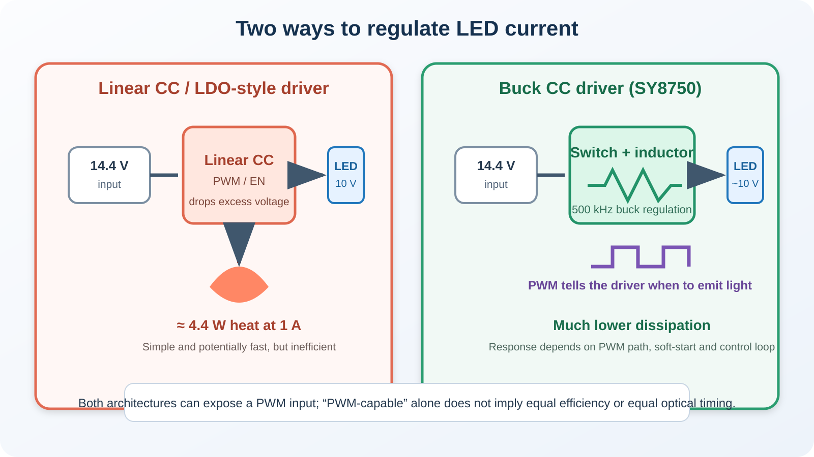
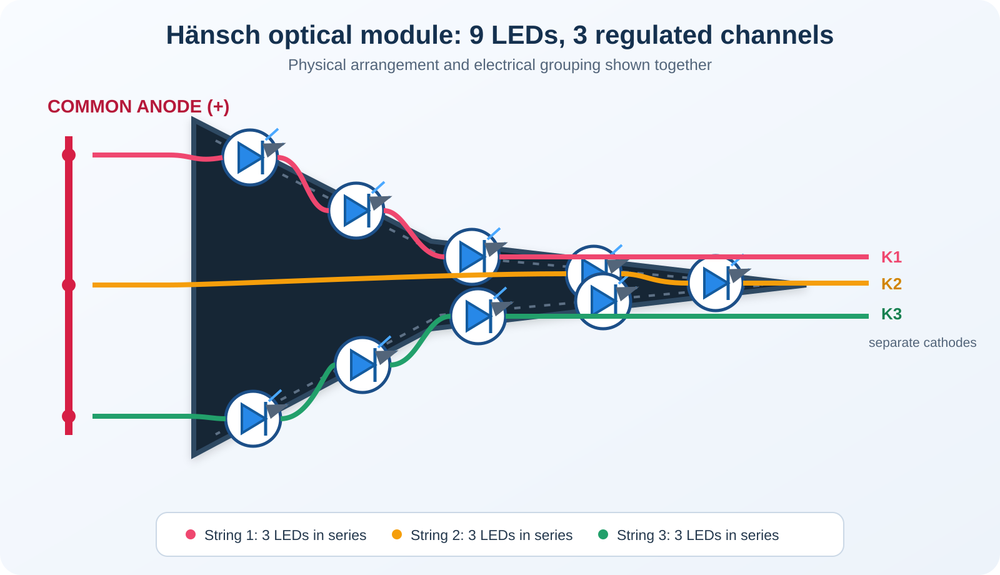
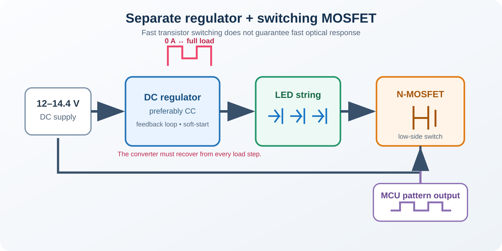
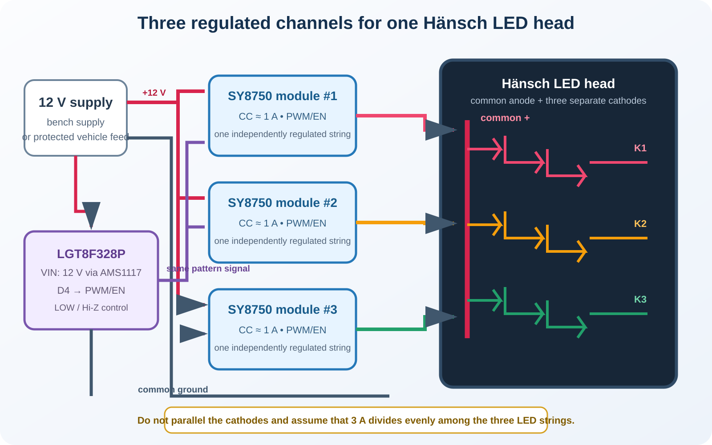
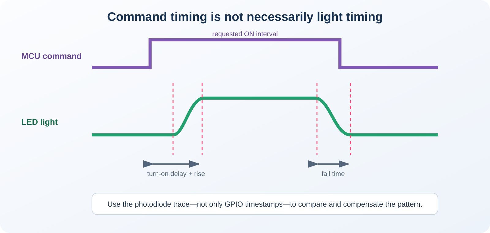

# Flashing High Performance LEDs (Emergeny Lights)

> Using an inexpensive SY8750-based buck driver and an LGT8F328P to control an original nine-LED Hänsch optical module

Like all LEDs, high-power LEDs require current control, or else they will be destroyed. While a simple resistor is usually sufficient for a small indicator LED, high-power LEDs would produce way too much excess heat. 

In this article, I am driving high-power emergency light LEDs with flashing light patterns and illustrate affordable and simple techniques to address a number of challenges:

* **Efficient Constant-Current LED Driving:**   
Efficient buck-like LED driving without the losses you experience with simple resistors.   
* **Fast Switching:**   
While normal LED drivers work well with continuous light, high-frequency flash patterns introduce challenges to a DC regulator. Sharp light patterns require the regulator to switch fast, without overshoot and other regulation effects.

## Overview

This article takes a commercial LED emergency light module, and adds the required driver electronics to safely operate it with custom flash patterns. You can of course use *any* high-power LED.

Here are the parts used:

* **LEDs:**   
  Hänsch DBS4000 main LED light module commonly used by German police and emergency services.

  


* **Constant Current Driver:**   
  Inexpensive [5–85 V adjustable constant-current module](https://de.aliexpress.com/item/1005011576461293.html)    
* **Pattern Generator:**     
  Inexpensive Arduino Clone with a modified [Blink sketch](https://done.land/components/microcontroller/families/arduino/lgt8f328p/examplecode/blink/) that drives the `PWM` pin of the constant current driver.

> [!IMPORTANT]
> Blue emergency lights are regulated equipment. This experiment is intended for lab use and technical analysis. Do not operate blue warning lights on public roads or in a way that could be mistaken for an authorized emergency signal.


## LEDs Need Current Control

An LED is fundamentally a current-driven component. Once its forward voltage is reached, it fully utilizes the current to convert it to light. Just a small voltage increase beyond this can cause a huge  current increase, and this excess current is converted directly to heat, quickly destroying the LED.

For a low-power indicator LED, current is normally limited with a series resistor:

```text
VCC ── resistor ── LED ── GND
```

At 5–20 mA, this is inexpensive and entirely adequate. The resistor converts the excess voltage into heat, but the power involved is small, so things work just fine.

### High-Power LEDs Are Different

At higher currents, the same principle produces much more heat. Assume a string of three blue high-performance LEDs needs approximately 10 V at 1 A while the vehicle supply is at 14.4 V. A resistor or linear current regulator must dissipate approximately:

```text
PLOSS = (VIN − VLED) × ILED
PLOSS = (14.4 V − 10 V) × 1 A
PLOSS = 4.4 W
```

Those 4.4 W are produced in addition to the heat generated by the LEDs. While a resistor or linear constant-current driver *can* still work, removing its excess heat becomes increasingly unproportional and wasteful.

A switching constant-current regulator works differently: It transfers energy through a switch and inductor, much like a buck converter, and regulates the current through the LED string with substantially lower losses.




### The Original DBS 4000 LED Module

The test object is an original DBS 4000 blue main beacon module. The complete head contains nine Cree `XP-E2` LEDs in a sideways-V arrangement:

- Five LEDs form the upper arm.
- Four LEDs form the lower arm.
- Electrically, the LEDs are divided into three strings.
- Each string contains three LEDs in series.
- The three strings share a common anode.
- Each string has its own cathode connection.
- The optical head contains no current regulator.




The LED head is separate from the original Hänsch controller and contains the LED PCB, optics, and thermal structure, but not the electronics that regulate or switch the LED current. Electrically, it is three raw high-power LED strings consisting of three LEDs each, with a common positive connection.

The original design decition was to keep the forward voltage of each LED string slightly below the anticipated 12V car supply voltage so that the driver electronics would need to adjust the voltage only slightly in a *Buck* fashion.

Within each group, the three LEDs are in series. The same current flows through all three, while their forward voltages add:

```text
One string:

common anode ──► XP-E2 ──► XP-E2 ──► XP-E2 ── cathode
                       approximately 1 A
```

Three blue `XP-E2` LEDs typically require roughly 9–10.5 V at high current. This is a useful match for a nominal 12 V supply, provided the driver still has enough voltage headroom.

### Common Anode

In this specific lamp design, all three LED strings share a **common anode**: their "Plus"-side is connected. This has important consequences for designing a driver:

* **Parallel Connection:**   
It is **not** possible to drive the strings in parallel. Tying all three cathodes together and feeding them from one constant-current channel does **not** guarantee that the total current divides equally. Small differences in forward voltage and temperature can make one branch take more current than the others.

* **Serial Connection:**   
It is **not** possible to drive the strings in series because the strings already share a common anode.

So the only feasible design decicions are:

* **Change Lamp Circuitry:**    
Physically alter the way the nine LEDs are connected on the lamp PCB. This would involve identifying and cutting traces.   

* **Individual Drivers:**   
Use one driver per string. This is a simple and straight-forward solution with a number of advantages:

  - *Current Control:*
    Most cheap LED drivers can deliver only limited current. The ones I intend to use max at 1.5-2.5 A. Operating them at maximum current produces excessive heat, though, and requires additional fans and/or heat sinks. 

    Using one driver per string reduces the current into a more manageable region.
  - *Individual Control:*   
    Using separate drivers introduces the option to control all three strings separately. While you still can make them blink in sync, you could also slightly shift the PWM signals and create other effects, such as rotating lights.
  - *Simplicity:*    
    You can start with one driver and one string and experiment freely before you move on to use the concept with additional drivers on all three strings.   


## Constant Current Versus Constant Voltage

There are two ways of driving the LEDs:

* **Constant Voltage (CV):**    
  Electronically simpler, the input voltage defines how much current the LED takes in. This works well only when the LED properties are well defined and don't change.

  With LED forward-voltage tolerances, forward voltage changes due to temperature changes during operation, and component aging, CV cannot guarantee that the LEDs are driven at the intended current.

* **Constant Current (CC):**
  Here, the supply controls the current, and if i.e. the forward voltage drops due to heating, the CC power supply automatically reduces the voltage to ensure that current stays constant. So CC supplies are much more favorable for LED control.
  
  The reason why some professional emergency equipment manufacturers still choose CV over CC are the fast light patterns: A CC supply needs some time to adjust to variations. When the LED is turned on and off in rapid succession, it may take a CC supply noticeable time to adjust the current, resulting in washed out light patterns or even worse, i.e. overshoots.   

  In addition, carefully filtered central voltage rail plus controlled MOSFET switching in a CV supply may create less conducted or radiated interference (EMI) than several small switching CC converters located at the lamp heads, and low EMI is important for sensitive environments like emergency sites.

In a nutshell, both CV and CC have their individual pros and cons, yet with well-designed electronics, both CV and CC can be used. 

### DIY Conclusions

In a DIY scenario, you don't want to design an overly complex driver. So choosing a CC topology is the simplest and safest approach.

## Designing High Frequency Flashes

You could be intreagued to use a vanilla DC regulator and add a MOSFET to its output to hard-switch the regulator output on and off. This *may* work with some regulators, especially CV.





And it looks attractive because the MOSFET itself switches very quickly. However, the complete system responds much more slowly than the transistor, washing out sharp light patterns, and even potentially damaging your LEDs or other components. Here is why:

### Do not hard-switch regulator output
A switching regulator contains a feedback loop and normally expects specified ranges for:

- Output capacitance
- Minimum and maximum load
- Load-transient speed
- Startup conditions
- Loop stability
- Protection behavior

An emergency-light pattern repeatedly demands a full-scale load step:

```text
0 A → 1 A → 0 A → 1 A
```
Possible side-effects include:

- The unloaded output voltage rising between flashes
- Pulse-skipping or standby mode while the LED is off
- Soft-start being repeated at every pulse
- Delayed current rise
- Overshoot or ringing when the LED reconnects
- Open-load protection being triggered by a downstream MOSFET


With a CC regulator specifically, disconnecting its load is especially problematic: the regulator is trying to maintain current while its output is open, potentially causing overshoot when you turn the LED back on. 

### Do not hard-switch the regulator itself
You could instead place the MOSFET into the regulator **input** path, essentially turning the entire regulator on and off. This avoids the open output and regulation flaws, but every flash then becomes a new regulator startup with its intrinsic delays and unwanted soft start.


### Use a Dimmable Regulator (PWM)

The key is choosing a CC regulator that is capable of **dimming** LEDs. Do not confuse this with drivers that have merely an *Enable* pin (which in most cases switches the entire regulator on and off).

Dimmable regulators have a `PWM` pin. While this pin is primarily used to dim LEDs (by turning them on and off in very high succession), this pin can of course also produce light patterns. In essence, the PWM input is simply a safe digital way of turning the regulator output either on or off, and unlike most `Enable` pins, `PWM` can do this safely at high frequencies.

#### Linear vs. Switching

There are two common integrated approaches:

| Driver type | How it regulates | PWM control | Main disadvantage |
|---|---|---|---|
| Linear CC / LDO-style LED driver | Burns excess voltage as heat | Often available and potentially fast | Dissipation is `(VIN − VLED) × ILED` |
| Switching CC driver | Transfers energy through a buck stage | Often available; response is controller-dependent | More components and switching EMI |

Cheap linear constant-current ICs with PWM or enable inputs can work exactly as intended. They may even provide excellent pulse timing, but they do not solve the excess-heat problem.

## Ideal Driver: SY8750 
The `SY8750` is an example of a near-perfect LED driver for this project: it works as a switching buck constant-current driver. Silergy now lists the part as [`SY22648FCC` (`SY8750FCC`)](https://www.silergy.com/productsview/SY22648FCC) and specifies:

- 5–80 V input range
- Buck constant-current topology
- 500 kHz switching frequency
- Integrated 200 mΩ MOSFET
- PWM and analog dimming
- Up to 2 A LED current

> [!IMPORTANT]
> Some module listings advertise 5–85 V and up to 2.5 A. Those values exceed the official limits published for the SY8750/SY22648 itself. Unless the specific board can be positively identified as using a different controller, the IC manufacturer's 80 V and 2 A limits are the more conservative values.

### Adjustable Driver Module

The AliExpress board combines the LED-driver IC, inductor, freewheel path, current-sense components, current-adjustment potentiometer and PWM interface on one small module.

Labels vary between revisions, so verify the printing and wire colors on the delivered board. Functionally, the connections are:

| Connection | Function | Connect to |
|---|---|---|
| `VIN+` / input red | Positive supply | Protected 12 V supply |
| `VIN−` / input black | Supply return | Ground |
| `LED+` / output red | LED common anode | Hänsch common-anode wire |
| `LED−` / output black | Regulated channel return | One Hänsch string cathode |
| `PWM`, `P` or dimming input | Enables or modulates LED output | LGT8F328P control GPIO |
| PWM ground, if separately exposed | Dimming-signal reference | MCU and module ground |
| `ISET` potentiometer | Adjusts regulated LED current | Set and measure before full-power operation |

For the complete nine-LED Hänsch head, use three driver channels:





Each channel regulates one string. The PWM inputs may receive the same pattern when all nine LEDs should flash together, or separate MCU outputs can control the three strings independently.

### Setting the Constant Current Safely

The onboard potentiometer reportedly increases current when turned clockwise. Do not assume that the delivered position is safe. Set each module separately before connecting all three strings.

The onset is somewhat awkward: the module seems to have a minimum current at around 80-90 mA, so when you start from the minimum position and turn the potentiometer, you'll see no output current increase at first.

The preferred procedure is:

1. Mount the Hänsch LED head on its heat sink.
2. Use a current-limited bench supply at the intended input voltage, initially around 12 V.
3. Turn the current potentiometer fully toward minimum—normally counterclockwise on this module—but verify the behavior rather than forcing the end stop.
4. Connect only one LED string to one driver.
5. Place a suitable ammeter in series with the string, or use a calibrated current probe/shunt.
6. Enable the driver with a continuous signal or long test pulse.
7. Increase the setting slowly until the desired current is reached.
8. Disable the driver, allow the LEDs to cool, and repeat the adjustment for the other channels.
9. Verify current again at the highest intended supply voltage and after the driver has warmed up.

For the first test, start well below 1 A. Confirm polarity, regulation and cooling before approaching the experimentally established working current.

#### Can I use an Electronic Load?

Yes, but only if using an appropriate mode:

| Test load | Suitability | Reason |
|---|---|---|
| Real LED string on its heat sink | **Best final adjustment** | Reproduces the actual forward voltage and thermal behavior |
| Electronic load in constant-voltage (CV) mode | **Good** | Can hold approximately the expected 9–10.5 V while the driver regulates current |
| Power resistor bank | **Good** | Simple, but does not reproduce the LED's nonlinear voltage/current curve |
| Electronic load in constant-current (CC) mode | **Avoid** | The CC source and CC load can fight, hunt or settle unpredictably |
| Direct short circuit | **Never** | Can destroy the regulator. |

If the electronic load supports constant-voltage mode, set it to approximately the expected forward voltage of one three-LED string and ensure that its power rating can absorb the test current. At 10 V and 1 A, it must continuously dissipate about 10 W.

#### What to avoid?

* **Never Short-Circuit:**    
  Many generic CV/CC converter instructions suggest shorting the output through the 10 A range of a multimeter and then adjusting the current limit. That method can be acceptable for a converter explicitly designed and documented for it. It is not the best method for this LED driver, nor for many others.    

  The `SY8750` family includes short-circuit protection. During a short, the controller may enter a protection or foldback state, so the measured current need not equal the regulated LED current at a 9–10 V output. A short also creates maximum electrical stress, tests the multimeter lead resistance and fuse, and tells nothing about stability at the real LED operating voltage.

* **Never use CC Electronic Load:**
  While an electronic load in **CV** mode is useful, using a CC electronic load across a CC driver is conceptually wrong for normal adjustment: both devices attempt to control the same current. Depending on their loop dynamics and compliance ranges, the result can oscillate or clamp at an unrelated limit.

## Controlling the Module With an LGT8F328P

The [LGT8F328P Blink Example](https://done.land/components/microcontroller/families/arduino/lgt8f328p/examplecode/blink/) already demonstrates the useful GPIO behavior for this driver.

On the tested module, the control input behaves as follows:

| GPIO state | Driver control input | LED state |
|---|---|---|
| `OUTPUT` + `LOW` | Actively pulled low | Off |
| `INPUT` | High impedance; module pull-up takes over | On |

The microcontroller therefore does not need to actively drive the line high. It either pulls the input low or electrically releases it. This is similar to open-drain control.

The relevant code is:

```cpp
// LEDs off: actively pull the control input LOW
digitalWrite(PIN_LOW_HIZ, LOW);
pinMode(PIN_LOW_HIZ, OUTPUT);

// LEDs on: release the control input
pinMode(PIN_LOW_HIZ, INPUT);
```

Setting the pin to `INPUT` without enabling the internal pull-up disables the GPIO output driver and leaves the pin in a high-impedance state. The driver module's own pull-up can then enable the LEDs.

Before direct connection, measure the open-circuit voltage on the module's PWM input. If it exceeds the LGT8F328P GPIO rating, use an NPN transistor or small logic-level N-MOSFET as an open-collector/open-drain interface.

## Powering the LGT8F328P

The selected LGT8F328P board includes an AMS1117-family linear regulator. With a stable 12 V bench supply, the board can therefore be powered directly through its `VIN`/raw input; do not apply 12 V to the 5 V pin.

The onboard linear regulator still converts the voltage difference into heat:

```text
PREG = (VIN − 5 V) × IMCU
```

For example, at 12 V and 25 mA:

```text
PREG = (12 V − 5 V) × 0.025 A
PREG = 0.175 W
```

That is normally manageable for a small controller board. An external buck regulator is nevertheless preferable when:

- Input voltage may rise above 12 V
- More peripherals are powered from the 5 V rail
- Low standby consumption matters
- Additional thermal headroom is desirable
- The system is connected to a real vehicle electrical system

A nominal 12 V vehicle rail can exceed 14 V during charging and produce much higher transients. The development board's linear regulator alone is not automotive input protection. A real vehicle installation requires suitable fuse, reverse-polarity protection, transient suppression and filtering.

## From Blinking to the Original Pattern

The basic blink firmware can initially use long, visible intervals:

```cpp
constexpr uint32_t ON_TIME_MS  = 400;
constexpr uint32_t OFF_TIME_MS = 400;
```

Once current, cooling and control polarity are verified, the firmware can reproduce more complex patterns:

```text
ON    80 ms
OFF   60 ms
ON    80 ms
OFF  400 ms
```

The electrical timing alone, however, may not reproduce the visual appearance of the original light.

## Measuring the Original Light Pattern

Before implementing the driver, I built a small light-pattern spy. A photodiode observes an original Hänsch light and records the actual optical pulses. This avoids estimating short intervals by eye or from ordinary video footage.

The measurement chain is:

```text
original light → photodiode → pattern recorder → measured ON/OFF intervals
```

Those timings can be transferred to the microcontroller firmware, but they may still require correction.

## Command Timing Is Not Light Timing

With an earlier setup consisting of a separate CC regulator and MOSFET, the reproduced light pulses were shorter than expected. The MOSFET changed state immediately, but the LED current and optical output rose later.





The complete delay can include:

- GPIO propagation time
- MOSFET switching time
- Driver enable delay
- Converter soft-start
- Control-loop settling
- LED-current rise time
- Optical rise and fall time

GPIO and MOSFET delays are normally tiny compared with the behavior of the power converter. For a 500 ms pulse, several milliseconds barely matter. For a tightly timed 40–80 ms emergency-light pulse, the same delay can noticeably shorten the interval at full brightness.

The photodiode therefore needs to observe the newly built light as well:

```text
firmware → GPIO → LED driver → LED current → light output → photodiode
```

## Can the SY8750 Respond Faster?

The SY8750 module has a control input intended for LED modulation. Unlike the separate-regulator/MOSFET arrangement, the LED driver's own controller remains responsible for its switching stage while the light is modulated.

Potential benefits are:

- Shorter and more repeatable turn-on delay
- Controlled turn-off behavior
- Fewer regulator disturbances between flashes
- Less overshoot from reconnecting an open load
- Simpler hardware

These are hypotheses, not guaranteed results. PWM-capable LED drivers can still apply soft-start, filtering or internal timing that affects short pulses.

The decisive measurement compares the MCU control signal with the photodiode signal on an oscilloscope or logic/analog recorder:

```text
ΔtON  = optical rise threshold − electrical ON edge
ΔtOFF = optical fall threshold − electrical OFF edge
```

If the delay is constant, firmware can compensate for it. If it changes with supply voltage, temperature, current or previous off-time, compensation becomes more complicated and the driver architecture itself may need revision.


## Conclusion

The inexpensive driver module solves two problems at once: it regulates the current through a high-power LED string efficiently, and it exposes a control input intended for rapid light modulation.

The original Hänsch optical module adds an important complication: its nine LEDs form three separate series strings with a common anode. Correct current sharing therefore requires three regulated channels, not one oversized CC source with the cathodes simply tied together.

### Combining Drivers
The driver used in this example is ideal because - like the Hänsch light - it uses a **common anode**. So in order to drive all three strings, connect each string to its own driver.

Just make sure you **do not connect** the `GND` wires of each LED string. They need to stay separate and be wired directly to its distinct driver board.

### Removing Reverse Polarity Protection

The driver board I used placed a schottky diode at its input (among two other diodes). This input diode is used for reverse polarity protection which is a good idea only at first sight:

* In a fixed device, reverse polarity is no issue so it provides no value in this project
* It drops the input voltage by around 0.4V and brings the required output voltage (10-10.5V) dangerously close to the input voltage (12V), leaving only very little headroom for the regulator
* When operating multiple drivers in parallel, current is shared on the common anode, and since the LEDs are connected *behind* the diode, current may not distribute evenly and overload one of the involved diodes.

That's why you should consider bridging (not removing) these diodes. Just make sure you identify the correct one: one end goes directly to `VIN+`, and the other one to `LED+`.

### Remaining Questions
The remaining question is timing. A dedicated PWM-capable buck driver should be better suited to fast flashing than a separate continuously running regulator with its load repeatedly disconnected, but the photodiode measurement must decide whether that expectation is true. The final result is therefore not merely a blinking blue light; it is a practical comparison between GPIO timing, power-electronics response and actual optical output.


> Tags: LGT8F328P, Flasher, Emergency Light, PWM, SY8750, LED Driver, CC, CV, High-Performance LED, Emergency, Hänsch

[Visit Page on Website](https://done.land/components/microcontroller/families/arduino/lgt8f328p/examplecode/emergencylightdriver?105808091123265839) - created 2026-09-22 - last edited 2026-09-22
