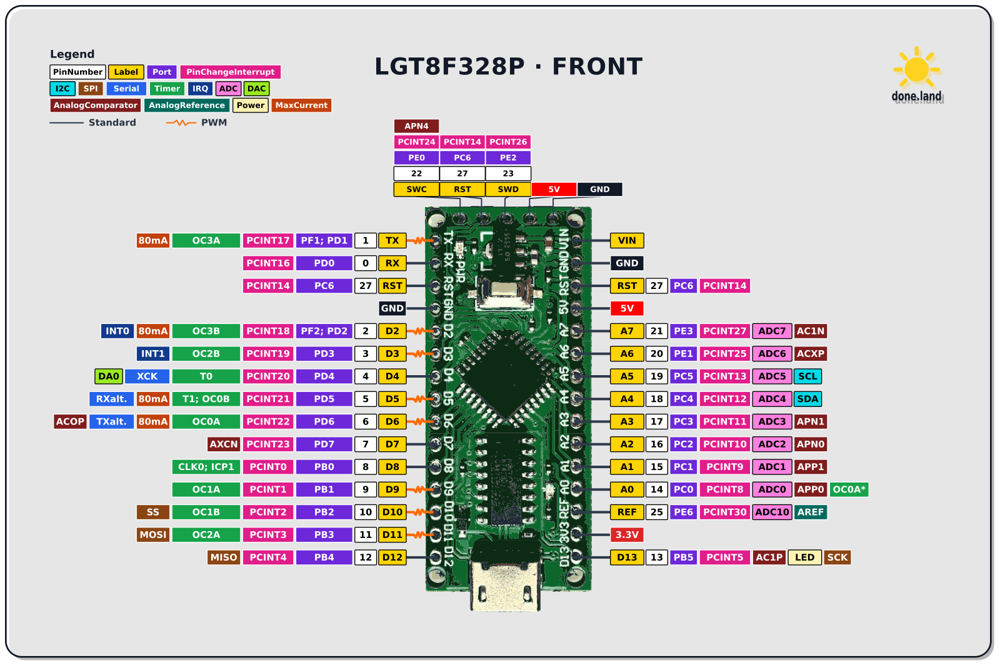
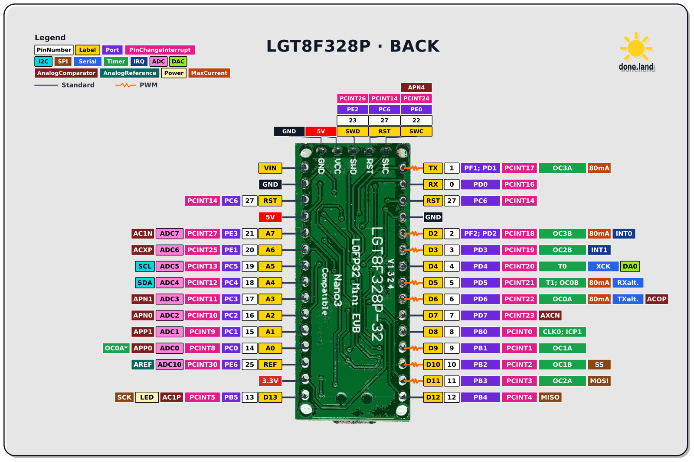

 

# LGFB32 Mini EVB

> LGT8F328P Board with On-Board USB-to-Serial and USB-C Connector

The **LGFB32 Mini EVB** board type comes with a USB connector and USB-to-Serial converter, making it simple to connect the board to a PC and upload firmware. There are variants with Micro-USB and with USB-C. 


### Front Pin-Out

[](materials/lgt8f328p_nano_pin_diagram_front.svg)

### Back Pin-Out

[](materials/lgt8f328p_nano_pin_diagram_back.svg)

This board type is ideal for prototyping and development when frequently updating the firmware is a priority. Later you can transition to a smaller **Pro Mini**-style board without Serial-to-USB circuitry and significantly lower power consumption. 

## Overview

Connect the board via USB to your PC, and use the **PlatformIO** development environment to compile and upload Arduino code.


This is the `platformio.ini` configuration file for **PlatformIO**:

```
[env:LGT8F328P]
platform = lgt8f
board = LGT8F328P
framework = arduino
board_build.f_cpu = 8000000L   ; 8MHz internal clock
board_build.clock_source = 1   ; 1 = internal, 2 = external
upload_flags = 
    -u
    -V
    -D

upload_speed = 57600
monitor_dtr = 0
monitor_rts = 0
```

## Power and Consumption

This board has three different power-related pins:

| Pin | Direction | Range | Description |
| --- | --- | --- | --- |
| `VIN` | in | 7-12 V | Connects to the input of the on-board **5V voltage regulator**. |
| `5V` | in/out | 5 V | 5 V system rail; can also be used to directly supply 5 V and bypass the voltage regulator |
| `3V3` | out | 3.3 V | 3.3 V auxiliary rail provided by the USB-UART circuitry's own internal 3.3 V regulator |

The surprising fact is that this board actually has **two voltage regulators**: a dedicated external one (i.e. AMS1117), and another internal one that lives inside the USB-UART chip.

The important distinction is that the AMS1117 generates the main 5 V system rail from `VIN`. The `3V3` pin is not the output of this regulator; its 3.3 V supply is generated separately by the USB-UART circuitry.

### Power Options

To power the board, you have a number of options:

* **USB:**   
  Plug in a USB-C cable. This powers `5V` from the USB rail. Since this power path contains a protection diode, effective voltage will be roughly 0.3 V lower.  

* **5V Stabilized:**    
  Connect an externally stabilized 5 V source to `5V`.  

* **7-12 V:**    
  Connect an unregulated voltage in the range of **7-12V** to `VIN`. The main voltage regulator turns it into 5 V. You cannot reliably operate the voltage regulator with input voltages below 7 V.

A few take-aways:

* If you want to power the MCU directly, supply power to `5V`. This bypasses the main voltage regulator.   
  - while you **can** power the MCU itself directly with **1.8-5.5 V**, this voltage would then also be present at `5V`. Most likely, on-board components such as the UART-to-USB converter and your own peripherals would not operate correctly anymore across this entire voltage range.   
  - if you want to run a stripped-down, power-efficient optimized version, remove the voltage regulator, LEDs, and UART-to-USB chip, and power the MCU directly via `5V` in the range of **1.8-5.5 V**.
* `3V3` is solely an output pin and provides auxiliary regulated 3.3 V at only low maximum currents. The exact available current depends on the USB-UART chip used by the particular board revision.

In a nutshell: This board is a **5 V Board** and should normally be operated using 5 V peripherals powered via `5V`.

## Power Consumption

The total board power consumption is divided primarily among these main components:

* Microcontroller

* Status LED

* Serial-to-USB

* Voltage Regulator

### Serial-to-USB

The on-board Serial-to-USB circuitry requires considerable extra power:

|      Clock | Nano-style with USB/UART | Pro Mini-style |  Difference | Reduction |
| ---------: | -----------------------: | -------------: | ----------: | --------: |
| **32 MHz** |                  32.6 mA |        15.0 mA | **17.6 mA** |   **54%** |
| **16 MHz** |                  27.8 mA |        11.5 mA | **16.3 mA** |   **59%** |
|  **8 MHz** |                  25.4 mA |         9.4 mA | **16.0 mA** |   **63%** |
|  **4 MHz** |                  23.3 mA |         8.2 mA | **15.1 mA** |   **65%** |
|  **2 MHz** |                  23.4 mA |         7.6 mA | **15.8 mA** |   **68%** |
|  **1 MHz** |                  22.8 mA |         7.3 mA | **15.5 mA** |   **68%** |

These values compare complete boards, so the difference does not represent the USB-UART chip alone. It also includes differences in LEDs and other board-level circuitry. Nevertheless, the measurements clearly show the substantial fixed overhead of the Nano-style board.

### Voltage Regulator

The LGT8F328P microcontroller can natively handle supply voltages in the exceptionally large range of 1.8 - 5.5 V, and in contrast to the ATmega328P used in genuine Arduino Nanos, the supply voltage does not impose the same severe clock-frequency restrictions. So for many use cases, you wouldn't need a voltage regulator **for the microcontroller**, especially when working with Lithium batteries as a power supply.

However, the same may not be true for peripherals. That's why this board comes with an on-board AMS1117 voltage regulator.

Within the wider LGT8F328P Mini EVB family, some board versions use an AMS1117-3.3 and therefore operate their main rail at 3.3 V, while others use an AMS1117-5 with a classic 5 V rail. This is particularly relevant when comparing Nano-style and Pro Mini-style variants. Always verify the actual regulator and rail voltage on the board in front of you matches your peripherals.

On the 5 V Nano-style board described here, the AMS1117 generates the main 5 V rail. The separate `3V3` pin is generated by the USB-UART circuitry and is not the output of an AMS1117-3.3 regulator.

* **Voltage Regulator Marking:**    
  Check whether the voltage regulator on your board has a readable marking.  

* **Measure Voltage:**     
  Measure the main rail voltage between `5V` and `GND`. If you intend to use the auxiliary 3.3 V supply, measure `3V3` separately.


## Conclusions

The Nano-style board version adds the USB-to-UART IC and its associated circuitry. Depending on the exact board revision, that can be CH340G, CH340C, CH9340C, HT42B534, or another bridge. 

These chips consume several milliamps, and some board designs fail to put the bridge properly into USB suspend when USB is disconnected. One documented LGT8F328P Nano variant has especially high consumption for exactly this reason.

This also explains something that otherwise looks odd: at 1 MHz, the Nano board still takes 22.8 mA, even though the corresponding Pro Mini needs only 7.3 mA. Reducing the CPU clock cannot eliminate the ~15 mA board-level overhead.

> Tags: Microcontroller, Arduino Nano, Clone, Pro Mini, HDR, ATmega328P, LGT8F328P

[Visit Page on Website](https://done.land/components/microcontroller/families/arduino/lgt8f328p/lgfb32minievb?767464090921261835) - created 2026-09-20 - last edited 2026-09-20
