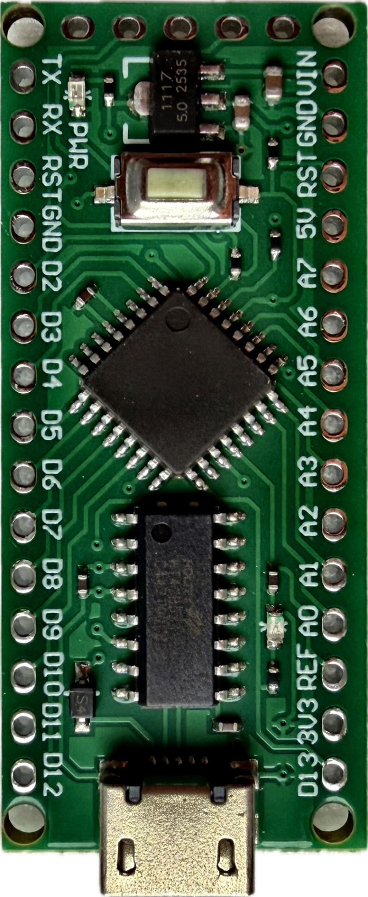
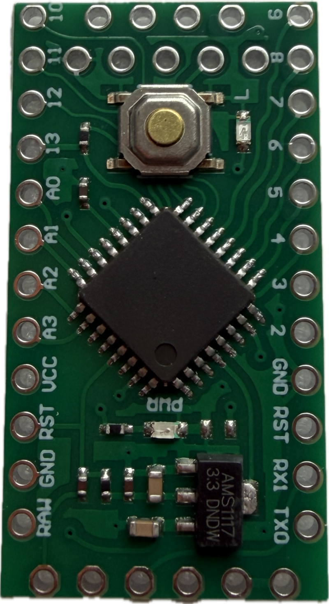

 
# LGT8F328P

> Affordable Arduino Nano Clone with a ATmega328P-Compatible LGT8F328P Microcontroller

LGT8F328P boards are Arduino-compatible development boards built around LogicGreen’s *LGT8F328P* microcontroller which is broadly similar to the *ATmega328P* used on classic Arduino Nano/Uno boards, but cheaper and more capable.

The *LGT8F328P* adds higher clock speeds, extra peripherals, enhanced timers/PWM features, and some additional analog functions. In addition, some pins can deliver up to 80 mA.

## Overview

LGT8F328P boards use the familiar Nano-style form factor, so they can often serve as inexpensive, faster alternatives to ATmega328P boards while still working with the Arduino ecosystem.

### Pro Mini Form Factor
Pro Mini–style LGT8F328P boards are stripped-down boards that omit the onboard USB-to-serial converter and USB connector. That makes them smaller, cheaper, and often lower-power than Nano-style boards.

Firmware must be uploaded through an external USB-to-UART adapter connected to the board’s serial programming pins.

### When to Use

The use cases derive from its advantages:

* **Size:**    
  Extremely small development boards, particularly the Pro Mini-style board without USB connector.
* **Power Consumption:**    
  Extremely low power consumption when compared to many other hobbyist MCUs.    
* **Cost:**    
  Considerably lower cost than Original Arduinos, and still more affordable than Clones that use ATmega328P MCU.   
* **Speed:**   
  Faster than the original Arduino Nano.    
* **GPIO Power:**    
  Some pins can directly supply up to 80 mA   
* **Extremely wide voltage range:**    
  Even though many development boards include a voltage regulator, the MCU itself accepts a very wide voltage range in both directions.

LGT8F328P is an excellent choice for small tasks that do not require much flash memory and rather focus on small board size and low power consumption, and for any project involving Lithium batteries as the MCU can directly work with the entire voltage range of LiIon, LiPo, and LiFePo4 without the need for a regulator.

| MCU            |                      Bare-MCU supply voltage | Notes                                                                                |
| -------------- | -------------------------------------------: | ------------------------------------------------------------------------------------ |
| **LGT8F328P**  |                                **1.8–5.5 V** | Genuine wide-voltage MCU; works directly in both 3.3 V and 5 V systems.              |
| **ATmega328P** |                                **1.8–5.5 V** | Supply voltage determines maximum available clock speed: **1.8–2.7 V:** *4 MHz* **2.7–4.5 V:** *10 MHz* **4.5–5.5 V:** *20 MHz*
| **CH32V003**   |                                **2.7–5.5 V** | 32-bit RISC-V MCU with genuine 5 V operation.                                        |
| **STM32F103**  |                                **2.0–3.6 V** | some inputs are 5 V tolerant, but VDD is not.                       |
| **ESP8266EX**  |                                **2.5–3.6 V** |        |
| **ESP32**      |                                **2.3–3.6 V** |             |
| **ESP32-S3**   |                                **3.0–3.6 V** |                                                                      |
| **RP2040**     |                                **1.8–3.3 V** |  |
| **RP2350**     | **1.8–3.3 V internally / 2.7–5.5 V externally** | has a built-in voltage regulator; even with 5 V supply, GPIOs are 3.3 V     |

## Caveats

Compared with an original Nano, the disadvantages are mostly compatibility, documentation, EEPROM behavior, and ecosystem maturity.

Compared with an ESP32, the LGT8F328P and the ESP32 play in different leagues, and comparing them isn't really fair. The limitations compared to ESP32 are primarily computing power (speed), much less flash memory, and the lack of integrated wireless connectivity.

### Connection Issues

Connecting a board with a USB connector to a PC can be challenging at first. Here is your check list when connecting to a Windows PC:

* **Watch for USB Discovery:**    
  When plugging in the USB connector to the PC, you should hear a connection chime, and device manager should show a new entry, either a new COM port, or an unknown device.

  If no chime plays, and device manager does not change its device list, then your USB cable is most likely not a data cable. I have experienced this numerous times, there are lots of pure charger cables floating around that are missing the data lines. 

  Switch the cable, and try again.

* **Check Power LED:**    
  On the board, its red power LED should light up. If it does not, and if you are using a USB-C connector on the board, then most likely the board does not implement the USB CC resistors, and you are using a USB-C-to-C cable.

  Switch the cable, and use a USB-C-to-A cable.

* **Manually Install UART Driver:**   
  If your development environment can't recognize the board, and if device manager isn't showing the board as a new COM port, then you need to install the proper driver for the UART-to-Serial chip used on the board.

  Take a magnifying glass, and decipher the label on the UART chip on the board. Most likely, it is a CH340, CH9340, or Holtek HT42B534-1. Search for a driver for your UART chip, install it, then reboot your PC.

After these steps, you should be set.

### Compared to Arduino Nano/ATmega Clones

* **Smaller ecosystem and weaker documentation:**    
  The LGT8F328P is broadly ATmega328P-compatible, but it is not a drop-in software equivalent. The Arduino support relies largely on community cores such as lgt8fx, and the manufacturer historically has not provided the same quality of English documentation that Microchip provides for the ATmega328P.    
* **Library incompatibilities:**   
  Most ordinary Arduino code works, but libraries that directly access AVR registers, make assumptions about timers, EEPROM, clock speed, or exact ATmega328P hardware may require modification.    
* **No true EEPROM:**   
  The ATmega328P has dedicated EEPROM; the LGT8F328P emulates EEPROM in its flash memory. The emulated area therefore consumes program flash, and changing its allocation requires some care.    
* **Less standardized board implementations:**    
  Most LGT8F328P boards are inexpensive third-party designs, so USB converters, regulators, LEDs, bootloaders, and pin labeling can vary between sellers. Genuine Arduino boards are more consistent. The board design directly affects the chip's low-power advantage: USB-to-UART converter and on-boad power LED may raise the real power consumption.    
  
  Measurements from the [lgt8fx project](https://github.com/dbuezas/lgt8fx) show about 32.6 mA at 32 MHz for a Nano-style board versus about 12.7 mA for a Pro Mini-style board without its power LED. For battery-powered projects, the USB-less versions are therefore considerably more attractive.
* **Programming/debug interface:**     
  The LGT8F328P provides its own programming/debug facilities rather than behaving exactly like an ATmega328P at the hardware-programming level.

### Compared to Modern MCU Designs like ESP32

* **Limited Memory:**   
  Only 2 KB SRAM and 32 KB flash — similar to Arduino Nanos — restrict this MCU to small projects. It is perfectly adequate for small embedded programs, but becomes restrictive for displays, large buffers, networking stacks, JSON processing, or more complex applications.    
* **8-bit architecture:**     
  Even at up to 32 MHz, the LGT8F328P remains an 8-bit AVR-compatible MCU. ESP32-class devices provide substantially more CPU performance and memory for computation-heavy tasks, and often have more than one core.    
* **No Radio:**    
  No integrated Wi-Fi or Bluetooth, so wireless communication requires an external module, whereas ESP32 devices integrate Wi-Fi and Bluetooth directly.    
* **No native USB:**   
  Many newer DIY MCUs support USB natively and do not require a separate USB-to-UART chip. Pro Mini-style versions omit USB entirely and require an external USB-to-UART adapter for uploading.     

## Power Consumption

Power consumption is one of the more interesting aspects of LGT8F328P boards, because although the microcontroller itself requires very little power, is only part of the story. On development boards, the USB-to-serial converter, voltage regulator, and power LEDs can easily consume as much power as—or more than—the MCU.

A typical Nano-style LGT8F328P board with USB generally sits in roughly the same power class as an ATmega328P Nano clone. With the MCU running continuously, total board consumption is commonly in the low tens of milliamps, depending strongly on clock frequency, supply voltage, USB bridge, and onboard LEDs. LGT8F328P boards are frequently operated at 32 MHz, so it is not automatically meaningful to say that they consume less than an ATmega328P running at 16 MHz—the higher clock rate costs power.

By comparison, a traditional Arduino Uno or Nano also carries substantial overhead. The MCU itself may require only a few milliamps under moderate conditions, but the USB interface, linear regulator, and permanently illuminated LEDs can raise complete-board consumption into approximately the 20–50 mA range, depending on the particular board. The Uno tends to be toward the higher end because it has more supporting circuitry.

The situation changes considerably with a Pro Mini–style LGT8F328P board without USB. Removing the USB-UART converter eliminates several milliamps of permanent overhead, and these boards often have much less supporting circuitry. With unnecessary LEDs removed or disabled and a suitable regulator, a running board can therefore be kept in the single-digit to low-tens-of-milliamps range. More importantly, sleep modes become worthwhile: a carefully designed LGT8F328P installation can reach microamp-level sleep consumption, whereas a Nano-style development board may continue wasting milliamps in its USB converter and regulator even while the MCU sleeps.

| Platform | Typical situation | Approximate consumption |
|---|---|---:|
| LGT8F328P Nano-style | MCU running, USB circuitry present | ~10–30 mA |
| LGT8F328P Pro Mini-style | MCU running, no USB converter | ~5–15 mA |
| ATmega328P Nano clone | Running | ~15–30 mA |
| Arduino Uno | Running | ~30–50+ mA |
| ESP32 board, radio off | CPU active | ~20–50 mA |
| ESP32 with Wi-Fi active | Normal operation | ~70–200+ mA |
| ESP32 Wi-Fi transmission peaks | Brief peaks | potentially several hundred mA |

## GPIOs

Some GPIOs are capable of delivering up to 80 mA, thus they can drive many loads that other boards are unable to. 

| MCU / Board | GPIO output capability | Practical note |
|---|---:|---|
| LGT8F328P | 12 mA normally, up to 80 mA on selected high-current pins | Major advantage: selected pins can be switched into an 80 mA high-current mode via the `HDR` register |
| ATmega328P / Arduino Nano | 20 mA typical design current, 40 mA absolute maximum per GPIO | 40 mA is an absolute maximum, not a recommended continuous operating current |
| ESP32 | up to ~40 mA source, ~28 mA sink per GPIO at maximum drive strength | Actual voltage drops with increasing current, and available current is shared across GPIO power domains |

> [!IMPORTANT]
> In order for these pins to deliver 80 mA, their special high power `HDR` mode needs to be enabled by firmware. By default, all pins are officially set to the default output current.    

Community measurements put the LGT8F328P standard output resistance around 10–12 Ω, versus roughly 3.7–4.5 Ω in high-current mode. So a normal pin is not suddenly clamped at 12 mA; rather, 12 mA is the documented drive-strength class.

> Tags: Microcontroller, Arduino Nano, Clone, Pro Mini, HDR, ATmega328P*

[Visit Page on Website](https://done.land/components/microcontroller/families/arduino/lgt8f328p?425460091620263408) - created 2026-09-19 - last edited 2026-09-19
