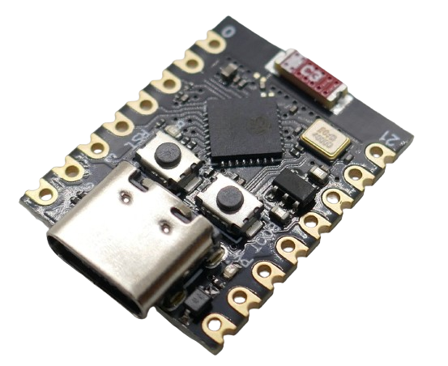
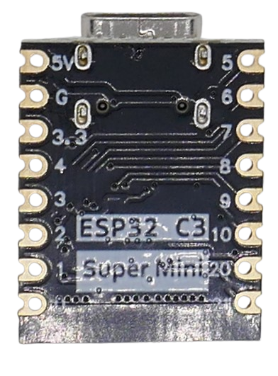

 
# ESP32-C3 Super Mini

> Extremely Compact And Very Affordable Microcontroller Board With Great Functionality

This is my new favorite whenever space is restricted. This tiny board fits even into the smallest devices and still provides ten fully usable GPIOs. It is energy efficient, widely available and very affordable, and both its computational power and its 4MB flash size are more than sufficient for most DIY projects. I have replaced *Arduinos* and *ESP8266* with this board in most of my new projects. 

When more than 10 GPIOs are needed, or when a *dual core* is required for computational intense tasks, I typically choose the [ESP32-S2 Mini](https://done.land/components/microcontroller/families/esp/esp32/s2/s2mini/). I tend to use classic *ESP32S* only when I need full backwards compatibility, i.e. when using third party firmware that isn't yet available for the newer *ESP32* family members. 


Here are the *ESP32 C2 SuperMini* benefits:

* **Compact:** very small (*22.5x18mm*)
* **Easy To Use:** works out of the box with many environments like *platform.io* or *ESPHome*. There are no issues with entering *firmware upload mode*, and no fiddling with pressing "boot" buttons to select the right mode.
* **Low Power:** low power consumption, supports *Bluetooth BLE*, making it ideal for battery-operated devices
* **Shields:** battery shields are available that add battery charging and portable power supply to the *C3 Super Mini* 
* **Affordable:** typically available for under €1.50 

The board has a *USB-C* connector and ten freely usable *GPIOs*. Four *GPIOs* can be used as *analog input*:


A programmable *blue LED* is connected to *GPIO 8* (inverted: *low* active), and a *red power LED* is *on* when the board is connected to *5V* (using its internal voltage regulator). This red LED is *off* when you power the board directly via the *3.3V* pin, i.e. from a battery. This makes sense to conserve energy when power is limited.

While it is more than twice as fast as a *ESP8266*, it is a *single core* controller running at *160MHz* clock speed. Classic *ESP32S* are *dual-core* running at *240MHz* and are roughly three times as fast. That said, most DIY projects do not require such speeds, and speed comes at cost: power consumption. If your project does involve very computing-intense tasks or needs to respond in real-time to more than one task, you may want to use a classic *ESP32S* or its successor *ESP32-S3*.

Its very small form factor limits the number of exposed GPIOs. If 10 GPIOs are not enough, you may have to look into larger boards that provide the room for exposing up to 22 GPIOs.




## Performance
*ESP32 C3 SuperMini* is a great replacement for *ESP8266* and more than doubles the processing speed. It also comes with a solid voltage regulator (most ESP8266 ship with under-rated voltage regulators that easily brown out once you connect power-hungry external sensors). Here is a quick performance comparison:

| Microcontroller | Performance | SRAM | PSRAM |
| --- | --- | --- | --- |
| ESP32-C3 | 160-200MIPS | 400KB | n/a |
| ESP8266 | 80MIPS | 160KB + 64KB Instruction RAM + 96KB Data RAM | n/a |
| ESP32S | 600MIPS | 520KB | optional, up to 4MB |

## GPIO
The ESP32-C3 has 22 GPIOs of which the *C3 Super Mini* exposes 13 due to its compact size. Of these 13 GPIO, 10 are freely usable whereas the remaining 3 GPIOs are strapping pins and cannot be used during the boot procedure.




| Pin | Description | Remark |
| --- | --- | --- |
| 5V | External or USB power | passes the internal voltage regulator |
| G | *GND* | |
| 3.3 | 3.3V directly (3.0-3.6V) | bypasses the voltage regulator. Does not turn on the red power LED. When supplying more than *3.3V* at this pin, you may destroy the microcontroller. When supplying *5V*, this is the *3.3V* outputted by the voltage regulator |
| 0-10 | *GPIO0* - *GPIO10* | 2 and 9 are strapping pins that are reserved during boot. 8 controls the blue LED on the board (inverted) |
| 20-21 | *GPIO20*-*GPIO21* |


All GPIOs are multifunctional and can be configured for various purposes, such as digital I/O, ADC (Analog-to-Digital Converter), UART, SPI, I2C, PWM, and more. 

### Ten Freely Usable GPIOs

These 10 GPIO can be freely used:

| Pin | Remark |
| --- | --- |
| 0 | can be used for analog input (ADC1) |
| 2 | can be used for analog input (ADC1) |
| 3 | can be used for analog input (ADC1) |
| 4 | can be used for analog input (ADC1) |
| 5 | can be used for analog input (ADC1) |
| 6 |  |
| 7 |  |
| 10 |  |
| 20 |  |
| 21 |  |

### Additional Three GPIOs

If you require more *GPIOs*, then these three GPIOs can be used with some restrictions: make sure your circuitry isn't pulling any of these up or down by hardware. Since these strapping pins are only used during boot (when your firmware isn't yet active), you can use them freely as long as you make sure your wiring doesn't tamper with their state. Else, your board may not boot properly anymore.

| Pin | Remark | Default |
| --- | --- | --- |
| 8 | connected to blue LED (*low* turns LED on). Controls ROM message printing (not critical) | floating |
| 2 | strapping pin, do not use during boot (selects boot mode) | floating |
| 9 | strapping pin, do not use during boot (boot button) | pulled up |

> [!NOTE]
> *JTAG* is available on *GPIO4*-*GPIO7*.


### Interfaces

| Interface | Pins | Remarks |
| --- | --- | --- |
| ADC1 | *GPIO0*-*GPIO4* | Analog input, 12bit, 0-3.3V (supply voltage) are transformed to 0-4096 digitally |
| ADC2 | *GPIO5* | cannot be used when *WiFi* is enabled |
| I2C | *any* | recommended to use external pull-ups |
| SPI | *any* | |
| LED PWM | *any* | 6 channels |
| UART | *any * | |


### Boot Modes
The strapping pins control the boot behavior during the boot process:

| Mode | GPIO2 | GPIO8 | GPIO9 |
| --- | --- | --- | --- |
| SPI Boot (normal) | *high* | *any* | *high* |
| UART/JTAG (firmware upload) | *high* | *high* | *high* |


### Board Schematics


### Programmable LED
The board has a *blue LED* connected to *GPIO8*. This *LED* is *inverted* because it is sinked, not sourced: *low* turns the LED **on**, and *high* turns it **off**.

## Programming

The *ESP32-C3 Super Mini* is widely adopted and simple to use.

### platformio
In *platformio*, use the board [`ESP32-C3-DevKitM-1`](https://docs.platformio.org/en/latest/boards/espressif32/esp32-c3-devkitm-1.html).

````
[env:esp32-c3-devkitm-1]
platform = espressif32
board = esp32-c3-devkitm-1
````

Other IDs may work equally well:

````
[env:lolin_c3_mini]
platform = espressif32
board = seeed_xiao_esp32c3
````

### ESPHome
In *ESPHome configurations*, use the board id `esp32-c3-devkitm-1`:

````
esp32:
  board: esp32-c3-devkitm-1
````

You can adjust and override specs if needed:

````
esphome:
  name: c3-supermini-test
  friendly_name: C3 SuperMini Test
  platformio_options:
    board_build.f_flash: 40000000L
    board_build.flash_mode: dio
    board_build.flash_size: 4MB

esp32:
  board: esp32-c3-devkitm-1
  variant: esp32c3
  framework:
    type: arduino

light:
  - platform: status_led
    name: "Status LED"
    id: esp_status_led
    icon: "mdi:alarm-light"
    pin:
      number: GPIO8
      inverted: true
    restore_mode: ALWAYS_OFF
````

> Tags: ESP32-C3, C3

[Visit Page on Website](https://done.land/components/microcontroller/families/esp/esp32/c3/c3supermini?845657081329241300) - created 2024-08-28 - last edited 2024-08-28
