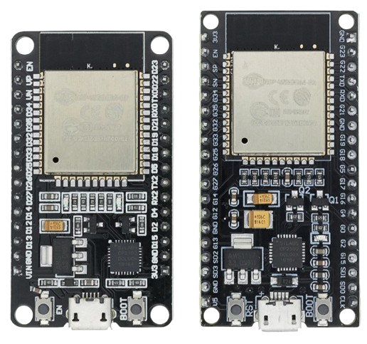
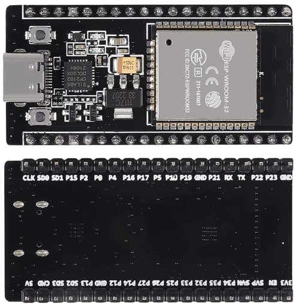

 
# ESP32 DevKitC V4

> Original DevKit From Espressif Providing Access To Almost All ESP32 Pins - For Experienced Users 

This is a classic engineering **development board**, targeted towards *expert prototyping*, *debugging*, *education*, and *experimenting*. It is basically just a hosting platform for a *ESP32 module*, providing access to almost all of its pins. 

This board is not an ideal choice for beginners and is particularly unsuited for DIY devices, especially those that are battery-operated.

> [!TIP]
> If you are a beginner or planning to use the board in your own DIY devices, [there are much better-suited boards](https://done.land/components/microcontroller/families/esp/esp32/classicesp32/esp32devkitcv4/#what-is-your-use-case) for the same price. If you want a "classic" development board, consider the smaller *30-pin* version, as most of the additional pins exposed on this *38-pin* board are unusable anyway, and you are wasting space. The picture below shows the size difference (left: *30pin*, right: *38pin*):



## Overview


First, the good news: this is a solid piece of hardware with a decent voltage regulator that is used in many community projects. 

The board comes with a variety of *ESP32 modules* installed, typically *WROOM 32D* (featuring a PCB antenna) and *WROOM 32U* (with an IPX connector for an external antenna).

The table below lists information specific to the original *DevKitC V4*. Please note that clones may utilize different components, other USB connectors, and can vary in PCB dimensions.


| Item | Description |
| --- | --- |
| USB Connector | Micro-USB |
| Microcontroller | ESP32-WROOM-DA/32E/32UE/32D/32U, ESP32-WROVER-E/IE, ESP32-SOLO1 |
| Voltage Regulator | [IRU1117-33](https://done.land/assets/files/iru1117_datasheet.pdf) | 
| UART | [CP2102](https://done.land/assets/files/cp2102_datasheet.pdf) |
| UART Driver | [Silicon Labs](https://www.silabs.com/developers/usb-to-uart-bridge-vcp-drivers?tab=downloads) |
| Input Voltage at **5V pin** | *4.75-7.0V* |
| Input Voltage at **3.3V pin** | *3.0-3.6V* |
| Power Consumption | WiFi: *130-160mA*<br/>Deep Sleep: *19mA* |
| Internal LED | none |
| I2C Pins | SDA 21, SCL 22 |
| SPI Pins | MOSI 23, MISO 19, SCLK 18 |
| Size | 48.2x27.9mm (without PCB antenna), 54.4x27.9mm (with PCB antenna) |

### Not Beginner-Friendly

The not-so-good news is that this board *is not beginner-friendly*. Its design is nearly a decade old and has been superseded by many [newer boards and ESP32 variants](https://done.land/components/microcontroller/families/esp/esp32/classicesp32/esp32devkitcv4/#what-is-your-use-case) that are more powerful, compact, and user-friendly.

Here’s why this board isn’t beginner-friendly:


* **Micro-USB:** The board features an old *Micro-USB* connector (newer revisions come with *USB-C*). 
* **Drivers:** your PC might not recognize the board out-of-the-box. It uses a *CP2102* UART controller, and its drivers aren't typically included in your PC operating system. You may need to [manually install the appropriate driver](https://done.land/components/microcontroller/families/esp/esp32/classicesp32/esp32devkitcv4/#manual-driver-installation) first.
* **Size:** The board's size makes it incompatible with standard breadboards. You'll need to either use two breadboards side-by-side,  connect wires directly to the pins or use a dedicated [expansion development board](https://done.land/components/microcontroller/expansionboards/devkitcv4/) for easier prototyping.

    

* **Pins:** While it seems advantageous to have access to nearly all ESP32 pins, many of the additional pins exposed by this board are unusable for DIY projects. For example, *GPIO 6-11* are reserved for communication with flash memory. Using these pins can make the board unstable or prevent it from booting entirely.
* **Pin Labeling:** Pin labels on the board are inconsistent, confusing, and difficult to read. Some pins are labeled with *GPIO numbers*, while others use *D* notation (e.g., *D2*, which is *GPIO9*). The *Dxxx* pins are typically used in custom sketches, however with this board they are used for the **unsafe** pins and should never be used. This inconsistency can easily confuse beginners.
* **No LED:** Unlike many other development boards, this one lacks a built-in programmable LED, which is a handy feature for testing and learning.
* **Firmware Upload:** Uploading firmware requires *manual* intervention. You need to hold down the *Boot* button and then press the *Reset* button to enable bootloader mode for uploading. Most other boards do this automatically.
* **Hardware Flaws:** Early board revisions had hardware issues preventing sketches from running when powered via the *5V* pin.
Generally, this board design is outdated. It was introduced when *ESP32S* microcontrollers were first released in 2016. Despite its age, the *DevKitC V4* board remains extremely popular and is readily available from numerous sources.

> [!TIP]
> You can find many variants of this board design. They all function essentially the same, as vendors typically use the open-source hardware design provided by the manufacturer, and adjust it only slightly while keeping boards pin-compatible. H**Price differences can be significant**, though: while the board is available for under €2 on *AliExpress*, local vendors often sell essentially the same product for €12 or more, sometimes even marketing this as a "sale."

### Clones

This article focuses on the [original DevKitC V4 board designed by the manufacturer](https://docs.espressif.com/projects/esp-idf/en/v4.4/esp32/hw-reference/esp32/get-started-devkitc.html). Since this design is open-source, a wide range of products from different manufacturers exists, only slightly varying in PCB quality. A board labeled *DevKitC V4* typically adheres to the original components and circuitry. Therefore, it doesn’t matter *which* variant you purchase—shop wisely and compare prices.

Some manufacturers have adapted the original design over time, modernizing or streamlining components such as the voltage regulator (*AMS1117* instead of *IRU1117-33*), UART chip (*CH340* instead of *CP2102*), or USB connector (*USB-C* instead of *Micro-USB*). Most of these changes are practical improvements; for example, the *CH340* chip typically doesn’t require manual driver installation, and *USB-C* is a clear upgrade over the older *Micro-USB* connector. 

Below is an example of a clone featuring an *AMS1117* voltage regulator and pin labels on the backside:



The picture also illustrates that vendors may change the pin labeling. The variant shown uses pin labels on the backside (instead of the front).

The general pin design, however, always follows the original specification, ensuring these clones are *pin-compatible*. All variants of the board work essentially the same, providing a reliable platform to test and experiment with a standard *ESP32 module*.


### Always Use Antenna
Some boards come with *IPEX connectors* for external antennas which can be a good choice when you need maximum *WiFi strength* or must operate in weak WiFi networks. 


If the board expects an external antenna to be connected, you can clearly see the *IPEX* connector (left board) that is replacing the *PCB antenna* (right board):


Again, this flexibility is great, but it comes with added responsibilities and caveats on your part: **it is your responsibility** now to actually connect an antenna. 

If your power up the board without an antenna connected, you quickly destroy its *WiFi power amplifier*.

### Conclusion 


This board is best suited for prototyping, education, and experimenting, and target experienced users that know what they are doing. For them, it offers a wide variety of options. However, these options come with responsibilities: 

* With almost all *ESP32* pins exposed, you must identify the ones that are safe to use, or else the board will become unstable or refuses to boot at all.     
* Likewise, with an external antenna jack, you must ensure a suitable antenna is connected, or else you will be damaging the *WiFi power amplifier*.  
This board is also not ideal for production devices, especially battery-operated ones:

In addition to its large size, it is highly inefficient in terms of power consumption. Even in *deep sleep*, the board draws around *19mA*, while modern *ESP32* boards typically consume just *500μA*. As a result, this board might only last a single day on a battery, whereas modern boards could operate for over a month. Optimized board designs like the *FireBeetle* series can draw as little as *20μA*, extending the potential deep sleep runtime to up to three years.

The key reason for this inefficiency is that a true *development board* is designed for testing and experimenting with the *ESP32* in a lab setting. It is not intended for production use, leaving power optimization to dedicated board designers.


## Hardware Overview

The *ESP32 module* (depending on type, either with a PCB antenna or an IPX antenna jack) occupies about half of the PCB surface area. Toward the inner side, there is unused space unless your breakout board uses the larger *WROVER* module, which includes additional *PSRAM*.


### USB Connector

On one side, a *Micro-USB* connector allows you to connect the board to a computer.


Next to the *USB connector*, a *Silicon Labs CP2102* chip provides a *USB-to-UART* bridge, capable of speeds up to 3 Mbps. This chip may require [manual driver installation](#manual-driver-installation) for your computer to recognize it.


### Power Supply

The board offers three *mutually exclusive* ways to power it:

1. **USB:** Use *5V USB*, which is internally converted to *3.3V*.
2. **5V/GND Pins:** Connect an external power supply to the *5V* and *GND* pins. This input also passes through the onboard voltage regulator, similar to the USB method.
3. **3.3V/GND Pins:** Supply *3.3V* directly to the *3.3V* and *GND* pins. This method bypasses the voltage regulator and powers the microcontroller directly. It is the most energy-efficient method but also the riskiest. If your external supply does not consistently deliver regulated voltage between *3.0V* and *3.6V*, it may damage the board and/or microcontroller.

> [!CAUTION]
> Always use **only one** of the three power methods listed above. Never power the board through both an external supply and *USB* simultaneously. The most common mistake is supplying power through the *5V* or *3.3V* pins while connecting the board to a computer via *USB cable* for firmware uploads. To avoid damage: disconnect the external power supply during firmware uploads **-or-** use a *USB connector* that can disable its power lines like in the picture below.


### Voltage Regulator

Behind the *CP2102* lies an *IRU1117-33* 3.3V *voltage regulator*, capable of supplying up to *800mA*. This regulator is used when the board is powered via *USB* or the *5V pin*. It accepts a maximum input voltage of *7V*.

To the right, there are two *JY3/S8050* epitaxial planar transistors, each with a high collector current of *500mA* and high total power dissipation.

### Power LED

A *surface-mount power LED* is located on the opposite side of the board. It illuminates whenever input power passes through the voltage regulator. However, it **does not turn on** when you power the board via the *3.3V pin* to conserve energy in battery-operated scenarios.

> [!CAUTION]
> The *power LED* only lights up when the internal *voltage regulator* is active (when *5V* is supplied). It remains off when powering the board via the *3.3V pin*.

### Firmware Download Mode

The board includes two push buttons labeled *EN* (reset) and *Boot*. 

To enter *Firmware Download Mode*:
1. Hold down the *Boot* button.
2. While holding *Boot*, press and release the *EN* button.
3. Release the *Boot* button.

This puts the board into *Firmware Download Mode*, allowing you to upload new firmware via the *USB connector*. Timing is crucial—this must be done exactly when your IDE attempts to connect to the board.

After the firmware transfer is complete, press the *EN* button to exit *Firmware Download Mode* and run your sketch.

## Pinouts

This breakout board exposes most of the *ESP32* pins:


The tables below provide detailed information for each header pin. The *Pin Type* resolves as follows:
- **P**: Power supply
- **G**: Ground
- **I**: Input
- **O**: Output

### Header Pin Row 1

| Pin | Label | Pin Type | Description |
|  --- |  --- |  --- |  --- |  
| 1 | 3V3 | P | 3.3V power supply |
| 2 | EN | I | CHIP_PU, Reset |
| 3 | VP | I | GPIO36, ADC1_CH0, S_VP |
| 4 | VN | I | GPIO39, ADC1_CH3, S_VN |
| 5 | IO34 | I | GPIO34, ADC1_CH6, VDET_1 |
| 6 | IO35 | I | GPIO35, ADC1_CH7, VDET_2 |
| 7 | IO32 | IO | GPIO32, ADC1_CH4, TOUCH_CH9, XTAL_32K_P |
| 8 | IO33 | IO | GPIO33, ADC1_CH5, TOUCH_CH8, XTAL_32K_N |
| 9 | IO25 | IO | GPIO25, ADC1_CH8, DAC_1 |
| 10 | IO26 | IO | GPIO26, ADC2_CH9, DAC_2 |
| 11 | IO27 | IO | GPIO27, ADC2_CH7, TOUCH_CH7 |
| 12 | IO14 | IO | GPIO14, ADC2_CH6, TOUCH_CH6, MTMS |
| 13 | IO12 | IO | GPIO12, ADC2_CH5, TOUCH_CH5, MTDI |
| 14 | GND | G | Ground |
| 15 | IO13 | IO | GPIO13, ADC2_CH4, TOUCH_CH4, MTCK |
| 16 | D2 | IO | GPIO9, D2, **avoid, used by SPI flash** |
| 17 | D3 | IO | GPIO10, D3, **avoid, used by SPI flash** |
| 18 | CMD | IO | GPIO11, CMD, **avoid, used by SPI flash** |
| 19 | 5V | P | 5V power supply |


### Header Pin Row 2

| Pin | Label | Pin Type | Description |
|  --- |  --- |  --- |  --- | 
| 1 | GND | G | Ground |
| 2 | IO23 | IO | GPIO23, **MOSI** |
| 3 | IO22 | IO | GPIO22, **SCL** |
| 4 | TX | IO | GPIO1, U0TXD |
| 5 | RX | IO | GPIO3, U0RXD |
| 6 | IO21 | IO | GPIO21, **SDA** |
| 7 | GND | G | Ground |
| 8 | IO19 | IO | GPIO19, **MISO** |
| 9 | IO18 | IO | GPIO18, **SCLK** |
| 10 | IO5 | IO | GPIO5 |
| 11 | IO17 | IO | GPIO17, **WROVER: used internally** |
| 12 | IO16 | IO | GPIO16, **WROVER: used internally** |
| 13 | IO4 | IO | GPIO4, ADC2_CH0, TOUCH_CH0 |
| 14 | IO0 | IO | GPIO0, ADC2_CH1, TOUCH_CH1, Boot |
| 15 | IO2 | IO | GPIO2, ADC2_CH2, TOUCH_CH2 |
| 16 | IO15 | IO | GPIO15, ADC2_CH3, TOUCH_CH3, MTDO |
| 17 | D1 | IO | GPIO8, D1, **avoid, used by SPI flash** |
| 18 | D0 | IO | GPIO7, D0, **avoid, used by SPI flash** |
| 19 | CLK | IO | GPIO6, CLK, **avoid, used by SPI flash** |


### Pins To Avoid
The large number of exposed pins can be confusing: some of the exposed pins are **not safe to use**.

#### SPI Flash
A few pins (GPIO 6–11) are used internally for communication between the ESP32 and *SPI flash memory*. They are grouped on both sides near the USB connector. Using these GPIOs may disrupt access to the SPI flash memory/SPI RAM.

Some of these pins are labeled as **D0** to **D3**, which is highly confusing for beginners: in many sketches, these labels are used for regular GPIOs. 

The pins to avoid are labeled **D0**–**D3**, **CMD**, and **CLK**.

#### WROVER
Typically, this board comes with the *ESP32-WROOM* module. In this case, you are free to use **GPIO16** and **GPIO17**.

If, however, your module uses the more sophisticated *ESP32-WROVER*, these two pins are needed internally and may not be used.


---

### Hardware Flaw
On the **initial** versions of this board, there was an odd behavior: when powered externally (via *5V* pin), you need to manually press the *EN* button to run your sketch. By default, the board runs the bootloader and enters firmware upload mode. The issue does not occur when the board is powered via *USB*.

The reason for this unwanted behavior is a *capacitor* (C15) connected in parallel to the *Boot* button. On newer versions of this breakout board, the *capacitor* has been removed. If it is still in place on your board, and you experience this problem, then you should remove it.

> [!CAUTION]
> The SMD capacitor is very small, and there are delicate tracks behind it that can easily be damaged by brute force or an over-sized and over-heated soldering iron. Desoldering this component requires proper tools (i.e., a heat gun).

The picture shows a newer version with the solder pads for *C15* (but with no capacitor present):


---

### Practical Considerations
This board is a *development board* in its best sense: it exposes almost all *ESP32* pins and invites anyone to fully test-drive the *ESP32*.

Unfortunately, for the same reasons, the board is fairly large. Its *width* is *28mm*, which is unfortunately *too wide* to place the breakout board on typical breadboards:


Only one row of header pins would remain accessible.

#### One Breadboard Isn't Enough
Most breadboards are modular and can be combined and rearranged. When you take *two* breadboards and remove *one power rail* each, you can stick them together in a way that provides the necessary real estate to place the breakout board:


> [!CAUTION]
> Make sure you *ground yourself* before fiddling too much with the board trying to place it. Almost all microcontroller breakout boards are sensitive towards static electricity and can be accidentally destroyed by a single static spark.


### No Built-in LED
This board has no built-in user-controllable *LED*: simple *blink* sketches will not work.

> [!NOTE]
> There *is* a *LED* on the board; however, this is the *power LED* that is not user-controllable.


### Missing Board Definition
Neither *Arduino IDE* nor *platformio* provide a dedicated board *DevKitC V4*, so you need to find a similar board. That's no rocket science but not self-explanatory either, especially for novice users:

- **Arduino IDE**: choose *ESP-WROOM-32*.
- **platformio**: use the generic *esp32dev* profile, or use one of the many profiles added by companies that rebranded this generic board.


````
[env:az-delivery-devkit-v4]
platform = espressif32
board = az-delivery-devkit-v4
framework = arduino
````
> [!CAUTION]
> Make sure you remove any *build flags* or other settings that you do not *positively know are necessary*. If you *copy&paste* extra settings from other boards, you may easily run into compile exceptions like "Serial was not declared in this scope".

## Driver Installation
This board may not initially be recognized by your computer when you connect it via *USB cable*. This is due to its *USB to UART bridge*: 

The *CP2102* from *Silicon Labs* is fast, but it is not as ubiquitous as i.e. the *CH340*. It may require a manual *driver installation* before the board is recognized.

> [!NOTE]
> Some clones employ more commonly used UART chips such as the *CH340* in which case your board will be recognized out of the box, and no additional drivers are required.   

#### Is Board Recognized?
If a *new device discovered* chime plays when you connect the board to your PC, that's a very good sign. 

If no sound plays, or if you would like to verify, open *device manager* (*Windows* PC) and check that a new *COM Port* has appeared (and vanishes when you unplug the board from your PC).


### Manual Driver Installation
If *no COM Port* appears in *device manager* once you have connected the board to your PC, then most likely the *CP210x drivers* are missing.

[Visit Silicon Labs](https://www.silabs.com/developers/usb-to-uart-bridge-vcp-drivers?tab=downloads) and download the appropriate driver package. On *Windows*, I installed *CP210x Windows Drivers* and *CP210x VCP Windows*.

> [!TIP]
> Once you downloaded the driver packages, make sure you right-click the downloaded ZIP file, choose *Properties*, and click on the button to *unblock* the file **before you unzip it**.

Once drivers are installed, restart the computer. When you now connect the board, it will now be correctly recognized, and a *COM port* appears in *device manager*.

> [!TIP]
> If things *still* do not work, make sure you use an appropriate *USB cable*. Try using a cable that you previously successfully used to upload firmware. There are plenty of cheap cables with no data wire connection, high cable resistance, or loose plug connections.

## Uploading New Firmware
If you managed to successfully connect the board to your computer, then there is a final challenge to master when you are ready to upload new firmware to it: 

The board needs to be **manually** set to *firmware download mode* at *just the right moment*. Other microcontroller boards switch *automatically* to this mode when it is needed.

1. **Initiate Firmware Upload:** in your *IDE* (*platformio* or *ArduinoIDE*), compile your sketch and ask the IDE to upload it to your microcontroller.
2. **Connection:** your *IDE* tries to connect to the board. As soon as this happens and you see it trying to connect, hold the *Boot* button and press *EN* shortly. This procedure enables the firmware download mode. *Only now* will the board respond to the connection requests.

    The *connecting...* message will now hold for a second, and then the *IDE* starts to upload the new sketch to the board.

## Conclusion
The DevKitC V4 is a great *development board* to test-drive *ESP32* features simply because it exposes all important CPU pins.

It's a solid board with a good voltage regulator, and its *street price* of under EUR 2.00 is ok, too (don't buy it for EUR 10 or more - there are still people selling it for these ridiculous prices).

You can get great [expansion boards](https://done.land/components/microcontroller/expansionboards/devkitcv4/), and while the resulting physical size is huge now, it can be perfect in a lab or for educational purposes.

### What is Your Use Case?

It all boils down to your use case:

* **Beginner:**  If you are a beginner and would like to start exploring the world of microcontrollers, then there are definitely other boards that provide more bang for the buck while being a lot easier to handle.
* **Device Use:** If you are planning to use a microcontroller board inside your DIY devices, then there are *much* smaller boards with a much better energy efficiency for the same price, for example the [ESP32 C3 SuperMini](https://done.land/components/microcontroller/families/esp/esp32/c3/c3supermini/), or the [ESP32 S2 Mini](https://done.land/components/microcontroller/families/esp/esp32/s2/s2mini/). If you are willing to spend €5 instead of €2, the [T-Display](https://done.land/components/microcontroller/families/esp/esp32/lilygot-display/t-display/) comes with *16MB Flash Memory* (instead of *4MB*) and a TFT display, a battery interface and charger, and a deep sleep consumption of *290uA* (instead of *19mA*).

For comparison, here is a picture of the *ESP32 DevKitC V4*, plugged into an *expansion board*, and a [ESP32 C3 SuperMini](https://done.land/components/microcontroller/families/esp/esp32/c3/c3supermini/) that I placed next to it:


The former comes with all *classic ESP32 features* including [DAC](https://done.land/components/microcontroller/families/esp/espfeatures/dac/) and dual core processor, whereas the latter has just a *single core* and is missing some of the lesser-used ESP32 features (such as the DAC). They both have the same *4MB* of flash memory.

That said, I am routinely using the [ESP32 C3 SuperMini](https://done.land/components/microcontroller/families/esp/esp32/c3/c3supermini/) in most of my bread-and-butter sensors and devices including sophisticated applications such as [WLED](https://done.land/components/microcontroller/howtouse/firmware/fromsomeoneelse/wled/), and its tiny size and affordable price works perfectly well in my devices where a *ESP32 DevKitC V4* board would have been way too clumsy and power-hungry.

## Materials
[Board Schematics](materials/esp32_devkitc_v4-sch.pdf)    
[ESP32 Datasheet](materials/esp32_datasheet_en.pdf)    
[CP2102 USB-UART-Bridge](materials/cp2102_datasheet.pdf)    
[IRU1117 3.3V Voltage Regulator](materials/iru1117_datasheet.pdf)     
[S3050/J3Y Transistor](materials/iru1117_datasheet.pdf)     


  


> Tags: Microcontroller, ESP32, CP2102

[Visit Page on Website](https://done.land/components/microcontroller/families/esp/esp32/classicesp32/esp32devkitcv4?604445051417245543) - created 2024-05-16 - last edited 2024-05-16
