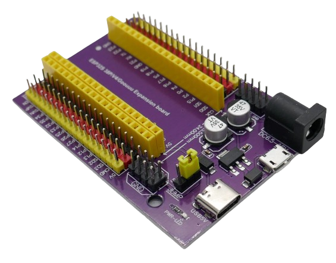

 
# DevKitC V4 / 38-Pin ESP32

> Expansion Board For 38-Pin ESP32 Development Boards

The popular *ESP32 DevKitC V4* development board is relatively large and does not fit on classic *breadboards*.

There is a variety of *expansion boards* available for this development board.

## ESP32S 38P/V4/Goouu Expansion Board

This board works with *38-pin* ESP32 development boards. It has *three pin rows* to be compatible with *24mm* and *25.5mm* width development boards.

### Quick Overview
The board comes with a *800mA 5V* voltage regulator. It does not provide *3.3V* and instead uses the built-in *3.3V regulator* on the plugged-in microcontroller board.

A special feature are the many *output power pins*: each *GPIO* has two companion power pins.

Whether the red companion pins provide *5V* or *3.3V* is controlled by a jumper setting.

There is no separate power switch: once you connect power to the board, a red on-board LED turns on.

## Pin Connectors
Each microcontroller pin is exposed to a **yellow** male pin compatible with classic *DuPont* cables. 

For each pin, there are additional *red* and *black* male pins for *power supply*.

> [!IMPORTANT]
> A jumper determines whether the *red pins* supply *3.3V* or *5V* so you can adjust the voltage according to the needs of the components you use. Always verify the jumper position, especially when using *3.3V components*. 

The pins for *VCC* (*3.3V*), *GND*, *RX*, and *TX* are exposed via a separate pin pad.

## Power Supply
The board comes with *USB-C* and *Micro-USB* connectors as well as a round *DC socket*. The board accepts input voltages in the range of *6.5-16V*.

### Solid 5V-Only Voltage Regulator
The board is using a [LD1117C50](materials/ld1117_datasheet.pdf) voltage regulator with a maximum **input** voltage of *15V* and a maximum **output** current of *800mA* and **output voltage** of *5V*.

> [!IMPORTANT]
> The boards is *not* supplying *3.3V*. The *3.3V* voltage is taken from the plugged-in microcontroller development board using its *on-board power regulator*.

### 5V Power Output Pins
The power supplied to the board is regulated to *5V* and then exposed at various pins:

* **Powering the microcontroller:** connected to the *5V* pin
* **Always accessible:** two terminals marked *5V* expose the regulated *5V*
* **Jumper:** when the jumper is set to *5V*, then *5V* is accessible *at all* red pins

### 3.3V Power Output Pins

*3.3V* is also available via various pins, however the *expansion board* is not producing this voltage. It is taken from the plugged-in microcontroller board and relies on its own voltage regulator (and its capabilities).

* **Always accessible:** *3.3V* is always accessible via the *VCC* pin and also via two terminals marked *3V*.
* **Jumper:** when the jumper is set to *3.3V*, then *3.3V* is accessible *at all* red pins
 

> Tags: Microcontroller, ESP32, Expansion Board, Development Board

