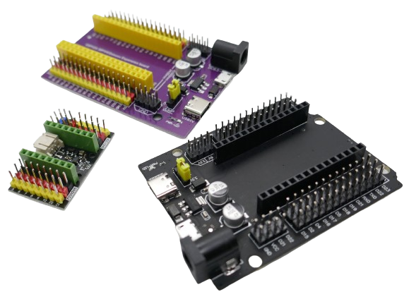

 
# Expansion Boards

> Expansion Boards For Classic ESP32 Development Boards

When working with microcontrollers, classic *breadboards* often are not enough for prototyping: Microcontroller development boards often are simply *too large* to fit on *breadboards*.

## Specific Microcontroller Breadboards
That's when *expansion boards* can help: they are designed for *specific* microcontroller development boards: you simply plug in a supported development board. To some extend, *expansion boards* are *sophisticated breadboards* that are specifically designed to host a microcontroller board.

For many projects, *expansion boards* can completely replace classic *breadboards*. For more complex projects, place your external components onto a *breadboard* as usual, and connect *extension board* and *breadboard* with *DuPont* wires.

## Benefits of Expansion Boards

*Expansion boards* can fix a number of issues you may experience once you start working with *microcontrollers*:

* **Space** As discussed, the primary issue are *microcontroller boards* that are *too large* to fit on breadboards.
* **Power Supply:** *USB* can provide power for simple projects, however once you use a lot of components, or when components (like sensors) cause power surges, your entire setup may become *unstable*: voltage drops lead to *brown-outs*, and the microcontroller may unexpectedly reboot.
* **Additional Voltages:** Your project may require *two* stable power supplies, one for *3.3V* and another one for *5V*. The *built-in power regulator* found on most *development boards* is limited to *500mA* or even less.
* **Testing in the Field:** you may want to test your prototype in the field, car, plane, or boat, powering it via an external power source (i.e. *12V* on-board voltage socket). Most *development boards* support a very limited input voltage range and can be damaged when exposed to more than *7V*.

### Expansion Board To The Rescue

*Expansion boards* fix all of the above: they typically come with robust dual voltage regulators and accept a wide range of input voltages.

They provide a perfectly-matching slot to plug in a given development board (*expansion boards* are made for *specific* development boards).

They often expose the microcontroller pins via multiple male pins for easy and clean wiring via *DuPont* cables.

### Caveats

Here are the few considerations when using an *expansion board*:

* **Supported Development Boards:** *Expansion boards* are designed for a specific *development board*. Make sure the *expansion board* fits *development board* you want to use.
* **Jumpers:** some *expansion boards* use *jumpers* to set the voltages. Make sure you understand how your *expansion board* works, and verify that it produces the voltage you need.
* **Power:** Most *expansion boards* come with robust voltage regulators, but there are significant differences. Make sure the *expansion board voltage regulator* provides the amount of power your prototype needs. Look for the maximum *current* that the *expansion board* can provide.

> Tags: Microcontroller, ESP32, Expansion Board, Development Board

[Visit Page on Website](https://done.land/components/microcontroller/families/esp/esp32/classicesp32/expansionboards?569323071504244301) - created 2024-07-03 - last edited 2024-07-03
