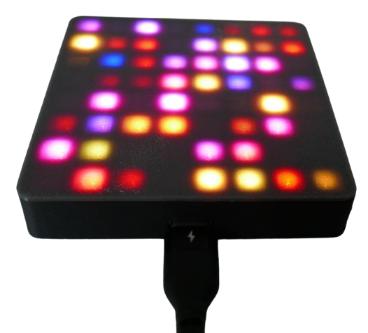
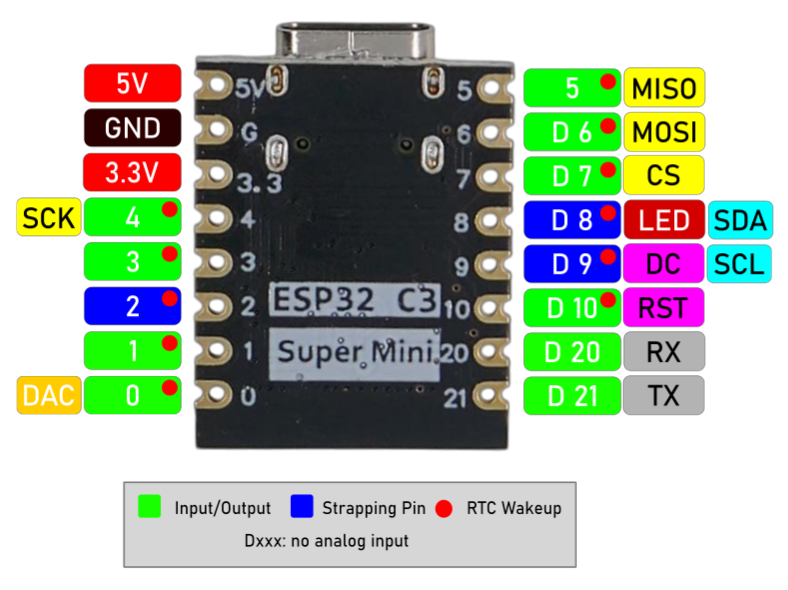

# ESP32-C3 Super Mini

> Compact And Affordable Microcontroller Board With Great Functionality

The **ESP32-C3 Super Mini** is my new go-to microcontroller board whenever space is top priority. Its tiny size allows it to fit into the smallest devices while still offering ten fully usable GPIOs. 


It is compatible with all **ESP32** development environments, including [ESPHome](https://done.land/tools/software/esphome/introduction/). Additionally, you can directly upload open-source firmware made for the **ESP32**, such as [WLED](https://kno.wled.ge/). 

[Here’s an example project](https://done.land/components/microcontroller/firmware/fromsomeoneelse/wled/) using the **ESP32-C3 Super Mini** and an **8x8 WS2812 LED Panel** to create an awesome colorful light cube—no programming required and just three short wires:



## Overview

The **ESP32-C3 Super Mini** is an energy-efficient, widely available, and affordable microcontroller. With its computational power and *4MB* flash storage, it is more than sufficient for most DIY projects.

I’ve replaced **Arduino** and **ESP8266** boards with the ESP32-C3 Super Mini in most of my new projects. However, there are a few exceptions where other boards are better suited:

* **Many GPIOs:** If a project requires more than *10 GPIOs*, I opt for the [ESP32-S2 Mini](https://done.land/components/microcontroller/families/esp/esp32/developmentboards/esp32-s2/s2mini/). It is cost-effective and has a slightly larger footprint compared to the ESP32-C3 Super Mini. Its extremely flat design makes it easy to integrate into portable devices.

* **Battery Power:** For portable projects, I use the [Lolin32 Lite](https://done.land/components/microcontroller/families/esp/esp32/developmentboards/esp32s/lolin32lite/). This board features a built-in battery charger and boost converter, making it ideal for single-cell *Li-Ion* battery operation. While other boards offer similar functionality, the Lolin32 Lite stands out for its affordability.

* **Display:** When a small color display is needed, I choose the [Lolin TTGO T-Display](https://done.land/components/microcontroller/families/esp/esp32/developmentboards/esp32s/t-display/). It includes a *1.14"* TFT display with a *135x240* resolution, which is well-suited for simple visual output in projects.

* **Compatibility:** For testing or ensuring maximum compatibility, I rely on the [ESP32 DevKitC V4](https://done.land/components/microcontroller/families/esp/esp32/developmentboards/esp32s/esp32devkitcv4/). While larger and less visually appealing, it is the default *ESP32* development board and an excellent starting point for experimenting with new components. Its compatibility minimizes unexpected microcontroller-related issues, allowing focus on integrating and exploring components. Additionally, there are robust [expansion boards](https://done.land/components/microcontroller/expansionboards/devkitcv4/) available, making prototyping with *DuPont* wires easier.

* **Computations:** For projects involving advanced computations, I prefer one of the latest *ESP32-S3* boards, which offer enhanced processing power.

* **WiFi Range:** When extended *WiFi range* is critical, I select boards with external antennas. While the *ESP32-C3 Super Mini* connects reliably to strong home *WiFi networks*, its small size and built-in antenna limit its range.

### Arduino Framework

It can be a major challenge at first to get this board to fully work in *ArdinoIDE* and *platformio* because there is not yet a specific board definiton for it.

While you can use pretty much any board definition targeting *ESP32-C3*, this assigns the wrong GPIOs to important pin constants that are used for *SPI* and *I2C*.

You *can* work around this by specifying the *correct* GPIO numbers directly, however in the case of *SPI* and *I2C*, this is often only an option for the much slower *software-emulated* interfaces. If you want to use the *fast hardware* interfaces, most libraries use the pre-defined GPIO constants. Naturally, if these are wrong, then *hardware SPI* and *hardware I2C* won't work.

So in a nutshell, while selecting *any ESP32-C3* board in your development environment will get you started, it most likely bites you eventually.

#### Finding Appropriate Board Definition
Since there is not yet a dedicated board definition, you need to use one that is similar enough. 

There is a board variant called  `esp32c3` that correctly defines the interface pins and only misses `LED_BUILTIN`:

| Pin Constant             | Value   | Remark |
| ------------------------ | :-----: | --- |
| **LED_BUILTIN**        | n/a     | **wrong:** should be *8* |
| **SDA** *(I2C)*        | 8       | 
| **SCL** *(I2C)*        | 9       | 
| **MOSI**/COPI *(SPI)*  | 6       | 
| **MISO**/CIPO *(SPI)*  | 5       | 
| **SCK**/SCL/SCLK *(SPI)* | 4       | 
| **SS**/CS *(SPI)*      | 7       | 
| **RX** *(Serial)*      | 20      | 
| **TX** *(Serial)*      | 21      | 
| **A0** *(analog input)* | 0       | 
| **A1** *(analog input)* | 1       | 
| **A2** *(analog input)* | 2       | 
| **A3** *(analog input)* | 3       | 
| **A4** *(analog input)* | 4       | 
| **A5** *(analog input)* | 5       | 

To use this board variant, you *must* select the board `esp32-c3-devkitm-1` and specify the board variant `esp32c3`. When you select a different board, you may not be able to target the board variant.

Here is the `platformio.ini` I use:

````
[env:esp32-c3-devkitm-1]
platform = espressif32
board = esp32-c3-devkitm-1
board_build.mcu = esp32c3
framework = arduino
build_flags =
    -D ARDUINO_USB_MODE=1
    -D ARDUINO_USB_CDC_ON_BOOT=1
````


When you use the suggested `platformio.ini`, all pins should be correctly defined, and you are ready for *hardware SPI* and *hardware I2C*. Only the constant `LED_BUILTIN` is wrong.


<details><summary>Verifying Correct Pin Definitions</summary><br/>

If you'd like to double-check whether the pin lables were correctly defined in your development environment, try this code:

````c++
#include <Arduino.h>

// (re)define BUILTIN_LED as most board definitions get this pin wrong:
// (remove this line if you'd like to see what the original definition is)
#define LED_BUILTIN 8


void showPins() {
  // prints currently valid pin assignments to terminal:
  Serial.println("Pin Definitions for the Board:");

  // SPI Pins
  Serial.println("\nSPI Pins:");
  Serial.printf("MISO: %d\n", MISO);
  Serial.printf("MOSI: %d\n", MOSI);
  Serial.printf("SCK: %d\n", SCK);
  Serial.printf("SS (CS): %d\n", SS);

  // I2C Pins
  Serial.println("\nI2C Pins:");
  Serial.printf("SDA: %d\n", SDA);
  Serial.printf("SCL: %d\n", SCL);

  // LED Pin
  Serial.println("\nLED Pin:");
#ifdef LED_BUILTIN
  Serial.printf("LED_BUILTIN: %d\n", LED_BUILTIN);
#else
  Serial.println("No LED_BUILTIN defined for this board.");
#endif

  // DAC Pins
  Serial.println("\nDAC Pins (if available):");
#if defined(DAC1) && defined(DAC2)
  Serial.printf("DAC1: %d\n", DAC1); // Often GPIO25
  Serial.printf("DAC2: %d\n", DAC2); // Often GPIO26
#else
  Serial.println("DAC not available on this board.");
#endif

  // UART/Serial Pins
  Serial.println("\nSerial Pins:");
#if defined(TX) && defined(RX)
  Serial.printf("TX: %d\n", TX);
  Serial.printf("RX: %d\n", RX);
#else
  Serial.println("Default UART TX and RX not defined for this board.");
#endif
}


void setup() {
  // start serial output (baud rate does not matter with USB CDC)
  Serial.begin();
  // set built-in LED on GPIO8 for output
  pinMode(LED_BUILTIN, OUTPUT);
  // wait for the serial output to be ready
  delay(1000);
  // output pin assignments
  showPins();
}

void loop() {
  // blinks built-in LED at 1Hz to check that firmware is running:
  digitalWrite(LED_BUILTIN, HIGH);
  delay(500);
  digitalWrite(LED_BUILTIN, LOW);
  delay(500);
}
````

When you run this code, the output should look like this:

````
Pin Definitions for the Board:

SPI Pins:
MISO: 5
MOSI: 6
SCK: 4
SS (CS): 7

I2C Pins:
SDA: 8
SCL: 9

LED Pin:
LED_BUILTIN: 8

DAC Pins (if available):
DAC not available on this board.

Serial Pins:
Default UART TX and RX not defined for this board.
````

Testing the actual pin definitions can be crucial due to the convoluted and sometimes strange way how the development environment picks the appropriate `pins_arduino.h` file for you. 

For example, if you selected the board `seeed_xiao_esp32c3` instead of `esp32-c3-devkitm-1` as suggested above, the otherwise identical `platformio.ini` would use wrong pin assignments.

With this board, *platformio* uses the variant `XIAO_ESP32C3` instead of the explicitly stated variant `esp32c3`. Unfortunately, that variant uses different pin assignments that do not match the *ESP32-C3 SuperMini*.

</details>

To make `LED_BUILTIN` work as well, simply re-define this constant in your code:

````
// (re)define BUILTIN_LED as most board definitions get this pin wrong:
#define LED_BUILTIN 8
````

Since *constants* are meant to be **constant**, your change will trigger a (benign) compiler warning that you can ignore:

````
src/main.cpp:5: warning: "LED_BUILTIN" redefined
 #define LED_BUILTIN 8

In file included from D:/.platformio/packages/framework-arduinoespressif32/cores/esp32/esp32-hal-gpio.h:29,
                 from D:/.platformio/packages/framework-arduinoespressif32/cores/esp32/esp32-hal.h:83,
                 from D:/.platformio/packages/framework-arduinoespressif32/cores/esp32/Arduino.h:36,
                 from src/main.cpp:1:
D:/.platformio/packages/framework-arduinoespressif32/variants/esp32c3/pins_arduino.h:11: note: this is the location of the previous definition
 #define LED_BUILTIN LED_BUILTIN  // allow testing #ifdef LED_BUILTIN
````

A "cleaner" approach is to use the GPIO number `8` instead of `LED_BUILTIN` in your code.

Or, you can add a new board definition to *Arduino Core* that correctly and completely describes this board. This work has in fact be [done already](https://github.com/espressif/arduino-esp32/blob/master/variants/nologo_esp32c3_super_mini/pins_arduino.h), and there is now a new board variant called `nologo_esp32c3_super_mini`. It apparently just takes forever for this new board definition to show up in the *Arduino Core* production build.

If you don't want to wait, copy the file content and add it manually to your *Arduino Core*.


<details><summary>New and updated board definitions are in the pipeline</summary><br/>


In the latest [arduino-esp32](https://github.com/espressif/arduino-esp32) release from *Espressif*, the ESP32-C3 Super Mini now has dedicated support under the name `nologo_esp32c3_super_mini`:

| Pin Constant             | Value   |
| ------------------------ | :-----: |
| **LED_BUILTIN**        | 8       | 
| **SDA** *(I2C)*        | 8       | 
| **SCL** *(I2C)*        | 9       | 
| **MOSI**/COPI *(SPI)*  | 6       | 
| **MISO**/CIPO *(SPI)*  | 5       | 
| **SCK**/SCL/SCLK *(SPI)* | 4       | 
| **SS**/CS *(SPI)*      | 7       | 
| **RX** *(Serial)*      | 20      | 
| **TX** *(Serial)*      | 21      | 
| **A0** *(analog input)* | 0       | 
| **A1** *(analog input)* | 1       | 
| **A2** *(analog input)* | 2       | 
| **A3** *(analog input)* | 3       | 
| **A4** *(analog input)* | 4       | 
| **A5** *(analog input)* | 5       | 

</details>


### Key Benefits of the ESP32-C3 Super Mini

- **Compact:** The board is extremely small (*22.5x18mm*), making it ideal for space-constrained projects.  
- **User-Friendly:** Compatible with platforms like *PlatformIO* and *ESPHome*. It eliminates the need for manual firmware upload mode or pressing "boot" buttons.  
- **Low Power:** Highly energy-efficient with *Bluetooth BLE* support, making it suitable for battery-powered devices.  
- **Expandable:** Optional battery shields add charging functionality and portable power supply options.  
- **Affordable:** Widely available, often priced under €1.50.  

### GPIOs

The board includes a **USB-C** connector and provides **10 fully usable GPIOs**. Additionally, four GPIOs support **analog input**:



> [!IMPORTANT]  
> In the pin schematic, **D** denotes a **digital-only** GPIO. Always use the actual GPIO number shown in the schematic to avoid confusion with legacy labeling.

### Programmable Blue LED

A programmable **blue LED** is connected to **GPIO 8** and is inverted (*low* active).  

Additionally, the board has a **red power LED**, which lights up when the board is connected to **5V** via its internal voltage regulator. If the board is powered through the **3.3V** pin (e.g., via a battery), the red LED automatically turns off, conserving energy in low-power scenarios.
### Performance Comparison

The **ESP32-C3** is over twice as fast as an **ESP8266**, thanks to its *single-core* processor running at **160MHz**. However, it is outperformed by classic **ESP32S** boards, which feature dual-core processors running at **240MHz**, offering roughly three times the computational power. This increased performance comes with higher power consumption, which may not be ideal for energy-sensitive projects.

For most DIY applications, the ESP32-C3's performance is more than sufficient. If your project involves computationally intensive tasks or demands real-time responsiveness for multiple tasks, consider using a classic **ESP32S** or the newer **ESP32-S3**.

The compact design of the **ESP32-C3 Super Mini** inherently limits the number of exposed GPIOs. If your project requires more than 10 GPIOs, larger boards exposing up to 22 GPIOs may be a better fit.


## Interfaces

The **ESP32-C3** supports multiple communication interfaces, making it versatile for various peripherals. You can use the following:

- **Two-Wire Serial Interface (UART)**  
- **[I2C](https://done.land/fundamentals/interface/i2c/):** Ideal for connecting sensors and displays.  
- **[SPI](https://done.land/fundamentals/interface/spi/):** Suitable for high-speed communication, such as with flash storage or displays.  

One of the ESP32-C3's standout features is the ability to map *any GPIO* to *any interface*. This flexibility is why different pin schematics for the chip exist. However, it is recommended to use the *default pins* for a given interface for the following reasons:

* **Compatibility:**  
  Many example codes assume the use of default GPIOs. If you choose custom GPIOs, you will need to modify the source code accordingly.  

* **Default Initialization:**  
  Libraries often provide default initializers, which automatically select the default GPIOs for a specific interface. Using these defaults simplifies development and ensures reliable performance.  

> [!IMPORTANT]  
> While using non-default GPIOs for an interface is technically feasible, you must ensure that your code and libraries are explicitly configured to use the chosen GPIOs for the desired interface.

### Serial Interface

| Serial Pin | ESP32-C3 SuperMini Pin |
| --- | --- |
| RX | 20 |
| TX | 21 |

### SPI

| SPI Pin | ESP32-C3 SuperMini Pin |
| --- | --- |
| MOSI | 6 |
| MISO | 5 |
| SCK | 4 |
| CS | 7 |

### I2C

The *I2C* interface can be challenging to use with the **ESP32-C3 Super Mini** due to its default GPIO assignments. The board definition sets *GPIO8* as **SDA** and *GPIO9* as **SCL*. However, *GPIO8* is also hard-wired to the programmable **LED**, which can cause conflicts.

#### Avoiding LED Conflicts
If you want to avoid interference with the built-in **LED**, consider using software I2C with custom pins. For instance:

| I2C Pin | ESP32-C3 Super Mini Pin |
|---------|--------------------------|
| SDA     | 1                        |
| SCL     | 3                        |


If you do not need to control the built-in LED and can ignore its state, you can stick to the default hardware *I2C* pins for optimal performance. This avoids the slight overhead associated with software I2C implementations.


## Serial And USB CDC

Note the use of `build_flags` in the suggested `platformio.ini` from earlier: 

Microcontrollers like the *ESP32-C3* include full *native* USB support. They no longer use *UART* components. The built-in *USB controller* can act as any USB device and i.e. simulate a keyboard or mouse. 

When you want to use *serial output* - since there is no dedicated *UART* anymore - you need to ask the *USB controller* to act as a *HWCDC* (*Hardware USB Communications Device Class*). This is what the *build flags* do.

In this case, the *USB controller* simulates a *COM interface*, and you can continue to use code like `Serial.println("Hello");` just as if you were using an older microcontroller with external *UART*. If you *do not* include the build flags, then *Serial* would not work, and your code would be unable to send text to a terminal.

There are a few caveats you should know:

* `Serial.begin();` some sources claim that *USB CDC* does not require this statement anymore. That's not true. You still need to *initialize* your serial connection. However, you no longer need to care about *baud rates* any longer. *USB CDC* always uses the maximum USB speed which is much higher than even the highest *baud rates* would allow. That's also the reason why you no longer need a `monitor_speed = ...` in your `platformio.ini`.
* `while (!Serial) {}` often, a loop is used to wait for the *Serial* interface to be fully initialized and ready to use. This may not work anymore with *USB CDC*. You will have to work around this with a fixed `delay(1000);'.


Apparently, only the constant `LED_BUILTIN` was updated in the new board definition. Here are your options:

* **Define the constant `LED_BUILTIN` manually** in your source code.  
* **Use pin number `8` directly** in your code when accessing the built-in LED.  
* **Permanently add the board definition file** from [pins_arduino.h](https://github.com/espressif/arduino-esp32/blob/master/variants/nologo_esp32c3_super_mini/pins_arduino.h) to your *Arduino Core* `variants` subfolder, and use the new board definition `nologo_esp32c3_super_mini`.  


## Caveat: Defective Board Designs

Although the **ESP32-C3 Super Mini** is widely available, subtle differences in board designs have emerged. In 2024, a revised board layout began appearing, which may negatively affect *WiFi connectivity*.


The image compares the original board design (left) with the revised layout (right). In the updated version, the crystal has been moved closer to the ceramic *WiFi antenna*.

### WiFi Sending Impaired

Users with the new board design have reported the following issues:

- While scanning for WiFi networks works, **connecting** to networks is either impossible or very slow.
- Connecting to WiFi sometimes requires **physically touching the antenna** to reduce transmission power.
- Connectivity issues worsen when female pin headers are added, particularly when wires are connected to **pin 21** (near the antenna).

#### Likely Cause: Antenna Interference
All reports point to interference during *WiFi transmission*, likely caused by the crystal's relocation closer to the antenna. This interference appears to disrupt the signal, especially during transmission. 

#### Workarounds
- Reducing transmission power (e.g., by touching the antenna) seems to alleviate the problem temporarily.
- Avoiding connections to **pin 21** or minimizing nearby wiring may help reduce interference.

### Remedy


Defective boards can still be used for many tasks that do not involve *WiFi*. However, if you need the board to transmit WiFi correctly, you can reduce the transmission power through code. This adjustment helps minimize interference caused by the crystal's proximity to the antenna.

To reduce transmission power, include the following code snippet in your project:

````c++ 
WiFi.setTxPower(WIFI_POWER_8_5dBm);
````
Reducing the transmission power prevents the interference from reaching critical levels.

By reducing the WiFi transmission power, you also lower overall power consumption. Since lower transmission power is often sufficient for most home environments with decent WiFi coverage, this can be seen as a positive side effect. 

However, this workaround may be impractical if your *C3 SuperMini* needs to operate in weak WiFi environments or far away from access points (e.g., in a garden). In such cases, returning the defective boards may be your best option.

> [!NOTE]
> The vast majority of **C3 SuperMini** boards use a flawless design. Only selected batches have been affected by a "redesign." If you're unsure about your board, measure the distance between the crystal and the ceramic antenna (see image above). A gap of at least *1mm* is normal, while affected boards have a gap of just *0.3mm*. For more details, check out this article: [ESP32-C3 SuperMini Flaw](https://roryhay.es/blog/esp32-c3-super-mini-flaw).

## Performance

The **ESP32-C3 SuperMini** is an excellent replacement for the **ESP8266**, offering more than double its processing speed. Additionally, it features a robust voltage regulator, which is an improvement over the under-rated regulators often found in ESP8266 boards that can brown out when powering power-hungry sensors.

Here’s a quick performance comparison:

| Microcontroller | Performance | SRAM | PSRAM |
| --- | --- | --- | --- |
| ESP32-C3 | 160-200 MIPS | 400 KB | n/a |
| ESP8266 | 80 MIPS | 160 KB + 64 KB Instruction RAM + 96 KB Data RAM | n/a |
| ESP32S | 600 MIPS | 520 KB | Optional, up to 4 MB |

### Key Notes on Performance
- **ESP32-C3:** While slower than the dual-core **ESP32S**, the **C3** is energy-efficient and well-suited for most IoT projects. Its processing speed is more than sufficient for tasks like sensor data handling, simple automation, and communication.
- **ESP8266:** Limited memory and lower processing power make it less ideal for modern projects but still suitable for simple use cases.
- **ESP32S:** A dual-core powerhouse for applications requiring heavy computation, real-time responsiveness, or support for memory-intensive tasks.

## GPIO

The **ESP32-C3** features 22 GPIOs, but the **C3 SuperMini** exposes only 13 due to its compact size. Of these 13 GPIOs, 10 are freely usable, while the remaining 3 are strapping pins and cannot be used during boot.


| Pin | Description | Remark |
| --- | --- | --- |
| 5V | External or USB power | Activates the internal voltage regulator and turns on the red power LED |
| G | *GND* | |
| 3.3 | 3.3V directly (3.0-3.6V) | **Bypasses the voltage regulator** and does not turn on the red power LED. Use this pin for low-energy scenarios, such as battery operation, but take **extreme caution** not to exceed the voltage limits. This pin **directly powers** the microcontroller. Exceeding *3.6V* will irreversibly damage the microcontroller. **Do not use LiIon batteries directly**.<br/><br/>When supplying power to the *5V* pin, this pin exposes the *3.3V* produced by the internal voltage regulator. |
| 0-10 | *GPIO0* - *GPIO10* | Pins 2 and 9 are strapping pins reserved during boot. Pin 8 controls the blue LED on the board (inverted). |
| 20-21 | *GPIO20* - *GPIO21* | free to use, no analog input |

All GPIOs are multifunctional and can be configured for various purposes, such as digital I/O, ADC (Analog-to-Digital Converter), UART, SPI, I2C, PWM, and more.

### Ten Freely Usable GPIOs

These 10 GPIO pins can be freely used:

| Pin | Remark |
| --- | --- |
| 0 | Digital and analog (ADC1) |
| 2 | Digital and analog (ADC1) |
| 3 | Digital and analog (ADC1) |
| 4 | Digital and analog (ADC1) |
| 5 | Digital and analog (ADC1) |
| 6 | Digital only |
| 7 | Digital only |
| 10 | Digital only |
| 20 | Digital only |
| 21 | Digital only |

### Three Reserve GPIOs

If you require more *GPIOs*, these three can be used with some restrictions. Ensure your circuitry doesn't pull any of these up or down by hardware.

These strapping pins are only used during boot (when the firmware isn't yet active), so you can use them freely in your software (firmware), just make sure your wiring doesn’t tamper with their state, or your board may not boot properly.

| Pin | Remark | Default |
| --- | --- | --- |
| 8 | Connected to blue LED (*low* turns LED on). Controls ROM message printing (not critical). | Floating |
| 2 | Strapping pin, do not use during boot (selects boot mode). | Floating |
| 9 | Strapping pin, do not use during boot (boot button). | Pulled up |

> [!NOTE]  
> *JTAG* is available on *GPIO4*-*GPIO7*.

### Boot Modes

The strapping pins control the boot behavior during the boot process:

| Mode | GPIO2 | GPIO8 | GPIO9 |
| --- | --- | --- | --- |
| SPI Boot (normal) | *High* | *Any* | *High* |
| UART/JTAG (firmware upload) | *High* | *High* | *High* |

### Board Schematics


### Programmable LED

The board has a *blue LED* connected to *GPIO8*. This *LED* is *inverted* because it is sinked, not sourced: *low* turns the LED **on**, and *high* turns it **off**.

## Programming

The **ESP32-C3 Super Mini** is widely adopted and simple to use.

### PlatformIO
In **PlatformIO**, use the board [`ESP32-C3-DevKitM-1`](https://docs.platformio.org/en/latest/boards/espressif32/esp32-c3-devkitm-1.html).


````
[env:esp32-c3-devkitm-1]
platform = espressif32
board = esp32-c3-devkitm-1
````


### ESPHome
In *ESPHome configurations*, use the board id `esp32-c3-devkitm-1`:

````
esp32:
  board: esp32-c3-devkitm-1
  variant: esp32c3
````

You can adjust and override specs if needed:

````
esphome:
  name: c3-supermini-test
  friendly_name: C3 SuperMini Test
  platformio_options:
    board_build.f_flash: 40000000L
    board_build.flash_mode: dio
    board_build.flash_size: 4MB

esp32:
  board: esp32-c3-devkitm-1
  variant: esp32c3
  framework:
    type: arduino

light:
  - platform: status_led
    name: "Status LED"
    id: esp_status_led
    icon: "mdi:alarm-light"
    pin:
      number: GPIO8
      inverted: true
    restore_mode: ALWAYS_OFF
````

> Tags: ESP32-C3, C3

[Visit Page on Website](https://done.land/components/microcontroller/families/esp/esp32/developmentboards/esp32-c3/c3supermini?845657081329241300) - created 2024-08-28 - last edited 2025-01-23
