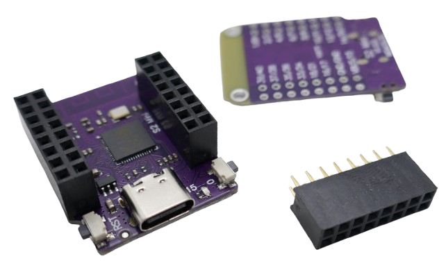

# S2 Mini

> Powerful ESP32-S2 Board That Works With ESP8266 Shields

The pink [S2 Mini microcontroller board](https://www.wemos.cc/en/latest/s2/s2_mini.html) (also known as *LOLIN S2 Mini* or *Wemos S2 Mini*) is an affordable and powerful option when you need *many GPIOs* and have space constraints.

In fact, here is my personal decision matrix for *budget ESP microcontrollers*:

| What I need | What I use |
| --- | --- |
| massive number of GPIOs | *ESP32-S2 Mini* |
| extremely small form factor | [ESP32-C3 Super Mini](https://done.land/components/microcontroller/families/esp/esp32/developmentboards/esp32-c3/c3supermini/) |
| battery support | [Lolin32 Lite](https://done.land/components/microcontroller/families/esp/esp32/developmentboards/esp32s/lolin32lite/) |
| small display and battery support | [Lilygo T-Display](https://done.land/components/microcontroller/families/esp/vendorsandseries/lilygot-display/) |
| 100% ESP32 Compatibility | [ESP32S DevKitC V4](https://done.land/components/microcontroller/families/esp/esp32/developmentboards/esp32s/esp32devkitcv4/) |
| anything beyond that | [ESP32-S3](https://done.land/components/microcontroller/families/esp/esp32/developmentboards/esp32-s3/)

## Overview

The *ESP32-S2 Mini* is powered by the **single-core** *ESP32-S2 microcontroller*. Unlike most other *ESP32* variants, this microcontroller lacks **Bluetooth support**.

Despite these limitations, the *ESP32-S2* is an exceptional microcontroller for several reasons: 

* **DACs:** It retains some features from the original *ESP32*, such as the two built-in *DACs* (*Digital-to-Analog Converters*)—a useful capability removed in all other *ESP32* successors.
* **Full USB-Stack Support:** Additionally, it is the first *ESP32* variant to offer full USB stack support, enabling it to emulate a wide range of USB device types, not just *human input devices*.

    For example, the *ESP32-S2* is the first *ESP32* family member that can natively [emulate mass storage devices](https://github.com/hathach/tinyusb/discussions/583), such as USB sticks. Older microcontrollers could only emulate *human input devices* like keyboards and mice. To dive deeper into these capabilities, check out the [TinyUSB library](https://github.com/adafruit/Adafruit_TinyUSB_Arduino).

While the *ESP32-S2 Mini* comes with a modest *4MB flash memory*, it includes an additional *2MB high speed PSRAM*. This extra memory can be particularly useful for applications that involve connecting displays to the board.


### The New ESP8266

In some respect, the *ESP32-S2 Mini* can be seen as the successor to the widely popular *ESP8266*:

- very affordable (comparable to *ESP8266* boards)
- many GPIOs
- same small, flat form factor of the *Wemos D1 Mini*
- supports shields designed for the *D1 Mini* (e.g., battery shields)

It blends these features with some of the best features of the *ESP32* world: 

* high speed memory
* fast CPU core
* much more efficient deep sleep
* two built-in DACs
* hardware support for cryptography
* full native USB stack support and no need for UARTs anymore.

| Use Case                                | Suitability |
|-----------------------------------------|-------------|
| Controlling devices via many GPIOs      | +++         |
| Migrating from *ESP8266*                | +++         |
| Integrating into small devices          | +++         |
| Beginner-friendly / ease-of-use         | o           |
| Bluetooth                               | -           |
| Demanding calculations                  | -           |
| Multi-tasking                           | -           |


### Caveats

The *ESP32-S2 Mini* offers **exceptional value for its price**, but it may not always be *beginner-friendly*.  

For example, a common issue with this board is its unreliable switching between the default *user firmware mode* and *firmware upload mode*. 

You may need to manually hold button *0* (Boot) while pressing the *Reset* button to have your PC recognize the board. Simply plugging it in may not result in your PC detecting a new USB device.  

Given the *ESP32-S2 Mini's* unique traits, here are the top four common problems and how you can elegantly work around them:


<details><summary>4 Most Common Issues - And Workarounds</summary><br/>


### Issue #1: Expansion Board

The *ESP32-S2 Mini* cannot be used directly on standard breadboards due to its dual header rows. A dedicated *development board* is necessary for prototyping, but commercial options are currently unavailable.

#### Workaround

Use two rows of 8-pin female *headers* (2.54mm pitch). These headers allow for reliable connections using standard *DuPont wires*.




### Issue #2: Wacky Native USB

The *ESP32-S2* is the first microcontroller in its family to feature full native USB support, eliminating the need for an external *UART* component. However, this innovation was implemented with some quirks: the board exposes **two different COM ports**:

- One for *normal operation*.
- Another for *firmware upload mode*.

In contrast, newer *ESP32* family members like the [ESP32-C3](https://done.land/components/microcontroller/families/esp/esp32/developmentboards/esp32-c3/c3supermini/) also have full native USB support and use no UART anymore. However, their USB support has matured and is implemented in a completely transparent, reliable and intuitive way.

Fortunately, by now most development environments like *Arduino IDE*, *PlatformIO*, and *ESPHome* work flawlessly. Except for one remaining issue:

You may have to *manually* switch to the appropriate USB interface:

* **Normal user code:** by default, the *ESP32-S2* executes the firmware you uploaded. Press the *Reset* button if you are uncertain and would like to force the microcontroller to normal user code mode.
* **Firmware Upload Mode:** hold button **0**, then press *Reset* to enter the special *firmware upload mode*. This mode remains active until you either press *Reset* (*without* holding button **0**), or remove power.

Here are the real-world situations in which you need to apply this knowledge:

* **IDE like ArduinoIDE/platformio:** right before your IDE wants to upload new firmware, you need to manually switch the board to *firmware upload mode*. Once the firmware has been uploaded, you need to manually press *Reset* to return back to normal mode.
* **ESPHome:** when trying to provision a new *ESP32-S2* with the [ESPHome Web Tools](https://web.esphome.io/), you must manually switch the board to *firmware upload mode*. Once the microcontroller has been provisioned, and the *ESPHome* firmware has been uploaded, you need to manually press *Reset* to return to normal mode. Only then will you be able to visit the device or open its log (as all of this is handled by the custom firmware and not the bootloader). 


#### Workaround

Understand the purpose of the buttons *0* and *Reset*, and make sure you switch the board to the appropriate mode manually when uploading new firmware.

If you cannot upload a binary firmware from another source, check out this  [manual workaround](https://done.land/tools/software/esphome/introduction/manualprovisioning) that was used before *ESPHome* natively supported *ESP32-S2*. It shows the general tools and steps you can use to upload any compatible binary firmware file.    


### Issue #3: Inherent Limitations

The *ESP32-S2* has certain limitations compared to other members of the *ESP32* family:

- **Bluetooth:** The *ESP32-S2* lacks Bluetooth support. While this saves energy for projects that don’t require Bluetooth, it can be a dealbreaker for those that do. Note that projects requiring Bluetooth may fail to compile for this board.
- **Single Core:** Most applications won’t notice a single-core limitation. However, projects with extensive *WiFi* usage might experience occasional slowdowns. For instance, some [WLED](https://done.land/components/microcontroller/firmware/fromsomeoneelse/wled/) users have reported minor lags in LED animations while editing settings via WiFi—a limitation specific to single-core boards.

#### Workaround

Do not select this board if your project requires *Bluetooth*. For WiFi-intensive applications, test your use case thoroughly to ensure acceptable performance.


### Issue #4: Incomplete IDE Support

Despite its affordability and unique features, the *ESP32-S2 Mini* has yet to gain widespread popularity. As a result, support for the board in community-driven open-source projects can be incomplete. For example, the *pins_arduino.h* file included in the *Espressif ESP32 Arduino Core* may require manual updates to enable intuitive pin labels like *D0* and *D1*.

#### Workarounds

1. **Edit the *pins_arduino.h* file**: Modify it in your development environment to add the missing pin definitions.  
2. **Define constants in your code**: Assign intuitive labels like *D0* to specific *GPIO* numbers.  
3. **Use raw GPIO numbers**: Refer to the actual GPIO numbers directly in your code.

</details>

## Expansion Board

Due to its two header rows on each side, the *ESP32-S2 Mini* cannot be plugged into a normal breakout board.

The easiest workaround is to get two double-row 8-pin female *header sockets* (2.54mm pitch), and solder them onto the front side of the PCB.


This way, you can use regular *DuPont* wires for prototyping, essentially turning your *ESP32-S2 Mini* into a miniature breakout board. 

> [!IMPORTANT]
> Make sure to use decent solder temperatures: there are a lot of pins to solder, so the PCB can heat up easily. When the PCB gets too hot, sensitive components may be damaged. ALso, make sure no solder is dripping through the through-holes, potentially causing short circuits underneath the *header socket*.   


## Pin Compatibility With Wemos D1 Mini (ESP8266)

The *ESP32-S2 Mini* preserves pin compatibility with the *ESP8266 D1 Mini*. Additional features are exposed via two extra pin header rows. This compatibility makes it an excellent replacement for *ESP8266*-based projects while allowing continued use of shields originally designed for the *D1 Mini*, such as battery shields.


## 27 Safely Usable GPIOs

The *ESP32-S2* microcontroller provides **43 GPIOs**, of which a maximum of [30 GPIOs are safely usable as input and output](https://done.land/components/microcontroller/families/esp/esp32/developmentboards/esp32-s2/#30-recommended-general-purpose-gpios). Since the *ESP32-S2 Mini* uses the ESP32-S2FN4R2 chip with integrated flash memory, it doesn't require external flash memory, freeing up more GPIOs.

The *S2 Mini* exposes **27 GPIOs**, which is sufficient for most projects.

| GPIO  | Remark                                |
|-------|---------------------------------------|
| 1–18  | *Input and output, pullup and pulldown resistors* |
| 21    | *Input and output, pullup and pulldown resistors* |
| 33–40 | *Input and output, pullup and pulldown resistors* |

All GPIOs support internal pullup and pulldown resistors.


### Built-In LED

The built-in *blue LED* is connected to *GPIO15* and is *high-active*.


## S2 Mini Technical Data

| Item | Value |
| --- | --- |
| CPU | ESP32-S2FN4R2 WiFi SoC, Xtensa single-core 32-bit LX7 microprocessor |
| Speed | 240MHz |
| Coprocessor | RISC-V ULP Coprocessor |

> [!TIP]
> The relatively new *ESP32-S2FN4R2* chip integrates flash and PSRAM directly into the *ESP32-S2 silicon*, saving space and reducing design complexity.

Due to its compact form factor, the *S2 Mini* does not expose all available hardware pins. However, the *27 GPIOs* provided are sufficient for most DIY projects.

| Item | Value |
| --- | --- |
| Digital IO Pins | 27 |
| Clock Speed | 240MHz |
| Flash | 4MB |
| PSRAM | 2MB |
| SRAM | 320KB |
| SRAM in RTC | 16KB (8KB accessible by ULP coprocessor) |
| Temperature Sensor | -20°C to +110°C |
| eFuse | 1792-bit for user data |
| SAR ADC | 2×13-bit, up to 20 channels, optimized for voltages <2.45V |
| DAC | 2×8-bit (Note: Second DAC has [fixable issues](https://vuknikolic.rs/en/posts/esp32/dac_fix/)) |
| Touch | 12× touch sensing IOs |
| SPI | 4×, SPI2 and SPI3 usable: HSPI and VSPI |
| I2S | 1× |
| I2C | 2× |
| UART | 2× |
| DVP 8/16 Camera Interface | 1× |
| LCD Interface | 1× 8-bit serial, 1× 8/16/24-bit parallel |
| TWAI (CAN-Bus) | 1×, ISO11898-1 (CAN Specification 2.0) |
| PWM Controller | 8× |
| USB OTG 1.1/PHY | Host and device support |
| Cryptographic | Hardware accelerators for AES (ECB/CBC/OFB/CFB/CTR, GCM), SHA, RSA, ECC (Digital Signature) |
| Size | 34.4×25.4mm |
| Weight | 2.4g |

The *ESP32-S2* offers improved power consumption in its sleep modes compared to the classic *ESP32*:

| Operation | Current |
| --- | --- |
| Normal (WiFi) | 310mA peak |
| Modem-Sleep | 12-19mA |
| Light-Sleep | 450µA |
| Deep-Sleep | 20-190µA |

Power regulation is managed by the *ME6211C33* voltage regulator:

| Item | Value |
| --- | --- |
| Input Voltage | 4.7-6.5V |
| Operating Voltage | 2-6V |
| Max Current | 500mA @ 4.3V input / 3.3V output |


## Hardware I2C Interface
Any pin can *emulate* an *I2C* interface (or define additional ones). However, only the *hardware I2C interface* uses optimized hardware that reduces load on the microcontroller and operates at higher speeds.

| Pin | Label | Description |
| --- | --- | --- |
| 33 | SDA | Data line |
| 35 | SCL | Clock line |

## Hardware SPI Interface
Any pin can *emulate* an *SPI* interface (or define additional ones). However, only the *hardware SPI interface* uses optimized hardware that reduces load on the microcontroller. For components requiring high data rates (such as *displays*), using *hardware SPI* is recommended for much better performance and higher frame rates.

| Pin | Label | Alternate Labels | Description |
| --- | --- | --- | --- |
| 11 | MOSI | SDO, SDA | Master Out Slave In – Data sent from the master to the slave. |
| 9 | MISO | SDI | Master In Slave Out – Data sent from the slave to the master. |
| 7 | CLK | SCL, SCLK | Clock – Synchronizes communication between the master and the slave. |
| 12 | SS | Chip Select | Used by the master to select the active slave. |

> [!TIP]
> Since the *S2 Mini* is pin-compatible with the *D1 Mini*, you can refer to *D1 Mini* documentation when specific details for the *ESP32-S2* are unavailable. Documentation for the *D1 Mini* is more widely available.

### Pins and Compatible Shields

The *S2 Mini* board has 32 pins organized in two rows of 16 pins each. The *outer* row of pins is compatible with the *ESP8266 D1 Mini*. This allows the *S2 Mini* to use existing *D1 Mini-compatible shields* seamlessly.


To ensure maximum backwards compatibility, the *S2 Mini* designers rearranged certain pin pairs. Pins *2-11* are organized in *pairs* (e.g., *2/3*, *4/5*, *6/7*, *8/9*, *10/11*). However, some pairs are reversed; for example, *12* and *13* are placed as *13/12* instead of *12/13*. This adjustment ensures that both *11* and *12* (which are used for the *hardware SPI interface*) remain accessible when using *D1 Mini-compatible shields*.

Without this reversal, pin *12* would have been located on the *inner* rows and become inaccessible for *D1 Mini* shields.


This compatibility enables the use of *battery shields* for adding charging functionality and battery power supply, making it easier to create portable projects.


> [!CAUTION]
> Some *software-configurable* pins (like the GPIO pins and the built-in LED pin) are **not compatible** with the *ESP8266 D1 Mini*. When converting software from the *ESP8266 D1 Mini* to the *S2 Mini*, ensure that pin numbers are reviewed and reassigned as necessary.

### S2 Mini Pinout

The pin numbers printed on the backside of the *S2 Mini* breakout board correspond to the exposed *GPIO* numbers. For instance, the pin marked *1* represents *GPIO1*.

| Pin | Remark | Description |
| --- | --- | --- |
| EN | | Reset button |
| 3V3 | | Direct power supply to the CPU |
| VBUS | | Connected to the ME6211C33 voltage regulator |
| 0 | Not exposed | Boot button pulls this pin low |
| 1-6 | | General-purpose: Analog input (ADC1) and digital input/output |
| 7 | SPI SCK | General-purpose: Analog input (ADC1) and digital input/output |
| 8 | | General-purpose: Analog input (ADC1) and digital input/output |
| 9 | SPI MISO | General-purpose: Analog input (ADC1) and digital input/output |
| 10 | | General-purpose: Analog input (ADC1) and digital input/output |
| 11 | SPI MOSI | General-purpose: Analog input (ADC2) and digital input/output |
| 12 | SPI SS | General-purpose: Analog input (ADC2) and digital input/output |
| 13-14 | | General-purpose: Analog input (ADC2) and digital input/output |
| 15 | Internal LED | General-purpose: Analog input (ADC2) and digital input/output |
| 16 | | General-purpose: Analog input (ADC2) and digital input/output |
| 17 | DAC1 | General-purpose: Analog input (ADC2) and digital input/output |
| 18 | DAC2 | General-purpose: Analog input (ADC2) and digital input/output |
| 19, 20 | Not exposed | *USB D1/D2*, connected to the *USB-C* connector | 
| 21 | | General-purpose digital input/output |
| 33 | I2C SDA | General-purpose digital input/output |
| 34 | | General-purpose digital input/output |
| 35 | I2C SCL | General-purpose digital input/output |
| 36-40 | | General-purpose digital input/output |

> [!CAUTION]
> The *ADC2* (used for analog inputs on *GPIO11-GPIO18*) is only available when *WiFi* is disabled. This limitation is due to shared hardware resources.


## Fixing Missing Pins

When programming the *S2 Mini* in *PlatformIO*, the translation between the true *hardware pins* and the *common pin labels* is handled automatically. The *IDE* refers to the appropriate version of the file `pins_arduino.h` in the folder: `%USERPROFILE%\\.platformio\packages\framework-arduinoespressif32\variants\lolin_s2_mini`.

### Pin Declarations Missing

At the time of this writing, the `pins_arduino.h` file exists but is incomplete. It does not define the *common pin labels* for all *digital pins*.

If your source code refers to a **D*x*** pin (e.g., `D2`) and you try to compile it, the compilation will fail with an exception because these labels are undefined.

Currently, no *officially updated version* of this file is available. To resolve this issue, you have two options:

1. **Quick Fix:**  
   Replace the *common pin labels* in your source code with the actual *hardware pin* numbers. For example, change `D2` to `2`. Since the *S2 Mini* uses hardware pin numbers directly, this approach works. However, it makes your code specific to the *S2 Mini*, meaning it will no longer work on other microcontroller boards.

2. **Permanent Fix:**  
   Open the file `pins_arduino.h` in a text editor and manually add the missing declarations. Below is an example of the declarations you can add. Be aware that your changes may be overwritten during future updates to the *Espressif32 Arduino framework*.


````c++
#ifndef Pins_Arduino_h
#define Pins_Arduino_h

#include <stdint.h>

// Default USB Settings
#define USB_VID 			0x303a
#define USB_PID 			0x80C2
#define USB_MANUFACTURER 	"WEMOS.CC"
#define USB_PRODUCT 		"LOLIN-S2-MINI"
#define USB_SERIAL 			"0"


// Default USB FirmwareMSC Settings
#define USB_FW_MSC_VENDOR_ID 		"ESP32-S2" 		//max 8 chars
#define USB_FW_MSC_PRODUCT_ID 		"Firmware MSC"	//max 16 chars
#define USB_FW_MSC_PRODUCT_REVISION	"1.23" 			//max 4 chars
#define USB_FW_MSC_VOLUME_NAME 		"S2-Firmware" 	//max 11 chars
#define USB_FW_MSC_SERIAL_NUMBER 	0x00000000

#define EXTERNAL_NUM_INTERRUPTS 46
#define NUM_DIGITAL_PINS        48
#define NUM_ANALOG_INPUTS       20

#define analogInputToDigitalPin(p)  (((p)<20)?(analogChannelToDigitalPin(p)):-1)
#define digitalPinToInterrupt(p)    (((p)<48)?(p):-1)
#define digitalPinHasPWM(p)         (p < 46)

static const uint8_t LED_BUILTIN = 15;
#define BUILTIN_LED  LED_BUILTIN // backward compatibility

static const uint8_t TX = 39;
static const uint8_t RX = 37;

static const uint8_t SDA = 33;
static const uint8_t SCL = 35;

static const uint8_t SS    = 12;
static const uint8_t MOSI  = 11;
static const uint8_t MISO  = 9;
static const uint8_t SCK   = 7;

static const uint8_t A0 = 1;
static const uint8_t A1 = 2;
static const uint8_t A2 = 3;
static const uint8_t A3 = 4;
static const uint8_t A4 = 5;
static const uint8_t A5 = 6;
static const uint8_t A6 = 7;
static const uint8_t A7 = 8;
static const uint8_t A8 = 9;
static const uint8_t A9 = 10;
static const uint8_t A10 = 11;
static const uint8_t A11 = 12;
static const uint8_t A12 = 13;
static const uint8_t A13 = 14;
static const uint8_t A14 = 15;
static const uint8_t A15 = 16;
static const uint8_t A16 = 17;
static const uint8_t A17 = 18;
static const uint8_t A18 = 19;
static const uint8_t A19 = 20;

static const uint8_t D1 = 1;
static const uint8_t D2 = 2;
static const uint8_t D3 = 3;
static const uint8_t D4 = 4;
static const uint8_t D5 = 5;
static const uint8_t D6 = 6;
static const uint8_t D7 = 7;
static const uint8_t D8 = 8;
static const uint8_t D9 = 9;
static const uint8_t D10 = 10;
static const uint8_t D11 = 11;
static const uint8_t D12 = 12;
static const uint8_t D13 = 13;
static const uint8_t D14 = 14;
static const uint8_t D15 = 15;
static const uint8_t D16 = 16;
static const uint8_t D17 = 17;
static const uint8_t D18 = 18;
static const uint8_t D33 = 33;
static const uint8_t D34 = 34;
static const uint8_t D35 = 35;
static const uint8_t D36 = 36;
static const uint8_t D37 = 37;
static const uint8_t D38 = 38;
static const uint8_t D39 = 39;
static const uint8_t D40 = 40;

static const uint8_t T1 = 1;
static const uint8_t T2 = 2;
static const uint8_t T3 = 3;
static const uint8_t T4 = 4;
static const uint8_t T5 = 5;
static const uint8_t T6 = 6;
static const uint8_t T7 = 7;
static const uint8_t T8 = 8;
static const uint8_t T9 = 9;
static const uint8_t T10 = 10;
static const uint8_t T11 = 11;
static const uint8_t T12 = 12;
static const uint8_t T13 = 13;
static const uint8_t T14 = 14;

static const uint8_t DAC1 = 17;
static const uint8_t DAC2 = 18;

#endif /* Pins_Arduino_h */
````
## Uploading Firmware

Follow these steps to upload new firmware to the *S2 Mini* using *PlatformIO*:

1. **Connect the Board**:  
   Use a USB-C cable to connect the *S2 Mini* to your computer. Ensure the cable is a *data cable* and not a *power-only cable*.

2. **Enter Flash Mode**:  
   - Hold down the *0* button.
   - While holding *0*, short-press the *RST* button.
   - Release the *RST* button. Your computer should play the sound indicating *new USB device discovery*.

3. **Upload the Firmware**:  
   - In *PlatformIO*, click the *Upload* button.  
   - *PlatformIO* will automatically:
     - Search for a port.
     - Reset the *S2 Mini*.
     - Find the port again and upload the firmware.

4. **Execute the Sketch**:  
   Once the upload completes, short-press the *RST* button again. The uploaded sketch should now execute.


### Troubleshooting USB Recognition Issues

If the *S2 Mini* is not recognized by your computer (e.g., no "new USB device" sound plays after following the above steps), try the following:

- Ensure the *USB cable* is fully plugged in at both ends.
- Reverse the plugs (try flipping the cable's orientation if possible).
- Use a different USB-C cable. Some cables may not make proper contact due to low-quality connectors.

> [!TIP]
> If changing the USB cable does not resolve the issue, try rebooting your computer. USB communication can sometimes fail over time, or other running software may interfere with USB device discovery. A reboot often resolves these unrelated USB issues, which can occur with any microcontroller board.

If the problem persists, check if the board is unusually warm. Poor build quality in some *S2 Mini* units may cause issues such as solder residue short-circuiting the CPU contacts. Inspect the board closely, paying attention to solder joints and potential defects.


### ESPHome

To flash the *S2 Mini* with [ESPHome](https://esphome.io/), note the following:

- The [ESPHome Web Tool](https://web.esphome.io/) is **incompatible** with this board (as of this writing).
- Use the [manual provisioning workaround](https://esphome.io/guides/manual-provisioning.html) to upload the ESPHome firmware or to provision the board with the generic ESPHome firmware.

Once the ESPHome firmware has been successfully uploaded via USB at least **once**, you can use *Over-The-Air (OTA)* updates for future firmware uploads. This approach bypasses the *S2 Mini USB incompatibilities* entirely for subsequent updates.


## Materials

[S2 Mini Datasheet](materials/esp32-s2_datasheet.pdf)   
[S2 Mini Schematics](materials/s2_mini_schematic.pdf)   
[S2 Mini Dimensions](materials/s2mini_dimensions.pdf)   
[ME6211 voltage regulator](materials/me6211_datasheet.pdf)   


> Tags: Microcontroller, ESP32, S2, ESP32 S2, Shield, Pin, I2C, SPI

[Visit Page on Website](https://done.land/components/microcontroller/families/esp/esp32/developmentboards/esp32-s2/s2mini?273412051205244129) - created 2024-05-04 - last edited 2024-07-16
