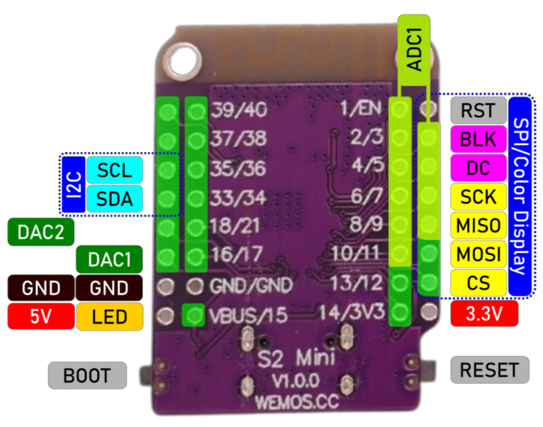

# S2 Mini

> Powerful ESP32-S2 Board That Works With ESP8266 Shields

The pink [S2 Mini microcontroller board](https://www.wemos.cc/en/latest/s2/s2_mini.html) (also known as *LOLIN S2 Mini* or *Wemos S2 Mini*) is an affordable and powerful option when you need *many GPIOs* and have space constraints. 


## Overview

The *ESP32-S2 Mini* is powered by the **single-core** *ESP32-S2 microcontroller*. Unlike most other *ESP32* variants, this microcontroller lacks **Bluetooth support**.

Despite these limitations, the *ESP32-S2* is an exceptional microcontroller for several reasons: 

* **DACs:**    
   It retains some features from the original *ESP32*, such as the two built-in *DACs* (*Digital-to-Analog Converters*)—a useful capability removed in all other *ESP32* successors.
* **Full USB-Stack Support:**    
   Additionally, it is the first *ESP32* variant to offer full USB stack support, enabling it to emulate a wide range of USB device types, not just *human input devices*.

    For example, the *ESP32-S2* is the first *ESP32* family member that can natively [emulate mass storage devices](https://github.com/hathach/tinyusb/discussions/583), such as USB sticks. Older microcontrollers could only emulate *human input devices* like keyboards and mice. To dive deeper into these capabilities, check out the [TinyUSB library](https://github.com/adafruit/Adafruit_TinyUSB_Arduino).
* **Full Support:**    
   The *S2 Mini* has a dedicated microcontroller board profile: `LOLIN S2 Mini`. When configured correctly, this board works exceptionally well in *ArduinoIDE*, *platformio*, and *ESPHome*.

While the *ESP32-S2 Mini* comes with a modest *4MB flash memory*, it includes an additional *2MB high speed PSRAM*. This extra memory can be particularly useful for applications that involve connecting displays to the board.


<details><summary>The New ESP8266?</summary><br/>


In some respect, the *ESP32-S2 Mini* can be seen as the successor to the widely popular *ESP8266*:

- very affordable (comparable to *ESP8266* boards)
- many GPIOs
- same small, flat form factor of the *Wemos D1 Mini*
- supports shields designed for the *D1 Mini* (e.g., battery shields)

It blends these features with some of the best features of the *ESP32* world: 

* high speed memory
* fast CPU core
* much more efficient deep sleep
* two built-in DACs
* hardware support for cryptography
* full native USB stack support and no need for UARTs anymore.

| Use Case                                | Suitability |
|-----------------------------------------|-------------|
| Controlling devices via many GPIOs      | +++         |
| Migrating from *ESP8266*                | +++         |
| Integrating into small devices          | +++         |
| Beginner-friendly / ease-of-use         | o           |
| Bluetooth                               | -           |
| Demanding calculations                  | -           |
| Multi-tasking                           | -           |


The *ESP32-S2 Mini* preserves pin compatibility with the *ESP8266 D1 Mini*. Additional features are exposed via two extra pin header rows. This compatibility makes it an excellent replacement for *ESP8266*-based projects while allowing continued use of shields originally designed for the *D1 Mini*, such as battery shields.


</details>

### Alternatives

Here is a decision matrix for *budget ESP microcontrollers*:

| What I need | What I use |
| --- | --- |
| massive number of GPIOs | *ESP32-S2 Mini* |
| extremely small form factor | [ESP32-C3 Super Mini](https://done.land/components/microcontroller/families/esp/esp32/developmentboards/esp32-c3/c3supermini/) |
| battery support | [Lolin32 Lite](https://done.land/components/microcontroller/families/esp/esp32/developmentboards/esp32s/lolin32lite/) |
| small display and battery support | [Lilygo T-Display](https://done.land/components/microcontroller/families/esp/vendorsandseries/lilygot-display/) |
| 100% ESP32 Compatibility | [ESP32S DevKitC V4](https://done.land/components/microcontroller/families/esp/esp32/developmentboards/esp32s/esp32devkitcv4/) |
| anything beyond that | [ESP32-S3](https://done.land/components/microcontroller/families/esp/esp32/developmentboards/esp32-s3/)


## Arduino Framework


For the *S2 Mini*, use the board definition `LOLIN S2 Mini`.


### ArduinoIDE
Verify that you have selected the board `LOLIN S2 Mini`:


Verify that the optional tool settings have been set correctly. In menu `Tools`, check these options:

* **USB CDC On Boot:** must be set to *Enabled*  
* **Upload Mode:** must be set to *UART0*


### platformio
Use this `platformio.ini`:

````
[env:lolin_s2_mini]
platform = espressif32
board = lolin_s2_mini
framework = arduino
build_flags = 
    -DARDUINO_USB_SERIAL
````


<details><summary>Example Code</summary><br/>

Use this code to test-drive the settings with your *S2 Mini*: the built-in LED should start blinking with *1 Hz* frequency, and the serial interface prints the *GPIO constants* and their values to the *ArduinoIDE Serial Monitor*: 


````c++
#include <Arduino.h>

void showPins() {
  // prints currently valid pin assignments to terminal:
  Serial.println("Pin Definitions for the Board:");

  // SPI Pins
  Serial.println("\nSPI Pins:");
  Serial.printf("MISO: %d\n", MISO);
  Serial.printf("MOSI: %d\n", MOSI);
  Serial.printf("SCK: %d\n", SCK);
  Serial.printf("SS (CS): %d\n", SS);

  // I2C Pins
  Serial.println("\nI2C Pins:");
  Serial.printf("SDA: %d\n", SDA);
  Serial.printf("SCL: %d\n", SCL);

  // LED Pin
  Serial.println("\nLED Pin:");
#ifdef LED_BUILTIN
  Serial.printf("LED_BUILTIN: %d\n", LED_BUILTIN);
#else
  Serial.println("No LED_BUILTIN defined for this board.");
#endif

  // DAC Pins
  Serial.println("\nDAC Pins (if available):");
#if defined(DAC1) && defined(DAC2)
  Serial.printf("DAC1: %d\n", DAC1); // Often GPIO25
  Serial.printf("DAC2: %d\n", DAC2); // Often GPIO26
#else
  Serial.println("DAC not available on this board.");
#endif

  // UART/Serial Pins
  Serial.println("\nSerial Pins:");
#if defined(TX) && defined(RX)
  Serial.printf("TX: %d\n", TX);
  Serial.printf("RX: %d\n", RX);
#else
  Serial.println("Default UART TX and RX not defined for this board.");
#endif
}


void setup() {
  // start serial output (baud rate does not matter with USB CDC)
  Serial.begin();
  // set built-in LED on GPIO8 for output
  pinMode(LED_BUILTIN, OUTPUT);
  // wait for the serial output to be ready
  delay(5000);
  // output pin assignments
  showPins();
}

void loop() {
  // blinks built-in LED at 1Hz to check that firmware is running:
  digitalWrite(LED_BUILTIN, HIGH);
  delay(500);
  digitalWrite(LED_BUILTIN, LOW);
  delay(500);
}
````
</details>


### ESPHome
In *ESPHome*, use the board `lolin_s2_mini`:

````
esp32:
  board: lolin_s2_mini
  framework:
    type: arduino
````

> [!IMPORTANT]
> If you upload via USB cable, you may have to *enable firmware upload mode* manually: hold button `0`, then press `RST`. Once upload completes, press `RST` to return to normal mode.


<details><summary>Examle configuration</summary><br/>

Here is an example configuration showing how yo interface a `ili9341` *TFT display* using *hardware SPI*:

````
esp32:
  board: lolin_s2_mini
  framework:
    type: arduino

output:
  - platform: ledc
    pin: 3
    id: gpio_3_backlight_pwm
    
light:
  - platform: monochromatic
    output: gpio_3_backlight_pwm
    name: "Touchdisplay Licht"
    id: back_light
    restore_mode: ALWAYS_ON

spi:
  clk_pin: GPIO07
  mosi_pin: GPIO11
  miso_pin: GPIO09

display:
  - platform: ili9xxx
    model: ili9341
    dc_pin: GPIO05
    cs_pin: GPIO12
    invert_colors: false
    show_test_card: true
    reset_pin: GPIO01
````

</details>

## GPIO Pin Assignments
The board definition `LOLIN S2 Mini` defines these *GPIO* pin constants:




Note the efficient pin design for the *I2C* and *SPI* interfaces which allows to i.e. add *JST connectors* right to the PCB.

| GPIO | Constant | Description |
| :---: | :---: | --- |
| 15 | `LED_BUILTIN` | built-in blue LED, *high active* (*on* when *high) |
|11 | `MOSI` | *SPI:* MOSI |
| 9 | `MISO`| *SPI:* MISO |
| 7 | `SCK` | *SPI:* SCK |
| 12 | `SS` | *SPI:* SS/CS |
| 33 | `SDA` | *I2C:* SDA |
| 35 | `SCL`| *I2C:* SCL | 


## Hardware I2C Interface
These are the hardware-optimized GPIOs for *I2C*:

| GPIO | Label | Description |
| --- | --- | --- |
| 33 | SDA | Data line |
| 35 | SCL | Clock line |

You can use any other suitable GPIO for *I2C* when you use the software-emulated *I2C* (which is slower and adds burden to the microcontroller).


## Hardware SPI Interface
These are the hardware-optimized GPIOs for *SPI*:

| Pin | Label | Alternate Labels | Description |
| --- | --- | --- | --- |
| 11 | MOSI | SDO, SDA | Master Out Slave In – Data sent from the master to the slave. |
| 9 | MISO | SDI | Master In Slave Out – Data sent from the slave to the master. |
| 7 | CLK | SCL, SCLK | Clock – Synchronizes communication between the master and the slave. |
| 12 | SS/CS | Chip Select | Used by the master to select the active slave. |


> [!IMPORTANT]
> The *S2 Mini* can use `GPIO9-14` and `GPIO33-37` for hardware *SPI* which is why you can run across documentation with **different GPIO suggestions** for *SPI*. What matters is the GPIOs that the **board definition** you use has defined: `LOLIN S2 Mini` defines the GPIOs listed above. If you want to use different GPIOs for hardware *SPI*, you must use a different board definition in your development environment.          

### Always Use Hardware SPI
Devices that choose to interface via *SPI* typically require *high* data rates (i.e. *TFT color displays*). Always make sure you use the *GPIOs* listed here, and **enable** *hardware SPI* in your software or library.

With software-emulated *SPI*, while you can use *any* free GPIO,  now your microcontroller must emulate *SPI* which keeps it busier, increases its energy consumption, and yields a significant lower performance.

> [!TIP]
> With even modest-size TFT color displays, using *software-emulated SPI* is *30x slower* than hardware-supported *SPI*. With displays, this leads to very low frame rates suitable only for static content.


### DAC (Digital-to-Analog)
The *ESP32-S2* features two *DACs* (*Digital-to-Analog Converters*) that allow you to generate analog voltages from digital values. These DACs are useful for applications where you need to output an analog signal, such as audio generation, controlling analog circuits, or creating variable voltages.

The DAC output voltage is in the range of  *0* to *3.3V* with as *12-bit resolution*, allowing to control the output voltage in *4096 steps* from 0 to 4095.

*S2 Mini* exposes *DAC1* on *GPIO17* and *DAC2* on *GPIO18*. The `LOLIN S2 Mini` board definition does not define GPIO constants for the DACs. If you require them, add definitions in your source code:

````c++
#define DAC1 17
#define DAC2 18
````

### Analog Input
*GPIOs 1-10* can be safely used for analog input up to a maximum analog input voltage of *2.5V* (when *attenuation* is set to `ADC_ATTEN_DB_12`).

#### Architecture
The *ESP32-S2* integrates 2 *SAR* (*Successive Approximation Register*) *ADCs* (*Analog-to-Digital Converters*), supporting a total of 20 measurement channels (analog enabled pins). Both *ADCs* support a resolution of **12 bit**.


#### Input Voltage Range

*ADCs* can measure analog voltages from *0 V* to *Vref* which varies slightly. The median is *1.1 V*. To convert higher voltages, input voltages can be attenuated before being input to the *ADCs*. There are 4 available attenuation options, the higher the attenuation is, the higher the measurable input voltage could be.

| Attenuation | Measurable input voltage range |
| :---: | --- |
| `ADC_ATTEN_DB_0` | 0 mV ~ 750 mV |
| `ADC_ATTEN_DB_2_5` | 0 mV ~ 1050 mV |
| `ADC_ATTEN_DB_6` | 0 mV ~ 1300 mV |
| `ADC_ATTEN_DB_12`| 0 mV ~ 2500 mV |

If these ranges are still not sufficient, i.e. because you'd like to measure a *LiIon battery cell* voltage to monitor state of charge in a portable device, use a simple voltage divider circuit.

#### ADC2 Used By WiFi
Only `ADC1` with its *GPIOs 1-10* is free for you to use. `ADC2` is needed by the *WiFi* subsystem. This is typically not a problem since most projects do not require more than *10* analog inputs.

If you need more analog inputs, you can decide to disable *WiFi* during the analog input measurements. `ADC2` with its *GPIOs 11-20* is available after `esp_wifi_stop();` and before `esp_wifi_start();`.

#### Analog Input GPIOs

| GPIOs | Remark |
| :---: | --- |
| 1-10 | `ADC1` - support analog input |
| 11-20 | `ADC2` - required by *WiFi*, use only when *WiFi* is disabled |


### General Purpose GPIOs
The [ESP32-S2](https://done.land/components/microcontroller/families/esp/esp32/developmentboards/esp32-s2/#30-recommended-general-purpose-gpios) microcontroller exposes a maximum of 30 safely usable general-purpose GPIOs. Of these, the *S2 Mini PCB* exposes **27 GPIOs**. That's a massive number, sufficient for even demanding projects:

| GPIOs | Digital Read/Write | Analog Read | PWM |
| :---: | --- | --- | --- |
| 1-10 | yes | yes | yes |
| 11-18 | yes | no (unless *WiFi* is disabled) | yes |
| 21 | yes | no | yes |
| 33-40 | yes | no | yes |

All GPIOs support internal pull-up and pull-down resistors.


### Built-In LED

| GPIO | Purpose | Remark |
| --- | --- | --- |
| 15 | built-in blue LED | **high-active:**  *high*=on, *low*=off |


### GPIO Description

The pin numbers printed on the backside of the *S2 Mini* breakout board correspond to the exposed *GPIO* numbers. For instance, the pin marked *1* represents *GPIO1*.

| Pin | Remark | Description |
| --- | --- | --- |
| EN | | Reset button |
| 3V3 | | Direct power supply to the CPU |
| VBUS | | Direct *5V*/USB input, connects to the *ME6211C33* voltage regulator to supply *3.3V* to the `3V3` pin |
| 0 | Not exposed | Boot button pulls this pin *low* |
| 1-6 | | General-purpose: Analog input (ADC1) and digital input/output |
| 7 | SPI SCK | General-purpose: Analog input (ADC1) and digital input/output |
| 8 | | General-purpose: Analog input (ADC1) and digital input/output |
| 9 | SPI MISO | General-purpose: Analog input (ADC1) and digital input/output |
| 10 | | General-purpose: Analog input (ADC1) and digital input/output |
| 11 | SPI MOSI | General-purpose: Analog input (ADC2) and digital input/output |
| 12 | SPI SS/CS | General-purpose: Analog input (ADC2) and digital input/output |
| 13-14 | | General-purpose: Analog input (ADC2) and digital input/output |
| 15 | Internal LED | General-purpose: Analog input (ADC2) and digital input/output |
| 16 | | General-purpose: Analog input (ADC2) and digital input/output |
| 17 | DAC1 | General-purpose: Analog input (ADC2) and digital input/output |
| 18 | DAC2 | General-purpose: Analog input (ADC2) and digital input/output |
| 19, 20 | Not exposed | *USB D1/D2*, connected to the *USB-C* connector | 
| 21 | | General-purpose digital input/output |
| 33 | I2C SDA | General-purpose digital input/output |
| 34 | | General-purpose digital input/output |
| 35 | I2C SCL | General-purpose digital input/output |
| 36-40 | | General-purpose digital input/output |

> [!CAUTION]
> The *ADC2* (used for analog inputs on *GPIO11-GPIO18*) is only reliably available when *WiFi* is disabled. 


## D1 Mini Pin Compatibility
The *S2 Mini* PCB retains pin compatibility with the popular *ESP8266 D1 Mini*: 

Both *outer* header rows remain pin compatible with the *D1 Mini PCB*, whereas both *inner* header rows have been added to expose the new features and capabilities of the *ESP32-S2*. 


This allows the *S2 Mini* to use existing *D1 Mini-compatible shields* seamlessly, i.e. *battery shields* or *expansion boards*.


<details><summary>How S2 Mini Retains Pin-Compatibility To ESP8266</summary><br/>

*S2 Mini*'s pin compatibility with the *D1 Mini* and the uniquous and affordable extension shields is yet another example how much thought and design was invested into the *S2 Mini*.

To ensure maximum backwards compatibility, the *S2 Mini* designers rearranged certain pin pairs. Pins *2-11* are organized in *pairs* (e.g., *2/3*, *4/5*, *6/7*, *8/9*, *10/11*). However, some pairs are reversed; for example, *12* and *13* are placed as *13/12* instead of *12/13*. This adjustment ensures that both *11* and *12* (which are used for the *hardware SPI interface*) remain accessible when using *D1 Mini-compatible shields*.

Without this reversal, pin *12* would have been located on the *inner* rows and become inaccessible for *D1 Mini* shields.


This compatibility enables the use of *battery shields* for adding charging functionality and battery power supply, making it easier to create portable projects.


> [!CAUTION]
> Some *software-configurable* pins (like the GPIO pins and the built-in LED pin) are **not compatible** with the *ESP8266 D1 Mini*. When converting software from the *ESP8266 D1 Mini* to the *S2 Mini*, ensure that pin numbers are reviewed and reassigned as necessary.


</details>

## Manually Enabling Firmware Update Mode
If you are using the correct board definition in your development environment (`LOLIN S2 Mini`), **and** you have configured *USB CDC* appropriately, then this board works extremely well, and your development environment automatically controls its firmware upload mode.

All you need to do in this case is connect the board via USB to your PC, and have the development environment upload new firmware to it - done.

If things do not work seamlessly, you *may have to manually* turn on and off the firmware upload mode. If for example your development environment can "see" your microcontroller (its COM port, for example), but fails to upload new firmware, then this is an indicator that you must *manually* enable firmware upload mode *before* asking your development environment to upload new firmware.

This is how you enable firmware upload mode manually:

1. Keep the button `0` pressed
2. Push the button `RST`
3. Release the button `0`

Once the firmware has been uploaded, manually press `RST` once (without pressing `0`) to exit *firmware upload mode* and run the newly uploaded firmware.


## Expansion Board

The *ESP32-S2 Mini* cannot be used directly on standard breadboards due to its dual header rows. 

The easiest workaround is to get two double-row 8-pin female *header sockets* (2.54mm pitch), and solder them onto the front side of the PCB.


This way, you can use regular *DuPont* wires for prototyping, essentially turning your *ESP32-S2 Mini* into a miniature breakout board. 

> [!IMPORTANT]
> Make sure to use appropriate solder temperatures: there are a lot of pins to solder, so the PCB can heat up easily. When the PCB gets too hot, sensitive components may be damaged. ALso, make sure no solder is dripping through the through-holes, potentially causing short circuits underneath the *header socket*.   


## S2 Mini Technical Data

The new *ESP32-S2FN4R2* chip integrates flash and PSRAM directly into the *ESP32-S2 silicon*, saving space, an *SPI channel*, and reducing overall design complexity.


### Microcontroller and Board

| Item | Value |
| --- | --- |
| CPU | ESP32-S2FN4R2 WiFi SoC, Xtensa single-core 32-bit LX7 microprocessor |
| Coprocessor | RISC-V ULP Coprocessor |
| Clock Speed | 240MHz |
| Flash | 4MB |
| PSRAM | 2MB |
| SRAM | 320KB |
| SRAM in RTC | 16KB (8KB accessible by ULP coprocessor) |
| Temperature Sensor | -20°C to +110°C (for CPU temperature monitoring only)|
| eFuse | 1792-bit user data |
| Size | 34.4×25.4mm |
| Weight | 2.4g |

### GPIOs and Interfaces

| Item | Value |
| --- | --- |
| USB OTG 1.1/PHY | Host and device support |
| Digital IO Pins | 27 |
| SPI | 4×, SPI2 and SPI3 usable: HSPI and VSPI |
| I2C | 2× |
| SAR ADC | 2×13-bit, up to 20 channels, optimized for voltages <2.45V |
| DAC | 2×8-bit (Note: Second DAC has [fixable issues](https://vuknikolic.rs/en/posts/esp32/dac_fix/)) |
| UART | 2× |
| PWM Controller | 8× |
| Touch | 12× touch sensing IOs |
| I2S | 1× |
| DVP 8/16 Camera Interface | 1× |
| LCD Interface | 1× 8-bit serial, 1× 8/16/24-bit parallel |
| TWAI (CAN-Bus) | 1×, ISO11898-1 (CAN Specification 2.0) |
| Cryptographic | Hardware accelerators for AES (ECB/CBC/OFB/CFB/CTR, GCM), SHA, RSA, ECC (Digital Signature) |

### Power Supply and Energy Consumption


| Operation | Current | Remark |
| --- | --- | --- |
| Input Voltage | 4.7-6.5V ||
| Operating Voltage | 2-6V ||
| Voltage Regulator | [ME6211](materials/me6211_datasheet.pdf) ||
| Max Current | 500mA @ 4.3V input / 3.3V output | Voltage Regulator Limitation |
| Normal (WiFi) | 310mA peak | *not tested* |
| Modem-Sleep | 12-19mA |*not tested* |
| Light-Sleep | 450µA |*not tested* |
| Deep-Sleep | 20-190µA |*not tested* |


## Materials

[S2 Mini Datasheet](materials/esp32-s2_datasheet.pdf)   
[S2 Mini Schematics](materials/s2_mini_schematic.pdf)   
[S2 Mini Dimensions](materials/s2mini_dimensions.pdf)   
[ME6211 voltage regulator](materials/me6211_datasheet.pdf)   


> Tags: Microcontroller, ESP32, S2, ESP32 S2, Shield, Pin, I2C, SPI

[Visit Page on Website](https://done.land/components/microcontroller/families/esp/esp32/developmentboards/esp32-s2/s2mini?273412051205244129) - created 2024-05-04 - last edited 2025-01-26
