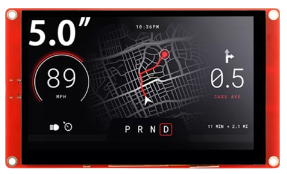
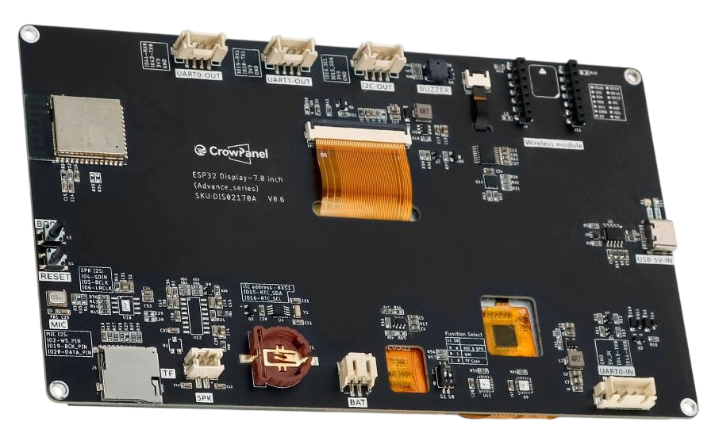

 
# Elecrow CrowPanel

> High-Quality and Full-Featured ESP32-S3 Display Boards With Touch

The initial [CrowPanel Basic](https://done.land/components/microcontroller/renownvendors/elecrow/crowpanel/#basic-series) series was using [ESP32-S3](https://done.land/components/microcontroller/families/esp/esp32/developmentboards/esp32-s3/) microcontrollers only with the larger display sizes (4.3" and larger). Smaller displays used the older [ESP32S](https://done.land/components/microcontroller/families/esp/esp32/developmentboards/esp32s/). And while all displays supported touch, displays smaller than 5" used the inferior *resistive* touch (which requires a stylus).

With the [CrowPanel Advanced](https://done.land/components/microcontroller/renownvendors/elecrow/crowpanel/#advanced-series) series, this has been streamlined: all models now use [ESP32-S3](https://done.land/components/microcontroller/families/esp/esp32/developmentboards/esp32-s3/) and **capacitive touch** displays.

## Overview
The [CrowPanel Advanced](https://done.land/components/microcontroller/renownvendors/elecrow/crowpanel/#advanced-series) series comes in a compact module which size is determined by the screen size you order.

On the backside, all connections are clearly labeled:  

However, for unknown reasons the vendor chose to use a mixture of different connector standards:

* **Speaker:** uses 2-pin *JST PH 2.0* as they are commonly used with *1S LiPo* pouch batteries.
* **UART0-IN:** uses 4-pin *JST XH2.54* which is also fairly common as generic connector with a 2.54 inch pitch
* **UART0-OUT**,**UART1-OUT**, **I2C-OUT**: uses 4-pin *HY2.0* connectors with a 2.0mm pitch. One such cable was provided with the device, however three are needed, and this type is not typically used in labs.

> Tags: Microcontroller, Elecrow, CrowDisplay, ESP32-S3, Capacitive Touch

[Visit Page on Website](https://done.land/components/microcontroller/families/esp/esp32/developmentboards/esp32-s3/elecrowcrowpanel?792292081404251335) - created 2025-08-03 - last edited 2025-08-03
