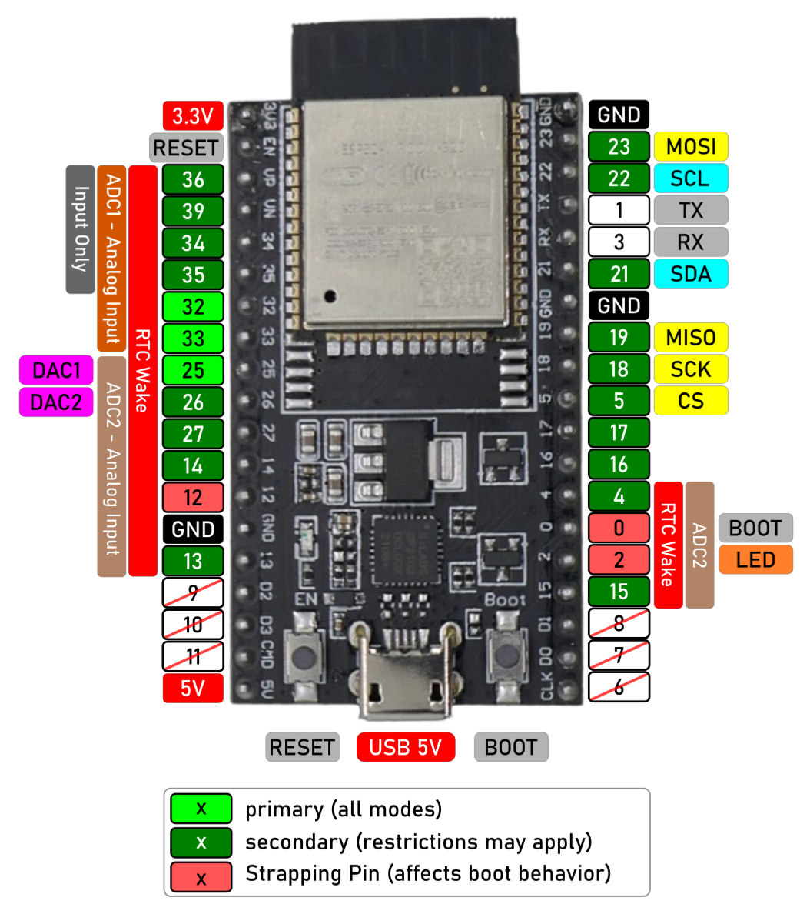
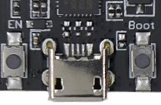
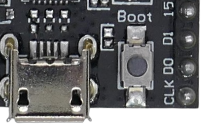
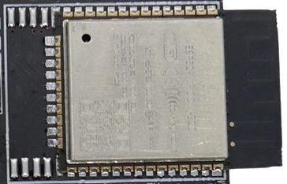
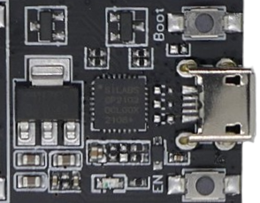
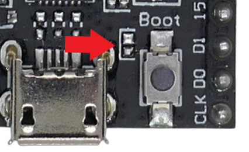
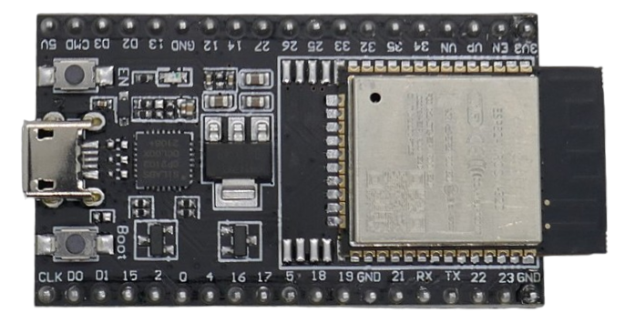

 
# ESP32 DevKitC V4

> Original DevKit from Espressif With Access to All ESP32 Pins – For Experienced Users
The *ESP32 DevKitC V4* is a classic **engineering development board**, designed for **advanced prototyping, debugging, education, and experimentation**. Essentially, it serves as a hosting platform for an *ESP32 module*, providing access to nearly all of its pins.

However, this board is **not an ideal choice for beginners**. It may also be less suitable for integration into DIY devices, particularly those that rely on battery power or have space constraints.

## Overview

The *ESP32 DevKitC V4* is widely regarded as the *gold standard* for *ESP32* prototyping. Many projects use this board to test and experiment with code and peripherals, and you can likely use existing *ESP32* source code with minimal modifications. 

Every possible *GPIO* is exposed, giving you a high degree of flexibility and the option to *adapt* your test setup to simulate almost any other *ESP32* board someone may have been used in a project you are trying to replicate.

> [!NOTE]
> *Espressif* has open-sourced the [original DevKitC V4 board design](https://docs.espressif.com/projects/esp-idf/en/v4.4/esp32/hw-reference/esp32/get-started-devkitc.html). Today, many vendors produce such boards with minor variations voltage regulator (*AMS1117* vs. *IRU1117-33*), UART chip (*CH340* vs. *CP2102*), USB connector (*USB-C* vs. *Micro-USB*), and pin labelling. **All of these "DevKitC" boards are pin-compatible.** 

### 30-Pin Variant
While the board provides access to *38 pins*, you likely won’t need all of them. In fact, having so many exposed pins can be **confusing** or even **risky**—some pins can destabilize the board if used as regular *GPIOs*.

A similar *30-pin variant* retains the essential GPIOs and flexibility while omitting the pins that are either **useless or problematic** for typical use cases.

The extra pins on the *38-pin version* (`D0`, `D1`, `D2`, `D3`, `CLK`, `CMD`) are primarily intended for **hardware engineers** exploring aspects of the *ESP32* that are beyond the needs of DIY hobbyists.

## GPIOs

The *ESP32S* follows standardized GPIO assignments, especially for common interfaces like *I2C* and *SPI*. Most development boards—including the *DevKitC V4* discussed here—[adhere to these conventions](https://done.land/components/microcontroller/families/esp/esp32/developmentboards/esp32s/#gpios).

### Primary GPIOs

If you need quick, reliable GPIOs, focus on those marked in *light green*: GPIOs `25`, `32`, and `33`. These three GPIOs support **all modes**—they can be used for *input*, *output*, and even *analog input*.

### Additional GPIOs

If you need more than the three foolproof GPIOs, there are many additional ones marked in *dark green*. However, these GPIOs may have restrictions depending on your use case.

Before using any of them, ensure you understand their limitations and potential conflicts with the microcontroller's features:

- **Input-Only:** Some GPIOs support only *input* and cannot be used for *output* or with internal pull-up/pull-down resistors.
- **Analog Input:** Only GPIOs connected to *ADC1* support analog input. GPIOs connected to *ADC2* can only be used for analog input while **WiFi is disabled**.
- **Shared Interfaces:** Some GPIOs are assigned to hardware interfaces such as *SPI*, *I2C*, or the two built-in *DACs* (*Digital-to-Analog Converters*). You can repurpose them if you don't require their assigned function.
- **WROVER Modules:** GPIOs `16` and `17` are available only on boards with **ESP32-WROOM** and **ESP32-SOLO-1** modules. Boards with **ESP32-WROVER** modules reserve these pins for internal use.

### Off-Limit GPIOs

Avoid using the GPIOs that are located near the **USB connector**—they are strictly **off-limits**. Specifically:

- GPIOs `6-11` are internally used for communication between the microcontroller and **SPI flash memory**. Using these pins may disrupt flash access, leading to system instability.

### Interfaces (UART, I2C, and SPI)

Interfaces allow the ESP32 to communicate with peripherals. The choice of interface depends on the peripheral you want to connect.

#### Software-Emulated 

- You can implement **any interface** on *any available GPIO* using software emulation.
- However, software-emulated interfaces introduce **higher CPU load** and are **significantly slower** than hardware-supported interfaces.
- To use a software-emulated interface, you must **explicitly specify** the GPIOs for the interface in your code.

#### Hardware-Accelerated 

- Some GPIOs are routed to dedicated **hardware-supported interfaces**, which are **much faster** and offload processing from the microcontroller.
- When using hardware-supported interfaces, the constructors in your development environment handle GPIO assignment **automatically**.
- Typically, you **do not** need to specify GPIOs when using these interfaces, as they are fixed.

> [!IMPORTANT]  
> If the *board definition* in your development environment (*Arduino IDE*, *PlatformIO*, *ESPHome*, etc.) **does not match your actual development board**, GPIO assignments for hardware interfaces may be incorrect, causing failures when trying to use them.

### SPI

*ESP32* comes with *two* hardware *SPI* interfaces called *VSPI* and *HSPI*. 

Most projects require only *one SPI* interface (if at all), and by convention *VSPI* is typically used. You should wire your board accordingly for best compatibility.

| SPI | MOSI | MISO | SCLK | CS |
| --- | --- | --- | --- |--- |
| VSPI (default) | `23` | `19` | `18` | `5` |
| HSPI (secondary) | `13` | `12` | `14` | `15` |

### I2C

| Label | GPIO |
| --- | --- |
| SDA | `21` |
| SCL | `22` |

### Serial Interface (UART)

| UART Port | TX | RX |
| --- | --- | --- |
| UART 0 (default) | `1` | `3` |
| UART1 | custom | custom |
| UART2 | `17` or custom | `16` or custom |

> [!NOTE]
> *UART0* is the default serial interface. It is used when you communicate with a PC terminal window, or when you upload firmware.

> [!NOTE]
> Here are detailed information about [safe-to-use ESP32 GPIOs](https://done.land/components/microcontroller/families/esp/esp32/developmentboards/esp32s/#safe-gpios).

## Firmware Upload Mode
The board comes with two buttons labelled `BOOT` and `RST`:

* `BOOT`: when pressed, connects GPIO `0` to `GND`
* `RST`: when pressed, connects `EN` to `GND` 

There are a number of use cases.

### Enter Firmware Upload Mode
Development environments often trigger firmware upload mode automatically before they start uploading new firmware to your microcontroller. 

With this board, this *does not occur automatically*, and you need to enable this mode *manually*:

* **Enter:** Keep `BOOT` pressed, then press `RST` once. The microcontroller reboots, and when it finds GPIO `0` *low* (since `BOOT` is pressed), it launches the *boot loader* from *ROM* and is now ready to accept firmware uploads from your development environment.
* **Exit:** Press `RST` once to reset the microcontroller. Do not hold down `BOOT`. When the microcontroller finds GPIO `0` *high* (default), it starts normally and runs the user firmware. 

### Regular Reset
You can press `RST` anytime to perform a normal reset. Keep in mind that this resets only your microcontroller. Connected peripherals (like displays) may not reset and may retain their display content.

### User Push Button
`BOOT` pulls GPIO `0` *low* when the user pushes this button. GPIO `0` has special meaning only when the microcontroller is booting. 

Once it has booted, and once your own firmware runs, you can safely use GPIO `0` for your own purposes.

For example, you can use GPIO `0` as a *digital input*, and use the built-in `BOOT` push button as input device.

## Driver Installation

The original board design used a *CP2102* UART from *Silicon Labs*. Consumer PCs do not typically ship with a driver for this UART. 

### CP210x Driver May Be Required
If your microcontroller is not recognized by the PC when you connect it, you most likely need to manually install the driver first:

- Visit [Silicon Labs](https://www.silabs.com/developers/usb-to-uart-bridge-vcp-drivers?tab=downloads) and download the appropriate driver package. On *Windows*, you should download both *CP210x Windows Drivers* and *CP210x VCP Windows*.

> [!TIP]
> After downloading the driver packages, right-click the ZIP file, select *Properties*, and click the *Unblock* button **before unzipping the file**.

Once the drivers are installed, restart your computer.

### UART Variations
Some vendors have replaced the *CP2102* UART by the more popular *CH340* in which case typically no additional drivers are required.

### Testing UART Connection
When you connect the *DevKitC V4* board via USB cable to your PC, and the required drivers are available, the PC should emit the typical sound signal for a newly discovered USB device.

In *Device Manager* (on *Windows*), a new *COM port* should show when the board is connected, and disappear when it is disconnected.

## Hardware Overview

The *DevKitC V4* is a **development board** explicitly designed for testing *ESP32* **modules**. It supports various *ESP32 modules*, including `ESP32-WROOM-DA/32E/32UE/32D/32U`, `ESP32-WROVER-E/IE`, and `ESP32-SOLO1`.

Because of this, the *ESP module* mounted on your development board may differ from the examples shown here.

### Module Variants

- **External Antenna:** If your board has an *IPEX* connector, you **must** connect an external antenna **before powering on the board**. Otherwise, a meandering PCB trace indicates a *built-in* antenna.
- **WROOM:** This variant is *smaller*, leaving some unused solder pads visible. It lacks *PSRAM*, and GPIOs `16` and `17` are available for use.
- **WROVER:** Includes additional *PSRAM* and utilizes all solder pads. GPIOs `16` and `17` are internally used and not available for general use.

In the original PCB design, which accommodates both `WROOM` and `WROVER`, the `WROOM` module left unused space. Some manufacturers optimized the PCB layout by shifting `WROOM` so that its PCB antenna fills this space rather than protruding.

> [!NOTE]
> The *DevKitC* from *Espressif* has undergone numerous minor revisions and variations. This section focuses on the standard components found in the original *Espressif* design.

### USB Connector

The original board uses a *Micro-USB* connector:

Many modern versions have replaced it with *USB-C*.

### UART Interface

Near the *USB connector*, a *Silicon Labs CP2102* chip provides a *USB-to-UART* bridge, supporting speeds up to **3 Mbps**. Your computer may require [manual driver installation](https://done.land/components/microcontroller/families/esp/esp32/developmentboards/esp32s/esp32devkitcv4/#manual-driver-installation) to recognize this chip.

### Power Supply

The board offers three *mutually exclusive* power options:

1. **USB:** Provides *5V*, which is internally regulated to *3.3V*.
2. **5V/GND Pins:** Allows external *5V* power input, passing through the onboard voltage regulator. Acceptable voltage range: *4.75V - 7.0V* (varies by board version).
3. **3.3V/GND Pins:** Supplies *3.3V* directly, bypassing the voltage regulator. This is more energy-efficient but **riskier**—if the voltage strays outside *3.0V - 3.6V*, it could damage the board. Additionally, the power LED will not turn on.

> [!CAUTION]
> Never use multiple power sources simultaneously. A common mistake is supplying power via the *5V* or *3.3V* pins while also connected to USB, which can damage the board. To prevent this, either disconnect external power during firmware uploads or use a *USB cable* with power lines disabled.

### Voltage Regulator

The board features an *IRU1117-33* 3.3V *voltage regulator*, capable of supplying up to **800mA**. It operates when powered via USB or the *5V pin* and supports a maximum input voltage of **7V**.

The board includes two *JY3/S8050* epitaxial planar transistors, each capable of handling **500mA** of current with high total power dissipation.

### Antenna

Some *ESP32 modules* come with a built-in PCB antenna, while others include support for an *IPEX connector*, allowing you to connect an external antenna for extended range.

If your board requires an external antenna, **make sure to connect it before powering on**. Running the board without an antenna—even briefly—can cause permanent damage to the built-in *WiFi amplifier*.

### Power LED

This board does not feature a programmable LED.

It includes a red *power LED* that lights up when the board is powered through the *5V* pin or via USB.

However, the LED will not turn on if you supply power directly to the *3V3* pin.

## Historic Hardware Flaw

In early versions of this board, there was a significant issue: when the board was powered externally (i.e., not through *USB*), it required you to manually press the *EN* button to reset the board and begin running your code. However, this problem did not occur when the board was powered via USB.

The root cause was a *capacitor* (`C15`) connected in parallel with the `Boot` button. This capacitor caused the board to enter the bootloader by default, preventing it from running your code. In later versions of the board, this capacitor was removed to fix the issue.

> [!CAUTION]
> If you're using an older version of the board and experiencing this issue, you might need to remove the problematic SMD capacitor (`C15`). This can be tricky due to its small size and the delicate tracks underneath. Make sure to use a heat gun and proper desoldering tools to carefully remove it.

Below is an image of a newer version of the board that still has the solder pads for *C15*, but without the capacitor installed:

## Conclusion

While the *ESP32 DevKitC V4* is a powerful and versatile board, it may not be the best choice for beginners due to several factors:

* **Drivers**:     
   The original design uses a *CP2102* UART controller, and its drivers are typically not included in your PC’s operating system. As a result, you may need to [manually install the appropriate driver](https://done.land/components/microcontroller/families/esp/esp32/developmentboards/esp32s/esp32devkitcv4/#manual-driver-installation) before your PC can recognize the board.

* **Size**:    
   The board's size can make it difficult to use with breadboards. To simplify connections, it's recommended to use a dedicated [expansion board](https://done.land/components/microcontroller/expansionboards/devkitcv4/) designed for this purpose.

    

* **Labels**:     
   Pin labeling can be confusing, and the print quality of some labels may be poor. Some pins are labeled by *GPIO numbers*, while others use *D* notation (e.g., `D2`, which corresponds to GPIO `9`). While `Dx` GPIOs in hobbyist projects denote *recommended* GPIOs, with *this* board, `Dx` are GPIOs **that you may under no circumstances use**. Accidentally using these pins may cause the board stop booting or behave erratically.

* **No LED**:     
   This board lacks a built-in programmable LED, a feature that is commonly used for testing and learning, particularly for beginners.
### When to Use

*ESP32 enthusiasts* should have at least *one ESP32 DevKitC V4* board for reference, along with an *expansion board* for it. This combination is a perfect starting point to explore and replicate existing projects or test new peripherals and unknown components.

#### Expansion Board Recommended

Here’s a picture showing the *DevKitC V4* mounted on an [expansion board](https://done.land/components/microcontroller/expansionboards/devkitcv4/). For comparison, at the bottom, you can see a modern [ESP32-C3 SuperMini board](https://done.land/components/microcontroller/families/esp/esp32/developmentboards/esp32-c3/c3supermini/), which, for many use cases, is a **much better, significantly smaller, and more affordable** choice.

#### Perfect Test Environment

Since the *DevKitC V4* uses a *classic ESP32* microcontroller and exposes every single GPIO pin, it’s the perfect development board for replicating projects. 

It doesn’t matter which development board the original author used—as long as it was based on an *ESP32* microcontroller, you’ll be able to use any of the *GPIOs* they selected without needing to adjust the project or its GPIO assignments. This greatly reduces the chances of breaking things during the process.

#### Exploring New Components

Thanks to the numerous connectors found on the *expansion board*, this setup is also ideal for quickly testing peripherals or exploring new devices.

#### First Realize, Then Optimize

Go step by step. It’s essential to first have a *working prototype*. The *DevKitC V4* might not be the smallest or most elegant, but it’s perfect for prototyping.

Once you’ve built a working prototype or successfully replicated an existing project and gained a solid understanding, you’re ready for the next steps:

* **Optimize Size:**    
   If you want to create a smaller device based on your idea, transition your working prototype to a more compact development board.
* **Optimize Cost/Performance:**    
   Move your code to a more modern, more capable, or possibly more affordable *ESP32* variant.

## Specifications

| Item | Description |
| --- | --- |
| USB Connector | Micro-USB |
| Microcontroller | ESP32-WROOM-DA/32E/32UE/32D/32U, ESP32-WROVER-E/IE, ESP32-SOLO1 |
| Voltage Regulator | [IRU1117-33](https://done.land/assets/files/iru1117_datasheet.pdf) | 
| UART | [CP2102](https://done.land/assets/files/cp2102_datasheet.pdf) |
| UART Driver | [Silicon Labs](https://www.silabs.com/developers/usb-to-uart-bridge-vcp-drivers?tab=downloads) |
| Input Voltage at **5V pin** | *4.75-7.0V* |
| Input Voltage at **3.3V pin** | *3.0-3.6V* |
| Power Consumption | WiFi: *130-160mA* Deep Sleep: *19mA* |
| Internal LED | none |
| I2C Pins | SDA 21, SCL 22 |
| SPI Pins | MOSI 23, MISO 19, SCLK 18 |
| Size | 48.2x27.9mm (without PCB antenna), 54.4x27.9mm (with PCB antenna) |

## Materials
[Board Schematics](materials/esp32_devkitc_v4-sch.pdf)    
[ESP32 Datasheet](materials/esp32_datasheet_en.pdf)    
[CP2102 USB-UART-Bridge](materials/cp2102_datasheet.pdf)    
[IRU1117 3.3V Voltage Regulator](materials/iru1117_datasheet.pdf)     
[S3050/J3Y Transistor](materials/iru1117_datasheet.pdf)     

  

> Tags: Microcontroller, ESP32, CP2102

[Visit Page on Website](https://done.land/components/microcontroller/families/esp/esp32/developmentboards/esp32s/esp32devkitcv4?604445051417245543) - created 2024-05-16 - last edited 2025-01-28
