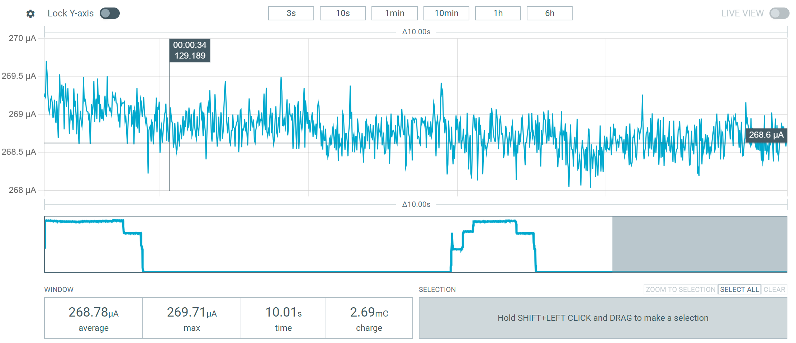

 
# Deep Sleep Example

> Sending T-Display To Deep Sleep Efficiently

The T-Display board supports a single LiIon/LiPo battery cell and comes with a built-in charger, so it is well suited for battery-operated devices. When you send the board to deep sleep though, it may still consume many *mA* and not sleep efficiently.

Here is an example project illustrating what you need to do to efficiently send the board to deep sleep, dropping power consumption to around *300uA*.

## Overview

Sending the board to deep sleep with the typical command sends only the *ESP32* MCU to sleep. Other components remain active and can continue to draw many *mA*. For efficient deep sleep, before sending *ESP32* to sleep, here is what you need to do:

* turn off the display backlight
* turn off the display controller
* turn off the LDO 

### 280 µA Deep Sleep Consumption

Without board-specific optimizations, when you send the ESP32 to deep sleep, power consumption stays at around 10mA which is outrageously high. In this article, I am walking you through creating a *platformio* project that illustrates how to enter deep sleep and how to wake the board. This can serve as a great starting point for your battery-operated projects.



The graph illustrates what you can expect from the optimization: in deep sleep mode, the board now consumes around 270-280 µA. While this is still not top notch, it is low enough for battery-powered devices.


## platformio.ini

To start, create a new project in *platform.io*. Then, open the file *platformio.ini* file in VSCode, and replace its content with this:

````

[env:lilygo-t-display]
platform = espressif32
board = lilygo-t-display
framework = arduino
board_build.flash_size = 16MB
board_build.partitions = no_ota.csv
lib_deps = 
	adafruit/Adafruit ST7735 and ST7789 Library@^1.10.4
````

Save the file. *Platformio* automatically installs the dependencies, i.e. the referenced *eTFT* library.

## main.cpp
Your source code goes into the file *src/main.cpp*. Replace its content with this:

````cpp
#include <Arduino.h>

// add adafruit library support for built-in display
#include <Adafruit_GFX.h>
#include <Adafruit_ST7789.h>
#include <SPI.h>


#define BLACK 0x0000
#define WHITE 0xFFFF
#define GREY  0x5AEB

#define TFT_MOSI 19
#define TFT_SCLK 18
#define TFT_CS 5
#define TFT_DC 16
#define TFT_RST 23

#define DISPLAY_WIDTH 240
#define DISPLAY_HEIGHT 135

Adafruit_ST7789 tft = Adafruit_ST7789(TFT_CS, TFT_DC, TFT_MOSI, TFT_SCLK, TFT_RST);

// GPIO pin definitions
#define BUTTON_SLEEP_PIN    GPIO_NUM_0     // Button to trigger deep sleep
#define BUTTON_WAKE_PIN     GPIO_NUM_35    // Button to wake from deep sleep
#define VBAT_LDO_PIN        14             // 0: optimized (when battery-powered))
#define TFT_BACKLIGHT_PIN   4              // TFT Display backlight pin 

void enterDeepSleep()
{
    // optimize power consumption before entering deep sleep
    // works only when on battery power by optimizing leakage current:
    pinMode(VBAT_LDO_PIN, OUTPUT);    
    digitalWrite(VBAT_LDO_PIN, LOW);

    // define wakeup pin:
    pinMode(BUTTON_SLEEP_PIN, INPUT_PULLUP);           // sleep button with pull-up resistor
    esp_sleep_enable_ext0_wakeup(BUTTON_WAKE_PIN, 0);  // 0 = wake on LOW

    tft.fillScreen(BLACK);
    tft.println("Entering sleep...");
    delay(1000); 

    // turn off tft backlight and controller
    digitalWrite(TFT_BACKLIGHT_PIN, LOW);
    tft.sendCommand(0x10);
    delay(100); 

    // send esp32 to sleep:
    esp_deep_sleep_start();
}

void setup() {

  // initialize display:
  tft.init(DISPLAY_HEIGHT, DISPLAY_WIDTH);
  tft.setRotation(3);
  tft.setTextSize(2);
  tft.setTextColor(WHITE);
  tft.fillScreen(BLACK);
  tft.println("Press button");
  tft.println("to enter sleep");

  // enable TFT backlight:
  pinMode(TFT_BACKLIGHT_PIN, OUTPUT);        
  digitalWrite(TFT_BACKLIGHT_PIN, HIGH);  

}

void loop() {
  
  // Continuously check if the sleep button is pressed
  if (digitalRead(BUTTON_SLEEP_PIN) == LOW) { enterDeepSleep(); }

  // add other logic here to run while the device is awake
}
````


## Next Steps

Your deep sleep template is ready now. Use **build** and **upload** in *platformio* to upload it to the board.

When the board is powered on, it shows a screen message. Pressing one button sends the board to deep sleep. Pressing the other button wakes it up.


> Tags: Lilygo, T-Display, Deep Sleep

[Visit Page on Website](https://done.land/components/microcontroller/families/esp/esp32/developmentboards/esp32s/t-display/programming/usingplatformio/deepsleepexample?078426031201260510) - created 2026-02-28 - last edited 2026-02-28
