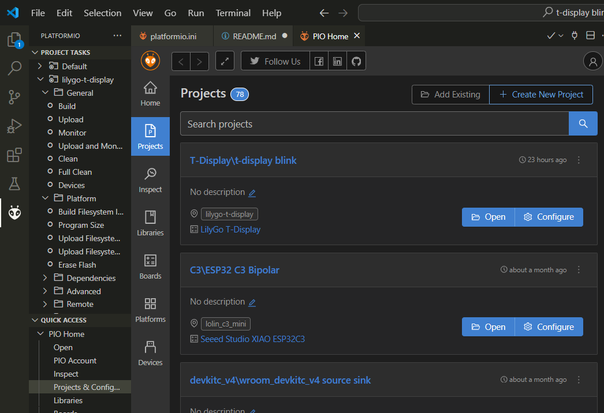
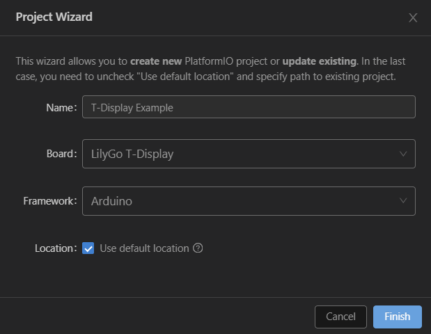
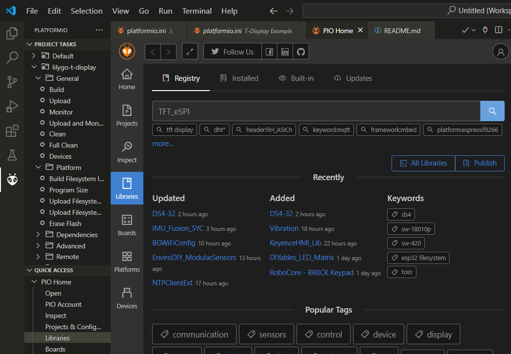
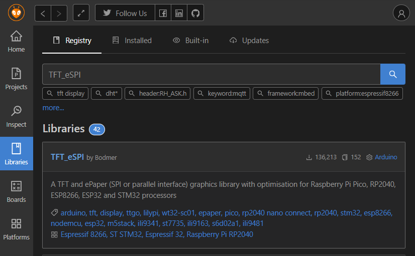
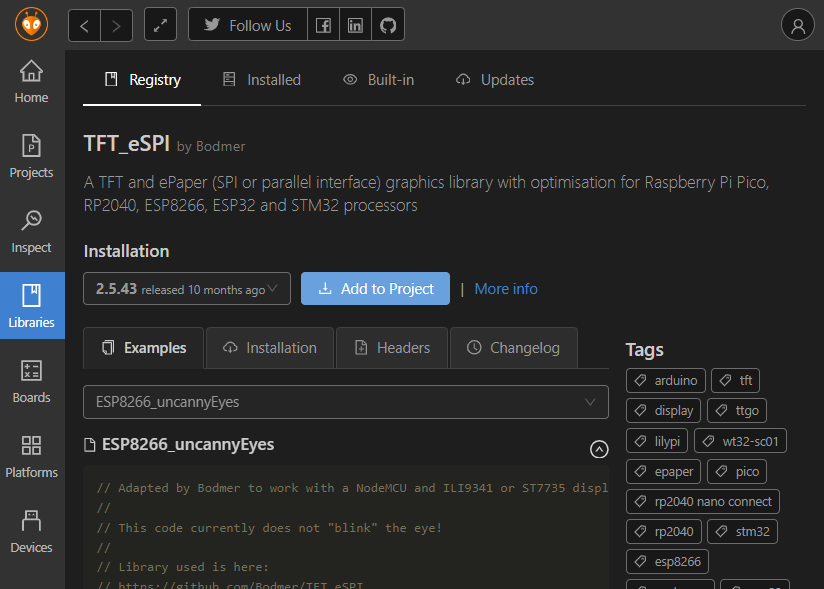
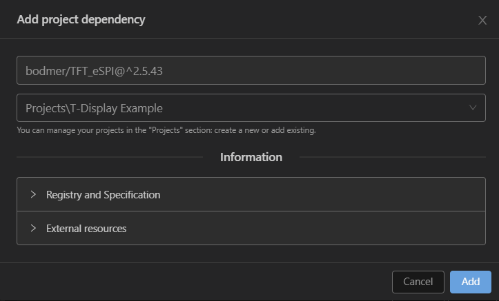
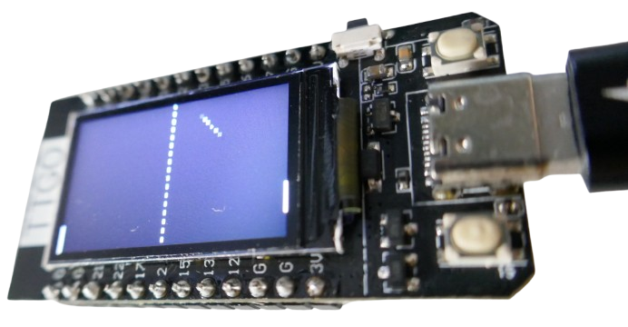

 
# Writing C++ Code For T-Display

> Programming Custom Firmware For T-Display Using C++ And platformio


The [T-Display](https://www.lilygo.cc/products/lilygo%C2%AE-ttgo-t-display-1-14-inch-lcd-esp32-control-board) development board is fully supported in *platformio* and can also be programmed using *ArduinoIDE*. 

Programming your own firmware is the most flexible approach: **you** decide what the microcontroller is going to do, and only the sky is the limit. On the contrary, this requires some *C++* skills.

Here is what I recommend:

* **Getting to know IDE/platformio:**    
  Focus on compiling and uploading some pre-made source code that is guaranteed to work, i.e. the *Pong Example*.
* **Create your own fresh platformio Project:**   
  Once uploading and running pre-made source code works, next focus on creating a new blank project in platformio, and adjust it step by step. Make sure you upload the project after each small step so you can verify your success.


## Overview

My favorite development environment is platformio. I no longer use ArduinoIDE. Below are the steps to create a new fresh platformio project for T-Display boards.

## Create New Project

In *platformio*, in the *Project Tasks* tree, go to *Projects & Configuration*. Then click *Create New Project* in the upper right hand corner.




### Name Project & Select Board
Name your project in *Name*, and select *LilyGo T-Display* in the combo box in *Board*. Leave the checkmark to save the new project in your default location, or remove the checkmark so you can set a different location. Then click *Finish*.



It takes a few seconds to prepare the new project folder. Your *platformio.ini* inside the project folder now looks like this:

````
[env:lilygo-t-display]
platform = espressif32
board = lilygo-t-display
framework = arduino
````

## Add Display Library
*T-Display* comes with a built-in *TFT color display*. In order to use it, you need to add an appropriate library. There are two ways of adding libraries to your project.

In this example, I am adding the library "TFT_eSPI" that can be used to program the built-in TFT display. There are other suitable TFT display libraries as well, *TFT_eSPI* just serves as an example.

### Browse for Library
If you don't know the exact name of a library, you can **browse** for a library.


1. In the *platformio* *Project Tasks* tree, click *Libraries*. A search panel opens. In the search text box, enter *TFT_eSPI*, and click the *magnifier* icon. Keep in mind that you can search for any keyword, so this dialog can help you even if you did not know the exact library name.

    


2. The search results include the library *TFT_eSPI* by *Bodmer*. Click on the library name:

    

3. You now see details about the library. Click on *Add to Project*:

    

4. As a last step, select your project from the dropdown list, and click *Add*.

    

Once downloaded, the library is automatically unpacked and placed inside your project folder.

### Add Dependency

Rather than going through all of these GUI dialogs, you can also simply add a dependency to your *platformio.ini* file. The IDE then **automatically installs* the library once you save the file.

In fact, the browser dialogs in the previous sections did just that. If you followed the example, your *platform.ini* file now looks similar to this:

````
[env:lilygo-t-display]
platform = espressif32
board = lilygo-t-display
framework = arduino
lib_deps = bodmer/TFT_eSPI@^2.5.43
````

> [!NOTE]
> The browser approach always finds the **latest version** of a library and adds it to your *platform.ini* file. Once done, this version is not automatically updated to keep your code stable. That's why you see version *2.5.43* in my file, whereas you might see a newer version in your *platform.ini* file if you used the browser approach.      


## Visit and Configure Library

With most libraries, you are set with the steps outlined above. Some libraries (like *TFT_eSPI*) might require adjustments, though, and maybe you just would like to know where the installed library physically lives.

With *TFT_eSPI*, you need to *configure* the library so it knows your display type and video controller. So you need to visit the library and select the appropriate display and controller.

### Visiting Library

The library is part of your project folder. In the explorer-like file tree in *VSCode*, the library is always located here: `.pio\libdeps\lilygo-t-display\TFT_eSPI`.

Inside this folder, there is a file called `User_Setup_Select.h`. When you open it, it has only one active `#include` line:

````c++
#include <User_Setup.h>           // Default setup is root library folder
````
All other `#include` lines are commented out. 

To adapt the library to any display and/or controller, *comment out* the default line, and *comment in* the line that describes your setup. For *T-Display*, here is what you do:

````c++
// comment out the default include:
//#include <User_Setup.h>           // Default setup is root library folder

// comment in the file for your board:
#include <User_Setups/Setup25_TTGO_T_Display.h>    // Setup file for ESP32 and TTGO T-Display ST7789V SPI bus TFT
````
Once you saved your changes, you are done.

## Writing Your Own Source Code

Now you are ready to go and can write your own source code. You always find it in *src/main.cpp*. Initially, this file contains just a template sketch.

Make sure you add the *Arduino* reference to retain maximum compatibility to sketches developed in *ArduinoIDE*:

````cpp
#include <Arduino.h>
````

If you migrate from *ArduinoIDE* to *platformio*, make sure you define all of your functions above `setup()` and `loop()`: 


Before your code can call a function, it must have been defined. *platformio* is stricter than *ArduinoIDE*, and you need to move all functions up so they are in fact defined once other code paths call the functions.

Else, you may get ugly error messages during compilation because the compiler cannot find the functions - since they were not yet defined when the code called them:

````
src/main.cpp: In function 'void setup()':
src/main.cpp:69:3: error: 'initgame' was not declared in this scope
   initgame();
   ^~~~~~~~
src/main.cpp:69:3: note: suggested alternative: 'initstate'
   initgame();
   ^~~~~~~~
   initstate

(...)
````

If you want to use existing sketches created in *ArduinoIDE*, make sure you rename the file extension from `.ino` to `.cpp`.


## Uploading Code

Once your sketch/code/program is complete, it is time to compile and upload it to the *T-Display* board:

1. Connect the *T-Display board* using a *USB-C* cable to your PC (where you are running *platformio*). Two things should happen:

   * **Power On:** The *T-Display* is powered and starts doing whatever the current firmware implemented. Most likely with new *T-Display boards*, you see a logo screen and then some samples.
   * **New Device Sound:** Your PC should play a *new USB device detected* sound (at least when your volume setting allows).

   If either of the two *does not happen*, then something is wrong, and you should check (or replace) the *USB cable* and reboot your PC before you continue. These both simple remedies fix most of the issues before you run into them.   

2. In the *platformio Project Tasks* tree, click *Upload*. *platformio* compiles the code, then detects your board on its *USB port*, turns it into bootloader mode, and uploads your firmware.

````
Looking for upload port...
Auto-detected: COM3
Uploading .pio\build\lilygo-t-display\firmware.bin
esptool.py v4.5.1
Serial port COM3
Connecting.........
Chip is ESP32-D0WDQ6 (revision v1.0)
Features: WiFi, BT, Dual Core, 240MHz, VRef calibration in efuse, Coding Scheme None
Crystal is 40MHz
MAC: c8:f0:9e:86:fa:24
...
Changing baud rate to 460800
Changed.
Configuring flash size...
Flash will be erased from 0x00001000 to 0x00005fff...
Flash will be erased from 0x00008000 to 0x00008fff...
Flash will be erased from 0x0000e000 to 0x0000ffff...
Flash will be erased from 0x00010000 to 0x0005bfff...
Compressed 17536 bytes to 12202...
...
Writing at 0x00010000... (9 %)
...
Writing at 0x0003dd39... (63 %)
...
Writing at 0x00059467... (100 %)
Wrote 308752 bytes (170205 compressed) at 0x00010000 in 4.2 seconds (effective 590.4 kbit/s)...
Hash of data verified.
...
Hard resetting via RTS pin...
````

With *T-Display*, there is no need to manually switch to bootloader mode. It is almost perfect plug&play: once the upload is completed, the board restarts, and you can watch an exciting round of *AI Pong* (you can't play yourself):




## Caveats

If you do run into issues, check these:

* **Not Recognized:** if your computer does not play a *new USB device found* jingle when you connect the board via *USB cable* to it, then most probably you need to [install the driver](https://done.land/components/microcontroller/firststeps/connecttopc/#installing-drivers) for the (relatively uncommon) *CH9102* UART chip.
* **No Port:** if *platformio* could not even find an active COM port, then your board is either not connected (check cable, plugs), or you need to reboot your PC. Every once in a while, it seems the host computer needs a refresh this way. 
* **No Uploading:** if the code cannot be transferred to the development board, then try to enable ROM bootloader mode manually: hold the left push button, and while holding it, shortly press the *reset* button on the **side** (not the other push button). 
* **No Restart:** if the board does not respond after uploading code, try pressing the *reset* button (small button on its side). If there is still no response, then you may have forgotten to configure the *TFT_eSPI* library (see above) which is why the screen stays blank.


> Tags: Lilygo, T-Display, Sketch, platformio, TFT_eSPI, C++, Pong, platformio

[Visit Page on Website](https://done.land/components/microcontroller/families/esp/esp32/developmentboards/esp32s/t-display/programming/usingplatformio?075453101202242631) - created 2024-10-01 - last edited 2026-01-01
