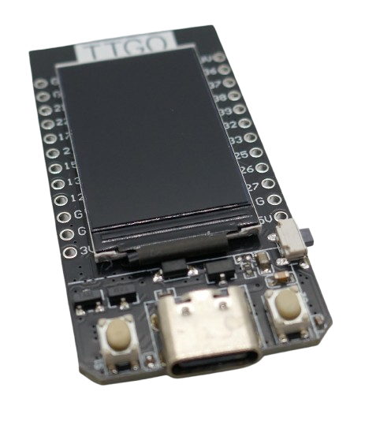

 
# T-Display

> ESP32 with 1.14 Inch Color TFT (135x240), 16MB Flash, 2x Programmable Buttons, And LiIon Battery Support

The [T-Display](https://www.lilygo.cc/products/lilygo%C2%AE-ttgo-t-display-1-14-inch-lcd-esp32-control-board) from [Lilygo](https://www.lilygo.cc/) is a great little board, perfect for experimenting, prototyping, or even as basis for developing small portable devices.


It comes with a classic [ESP32S](https://done.land/components/microcontroller/families/esp/esp32/developmentboards/esp32s/) equipped with a full *16MB* flash memory in a very small form factor.

As an added value, it has a built-in 1.14" color TFT display (with a 135x240 resolution), support for connecting a *LiIon* or *LiPo* battery (including charger), plus two general-purpose programmable push buttons.


## Overview
This [T-Display](https://lilygo.cc/en-pl/products/lilygo%C2%AE-ttgo-t-display-1-14-inch-lcd-esp32-control-board) is the first iteration of the *T-Display* series: development boards that have all the extra features built-in that you normally need for prototyping (display, charger, buttons).


> [!TIP]
> T-Display often comes unsoldered, and you have to solder the included header pins yourself. So make sure you keep the protective film on the display until you finished the soldering. The pins are very close to the display: without protection, hot flux may splash onto the display and damage it.


### Affordable and High Quality
This board is very affordable and really stands out: you can frequently buy it for around €5, but even the list price of $9 is reasonable, considering that you get a full [ESP32S](https://done.land/components/microcontroller/families/esp/esp32/developmentboards/esp32s/) with *16MB* of flash memory. Bulky development boards like the [DevKit C4](https://done.land/components/microcontroller/families/esp/esp32/developmentboards/esp32s/esp32devkitcv4/) often cost the same and offer much less.

> [!NOTE]
> *T-Displays* originally came with selectable flash memory sizes, starting at *4MB*. Today, all models have *16MB* (but better check before you buy).

Keep in mind though that T-Displays use unshielded *ESP32* (no metal cover) with no FCC id.

### Low Power Consumption
The microcontroller sets the base line for power consumption, but what distinguishes a good from a bad board is the *additional* power consumption, especially during power savings modes like deep sleep.

For a general purpose board, the T-Display performs very well with a low power consumption of just *220µA* during deep sleep (with proper configuration). 

This is in a useful range for battery-operated scenarios. Generic *ESP32* development boards often consume *10mA* or more during deep sleep due to inefficient design.

Power consumption varies depending on usage:

| Consumption | Mode |
| --- | --- |
| *40mA | Normal operation (WiFi disabled) |
| *130mA* | Normal operation (WiFi active)<br/>spikes of up to *370mA* are possible |
| *220µA* | Deep Sleep | 

> [!NOTE]
> Achieving the lowest deep sleep power consumption requires manually disabling both the display and the LDO. Without these adjustments, deep sleep power consumption may remain as high as *9mA*.

### Display
The T-Display features a built-in SPI-driven 1.14" TFT color display with a resolution of 135x240 pixels and a high pixel density of *260 PPI*. The display includes a programmable backlight controlled by *GPIO4*. 

Since *SPI pins* are not exposed, you cannot connect additional *SPI* devices to this board.

### Battery Support
The board can be powered from a single LiIon/LiPo battery for portable use through a *JST 1.25* connector on the backside of the board:


One such cable is part of the package.

When connecting the board via USB-C to a USB power supply, the connected battery is automatically charged.

#### Battery Connector
The board uses a small *JST 1.25* connector. Most affordable LiPo batteries use larger *JST PH 2.0* plugs.


#### Polarity
Always make sure you connect the battery in correct polarity! That's not easy unfortunately though.

There are no polarity markings on the board, and both pre-crimped cables and LiPo batteries with preinstalled connectors are **notorious for not keeping a uniform standard**.


* **Cables with Preinstalled Connectors:** sometimes, the red cable connects to pin 1, sometimes to pin 2. Completely random.
* **Batteries with Preinstalled Connector Wires:** no common standard. Most batteries use *JST PH 2.0* connectors, some use *JST 1.25* connectors. Polarity is random.

As an example, rechargeable LiPo batteries from *MakerFocus* typically come with the small *JST 1.25* connectors that fit the T-Display board. **However, their polarity is reversed**, so if you connect them through the (perfectly fitting) connector, you destroy your board.

> [!IMPORTANT]
> Always double-check the polarity before you connect a battery to T-Display! Do not trust cable colors or connectors that fit. Always measure with a multimeter yourself.

#### Voltage Sensor
The board has a built-in voltage sensor that is accessible at *GPIO34*.

### Programmable Buttons
The board comes with two programmable push buttons (active-low, so they are `GND` when pressed).

The button state is exposed at *GPIO0* and *GPIO35*. Note that *GPIO0* is a strapping pin.

## GPIOs and Connectivity

- **Usable GPIOs**: 
  - 8 digital and analog GPIOs
  - 4 digital and analog **input-only** GPIOs
  - 2 strapping pin GPIOs
  - 2 I2C GPIOs
- **Maximum GPIOs Available**: 16 

### Options and Assembly

The board is available with pre-soldered or unsoldered headers, allowing flexibility based on your needs.

> [!TIP]
> Avoid peeling off the protective film on the display immediately. Soldering header pins occurs near the display, and flux may accidentally spill onto it, so it is clever to keep the protective film in place until you have finished your soldering work.   

## Specs

The *ESP32S* microcontroller is available in *4MB* and *16MB* flash memory variants (**Important:** *32MiB* is *32Mbit* which is *4MB*). It does not include *PSRAM*. 

A *shell case* can be purchased separately, or you can [3D print a shell](https://github.com/Xinyuan-LilyGO/TTGO-T-Display/tree/master/3d_file) yourself.

| Item | Value |
| --- | --- |
| Microcontroller | ESP32S (Xtensa dual-core LX6) |
| Memory | *4MB*/*16MB* |
| Buttons | *GPIO0*, *GPIO35* (both *low active*) |
| UART | [CH9102](https://www.wch-ic.com/downloads/category/30.html), [installing driver](https://done.land/components/microcontroller/firststeps/connecttopc/#installing-drivers) |
| Onboard functions | two programmable buttons, battery power detection, charger |
| Display | 1.14 Inch TFT |
| Display Backlight | *GPIO4*, dimmable |
| Resolution | 135x240 |
| Density | High Density 260 PPI |
| Driver | [ST7789](materials/st7789_datasheet.pdf) |
| Library | [TFT_eSPI](https://github.com/Bodmer/TFT_eSPI) |
| Charger | [TP4054](materials/tp4054_datasheet.PDF) |
| Voltage Sensor | *GPIO34* |
| Power Consumption | *40mA* (no WiFi), *130mA* (WiFi), *350µA* (Deep Sleep) |
| Charging Current | 500mA |
| Size | 51.52x25.04x8.54mm |
| Voltage Regulator | [AP2112K](materials/ap2112_voltage_regulator.pdf), >600mA |
| Support | [T-Display Github](https://github.com/Xinyuan-LilyGO/TTGO-T-Display) |


#### PlatformIO

If your board includes *16MB* of flash, ensure you specify this size in the *platformio.ini* file. Otherwise, your firmware will default to using only *4MB*:

````ini
[env:lilygo-t-display]
platform = espressif32
board = lilygo-t-display
framework = arduino
board_build.flash_size = 16MB  # important: unlock full flash size if your board has 16MB!
````


#### ESPHome

Similarly, for *ESPHome configurations*, explicitly declare the flash size:

````
esp32:
  board: esp32dev
  flash_size: 16MB  # important: if your board has 16MB, unlock it!
  framework:
    type: arduino
````
> [!CAUTION]  
> If you specify *16MB* with boards that only have *4MB*, your firmware *may or may not* reference memory that does not exist (depending on your overall firmware size). So the effects are random: your board may continue to work fine, or you may experience boot failures or sudden resets. The latter happens whenever your firmware code tries to access non-existing flash memory. In a nutshell, add the extended flash size keys only when you are *certain* that your board has this much memory (see below for how to check the flash size).

#### Determining Built-In Flash Memory

If you are unsure of your board's flash size, do not rely solely on *build tools*. Depending on the tool, it may default to reporting a *4MB* flash size regardless of the actual capacity.

To verify the flash size, use the [Adafruit ESPTool](https://adafruit.github.io/Adafruit_WebSerial_ESPTool/) in a compatible browser like *Chrome*.  


1. Connect your board to your PC via a *USB-C* cable.  
2. Put the board in *ROM bootloader mode*:
   - Hold the *left push button* while pressing the *reset* button on the side.  
3. Click *Connect* in the upper-right corner of the website and select the USB port.  
4. The tool will display technical specifications, including the real flash size.  

Additionally, this tool can manually upload firmware binaries:
- Click *Choose a file* to specify the firmware.  
- Use the *Erase* function to clear the flash memory.  
- Click *Program* to upload the specified binary.

## Caveats

The *LilyGO T-Display* board is a fantastic choice, especially when you can get it for €5 or less. However, like any hardware, it has some limitations:

### No Built-In LED

The board has a *blue LED* near the *USB-C* connector, but it is tied to the internal charger and cannot be programmed. The LED's behavior depends on the battery status:  


| Condition                      | Blue LED Status |
|--------------------------------|-----------------|
| No battery connected           | On (dimmed)    |
| Battery connected, charging    | On (bright)    |
| Battery connected, not charging | Off           |

> [!TIP]
> To achieve the most power-efficient operation, power the board via the *JST 1.25* battery connector.  

There is *no programmable LED* on this board. Testing it with a simple *blink* sketch is not possible unless you use the display backlight on *GPIO4* instead.

### No SPI Interface Exposed

The board uses the primary *SPI interface* internally for the built-in display. These pins are not exposed, so they cannot be used for other peripherals. The secondary *SPI interface* is partially exposed, but pin 14 is missing, which limits usability. Essentially, external *SPI peripherals* cannot be connected to this board. Peripheral connections are limited to *I2C*.

### Charger and External Battery

The board supports external *LiIon* or *LiPo* batteries via a *JST 1.25* plug on its backside. *LiFePO4* batteries cannot be used as the charging voltage is too high.

#### Charging Current

The charger is configured to a relatively high *500mA* charging current. 

Ensure that any connected battery can handle this current. Smaller batteries, typically those below *1000mAh*, may not support such a high charge rate and could be damaged. 

In fact, the typical *LiPo* pouch cells normally require a charging rate of no more than **0.3C**. So even for *1000mAh* batteries, charging at *500mA* is exceeding this, which is considered stressful and may reduce battery lifespan.

> [!NOTE]
> *500mA* charging may still make sense in the context of portable devices where you don't want to maximize battery lifetime but rather ensure fast charging.  
 
### Voltage Sensor Readings

The built-in *voltage sensor* on *GPIO34* provides accurate battery voltage readings **only when powered by the battery**. When *USB power* is connected, the readings during active charging (indicated by the blue charger LED) can be misleading:

- During the initial *constant current* phase, the sensor reports a constant *4.20V*.
- In the *constant voltage* phase, the reported voltage gradually increases to values well above *4.60V*.

These readings **do not reflect the true battery terminal voltage**. Direct measurement during charging shows that the *TP4054 charger* regulates the voltage safely, gradually rising until it reaches a constant *4.20V*.

> [!IMPORTANT]
> Set the *attenuation* for *GPIO34* to the maximum setting (*12dB*). Without this, the *ADC* will saturate and report incorrect values of around *1V*.

#### Voltage Spikes in Sensor Readings

The *ESP32 ADCs* are known for limited precision. 

While the reported battery voltage is generally accurate, frequent *positive outliers* (spikes) occur. To address this, use a *quantile filter* with the *0.25 quantile* to smooth the values by cutting off spikes.

Below is an example configuration for *GPIO34* as a battery voltage sensor in *ESPHome*, including outlier filtering:


````
sensor:
  - platform: adc
    pin: GPIO34
    id: battery_voltage
    name: "Voltage"
    update_interval: 1s
    accuracy_decimals: 2
    attenuation: 12dB
    samples: 10
    entity_category: "diagnostic"
    device_class: "voltage"
    filters:
      # transform the raw value (voltage divider) to actual voltage:
      - multiply: 2.04
      # remove outliers (voltage spikes only):
      - quantile:
          window_size: 7
          send_every: 4
          send_first_at: 3
          quantile: .25
````


> [!TIP]
> Note the conversion factor `- multiply: 2.04` that takes the built-in *voltage divider* into account. The conversion rate really is `2.0` (since the voltage divider uses two equal resistors); however, since these are not precision resistors, there is a certain variability. Measure the actual battery voltage with a multimeter and compare it to the readings. Next, *adjust the conversion factor* accordingly so the readings match your multimeter results. In my case, the conversion factor turned out to be `2.04`. It may be slightly different for you.


You find more details in the detailed article ["Programming T-Display With ESPHome"](https://done.land/components/microcontroller/families/esp/esp32/developmentboards/esp32s/t-display/programming/usingesphome/).

### Low Voltage Tolerance

Typical *Li-ion* batteries shouldn't be discharged below *3.0V* if you want to keep them healthy. However, once voltage drops below *3.2V*, the display backlight starts to flicker, so you cannot fully exploit your battery capacity anyway.

There is no built-in *low voltage protection* that kicks in at *3.2V* and turns off the board, so your battery may discharge well below this threshold while the board starts to behave erratically.

That's why you should use the built-in *voltage sensor* (see above) and ensure your board enters *deep sleep* once the voltage drops below *3.2V*. 

Here is an [example using ESPHome](https://done.land/components/microcontroller/families/esp/esp32/developmentboards/esp32s/t-display/programming/usingesphome/addingdeepsleep/) that implements this *low voltage protection* along with other useful features for battery operation.


### Power-Off Capabilities

Once a development board is equipped with an external battery, it needs an *off* switch—or else it would run until the battery is drained.

For battery operation, you need to add a physical switch to your battery. *Deep sleep mode* consumes too much power to act as a *power-off switch* replacement.

#### Deep Sleep Power Consumption

This board has a better-than-average *deep sleep power consumption* of *220µA* (e.g., [Lolin32 Lite](https://done.land/components/microcontroller/families/esp/esp32/developmentboards/esp32s/lolin32lite/) consume up to *4mA*). High-efficiency boards (like the *DFRobot FireBeetle*) consume as little as *12µA*.

The *220µA* deep sleep consumption isn't reached initially. When sending this board to *deep sleep*, it may consume up to *9mA*.

As detailed in the article about [adding Deep Sleep using ESPHome](https://done.land/components/microcontroller/families/esp/esp32/developmentboards/esp32s/t-display/programming/usingesphome/addingdeepsleep/), it is crucial to use the **ext0** *deep sleep mode*, you **must** send the built-in display to its own *deep sleep* and disable the *LDO* on the board **before** putting the *ESP32* into sleep. Fortunately, all of this can be done via software and requires no hardware tuning.

| GPIO | Modes             | Exposed? | Remark                            |
|------|-------------------|----------|-----------------------------------|
| 16   | Din Dout          | no       | Used for display DC (data/command) |
| >17  | Din Dout          | yes      | Available                        |
| >25  | Ain Aout Din Dout | yes      | Available                        |
| >26  | Ain Aout Din Dout | yes      | Available                        |
| >27  | Ain Din Dout      | yes      | Available                        |
| >32  | Ain Din Dout      | yes      | Available                        |
| >33  | Ain Din Dout      | yes      | Available                        |
| 34   | Ain Din           | no       |                                   |
| 35   | Ain Din           | not directly, wired to right onboard push button | |
| 36   | Ain Din           | yes      | Input only, no pullup/pulldown   |
| 37   | Ain Din           | yes      | Input only, no pullup/pulldown   |
| 38   | Ain Din           | yes      | Input only, no pullup/pulldown   |
| 39   | Ain Din           | yes      | Input only, no pullup/pulldown   |

> *HSPI* is not fully exposed anyway and therefore cannot be used - marked *GPIOs* are free to use for other purposes.  
> *GPIOs* marked with `>` are recommended *GPIOs* that can serve as *input* and *output* and have no caveats or restrictions.



### Reserve GPIOs

Additional *GPIOs* can be used if your code does not require *I2C*, and/or if you can live with associated restrictions or caveats:

| GPIO | Modes             | Caveat                        |
|------|-------------------|-------------------------------|
| 2    | Ain Din Dout      | Boot fails if pulled *high*, strapping pin |
| 12   | Ain Din Dout      | Boot fails if pulled *high*, strapping pin, HSPI |
| 21   | Din Dout          | Free to use if I2C is not used |
| 22   | Din Dout          | Free to use if I2C is not used |

### I2C and SPI

The board uses the default *ESP32S I2C* pins:

| Pin | Description |
|-----|-------------|
| 21  | SDA         |
| 22  | SCL         |

*VSPI* is used for the internal display. *HSPI* pins are not fully exposed (*GPIO14*/*CLK* missing) so *HSPI* is not meant to be used as a secondary *SPI* interface:

| Function | VSPI | HSPI |
|----------|------|------|
| MOSI     | -    | 13   |
| MISO     | -    | 12   |
| CLK      | -    | -    |
| CS       | -    | 15   |

That's why *Lilygo* labels these *GPIOs* as freely usable.
## Strapping Pins
Here is a list of the exposed *strapping pins* that can influence (or impair) the boot process:

| GPIO | Exposed? | Restriction/Caveat |
|------|----------|--------------------|
| 0    | Hard-wired boot button | *Low* to run ROM serial boot loader. Else, run custom code |
| 2    | Yes      | Strapping function ignored when not in boot mode. Else, must be *low/floating* to enter boot loader. |
| 5    | Used internally for display | Controls timing of *SDIO slave*, default is *high* during boot (rising-edge output). Irrelevant when chip uses normal SPI flash. Used for CS in VSPI. |
| 12   | Yes      | Sets flash voltage (3.3V by default). If set to *high* on accident during boot, 3.3V flash receives 1.8V and browns out. |
| 15   | Yes      | *Low* silences boot messages, irrelevant. |

### Caveats

You are good to use the GPIOs above as long as you do not use them as *inputs*, and do not hard-wire them to a given state:

* **GPIO2:** must never be hard-wired to *high*. In your code, you can freely use *GPIO2* because your code will not run anyway when boot mode is enabled via the *boot button*, and *GPIO2* only matters in this boot mode and is otherwise ignored.
* **GPIO12:** must never be hard-wired to *high*. In your code, you can freely use *GPIO2* because your code will only run *after* the flash voltage has been set.
* **GPIO15:** Freely usable. Whether or not boot messages are emitted does not interfere with boot.

The only exception to the rule - *never use as input* - is *GPIO0*: this *GPIO* **is** used as an input (it is wired to the left push button), yet obviously because this button **is supposed to** influence the boot process: when you hold the button at power-up, the ROM bootloader is loaded.

Once the boot process has completed and your own firmware code runs, you can now safely use this *low active* button at *GPIO0* for your own purposes.

> [!NOTE]
> At this point, you can use *all* of the strapping pins as *inputs*. You just need to make sure that strapping *GPIOs* cannot be actively changed *before* the boot process has completed.

## Display
The 1.14"@135x240 TFT color display has a high pixel density of 260 PPI. While this is still half of what an *iPhone* screen features, it is considered top notch for DIY TFT displays which normally are in the range of 100-200 PPI.


The SPI interface used by the display utilizes these six GPIOs that are not exposed physically:

| GPIO | Description |
|------|-------------|
| 4    | Backlight (BL) |
| 5    | CS          |
| 16   | DC          |
| 18   | SCLK        |
| 19   | MOSI        |
| 23   | Reset (RST) |

## Power

There are four options to power the board, and the supported voltage range stretches from *2.3-6.0V*, depending on the input you use.

| Source     | Voltage Range | Remarks |
|------------|---------------|---------|
| USB-C      | 3.8-6.0V      | *5V input* passes the internal *AP2112K* voltage regulator which delivers *3.3V* to the board |
| 5V pin     | 3.8-6.0V      | Same as *USB input* |
| 3.3V pin   | 2.3-3.6V      | Input power bypasses the voltage regulator and is directly supplied to the board and chip. The input voltage must be in the range of *2.3-3.6V* for the CPU (but may need to be closer to *3.3V* for the display). If the voltage exceeds *3.6V*, the CPU is lost. You *must* protect your board from even the slightest over-voltage spikes when using the *3.3V input pin*. It can be powered directly off *LiFePo4* batteries, but never *LiIon* batteries. The latter always require a voltage regulator or other means of capping over-voltage. Supplying power via *3.3V pin* improves overall efficiency and minimizes power consumption, but it carries the inherent risk of permanently damaging the board. |
| LiIon      | 3.7-4.2V      | All *T-Display* boards feature a *LiIon battery* connector (located on the back). When not connected to any other power source, *LiIon battery input* is processed by the same *AP2112K* voltage regulator that converts the *USB input voltage* to *3.3V*. When connected to a *5V power source* like *USB*, the integrated charger (*TP4054*) recharges a connected *LiIon battery* with *500mA*. |


## Onboard Buttons

The board comes with *two large* push buttons on the top, and a smaller button on the side. The smaller button is the *Reset* button.


The two larger buttons can be programmed:

| GPIO | Button | Remark |
|------|--------|--------|
| 0    | Left   | *Low active*, pulled up. When pressed during boot, the ROM bootloader launches. Once your firmware runs, *low* when button is pressed, else *high* |
| 35   | Right  | *Low active* as well |

## Firmware

The board comes with a preloaded default firmware which makes it simple to test-drive it. When you power on the board, the display shows a *TTGO* logo, followed by some full color screens.


You then find yourself in a menu: pressing the left push button starts a *WiFi Scan*, while pressing the right button either shows the battery voltage (if an external LiIon battery is connected), or switches right away into deep-sleep mode.


The board can be programmed by using the typical development environments (*ArduinoIDE* or *platformio*), or by using *ESPHome*.


## Materials

[Schematics (PNG)](materials/lilygo_t-display.png),  [Schematics (PDF)](materials/lilygo_t-display.pdf)    
[ST7789V Video Controller](materials/st7789_datasheet.pdf)    
[AP2112 Voltage Regulator](materials/ap2112_voltage_regulator.pdf)    
[TP4054 LiIon Charger](materials/tp4054_datasheet.PDF)    
[3D Printable Shell](https://github.com/Xinyuan-LilyGO/TTGO-T-Display/tree/master/3d_file)    

> Tags: Lilygo, T-Display

[Visit Page on Website](https://done.land/components/microcontroller/families/esp/esp32/developmentboards/esp32s/t-display?261761091530243112) - created 2024-09-29 - last edited 2025-08-04
