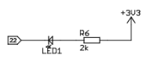

 
# Lolin32 Lite

> Classic ESP32 With LiIon/LiPo Battery Support For Use In Portable Devices

The *Lolin32 Lite* development board uses a *ESP32* microcontroller, has *4MB flash memory*, and supports connecting an external *LiIon/LiPo* rechargeable battery. The battery can be charged through the *USB-C* connector. In combination with its small footprint, it is a good choice for use in portable devices.

> [!IMPORTANT]
> High *deep sleep* power consumption makes this board *not a good choice* for battery-operated sensors designed to run continuously: a *deep sleep* consumption of *>4.500uA* is **much higher** than average boards (*300-500uA*), let alone power-optimized boards (*12uA*), and will drain batteries quickly. This board is a *good* choice for portable devices that you want to *completely switch off* when not in use, i.e. via a physical switch or a *bistable electronic switch*. 

This board is officially *retired* by its manufacturer *WEMOS* since 2018, and is no longer referenced on their website. It is *still* a great board, and it is currently (2024) sold for extremely low prices (<€1.50). The currently sold version now has a *USB C* connector whereas the original version came with *Micro USB*.

You can [view an archieved version of the *Lolin Lite* product page](https://web.archive.org/web/20191002041532/https://wiki.wemos.cc/products:lolin32:lolin32_lite). The successor of this board is the [WEMOS Lolin D32](https://www.wemos.cc/en/latest/d32/d32.html).

## Overview
*Lolin32 Lite* is an *excellent classic *ESP32S* board with a small form factor while still exposing all important pins. It is *retired*, and meanwhile there are more modern and sophisticated microcontrollers and boards available. But not for a price of *€1.50* per piece.

### Pros and Cons

The things I like most about this board:

* **Just Works:** dependably switches in *bootloader mode*. It is very simple to use and to flash.

    

* **Small and Complete:** compared to the bulky *ESP32 DevKit* boards, this one is small, exposes all important pins, and fits in portable housings. It comes with an onboard LED: the [schematics](materials/lolin32_lite.pdf) clarify that *GPIO22* is **sinking** current; the other leg of the *LED* is connected to *3.3V*. Thus, the *LED* is *low active* (*on* when *GPIO22* is *low*):

    

* **Built-in LiIon Battery Support:** it's easy to hook up a *LiIon* or *LiPo* battery and run this board on the go.

What I did not like:

* **Unconventional I2C Pins:** board uses non-standard *I2C* pins which requires you to change the default pins in sample code.
* **High Deep Sleep Power Consumption:** unlike *Lolin32*, this *Lite* board requires hefty *4.5mA* quiescent current while in *deep sleep*. *100-300uA* would be normal. So no good choice for *always-on sensor projects*.
* **No Vin/5V Pin:** this board is designed to be powered either by *5V USB*, via *3V pin*, or via *LiIon battery*. There is no *Vin pin* to supply external power from a power supply. Likewise, there is no built-in way to power *5V peripherals*. You *can* of course solder your own *5V connection* to the *USB connector* but that's no fun.

### I2C
This board **does not expose** the usual pins for *I2C* (*21* and *22*): pin *21* is not exposed, and pin *22* is used for the internal *LED*. 

*I2C* is connected to pins *2* (*SCL*) and *15* (*SDA*). That is a bit unfortunate since pin *2* is a *strapping pin*.

Since *ESP32* can map *I2C pins* to any other *GPIO*, if the default pins cause trouble, pin *23* (*SDA*) and *19* (*SCL*) might work better for you.

### SPI
The board exposes the default *SPI pins*:

| Pin | Description |
| --- | --- |
| *23* | *MOSI*: master-out-slave-in |
| *19* | *MISO*: master-in-slave-out |
| *18* | *SCK*: clock |
| *5* | *CS*: chip select |
| *22* | *WP*: wrrite-protect (also internal LED) |

## Specs

| Item | Description |
| --- | --- |
| Memory | external 4MB Flash |
| Clock Speed | 240MHz |
| Charging | 500mA charging current, TP4054 |
| Voltage Regulator | ME6211 |
| Power Consumption | 45.4mA (no WiFi), 130mA (WiFi), 4.5mA (deep sleep/hibernation) |
| Internal LED | GPIO22 |
| Battery | LiIon/LiPo 3.7V |
| Battery Connector | Micro-JST 2.0 PH 2-Pin |
| USB Connector | Micro-USB (older versions), USB-C (latest versions) |
| USB-to-TTL | CH340 |
| Size | 49.2x25.5mm |
| Weight  | 6.6g |

## Charging
Power can be supplied from a *LiIon*/*LiPo* via its *JST 2.0 PH* connector. The battery is charged when the board is connected to *USB* via a standard *TP4054* charger IC:

## Comparison Lolin32 Lite vs. Lolin32 
The *Lolin32 **Lite*** development board is the *smaller version* of the *Lolin32* development board. The latter has its *JST 2.0 battery socket* placed on the side rather than next to the *USB connector*.

The differences between *Lolin32 **Lite*** and *Lolin32* are the *smaller footprint* of the *Lite* board, and as a consequence of its smaller size the lack of some pins: *RX0*, *TX0*, and *5V* are not exposed. There is also just one *GND* pin (instead of five), and just one *3.3V* pin (instead of three).

To further reduce the board size, it has a *reset* but no *boot* button. This turns out not to be a disadvantage though as the board reliably turns to *firmware upload mode* automatically when flashing it in *Arduino IDE*, *platform.io*, and *ESPHome*.

> [!IMPORTANT]
> For unknown reasons, while the *Lolin32* has excellent low *deep sleep* power consumption (around *130uA*), the *Lolin32 Lite* (discussed here) required astonishing *>4**m**A*. Despite all efforts - using *ext1* mode and hibernation, manually disabling *I2C pullups*, supplying power directly to the *3V* pin - the quiescent current remained above *4.5mA*. This indicates a serious hardware design flaw in which i.e. the battery charger or voltage regulator is consuming power while in *deep sleep* mode.

*Lolin32 **Lite*** specifically targets portable devices and focuses on a small footprint, rechargeable battery support (including charging), and use of power-efficient *3.3V components* **only**. There is no *5V pin*, and its *GPIOs* are not *5V tolerant*. 

The board receives power solely via a connected battery or its *USB connector*. While you can supply power via its *3.3V* pin directly, this disables the built-in battery charger.

> [!NOTE]
> *Lolin32 **Lite*** should have more accurately be named *Lolin32 **Portable*** as it is just as powerful as *Lolin32* and not at all a *lite* version, rather optimized for **portable** use.

## When To Use

This is a relatively cheap yet solid board with many exposed pins at a small form factor. Thanks to its built-in *LiIon* battery support and relatively small size, it serves well in portable or *solar*-powered devices.

One important draw-back is its missing support for *5V peripherals*. Another point worth consodering in battery-operated projects is its relatively *high deep sleep power consumption*. If you need to maximize battery life, you either look into the *Lolin32* (without *Lite*) which uses just *70uA* in *deep sleep*. Or [you simply turn *this* board](https://done.land/components/signalprocessing/switch/bistableswitch/xl-10al) into a highly power-efficient solution (with only *130nA* sleep current) by adding a *bistable switch*.

## Materials
[Lolin32 Lite Schematics](materials/lolin32_lite.pdf)
[ME6211 Voltage Regulator](materials/me6211_ldo.pdf)
[Lolin32 Lite eBook](https://megma.ma/wp-content/uploads/2021/08/Wemos-ESP32-Lolin32-Board-BOOK-ENGLISH.pdf)   
[HM4054H Charger](materials/hm4054h_datasheet.pdf)   
[LTH7R Charger (Chinese)](materials/lth7r_datasheet_ch.pdf)   
[LTH7S Charger (Chinese)](materials/lth7s_datasheet_ch.pdf)   

  

> Tags: Microcontroller, ESP32, Lolin Lite, Battery, Charger

[Visit Page on Website](https://done.land/components/microcontroller/families/esp/esp32/espmodels/classicesp32/lolin32lite?601146050916240343) - created 2024-05-15 - last edited 2024-10-15
