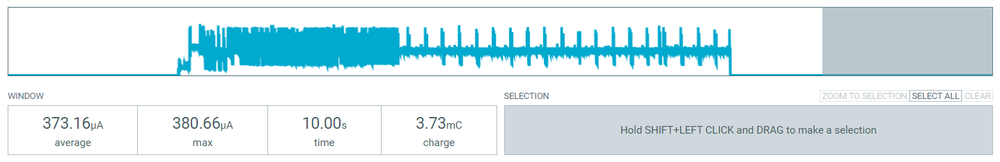

 
# Adding Deep Sleep To T-Display

> Turning Off Battery-Driven T-Displays By Using Deep Sleep And Wakeup


Once the [T-Display](https://www.lilygo.cc/products/lilygo%C2%AE-ttgo-t-display-1-14-inch-lcd-esp32-control-board) gets connected to an external *LiIon* or *LiPo* battery, it can run independently and requires no USB cable. At an average power consumption of *130mA*, it can theoretically run short of 8 hours from a *1.000 mAh* battery. Since the display starts flickering at around *3.2V*, though, you won't be able to utilize the full battery capacity.

Battery-driven boards introduce new challenges:

* **Power Switch:** you want to be able to turn the device off when you don't need it
* **Power Management:** you may want to switch the board to low-power modes when it isn't busy doing things for you
* **Low Voltage Protection:** you want to turn off the device when battery voltage drops below a voltage threshold that won't allow the peripherals (like the display) to work correctly anymore

One solution not discussed here is to add a physical power switch to the positive lead of your battery - very advisable. Physically turning off the device is the most efficient power savings mode and allows you to store the device for months without losing significant charge capacity.

## Overview

This article focuses on how to add *deep sleep* support to the *T-Display* board, and how to **do it right**. If you do it **wrong** or careless, your *deep sleep* may consume very much power and drain your batteries much earlier than you expected.

The configuration presented here is based on the [*sample configuration* created earlier](https://done.land/components/microcontroller/families/esp/esp32/lilygot-display/t-display/programming/usingesphome). 

To keep things focused and simple, this article **does not aim** to optimize the power consumption *during run-time*. It just focuses on *deep sleep*.

I'll first cover the required optimizations individually, then present the entire configuration.

## Efficient Deep Sleep

When you send an *ESP32* to *deep sleep* via *ESPHome configuration*, you often see code like this:

````
deep_sleep:
  id: deep_sleep_control
  wakeup_pin: 35
````

If you do it like this, the board would indeed switch to *deep sleep* once you invoke `- deep_sleep.enter: deep_sleep_control` (i.e. via button press). It would now consume an astonishing *9mA* though instead of the expected *370uA*, and here is why:

* **Display Driver:** once you add a *display* component to your configuration, the display controller gets initialized. Even when you send the *ESP32* to *deep sleep* will this driver consume around *6.5mA*.
* **RTC IO Mode:** when you use `wakeup_pin:`, you are automatically keeping the *RTC IO* subsystem active. This mode is called `ext0`, and it costs you another *2mA*. The better approach is to use ` esp32_ext1_wakeup:`: this mode can use *multiple wakeup pins*, however it only supports waking up the processor when *all specified pins turn **low** together*, or any *one* of them turns **high**. If that works for you, it saves another *2mA*.  


### Correctly Adding Deep Sleep
Here is the most energy efficient implementation for *deep sleep* and manual wake-up:

````
# Add deep-sleep capabilities
deep_sleep:
  id: deep_sleep_control
  esp32_ext1_wakeup:
    pins:
      - number: 35
        allow_other_uses: true
    mode: ALL_LOW
````

Note how `esp32_ext1_wakeup:` is used to enable the power efficient `ext1` deep sleep mode: *GPIO35* (one of the push buttons) is used to wake up the system. Since this push button is also used as a *regular* button elsewhere in the configuration, it is marked `allow_other_uses: true`. Else, since *ESPHome 2023* you would get errors, keeping you from assigning the same *GPIO* to two different components.

The pin mode is `ALL_LOW` since the *T-Display buttons* are *low active*. Note that `esp32_ext1_wakeup:` does not honor `inverted: true` or any other sophisticated pin declarations (which is the primary difference to the more power-hungry `wakeup_pin:`).

#### Invoking Deep Sleep On Button Press
To invoke *deep sleep*, a script is used, because sending *T-Display* to *deep sleep* requires a few steps, not just one:

````
# A script to run actions before deep sleep
script:
  - id: prepare_for_sleep
    then:
      - lambda: |-
          // Send display to sleep before deep sleep
          uint8_t command = 0x10;  // switching display to sleep mode
          id(display1).command(command);
      - delay: 120ms    
      - deep_sleep.enter: deep_sleep_control  # trigger deep sleep after preparation
````

It is crucial to send the command *SLEEPIN* (`0x10`) to the display to disable it before entering deep sleep. If you omit this, deep sleep will consume an extra *6.5mA*.

> [!NOTE]
> I [raised this issue](https://github.com/esphome/issues/issues/6307) with *ESPHome*, and hopefully we will see the display disabling itself automatically on deep sleep in the future.    

The script can then be tied to any action you like: `- script.execute: prepare_for_sleep`. You can for example use *one* button to send the board to *deep sleep*, and another one to *wake it up again*:

* **Deep Sleep Button:** invoke the script *prepare_for_sleep* when the button is pressed.
* **Wake Up Button:** define the button pin in `esp32_ext1_wakeup:`.

> [!IMPORTANT]
> **Never** use the same switch for *sending to deep sleep* and *wake up*, or else the board will immediately wake up again as the button is *still pressed* when *deep sleep* takes over. Also, never use *GPIO0* to send the board to *deep sleep* on a simple button press. *GPIO0* is the *boot* button, and you don't want the board to go in *deep sleep* when you really intended to boot into *ROM bootloader* mode. If you do use *GPIO0* (like in this example), make sure *deep sleep* is invoked only on a *long press*.

When *deep sleep* is configured this way, it optimizes power efficiency:




The graph shows that the board consumes only *373uA* in *deep sleep*. This is the best you can get with *T-Display* - even directly programmed c++ code on *platformio* does not perform better:


### Low Voltage Protection
When the battery voltage drops below *3.2V*, the display starts to flicker. To send the device to *deep sleep* in such cases, add this:

````
sensor:
  # handle voltage sensor
  - platform: adc
    pin: GPIO34
    name: "Voltage"
    update_interval: 1s
    accuracy_decimals: 2
    attenuation: 12dB
    samples: 10
    filters:
      - multiply: 2.0
      - median:
          window_size: 7
          send_every: 4
          send_first_at: 3
    # enter deep-sleep below 3.2V:
    on_value_range:
      below: 3.2
      then:
        - script.execute: prepare_for_sleep
````

## Sample Configuration
Here is the complete sample configuration that extends the [intial version](https://done.land/components/microcontroller/families/esp/esp32/lilygot-display/t-display/programming/usingesphome) with efficient *deep sleep* capabilities:

* **Sleep:** keep the left button pressed for at least 3 seconds to invoke *deep sleep*. A notification shows on the display when you start pressing the button, asking you to keep pressing.
* **Wakeup:** press the right button to wake up the board.


````
# A script to run actions before deep sleep
script:
  - id: prepare_for_sleep
    then:
      - lambda: |-
          // Send display to sleep before deep sleep
          uint8_t command = 0x10;   // switching display to sleep mode
          id(display1).command(command);
      - delay: 120ms    
      - deep_sleep.enter: deep_sleep_control  # trigger deep sleep after preparation


# Add deep-sleep capabilities
deep_sleep:
  id: deep_sleep_control
  esp32_ext1_wakeup:
    pins:
      - number: 35
        allow_other_uses: true
    mode: ALL_LOW 
  
    
interval:
  - interval: 1s
    then:
      - if:
          condition:
            and:
              - binary_sensor.is_on: button_left
          then:
            - lambda: |-
                    id(isShutdown) = true;
            - delay: 3s
            - if:
                condition:
                  and:
                    - binary_sensor.is_on: button_left
                then:
                  - script.execute: prepare_for_sleep
                else: 
                   - lambda: |-
                        id(isShutdown) = false;

# make sure state persists after 10sec of operation:
preferences:
  flash_write_interval: 10s

# store wifi connectivity state:
globals:
  - id: isOnline
    type: bool
    restore_value: no
    initial_value: 'true'  # since the board is offline at first, this triggers refresh
  - id: isShutdown
    type: bool
    restore_value: no
    initial_value: 'false'  # true when a shutdown is in progress   
        
# retrieve current WiFi signal strength:
sensor:
  - platform: wifi_signal
    name: "WiFi Signal dB"
    id: wifi_signal_db
    update_interval: 1s

  - platform: copy 
    source_id: wifi_signal_db
    name: "WiFi Signal Percent"
    id: wifi_signal_percent
    filters:
      - lambda: return min(max(2 * (x + 100.0), 0.0), 100.0);
    unit_of_measurement: "Signal %"
    entity_category: "diagnostic"
    device_class: ""

  # handle voltage sensor
  - platform: adc
    pin: GPIO34
    name: "Voltage"
    update_interval: 1s
    accuracy_decimals: 2
    attenuation: 12dB
    samples: 10
    filters:
      - multiply: 2.0
      - median:
          window_size: 7
          send_every: 4
          send_first_at: 3
    # enter deep-sleep below 3.2V:
    on_value_range:
      below: 3.2
      then:
        - script.execute: prepare_for_sleep

# handle the two built-in push buttons:
binary_sensor:
  - platform: gpio
    name: 'Button Left'
    id: button_left
        
    pin:
      number: GPIO0
      inverted: True
      
      mode:
        input: True
        pullup: True

    filters: 
      - delayed_on: 10ms
      - delayed_off: 10ms

    # optional: this dims the display backlight:
    on_press:
      - light.dim_relative:
          id: back_light
          relative_brightness: 5%
          transition_length: 0.1s
          brightness_limits:
              min_brightness: 20%
      - delay: 0.1s

  - platform: gpio
    name: 'Button Right'
    id: button_right

    pin:
      number: GPIO35
      inverted: True
      allow_other_uses: true
      
      mode:
        input: True

    filters: 
      - delayed_on: 10ms
      - delayed_off: 10ms

    # optional: this increases brightness of display backlight:
    on_press:
      - light.dim_relative:
          id: back_light
          relative_brightness: -5%
          transition_length: 0.1s
          brightness_limits:
            min_brightness: 20%
      - delay: 0.1s

# handle built-in display backlight:
# use a separate "light" component to enable dimming rather than
# using the "display" property for backlight gpio
output:
  - platform: ledc
    pin: 4
    id: display_backlight_pwm

light:
  - platform: monochromatic
    output: display_backlight_pwm
    name: "Display Backlight"
    id: back_light
    restore_mode: RESTORE_AND_ON
    effects:
      - pulse:
          name: noWifiConnection
          min_brightness: 60%
          max_brightness: 80%

# handle the built-in TFT color display:
spi:
  clk_pin: GPIO18
  mosi_pin: GPIO19
  id: spi_bus

display:
  - platform: ili9xxx
    model: ST7789V
    id: display1
    cs_pin: GPIO5
    dc_pin: GPIO16
    reset_pin: GPIO23
    dimensions:
      height: 240
      width: 135
      offset_height: 40
      offset_width: 52
    invert_colors: true
    update_interval: 1s
    rotation: 90°
    
    lambda: |-
      // Draw the current SSID
      it.printf(0, 0, id(lato), "SSID: %s", WiFi.SSID().c_str());

      // Draw Wi-Fi signal strength bar graph
      int signal_strength = id(wifi_signal_percent).state; // Get the current signal strength
      int bar_length = 240 * signal_strength / 100; // Map the signal strength to a length

      // Draw the bar
      it.filled_rectangle(0, 30, bar_length, 2, GREEN); 
      
      // Check Wi-Fi connection status
      if (WiFi.status() == WL_CONNECTED) {
        if (id(isOnline) == false) { 
          id(back_light).turn_on().set_effect("none").perform();       
          id(isOnline) = true;
        }
        it.image(216, 0, id(wifiOn), GREEN);
        
      } else {
        if (id(isOnline) == true) { 
          id(back_light).turn_on().set_effect("noWifiConnection").perform();         
          id(isOnline) = false;
        }
        it.image(216, 0, id(wifiOff), RED); 
      }

      
      if (id(isShutdown) == true) {
        it.print(0, 70, id(latobold), "keep pressing");
        it.print(0, 94, id(latobold), "for power off...");
      }


font:
  - file:
      type: gfonts
      family: Lato
      weight: 400
    id: lato
    size: 20
  - file:
      type: gfonts
      family: Lato
      weight: 700
    id: latobold
    size: 24
  - file:
      type: gfonts
      family: Lato
      weight: 900
    id: latoblack
    size: 30
  - file:
      type: gfonts
      family: Lato
      weight: 900
    id: latoblackheader
    size: 50

color:
  - id: WHITE
    red: 100%
    green: 100%
    blue: 100%
    white: 100%
  - id: RED
    red: 100%
    green: 0%
    blue: 0%
    white: 0%
  - id: GREEN
    red: 0%
    green: 100%
    blue: 0%
    white: 0%
  - id: BLUE
    red: 0%
    green: 0%
    blue: 100%
    white: 0%
  - id: YELLOW
    red: 100%
    green: 100%
    blue: 0%
    white: 0%
  - id: ORANGE
    red: 100%
    green: 65%
    blue: 0%
    white: 0%
  - id: BLACK
    red: 0%
    green: 0%
    blue: 0%
    white: 0%


image:
  - file: mdi:wifi
    id: wifiOn
    resize: 24x24
  - file: mdi:wifi-off
    id: wifiOff
    resize: 24x24
````


> Tags: Lilygo, TTGO, T-Display, ESPHome, Deep Sleep, Ext0, Ext1, esp32_ext1_wakeup, Display Disable
