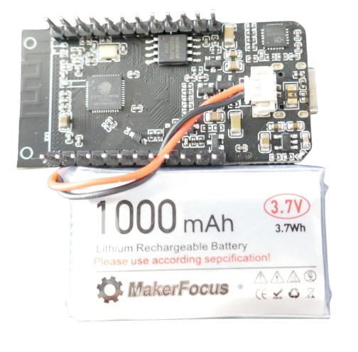
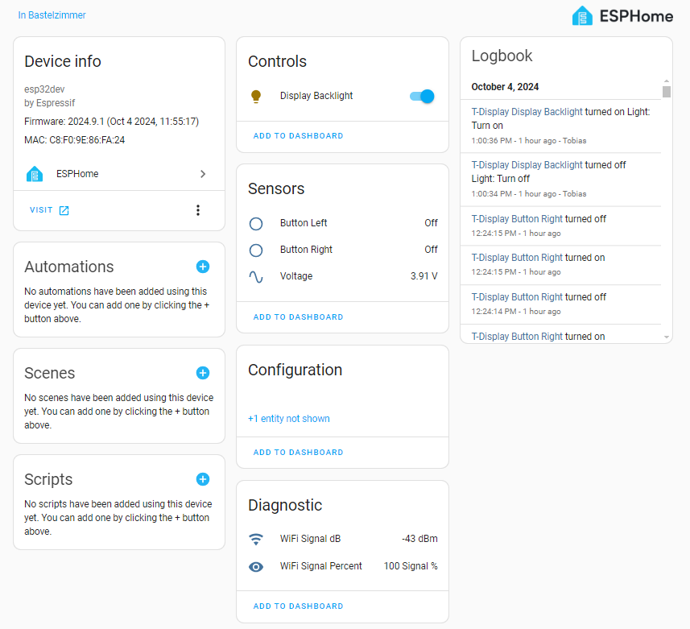
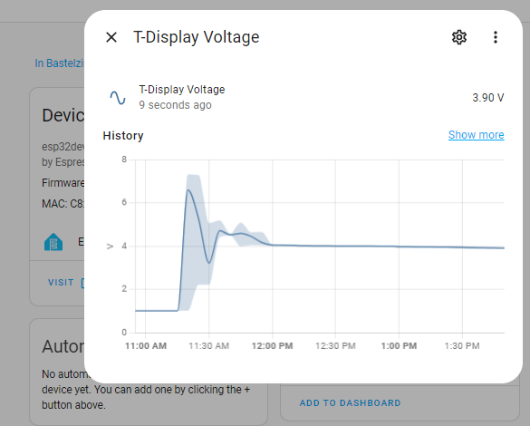

 
# Programming T-Display With ESPHome

> Programming T-Display With ESPHome Configuration


The [T-Display](https://www.lilygo.cc/products/lilygo%C2%AE-ttgo-t-display-1-14-inch-lcd-esp32-control-board) can be programmed completely without writing code by using [ESPHome](https://done.land/tools/software/esphome).

In this article, I walk you through a simple *ESPHome configuration* that turns your *T-Display* into a battery-operated *WiFi coverage testing tool* - while showing the relevant details you need to know to access all the built-in *T-Display* features from within your *ESPHome configuration*.


So once you have this little tool working, you can re-use the *configuration* to quick-start your own projects with *T-Display* and *ESPHome*.

## Prerequisites
To program *T-Display* in *ESPHome*, you need to [install ESPHome](https://done.land/tools/software/esphome#installing-esphome). 

* **ESPHome as part of Home Assistant:** The recommended way is to install [Home Assistant](https://done.land/tools/software/homeassistant) first, then [install ESPHome as part of Home Assistant](https://done.land/tools/software/esphome#installing-esphome). This provides you with the most functionality as *ESPHome* and *Home Assistant* are a perfect team. One of the easiest and most reliable ways is to [set up Home Assistant on a Raspberry Pi 5 Server](https://done.land/components/microcontroller/families/raspberry/raspberrypi/assembly/selectingos#picking-operating-system).

* **Stand-Alone:** You *can* [install ESPHome stand-alone](https://done.land/tools/software/esphome#installing-stand-alone-esphome-instance) on your PC. This is straight-forward and simple to do. Without *Home Assistant*, you miss out on being able to *centrally monitor* devices, and create *automations* across multiple devices. 

> [!TIP]
> *ESPHome* and *Home Assistant* may be a bit overwhelming at first when you are new to it: they consist of a number of moving parts that perfectly complement each other. You may want to quickly [review the ESPHome overview](https://done.land/tools/software/esphome/introduction).   


## Creating New Configuration
Start in *ESPHome* by adding a *New Device*. This provides you with a generic [default configuration](https://done.land/tools/software/esphome/introduction/defaultconfiguration).

The default configuration covers your fundamentals, i.e. the board type, and accessing your *WiFi*. Once this part of the configuration is done, you never touch it again. All "programming" takes place below it.

### Correcting Board Memory

Before you start programming anything, review the settings for your *T-Display board*:

````
esp32:
  board: esp32dev
  flash_size: 16MB  # important: if your board has 16MB, unlock it!
  framework:
    type: arduino
````

*T-Display* is a typical *ESP32S* microcontroller at its heart which is why it uses the generic `esp32dev` board definition. By default, this sets the *flash RAM* to *4MB* (the minimum memory commonly used by *ESP32S*).

*T-Display* comes in two versions: with *4MB* and with *16MB* flash memory. The latter is the more common type sold today. It is *crucial* that you *unlock your flash memory* and tell *ESPHome* that your board has *16MB* (if it does) by adding the line `flash_size: 16MB`. 

If you are uncertain and would like to find out how much *flash memory* your *T-Display* really has, [use the Adafruit ESPTool](https://done.land/components/microcontroller/families/esp/esp32/lilygot-display/t-display#finding-out-true-flash-memory).


> [!IMPORTANT]
> *ESPHome* requires considerable memory for its components. With a *4MB* board (or with a *16MB* board that is not specifying its capacity via `flash_size: 16MB`), you quickly run out of memory and can't leverage the capabilities of your awesome *T-Display*.

## Accessing Display, Buttons, External Battery
*T-Display* comes with a wealth of extra features that distinguishes it from generic *ESP32S boards*. These extras need to be *defined* in your configuration so you can use them. Here is how:


* **TFT Color Display:** The built-in display is supported by *ESPHome* by the *model type* `TTGO TDisplay 135x240` within the display platform `st7789v`. The display backlight can be controlled by a `light` component (including dimming and effects).
* **Two Push Buttons:** both push buttons can be accessed as an *inverted* `binary_sensor` (they are both *low active* by nature). Either expose the buttons as *entities* (so in *Home Assistant* `configuration.xaml` you can tie actions to them), or tie `on_press` and other events directly to them. In the sample configuration below, one button dims the display backlight whereas the other makes it brighter.
* **Voltage Monitor:** *T-Display* supports an external *LiIon* battery (including charger) and has a dedicated *voltage monitor*. The voltage can be retrieved via a `sensor` component in the `adc` platform (*analog-to-digital converter input`).



## Sample Configuration
Below *sample configuration* aims to focus on the specific *T-Display* features while at the same time providing a practical example.

**Add** (not replace) the following code to your *configuration*:

````
# make sure state persists after 10sec of operation:
preferences:
  flash_write_interval: 10s

# store wifi connectivity state:
globals:
  - id: isOnline
    type: bool
    restore_value: no
    initial_value: 'true'  # since the board is offline at first, this triggers refresh


# retrieve current WiFi signal strength:
sensor:
  - platform: wifi_signal
    name: "WiFi Signal dB"
    id: wifi_signal_db
    update_interval: 1s

  - platform: copy 
    source_id: wifi_signal_db
    name: "WiFi Signal Percent"
    id: wifi_signal_percent
    filters:
      - lambda: return min(max(2 * (x + 100.0), 0.0), 100.0);
    unit_of_measurement: "Signal %"
    entity_category: "diagnostic"
    device_class: ""

  # handle voltage sensor
  - platform: adc
    pin: GPIO34
    name: "Voltage"
    update_interval: 1s
    accuracy_decimals: 2
    attenuation: 12dB
    samples: 10
    filters:
      - multiply: 2.0
      - median:
          window_size: 7
          send_every: 4
          send_first_at: 3

# handle the two built-in push buttons:
binary_sensor:
  - platform: gpio
    name: 'Button Left'
    id: button_left
        
    pin:
      number: GPIO0
      inverted: True
      mode:
        input: True
        pullup: True

    filters: 
      - delayed_on: 10ms
      - delayed_off: 10ms

    # optional: this dims the display backlight:
    on_press:
      - light.dim_relative:
          id: back_light
          relative_brightness: 5%
          transition_length: 0.1s
          brightness_limits:
              min_brightness: 20%
      - delay: 0.1s

  - platform: gpio
    name: 'Button Right'
    id: button_right

    pin:
      number: GPIO35
      inverted: True
      mode:
        input: True

    filters: 
      - delayed_on: 10ms
      - delayed_off: 10ms

    # optional: this increases brightness of display backlight:
    on_press:
      - light.dim_relative:
          id: back_light
          relative_brightness: -5%
          transition_length: 0.1s
          brightness_limits:
            min_brightness: 20%
      - delay: 0.1s

# handle built-in display backlight:
# use a separate "light" component to enable dimming rather than
# using the "display" property for backlight gpio
output:
  - platform: ledc
    pin: 4
    id: display_backlight_pwm

light:
  - platform: monochromatic
    output: display_backlight_pwm
    name: "Display Backlight"
    id: back_light
    restore_mode: RESTORE_AND_ON
    effects:
      - pulse:
          name: noWifiConnection
          min_brightness: 60%
          max_brightness: 80%

# handle the built-in TFT color display:
spi:
  clk_pin: GPIO18
  mosi_pin: GPIO19

display:
  - platform: st7789v
    id: display1
    cs_pin: GPIO5
    dc_pin: GPIO16
    reset_pin: GPIO23
    backlight_pin: no
    model: TTGO TDisplay 135x240
    update_interval: 1s
    rotation: 90°
    
    # optional: handle the WiFi connectivity icons and the signal strength
    lambda: |-
      // Draw the current SSID
      it.printf(0, 0, id(lato), "SSID: %s", WiFi.SSID().c_str());

      // Draw Wi-Fi signal strength bar graph
      int signal_strength = id(wifi_signal_percent).state; // Get the current signal strength
      int bar_length = 240 * signal_strength / 100; // Map the signal strength to a length

      // Draw the bar
      it.filled_rectangle(0, 30, bar_length, 2, GREEN);  // Bar at (10,30), length, height 20, filled with GREEN
      
      // Check Wi-Fi connection status
      if (WiFi.status() == WL_CONNECTED) {
        if (id(isOnline) == false) { 
          id(back_light).turn_on().set_effect("none").perform();       
          id(isOnline) = true;
        }
        it.image(216, 0, id(wifiOn), GREEN);
        
      } else {
        if (id(isOnline) == true) { 
          id(back_light).turn_on().set_effect("noWifiConnection").perform();         
          id(isOnline) = false;
        }
        it.image(216, 0, id(wifiOff), RED); 
         
      }


font:
  - file:
      type: gfonts
      family: Lato
      weight: 400
    id: lato
    size: 20
  - file:
      type: gfonts
      family: Lato
      weight: 700
    id: latobold
    size: 24
  - file:
      type: gfonts
      family: Lato
      weight: 900
    id: latoblack
    size: 30
  - file:
      type: gfonts
      family: Lato
      weight: 900
    id: latoblackheader
    size: 50

color:
  - id: WHITE
    red: 100%
    green: 100%
    blue: 100%
    white: 100%
  - id: RED
    red: 100%
    green: 0%
    blue: 0%
    white: 0%
  - id: GREEN
    red: 0%
    green: 100%
    blue: 0%
    white: 0%
  - id: BLUE
    red: 0%
    green: 0%
    blue: 100%
    white: 0%
  - id: YELLOW
    red: 100%
    green: 100%
    blue: 0%
    white: 0%
  - id: ORANGE
    red: 100%
    green: 65%
    blue: 0%
    white: 0%
  - id: BLACK
    red: 0%
    green: 0%
    blue: 0%
    white: 0%


image:
  - file: mdi:wifi
    id: wifiOn
    resize: 24x24
  - file: mdi:wifi-off
    id: wifiOff
    resize: 24x24
````

Next, *upload* the *configuration* to your *T-Display* board. The most robust and simplest way is to [use a USB cable](https://done.land/tools/software/esphome/introduction/provisioningdirectly), and connect the board directly with the computer **that runs ESPHome** (which might be a *Raspberry Pi* if you are using *ESPHome* inside *Home Assistant*).

## Use Case: WiFi Coverage Tester
The sample configuration primarily illustrates how to access the *T-Display features*, but it has of course also a use case already: your *T-Display* serves as a *WiFi coverage tester device*.

Once the firmware is uploaded, the board does this:


* **Offline:** at first, it shows a pulsating display with a red WiFi icon.
* **Connected:** once the board successfully connects to your *WiFi*, the pulsating display backlight stops, and the WiFi icon turns green. The name of the *WiFi* it connected to is displayed.
* **Signal Strength Tester:** from now on, the device acts as a *WiFi coverage* tester: a green bar visualizes the *WiFi coverage* at your current position. You can now use the device to test *WiFi coverage* in your home, and also judge the *T-Display* *WiFi sensitivity* and quality of its antenna.
* **Display Dimming:** press the push buttons to adjust the brightness of the display backlight. The setting you choose is stored as your new preference, and when you turn off and later turn on the device, once it connected to *WiFi*, the display brightness is restored to your last setting.


Connect the board via *USB-C* to a *powerbank*, or hook up a single *LiIon* battery to the *JST 1.25* jack at its bottom side, and move around to see the green bar change.

## Home Assistant
If you use *ESPHome* in combination with *Home Assistant*, the already useful *stand-alone device* gets extra benefits. So when you receive a notification from *Home Assistant* that a new device was discovered, add your new *T-Display* device to *Home Assistant*.



On the *devices* page in *Settings/Devices & services/ESPHome*, you now see all of its exposed entities:

* **Display Backlight:** in the *Controls* tile, you can turn the *TFT display backlight* on or off. This uses a nice *1 sec* transition effect. The current *dimming level* that you may have set via the push buttons is kept.
* **Buttons:** press one of the two push buttons to see their state change in the *Sensors* tile. 
* **Voltage:** the current *voltage* is also shown in the *Sensors* tile.
* **WiFi Signal Strength:** the tile *Diagnostic* shows the current *WiFi* strength both in *dBm* and *percent*.

### Power Consumption Monitoring
Since *Home Assistant* automatically logs sensor readings, you can now easily evaluate battery-driven scenarios: provided you connected a *LiIon battery* to your *T-Display*, let it run for a while. Then click on the *Voltage* that is displayed in the *Sensors* tile.




> [!NOTE]
> Don't worry about the high voltage spikes in the picture: when I started developing the configuration above, some settings were needed that I missed at first. Fortunately, you can start with a good configuration right away.   


#### Power Consumption Monitoring
Click *Show more*, then set a timespan, i.e. the past 30 minutes. You can now see how the battery voltage changed. This provides great clues about power consumption, and expected mileage that you get out of your battery.


#### Smoothening Sensor Data
The visible voltage flucuation of *0.05V* in the graph above can be eliminated by a simple *median filter*: it is very effective in removing *outliers*:

````
 filters:
  - multiply: 2.0
  - median:
      window_size: 7
      send_every: 4
      send_first_at: 3
````

This is illustrated by the next graph that monitored voltage drop over a course of two hours:


Initially, the update frequency was *1s*, and a uniform *voltage fluctuation* is visible. Next, the update frequency was raised to *5s*, and *averaging* with *20 samples* was employed. This just reduced the data points but kept the outliers. 

Ultimately, the *median* filter was added which very efficiently took care of the outliers and produced a smooth curve correctly resembling the *LiIon battery* voltage drop over time.

## Understanding ESPHome Configuration

Now that you know what the device does, let's take a final look at the *ESPHome configuration* to see *how* this was done, and what your options are to *adjust* and *modify* the configuration to your needs.

Let's take a look at the individual *T-Display* features the *configuration* addresses:


### Push Buttons
The two push buttons are implemented as regular `binary_sensor` of type *gpio*. Since both buttons are *low active*, the result is reversed: `inverted: True`.

````
# handle the two built-in push buttons:
binary_sensor:
  - platform: gpio
    name: 'Button Left'
    id: button_left
        
    pin:
      number: GPIO0
      inverted: True
      mode:
        input: True
        pullup: True
````

To *debounce* the buttons, a delay *filter* is added:

````
    filters: 
      - delayed_on: 10ms
      - delayed_off: 10ms

````

And to illustrate button functionality, `on_press` dims the display backlight:

````
    # optional: this dims the display backlight:
    on_press:
      - light.dim_relative:
          id: back_light
          relative_brightness: 5%
          transition_length: 0.1s
          brightness_limits:
              min_brightness: 20%
      - delay: 0.1s

````

The second button is implemented very similarly. Its *GPIO35* is however a pure *ESP32S input* with no *pullup or pulldown* resistors:

````
  - platform: gpio
    name: 'Button Right'
    id: button_right

    pin:
      number: GPIO35
      inverted: True
      mode:
        input: True

    filters: 
      - delayed_on: 10ms
      - delayed_off: 10ms

    # optional: this increases brightness of display backlight:
    on_press:
      - light.dim_relative:
          id: back_light
          relative_brightness: -5%
          transition_length: 0.1s
          brightness_limits:
            min_brightness: 20%
      - delay: 0.1s
````
### Display
Let's take a look at how you access the built-in *TFT color display* in *ESPHome*:


#### SPI Interface
Since the display is using the fast *SPI interface*, `spi` needs to be defined, and the approproate *GPIOs* specified.

````
# handle the built-in TFT color display:
spi:
  clk_pin: GPIO18
  mosi_pin: GPIO19
````

#### Display and Resolution
The *display* is handled by `display`, and configured to use the `st7789v` video controller and the `TTGO TDisplay 135x240` display type.

The *GPIOs* for *CS* and *DC* are specified. Note that I am **not** specifying the *GPIO4* for `backlight_pin`: in order to better control the backlight, and use dimming, it is separately declared as `light`.

````
display:
  - platform: st7789v
    id: display1
    cs_pin: GPIO5
    dc_pin: GPIO16
    reset_pin: GPIO23
    backlight_pin: no
    model: TTGO TDisplay 135x240
````

#### Display Content
The display content can be generated using a *lambda expression*. `update_interval` specifies how often the screen is redrawn:

````
    update_interval: 1s
    rotation: 90°
    
    # optional: handle the WiFi connectivity icons and the signal strength
    lambda: |-
      // Draw the current SSID
      it.printf(0, 0, id(lato), "SSID: %s", WiFi.SSID().c_str());

      // Draw Wi-Fi signal strength bar graph
      int signal_strength = id(wifi_signal_percent).state; // Get the current signal strength
      int bar_length = 240 * signal_strength / 100; // Map the signal strength to a length

      // Draw the bar
      it.filled_rectangle(0, 30, bar_length, 2, GREEN);  // Bar at (10,30), length, height 20, filled with GREEN
      
      // Check Wi-Fi connection status
      if (WiFi.status() == WL_CONNECTED) {
        if (id(isOnline) == false) { 
          id(back_light).turn_on().set_effect("none").perform();       
          id(isOnline) = true;
        }
        it.image(216, 0, id(wifiOn), GREEN);
        
      } else {
        if (id(isOnline) == true) { 
          id(back_light).turn_on().set_effect("noWifiConnection").perform();         
          id(isOnline) = false;
        }
        it.image(216, 0, id(wifiOff), RED); 
         
      }
````

It is of course up to you what you would like to draw on your display: `it` represents the *display` and its methods.

#### Backlight
The backlight is controlled separately via `light`, using an `output` rather than a *gpio* `binary_sensor`. This way, the backlight can be smoothly transitioned, and brightness be adjusted using *PWM*:

````
# handle built-in display backlight:
# use a separate "light" component to enable dimming rather than
# using the "display" property for backlight gpio
output:
  - platform: ledc
    pin: 4
    id: display_backlight_pwm

light:
  - platform: monochromatic
    output: display_backlight_pwm
    name: "Display Backlight"
    id: back_light
    restore_mode: RESTORE_AND_ON
    effects:
      - pulse:
          name: noWifiConnection
          min_brightness: 60%
          max_brightness: 80%
````
As part of `light`, you can define *effects*. The configuration defines a *noWifiConnection* effect of type *pulse* that is controlled by the *lambda* inside `display` (see next section): when there is no *WiFi* connection, the effect is turned on, else off.

The `light` also takes care of *restoring* the original dim level. Just make sure you set your preferences for the `flash_write_interval`: in order to protect the flash memory from constant writes, *ESPHome* writes persistent information only in intervals. That's a good thing because you don't want to save settings *while* the user may still be trying to figure out the best dimming level.

The sample configuration uses a *10sec* interval: the current dimming level is preserved once it did not change for at least *10 seconds* (if you reboot or reset the board before, your recent adjustments are lost). 

````
# make sure state persists after 10sec of operation:
preferences:
  flash_write_interval: 10s
````


#### Global Variables
The configuration uses one *global variable* (`globals`): *isOnline* is *boolean* and defaults to *true*:

````
# store wifi connectivity state:
globals:
  - id: isOnline
    type: bool
    restore_value: no
    initial_value: 'true'  
````

The purpose of this variable is to handle the *display backlight effect switching*: if you don't care about effect switching, remove both the *lambda code* **and** this variable.

Here is why the variable is needed with *display backlight effect switching*:

The display content is refreshed every *1s* (`update_interval: 1s`), so the displays' *lambda code* is executed each second, and it is responsible for redrawing the entire display content. So there is nothing to gain here, the (re-)drawing cannot be skipped under *any* conditions, even if connectivity has not changed.


However, backlight *effects* should **not** be restarted every second. They should just be turned on or off *once*, based on a single *connectivity change*. That's where the global variable comes into play: if this variable differs from the current connectivity status, then it's time to change the backlight effect (and set the variable to the new mode).

### Icons
Note how I am using *predefined google material font symbols* - no need to manually add icon files or design complex bitmaps separately.

````
image:
  - file: mdi:wifi
    id: wifiOn
    resize: 24x24
  - file: mdi:wifi-off
    id: wifiOff
    resize: 24x24
````

> [!TIP]
> If you are looking for a particular icon, browse to [Pictogrammers](https://pictogrammers.com/library/mdi/), and enter a keyword or search phrase into their search text box to quickly view all matching icons and their names.    


### Fonts
The same goes for *google fonts*:

````
font:
  - file:
      type: gfonts
      family: Lato
      weight: 400
    id: lato
    size: 20
  - file:
      type: gfonts
      family: Lato
      weight: 700
    id: latobold
    size: 24

(...)
````
## Battery Voltage
*T-Display* measures the external battery voltage at *GPIO34*, and uses the *ADC input* (analog-to-digital). 


````
  # handle voltage sensor
  - platform: adc
    pin: GPIO34
    name: "Voltage"
    update_interval: 1s
    accuracy_decimals: 2
````


This imposes a few challenges, though: you can use the `adc` platform to read *analog-in GPIOs*, but *ESP32* can only read voltages of up to *1.1V*. That's why they have different *attenuation* modes.

In order to correctly read the battery voltage, the *GPIO* must be turned into the *12dB attenuation mode*, or else this input always shows the same (capped) value: 


````
    attenuation: 12dB
````

In addition, the board uses a *voltage divider* that needs to be taken into account (`multiply: 2.0`), and since the measured voltage may *fluctuate* a bit, it makes sense to define a number of *samples*, and use the *average* instead of raw measured values:

````
    samples: 10
    filters:
      - multiply: 2.0
````

The configuration uses *20* samples. Still, this resulted in a consistent voltage fluctuation of *0.05V*. You may want to increase the samples, and also increase the `update_interval` from *1s* to something like *5s* to get rid of this.

## WiFi Strength
The *WiFi strength* is taken from a sensor from the `wifi_signal` platform. Obviously, this sensor is only required if you actually *want* to read and display the *WiFi strength*. You can remove all of this if you'd rather want to display different things.

````
sensor:
  - platform: wifi_signal
    name: "WiFi Signal dB"
    id: wifi_signal_db
    update_interval: 1s
````

Since this sensor returns *dBm*, a `copy` sensor is used with a *lambda* to convert *dBm* in *percent*:

````
  - platform: copy 
    source_id: wifi_signal_db
    name: "WiFi Signal Percent"
    id: wifi_signal_percent
    filters:
      - lambda: return min(max(2 * (x + 100.0), 0.0), 100.0);
    unit_of_measurement: "Signal %"
    entity_category: "diagnostic"
    device_class: ""
````

> Tags: Lilygo, TTGO, T-Display, ESPHome, Home Assistant, Configuration, Battery, Voltage

[Visit Page on Website](https://done.land/components/microcontroller/families/esp/esp32/lilygot-display/t-display/programming/usingesphome?856302101504243514) - created 2024-10-03 - last edited 2024-10-03
