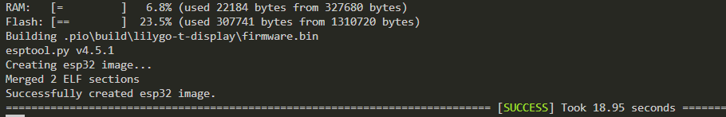

 
# Writing C++ Code For T-Display

> Programming Custom Firmware For T-Display Using C++


The [T-Display](https://www.lilygo.cc/products/lilygo%C2%AE-ttgo-t-display-1-14-inch-lcd-esp32-control-board) is fully supported by the development environment *platformio* and can also be programmed using *ArduinoIDE* (you just need to install its support for *ESP32* microcontrollers).

Programming your own firmware is the most flexible approach: **you** decide what the microcontroller is going to do, and only the sky is the limit. 

The price to pay is *programming* (which requires some *C++* skills), and it is up to you to find and download appropriate libraries that support your peripherals - such as the built-in TFT display.


You can start programming firmware in two ways:

* **From Existing:** download a ready-to-go *sample project*, and load it into *platformio*. Then adjust the project to your needs, or compile it as-is.
* **From Scratch:** start a *new project* in *platformio*, and tell the project the type of board you are using, and the extra libraries you need.


## New From Existing
When you [download](materials/t_display_pong.zip) a *known-good* project from a trusted source, you save time and effort. The *ZIP file* contains the ready-to-go *platformio project* for the *Pong Example*, already adjusted to be *platformio-compatible*, and fitting the *T-Display* screen resoultion.

After downloading, *unblock* and *unzip* the file, then open the unzipped folder in *VSCode*. Next, click *Upload* in the *platformio Project Tasks*, and you are done.

If you have a bit more time, in the next section, we'll together build a project from scratch, and you can see all the detail settings that might be important to know when programming *T-Display*.


## New Project From Scratch
In *platformio*, in the *Project Tasks* tree, go to *Projects & Configuration*. Then click *Create New Project* in the upper right hand corner.


### Name Project & Select Board
Name your project in *Name*, and select *LilyGo T-Display* in the combo box in *Board*. Leave the checkmark to save the new project in your default location, or remove the checkmark so you can set a different location. Then click *Finish*.


It takes a few seconds to prepare the new project folder. Your *platformio.ini* inside the project folder now looks like this:

````
[env:lilygo-t-display]
platform = espressif32
board = lilygo-t-display
framework = arduino
````

### Add TFT Library
*T-Display* comes with a *TFT color display*. In order to program it and display things on it, you can add the *TFT_eSPI* library to your project. It supports a rich set of TFT displays and video controllers (including those used in *T-Display*):

1. In the *platformio* *Project Tasks* tree, click *Libraries*. A search panel opens. In the search text box, enter *TFT_eSPI*, and click the *magnifier* icon.

    


2. The search results include the library *TFT_eSPI* by *Bodmer*. Click on the library name:

    

3. You now see details about the library. Click on *Add to Project*:

    

4. As a last step, select your project from the dropdown list, and click *Add*.

    

Once downloaded, the library is automatically unpacked and placed inside your project folder.

Your *platformio.ini* file now looks like this:

````
[env:lilygo-t-display]
platform = espressif32
board = lilygo-t-display
framework = arduino
lib_deps = bodmer/TFT_eSPI@^2.5.43
````


### Configure eTFT Library
Adding the *TFT_eSPI* library to your project is just the first of two steps: you need to *configure* the library so it know what your display and video controller is. Without this, your display remains blank.

Fortunately, this step is very simple: the library already knows your board and display (among hundreds of others). You just need to select it.

The library is part of your project folder. In the explorer-like file tree in *VSCode*, the library is always located here: `.pio\libdeps\lilygo-t-display\TFT_eSPI`.

Inside this folder, there is a file called `User_Setup_Select.h`. When you open it, it has only one active `#include` line:

````c++
#include <User_Setup.h>           // Default setup is root library folder
````
All other `#include` lines are commented out. 

To adapt the library to any display and/or controller, *comment out* the default line, and *comment in* the line that describes your setup. For *T-Display*, here is what you do:

````c++
// comment out the default include:
//#include <User_Setup.h>           // Default setup is root library folder

// comment in the file for your board:
#include <User_Setups/Setup25_TTGO_T_Display.h>    // Setup file for ESP32 and TTGO T-Display ST7789V SPI bus TFT
````
Once you saved your changes, you are done.

## Pong: Example Sketch

The *TFT_eSPI* library comes with a lot of example code. It is just a bit unintuitive to find: in the *VSCode explorer tree*, navigate to `.pio\libdeps\lilygo-t-display\TFT_eSPI\examples`. 


Inside this folder, you find plenty of examples, organized by display resolution and features:


> [!IMPORTANT]
> *TFT_eSPI* is a *generic TFT display library* not affiliated with any particular board or display. The *T-Display resolution* of *135x240* pixels is rather uncommon. Use the examples in the folder *160x128* as a start. You can adjust the resolution to your full screen capacity later.   

### Copying Example Code
To use one of the examples, open the example *.ino* file in *VSCode*, select the entire code, and paste it into your main source code file `src\mainapp.cpp`. Replace all the sample code that existed in this file.


If you want to follow along, choose the example `.pio\libdeps\lilygo-t-display\TFT_eSPI\examples\160 x 128\Pong_v3`. It will display an exciting round of super-fast *Pong* on the display (you can only watch, not play). This particular example covers a lot of excellent learning points, though:

* **Fixing Incompatibilities:** how to convert *ArduinoIDE* `.ino` files so that they work with other dev environments like *platformio*
* **Fine-Tuning Code:** making sure the code uses the full display resolution


> [!IMPORTANT]
> The simple *Pong3* example comes with a single source code file. If the example folder contains additional resources such as additional `.h` files, pictures, or fonts, then you need to *also* copy them to your main `src` folder. 

### Testing Code
Before you change the code in any way, make sure you got all that is needed: try and compile it: in the *platform.io Project Tasks* tree, click *Build*.

This starts the compilation process which takes place in the console window. Look for *errors*, and check to see whether the compilation ended successfully or failed.


> [!TIP]
> Do not worry about orange compiler **warnings**: they can occur quite frequently. In this example, warnings will remind you that your display has no *touch capabilities*, for example. The only things that matter are **red compiler errors**.   


### Fixing Code Issues
The most common causes for compilation failure are missing libraries (we have taken care of this), and *incompatibilities between **ArduinoIDE** and **platformio***.

The latter is the culprit here: the example file's extension `.ino` suggested that these examples were created using *ArduinoIDE*. These files are a *special flavor* of generic `.cpp` files.

#### Adding `Arduino.h`
To fix this, add `#include <Arduino.h>` to your code. This include statement is added automatically in *ArduinoIDE* and may be needed elsewhere.

#### Changing Order Of Function Declarations
A much more severe issue is the *order in which functions are defined* in your code. In *ArduinoIDE*, functions can be declared in any order. *platformio* is adhering more to *C++* standards and requires functions to be declared **before** they can be used by another function.

To fix this, you need to reorder the functions in your code. For this, take a look at the compiler errors. You see errors like this:

````
src/main.cpp: In function 'void setup()':
src/main.cpp:69:3: error: 'initgame' was not declared in this scope
   initgame();
   ^~~~~~~~
src/main.cpp:69:3: note: suggested alternative: 'initstate'
   initgame();
   ^~~~~~~~
   initstate
src/main.cpp: In function 'void loop()':
src/main.cpp:80:3: error: 'lpaddle' was not declared in this scope
   lpaddle();
   ^~~~~~~
src/main.cpp:80:3: note: suggested alternative: 'lpaddle_d'
   lpaddle();
   ^~~~~~~
   lpaddle_d

(...)
````

#### Moving `setup()` and `loop()` to the end
Translating these error messages, they say: function *setup()* called function *initgame()*, but *initgame()* was not declared (at this point, at least). Same for *loop()*.

Therefore, the first thing to try is to move *setup()* and *loop()* to the **end** of the code, then call *Build* again.

If this does not fix all errors (like in this example), move to the next section. Else, you are done.

#### Moving Individual Functions
After shifting *setup()* and *loop()* to the end of the code, the number of compiler errors was reduced, but there are still errors:

````
src/main.cpp: In function 'void initgame()':
src/main.cpp:66:3: error: 'calc_target_y' was not declared in this scope
   calc_target_y();
   ^~~~~~~~~~~~~
````

This time, the function *initgame()* called *calc_target_y()* before it was declared. So you need to move *calc_target_y* upwards in the code, above the declaration for *initgame()*.

Then you'd need to do the same for all other conflicts that caused compiler errors.

> [!TIP]
> In this particular example, *initgame()* serves a similar purpose as *setup()* and *loop()*. In cases like this, you should first try and move *loop()* to the end of the code, right above *setup()*, and *Build* again to see whether this already solved the issue. And it turns out: that fixed it!





### Adjusting Code
Before you upload the code to your *T-Display board, you may want to adjust it.

At the start of the code, it defines the display resolution (*128x160*):

````c++
int16_t h = 128;
int16_t w = 160;
````

The *T-Display* uses a resolution of *135x240*, so you may want to unlock the true real-estate of your display by changing:

````c++
int16_t h = 135;
int16_t w = 240;
````

## Uploading Code
Connect the *T-Display board* using a *USB-C* cable to your PC (where you are running *platformio*). Two things should happen:

* **Power On:** The *T-Display* is powered and starts doing whatever the current firmware implemented. Most likely with new *T-Display boards*, you see a logo screen and then some samples.
* **New Device Sound:** Your PC should play a *new USB device detected* sound (at least when your volume setting allows).

> [!TIP]
> If either of the two *does not happen*, then something is wrong, and you should check (or replace) the *USB cable* and reboot your PC before you continue. These both simple remedies fix most of the issues before you run into them.   

To upload the code, in the *platformio Project Tasks* tree, click *Upload*. *platformio* compiles the code, then detects your board on its *USB port*, turns it into bootloader mode, and uploads your firmware.

````
Looking for upload port...
Auto-detected: COM3
Uploading .pio\build\lilygo-t-display\firmware.bin
esptool.py v4.5.1
Serial port COM3
Connecting.........
Chip is ESP32-D0WDQ6 (revision v1.0)
Features: WiFi, BT, Dual Core, 240MHz, VRef calibration in efuse, Coding Scheme None
Crystal is 40MHz
MAC: c8:f0:9e:86:fa:24
...
Changing baud rate to 460800
Changed.
Configuring flash size...
Flash will be erased from 0x00001000 to 0x00005fff...
Flash will be erased from 0x00008000 to 0x00008fff...
Flash will be erased from 0x0000e000 to 0x0000ffff...
Flash will be erased from 0x00010000 to 0x0005bfff...
Compressed 17536 bytes to 12202...
...
Writing at 0x00010000... (9 %)
...
Writing at 0x0003dd39... (63 %)
...
Writing at 0x00059467... (100 %)
Wrote 308752 bytes (170205 compressed) at 0x00010000 in 4.2 seconds (effective 590.4 kbit/s)...
Hash of data verified.
...
Hard resetting via RTS pin...
````

With *T-Display*, there is no need to manually switch to bootloader mode. It is almost perfect plug&play: once the upload is completed, the board restarts, and you can watch an exciting round of *AI Pong* (you can't play yourself):


If you do run into issues, check these:

* **No Port:** if *platformio* could not even find an active COM port, then your board is either not connected (check cable, plugs), or you need to reboot your PC. Every once in a while, it seems the host computer needs a refresh this way. 
* **No Uploading:** if the code cannot be transferred to the development board, then try to enable ROM bootloader mode manually: hold the left push button, and while holding it, shortly press the *reset* button on the **side** (not the other push button). 
* **No Restart:** if the board does not respond after uploading code, try pressing the *reset* button (small button on its side). If there is still no response, then you may have forgotten to configure the *TFT_eSPI* library (see above) which is why the screen stays blank.


## Materials
[platformio T-Display Pong Example](materials/t_display_pong.zip)

> Tags: Lilygo, T-Display, Sketch, platformio, TFT_eSPI, C++, Pong

[Visit Page on Website](https://done.land/components/microcontroller/families/esp/esp32/lilygot-display/t-display/programming/writingcode?075453101202242631) - created 2024-10-01 - last edited 2024-10-01
