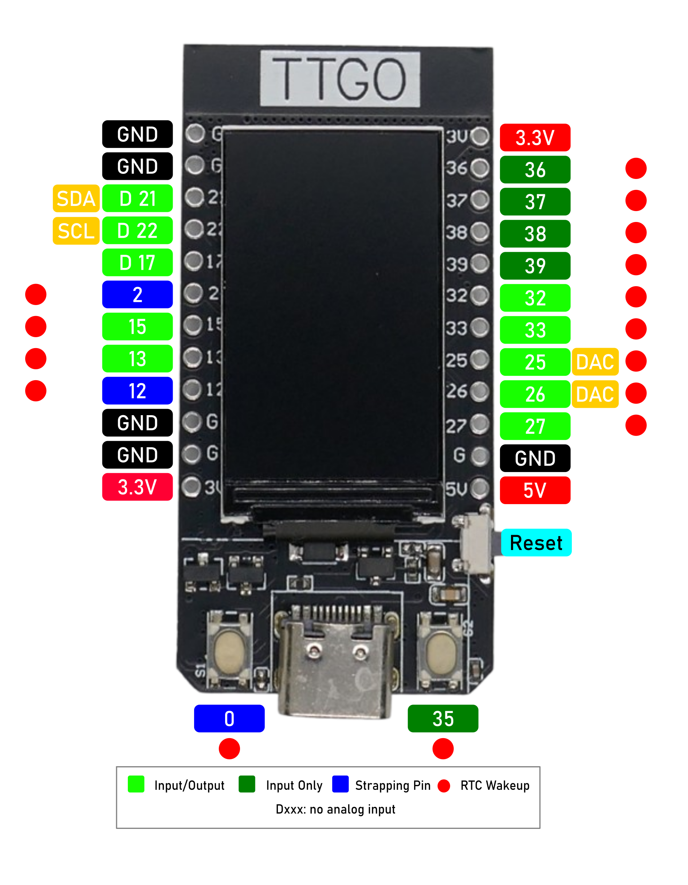
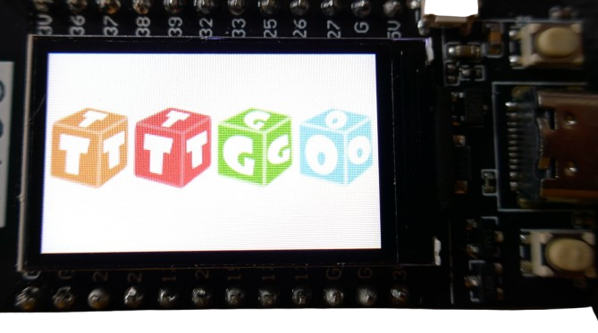

 
# T-Display

> ESP32 With 1.14 Inch Color TFT At 135x240 Resolution, 16MB Flash, Two Programmable Buttons, And LiIon Battery Support

The [T-Display](https://www.lilygo.cc/products/lilygo%C2%AE-ttgo-t-display-1-14-inch-lcd-esp32-control-board) from [Lilygo](https://www.lilygo.cc/) is the initial version of the *T-Display* series: an affordable *general purpose* *ESP32S development board*, available with *4MB* and *16MB* of flash memory. 

Available sometimes for under €5.00 (16MB Flash), is is a great bang for the buck if you plan to create battery-driven small devices since the board comes with everything you need: display, two buttons, *LiIon* charger, and a decent *deep sleep* consumption.

It consumes between *40mA* (no WiFi) and *130mA* (WiFi), with spikes up to *370mA*. In *deep sleep*, the board needs *350uA*. *Deep sleep* power consumption is not excellent, but not bad either.

## Overview

The board features a built-in SPI-driven 1.14" TFT color display (135x240 resolution) at high density (260PPI), equipped with a programmable backlight (*GPIO4*). Since *SPI pins* are not exposed, you cannot connect additional *SPI* devices.





There are 8 freely usable digital and analog *GPIOs*, 4 digital and analog **input-only** *GPIOs*, two strapping pin *GPIOs*, and two *I2C GPIOs*. At a maximum, you can use *16 GPIOs*.


The board comes with *two freely programmable push buttons* (low active), a *JST 1.25mm connector* for connecting a *LiIon battery* on the backside (including charger using the *USB-C power supply*), and a built-in voltage sensor at *GPIO34*.


It is available pre-soldered or with unsoldered header pins. 

> [!TIP]
> Do not immediately peel off the protective film on the display. Soldering the header pins occurs in close proximity to the display, and there may be drops of flux spilling onto it.


## Specs

The *ESP32S* microcontroller is available in a *4MB* and a *16MB* version. It has no *PSRAM*. A *shell case* can be ordered separately, or you can [3D print a shell](https://github.com/Xinyuan-LilyGO/TTGO-T-Display/tree/master/3d_file) yourself.

| Item | Value |
| --- | --- |
| Microcontroller | ESP32S (Xtensa dual-core LX6) |
| Memory | *4MB*/*16MB* |
| Buttons | *GPIO0*, *GPIO35* (both *low active*) |
| UART | [CH9102](https://www.wch-ic.com/downloads/category/30.html), [installing driver](https://done.land/components/microcontroller/howtouse/connecttopc#installing-drivers) |
| Onboard functions | two programmable buttons, battery power detection, charger |
| Display | 1.14 Inch TFT |
| Display Backlight | *GPIO4*, dimmable |
| Resolution | 135x240 |
| Density | High Density 260 PPI |
| Driver | [ST7789](materials/st7789_datasheet.pdf) |
| Library | [TFT_eSPI](https://github.com/Bodmer/TFT_eSPI) |
| Charger | [TP4054](materials/tp4054_datasheet.PDF) |
| Voltage Sensor | *GPIO34* |
| Power Consumption | *40mA* (no WiFi), *130mA* (WiFi), *350uA* (Deep Sleep) |
| Charging Current | 500mA |
| Size | 51.52x25.04x8.54mm |
| Voltage Regulator | [AP2112K](materials/ap2112_voltage_regulator.pdf), >600mA |
| Support | [T-Display Github](https://github.com/Xinyuan-LilyGO/TTGO-T-Display) |




### Flash Memory
The size of the built-in *flash memory* is the only *variable* spec.

There are *T-Display models* with just *4MB flash memory*, yet most currently sold models come with *16MB*. While *4MB* indeed used to be the *standard flash size* for *ESP32*, today (especially when using displays and/or *ESPHome*), *4MB* often is not sufficient anymore and may severely limit you once you start developing more complex projects.

> [!IMPORTANT]
> Check the *Flash Size* **before you buy** so you don't accidentally purchase old *4MB* models. Do not buy if the seller is not mentioning the flash size. And remember: *32Mbit* are really just *4MB(yte)*. The price difference between *4MB* and *16MB* models is small.

#### platformio
If your board *has 16MB*, make sure you **specify this size** in the *platformio.ini*, or else your firmware will only use the default *4MB* flash ram:

````
[env:lilygo-t-display]
platform = espressif32
board = lilygo-t-display
framework = arduino
board_build.flash_size = 16MB ; # important: if your board has 16MB, unlock it!
````
#### ESPHome

Likewise, if you use *ESPHome*, add the flash size to your *configuration*:

````
esp32:
  board: esp32dev
  flash_size: 16MB  # important: if your board has 16MB, unlock it!
  framework:
    type: arduino
````

> [!CAUTION]
> If you specify *16MB* with boards that only have *4MB*, your firmware *may or may not* reference memory that does not exist (sepending on your overall firmware size). So the effects are random: your board may continue to work fine, or you may experience boot failures or sudden resets. The latter happens whenever your firmware code tries to access non-existing flash memory. In a nutshell, add the extended flash size keys only when you are *certain* that your board has this much memory (see below for how to check the flash size).


#### Determining Built-In Flash Memory

If you aren't sure what the flash size of your board is, you cannot necessarily trust your *build tools*: depending on which you use, they may report a default *4MB* flash size no matter what the real flash size is.

To find out the *real* size, navigate to the [Adafruit ESPTool](https://adafruit.github.io/Adafruit_WebSerial_ESPTool/) in a compatible browser (such as *Chrome*).


Next, connect your board via *USB-C* and a USB cable to your PC, then *manually switch* the board to *ROM bootloader mode* (hold left push button, press *reset* button on the side). 

Now, click *Connect* in the upper right side of the website, and select the USB port you connected the board to. The tool returns its technical specs including the real flash size.

You can of course use this tool also to *manually upload binary firmware files* if you need to: click *Choose a file* in the top area, then *Erase* the flash memory and *Program* it with the file(s) you specified.

## Caveats
This is an awesome board, especially since market prices have dropped below €5. Like anything else, it isn't perfect though. Here are a few caveats:

### No Built-In LED
The board has a *blue LED* on its backside corner next to the *USB-C* connector, however it is wired to the internal charger and cannot be programmed: the blue LED is *on* when the voltage at the *JST 1.25* connector is below *4.2V*, else *off*:


| Condition | Blue LED Status |
| --- | --- |
| no battery connected | on, dimmed |
| battery connected, charging | on, bright |
| battery connected, not charging | off |


> [!TIP]
> If you need to run this board in the most power-efficient way, make sure you power it through the *JST 1.25* battery connector.    

There is *no programmable LED* on this board. Testing the board with a simple *blink* sketch is not possible (unless you use the display backlight on *GPIO4* instead).

### No SPI Interface Exposed
The board uses the primary *SPI interface* internally to connect to the built-in display. The pins are not exposed, so you cannot use it for other peripherals. The secondary *SPI interface* isn't fully exposed either (pin 14 is missing). In a nutshell, you cannot connect additional external *SPI peripherals* to this board. To connect peripherals, you are limited to *I2C*.

### Charger and External Battery
The board supports using an external *LiIon* or *LiPo* battery via a *JST 1.25* plug on its backside. You **cannot** use *LiFePo4* batteries (the charging voltage would be too high).

#### Charging Current
The charger is set to a relatively high *500mA* charging current. You **must** ensure that the batteries you connect can sustain this current. Typically, batteries smaller than *1.000mAh* require (much) less charging currents and can be damaged otherwise. Even for *1.000mAh*, charging with *500mA* is considered a stressful *quick-charge* that shortens its life span.

> [!NOTE]
> For *portable devices*, it may be desirable to re-charge them as quickly as possible.    

#### Voltage Sensor Readings
The built-in *voltage sensor* at *GPIO34* reports correct battery voltage only *when powering from battery* (not charging). 

Once you connect *USB power*, the reported voltage **during active charging** (with the blue charger LED turned on) is confusing at first: in the initial *constant current* charging phase it is *4.20V*, and in the concluding *constant voltage* charging phase, voltage gradually increases to way beyond *4.60V*.


These voltage readings **do not resemble the true battery terminal voltage**. Measuring the battery terminal voltage during charging reveals that the *TP4054 charger* does an excellent job, and the charging voltage slowly increases initially until it reaches a safe constant voltage of *4.20V*.

> [!IMPORTANT]
> You **must** set the *attenuation* of *GPIO34* to the highest setting: *12dB*. Else, the *ADC* will saturate and always report values around *1V*.

#### Sensor Shows Voltage Spikes
Built-in *ESP32 ADCs* are known to be not particularly precise. The battery voltage is reported fairly accurate, however you will see frequent *outliers* in *positive directions* (voltage spikes). That's why you should smoothen the values, i.e. with a *quantile filter* using the *0.25 quantile* (cutting off voltage spikes).

Here is how you configure *GPIO34* as a *battery voltage sensor* in *ESPHome*, including filtering out *outliers*:

````
sensor:
  - platform: adc
    pin: GPIO34
    id: battery_voltage
    name: "Voltage"
    update_interval: 1s
    accuracy_decimals: 2
    attenuation: 12dB
    samples: 10
    entity_category: "diagnostic"
    device_class: "voltage"
    filters:
      # transform the raw value (voltage divider) to actual voltage:
      - multiply: 2.04
      # remove outliers (voltage spikes only):
      - quantile:
          window_size: 7
          send_every: 4
          send_first_at: 3
          quantile: .25
````

> [!TIP]
> Note the conversion factor `- multiply: 2.04` that takes the built-in *voltage divider* into account. The conversion rate really is `2.0` (since the voltage divider uses two equal resistors), however since these are no precision resistors, there is a certain variability. Measure the actual battery voltage with a multimeter and compare it to the readings. Next, *adjust the conversion factor* accordingly so the readings match your multimeter results. In my case, the conversion factor turned out to be `2.04`. It may be slightly different for you.

### Low Voltage Tolerance
Typical *LiIon* batteries shouldn't be discharged below *3.2V* anyway if you want to keep them healthy. However, once voltage drops below *3.2V*, the display backlight starts to flicker. 

Unfortunately, there does not seem to be a built-in *low voltage protection* that kicks in at *3.2V*, so your battery may be discharged well below *3.2V* while the board starts to behave erratically.

That's why you should use the built-in *voltage sensor* (see above), and make sure your board is sent to *deep sleep* once the voltage drops below *3.2V*. Here is an [example using ESPHome](https://done.land/components/microcontroller/families/esp/esp32/lilygot-display/t-display/programming/usingesphome/addingdeepsleep) that implements this *low voltage protection* plus a number of other useful features for battery operation.


### Power-Off Capabilities
Once a development board is equipped with an external battery, it needs an *off* switch - or else it would run until the battery is drained.

For battery operation, you need to add a physical switch to your battery. *Deep sleep mode* consumes too much power to be usable as *power off switch* replacement.

#### Deep Sleep Power Consumption
This board has a relatively high *deep sleep power consumption of *350uA*. It's not all bad, considering *deep sleep consumption* of up to *4mA* with many other boards (i.e. [Lolin32 Lite](https://done.land/components/microcontroller/families/esp/esp32/classicesp32/lolin32lite)). *350uA* is ok for switching off the board *temporarily*, or adding *low voltage protection*. However, good boards (like the *DFRobot FireBeetle*) need just *12uA*.

Unfortunately, even the *350uA* aren't reached at first. When sending this board to *deep sleep*, it may consume up to *9mA*.

As detailed in the article about [adding Deep Sleep using ESPHome](https://done.land/components/microcontroller/families/esp/esp32/lilygot-display/t-display/programming/usingesphome/addingdeepsleep), it is crucial to use the **ext01** *deep sleep mode*, and you **must** send the built-in display to its own *deep sleep* **before** you send the *ESP32* to sleep.


## GPIOs
The board offers generous 16 GPIOs, however certain restrictions apply:

| Count | Category | GPIOs  |
| --- | --- | --- |
| 8 | dedicated, input and output | 13,15,17,25-27,32-33 |
| 4 | dedicated, input only, no pullup/pulldown | 36-39 |
| 4 | caveats, restrictions apply | 2,12, 21-22 |


### Eight Prime-Time GPIOs + Four Input-Only
Below are the *always-safe GPIOs* available on **any** *ESP32S*. The board uses two of these for the built-in display, one to measure the battery voltage, and one for the right built-in push button.

> [!NOTE]
> The left push button is connected to *GPIO0* and is *low active*: when pressed, it connects to *GND*. Otherwise, it is *pulled up*. If you hold this button during power-on, the ROM bootloader is launched (so the button serves as classic *boot button*). Once your firmware takes control, *GPIO0* can be freely used, and when you configure it as *input*, it will be *low* when the left button is pressed, otherwise *high*.


| GPIO | Modes | Exposed? | Remark |
| --- | --- | --- | --- |
| 4 | Ain Din Dout | no | controls display backlight |
| >13 | Ain Din Dout | yes | available |
| 14 | Ain Din Dout | no | measures battery voltage |
| >15 | Ain Din Dout |yes | available |
| 16 | Din Dout | no | used for display DC (data/command) |
| >17 | Din Dout | yes | available |
| >25 | Ain Aout Din Dout | yes | available |
| >26 | Ain Aout Din Dout | yes | available |
| >27 | Ain Din Dout | yes | available |
| >32 | Ain Din Dout | yes | available |
| >33 | Ain Din Dout | yes | available |
| 34 | Ain Din | no |  |
| 35 | Ain Din | not directly, wired to right onboard push button |  |
| 36 | Ain Din | yes | input only, no pullup/pulldown |
| 37 | Ain Din | yes | input only, no pullup/pulldown |
| 38 | Ain Din | yes | input only, no pullup/pulldown |
| 39 | Ain Din | yes | input only, no pullup/pulldown |

> *HSPI* is not fully exposed anyway and therefore cannot be used - marked *GPIOs* are free to use for other purposes.    
> *GPIOs* marked with `>` are recommended *GPIOs* that can serve as *input* and *output* and have no caveats or restrictions.


### Reserve GPIOs
Additional *GPIOs* can be used if your code does not require *I2C*, and/or if you can live with associated restrictions or caveats:

| GPIO | Modes | Caveat |
| --- | --- | --- | 
| 2| Ain Din Dout | boot fails if pulled *high*, strapping pin |
| 12 | Ain Din Dout | boot fails if pulled *high*, strapping pin, HSPI |
| 21 | Din Dout | free to use if I2C is not used |
| 22 | Din Dout | free to use if I2C is not used |

## I2C and SPI

The board uses the default *ESP32S I2C* pins:

| Pin | Description |
| --- | --- |
| 21 | SDA |
| 22 | SCL |


*VSPI* is used for the internal display. *HSPI* pins are not fully exposed (*GPIO14*/*CLK* missing) so *HSPI* is not meant to be used as a secondary *SPI* interface:


| Function | VSPI | HSPI | 
| --- | --- | --- | 
| MOSI | - | 13 | 
| MISO | - | 12 |
| CLK | - | - |
| CS | - | 15 |

That's why *Lilygo* labels these *GPIOs* as freely usable.

## Strapping Pins
Here is a list of the exposed *strapping pins* that can influence (or impair) the boot process:

| GPIO | Exposed? | Restriction/Caveat |
| --- | --- | --- |
| 0  |  hard-wired boot button | *low* to run ROM serial boot loader. Else, run custom code |
| 2 | yes | Strapping function ignored when not in boot mode.  Else, must be *low/floating* to enter boot loader. |
| 5 | used internally for display | controls timing of *SDIO slave*, default is *high* during boot (rising-edge output). Irrelevant when chip uses normal SPI flash. Used for CS in VSPI. |
| 12 | yes | sets flash voltage (3.3V by default). If set to *high* on accident during boot, 3.3V flash receives 1.8V and browns out |
| 15 | yes | *low* silences boot messages, irrelevant |

### Caveats

You are good to use the GPIOs above as long as you do not use them as *inputs*, and do not hard-wire them to a given state:

* **GPIO2:** must never be hard-wired to *high*. In your code, you can freely use *GPIO2* because your code will not run anyway when boot mode is enabled via the *boot button*, and *GPIO2* only matters in this boot mode and is otherwise ignored.
* **GPIO12:** must never be hard-wired to *high*. In your code, you can freely use *GPIO2* because your code will only run *after* the flash voltage has been set.
* **GPIO15:** Freely usable. Whether nor not boot messages are emitted is not interfering with boot.

The only exception to the rule - *never use as input* - is *GPIO0*: this *GPIO* **is** used as an input (it is wired to the left push button), yet obviously because this button **is supposed to** influence the boot process: when you hold the button at power-up, the ROM bootloader is loaded. 

Once the boot process has completed and your own firmware code runs, you can now safely use this *low active* button at *GPIO0* for your own purposes.

> [!NOTE]
> At this point, you can use *all* of the strapping pins as *inputs*. You just need to make sure that strapping *GPIOs* cannot be actively changed *before* the boot process has completed.


## Display

This board comes with a hard-wired 1.14 Inch color TFT display at a resolution of 135x240 and a pixel density of 260 PPI.


It internally uses these six GPIOs that aren't exposed externally:

| GPIO | Description |
| --- | --- |
| 4 | Backlight (BL) |
| 5 | CS |
| 16 | DC |
| 18 | SCLK |
| 19 | MOSI |
| 23 | Reset (RST) |


## Power

There are four options to power the board, and the supported voltage range stretches from *2.3-6.0V*, depending on the input you use.


| Source | Voltage Range | Remarks |
| --- | --- | --- |
| USB-C | 3.8-6.0V | *5V input* passes the internal *AP2112K* voltage regulator which delivers *3.3V* to the board |
| 5V pin | 3.8-6.0V | same as *USB input* |
| 3.3V pin | 2.3-3.6V  | input power bypasses the voltage regulator and is directly supplied to the board and chip. The input voltage must be in the range of *2.3-3.6V* for the CPU (but may need to be closer to *3.3V* for the display). If the voltage exceeds *3.6V*, the CPU is lost: you *must* protect your board from even the slightest over-voltage spikes when using the *3.3V input pin*. It can be powered directly off *LiFePo4* batteries, but never *LiIon* batteries. The latter always require a voltage regulator or other means of capping over-voltage.  Supplying power via *3.3V pin* is improving overall efficiency and minimizing power consumption, but it carries the inherent risk of permanently damaging the board. |
| LiIon |  3.7-4.2V | All *T-Display* boards feature a *LiIon battery* connector (located on the back). When not connected to any other power source, *LiIon battery input* is processed by the same *AP2112K* voltage regulator that converts the *USB input voltage* to *3.3V*. When connected to a *5V power source* like *USB*, the integrated charger (*TP4054*) recharges a connected *LiIon battery* with *500mA*.


## Onboard Buttons
The board comes with *two large* push buttons on the top, and a smaller button on the side. The smaller button is the *Reset* button.


The two larger buttons can be programmed:

| GPIO | Button | Remark |
| --- | --- | --- |
| 0 | left | *low active*, pulled up. When pressed during boot, the ROM bootloader launches. Once your firmware runs, *low* when button is pressed, else *high* |
| 35 | right | *low active* as well |

## Firmware
The board comes with a preloaded default firmware which makes it simple to test-drive it. When you power on the board, the display shows a *TTGO* logo, followed by some full color screens.


You then find yourself in a menu: pressing the left push button starts a *WiFi Scan*, while pressing the right button either shows the battery voltage (if an external LiIon battery is connected), or switches right away into deep-sleep mode.


The board can be programmed by using the typical development environments (*ArduinoIDE* or *platformio*), or by using *ESPHome*.


## Materials

[Schematics (PNG)](materials/lilygo_t-display.png),  [Schematics (PDF)](materials/lilygo_t-display.pdf)    
[ST7789V Video Controller](materials/st7789_datasheet.pdf)    
[AP2112 Voltage Regulator](materials/ap2112_voltage_regulator.pdf)    
[TP4054 LiIon Charger](materials/tp4054_datasheet.PDF)    
[3D Printable Shell](https://github.com/Xinyuan-LilyGO/TTGO-T-Display/tree/master/3d_file)    

> Tags: Lilygo, T-Display

[Visit Page on Website](https://done.land/components/microcontroller/families/esp/esp32/lilygot-display/t-display?261761091530243112) - created 2024-09-29 - last edited 2024-10-17
