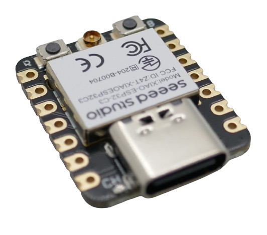

 
# ESP32 Microprocessor Family

> High-Powered Single- And Dual-Core Microcontrollers With WiFi, Bluetooth, And Now Also Zigbee And Thread Support

ESP microcontrollers are renowned for their affordability, performance, and well-balanced feature set, including support for wireless communications.

This makes ESP microcontrollers very popular for DIY projects.

On the downside, ESP microcontrollers are power-hungry and may not be the best choice for battery-powered portable devices. Their power consumption during normal operation is well above *100mA*, whereas the most power-efficient microcontrollers (i.e. the *Nordic nRF52* series such as the *nRF52840*) consume just *4-8mA*.

## Overview

The ESP family of microcontrollers has grown quite large over time. For general-purpose DIY projects, however, only a few models are relevant:

| Microcontroller | Remark | Successor |
| --- | --- | --- |
| [ESP8266](https://done.land/components/microcontroller/families/esp/esp8266/) | Single-Core Simple MCU, many users transitioned to this MCU from *Arduino* | [ESP32-C3](https://done.land/components/microcontroller/families/esp/esp32/developmentboards/esp32-c3/), [ESP32-S2](https://done.land/components/microcontroller/families/esp/esp32/developmentboards/esp32-s2/) |
| [ESP32S](https://done.land/components/microcontroller/families/esp/esp32/developmentboards/esp32s/) | Powerful Two-Core MCU, has become DIY default for many projects | **ESP32-S3** |

The first ESP microcontroller with overwhelming traction was the [ESP8266](https://done.land/components/microcontroller/families/esp/esp8266/). In 2016, the much more powerful dual-core [ESP32S](https://done.land/components/microcontroller/families/esp/esp32/developmentboards/esp32s/) started to replace the *ESP8266* and established itself as an affordable general-purpose DIY standard.

While this is still the case, a number of successor microcontrollers have surfaced. In a nutshell:

* For simple projects that used *ESP8266* previously, today *ESP32-S2* or *ESP32-C3* are used.
* For more advanced projects that used *ESP32S* before, today *ESP32-S3* often is a better choice.

The [Espressif Product Comparison](https://products.espressif.com/#/product-comparison) provides a complete list of models and specs.

### Specialized ESP32 Models

Some ESP family members focus primarily on new radio standards such as *Thread*, *Matter*, and *WiFi 5GHz*.

Unless this is important for you, you can safely ignore these MCUs:

| Microcontroller | Remark  | Key Radio Standards |
| --- | --- |  --- |
| **ESP32-C6** | Adds Wi-Fi 6, Thread, Zigbee |  Wi-Fi 6 (2.4 GHz), BLE 5.0, IEEE 802.15.4 (Thread, Zigbee) |
| **ESP32-H2** | Focus on Thread/Zigbee, no Wi-Fi |  IEEE 802.15.4 (Thread, Zigbee), BLE 5.2 |
| **ESP32-P4** | Newest member, supports Wi-Fi 5 GHz |  Wi-Fi 2.4 GHz & 5 GHz, BLE 5.x |

### UART and USB Support
The initial ESP models ([ESP8266](https://done.land/components/microcontroller/families/esp/esp8266/), [ESP32S](https://done.land/components/microcontroller/families/esp/esp32/developmentboards/esp32s/)) require a separate UART-to-USB chip (like *CH340*, *CP2102*, or *FTDI*) for programming and serial communication via USB. 

This often required the installation of specific drivers on the PC, and for terminal outputs, it was crucial to set the correct baud rates.

All newer ESPs come with native USB hardware (*USB-OTG*). This allows them to connect directly to a computer via USB for programming and serial communication, without the need for a separate UART-to-USB bridge chip. 

While this *theoretically* simplifies connecting the MCU to a PC (no special drivers required, no baud rate), in reality it initially caused other issues, mostly related to the tools that use the USB connection (programmer software). 

One reason is that native USB connections can be established using different techniques: *USB-OTG* (on-the-go) versus *USB Serial/JTAG* (USB CDC). Some development tools were initially not fully compatible to both, and some development board designs implemented two *different* virtual serial ports, one for terminal communication, and another one for flashing firmware. Again, some programming tools weren't initially prepared for this.

For example, [ESP32-S2 Mini](https://done.land/components/microcontroller/families/esp/esp32/developmentboards/esp32-s2/s2mini/) boards were notorious for connection problems.

That's why board designs temporarily continued to use dedicated UARTs despite using an ESP model that could actually communicate natively with USB.

Meanwhile, most software hickups have been resolved, and native USB connections today work smoothly and reliably. 

> [!TIP]
> For native USB connections to flawlessly work, you must specify the correct USB connection method in your development environment, i.e. in *platform.io* (`platformio.ini`). Else, you may not be able to connect, or you may loose selected features (i.e. terminal output).

Native USB support has a range of advantages:

* No PC drivers required for UART chips
* Faster, no need to specify baud rates
* Smaller development boards (as no separate UART chip is required)

### Form Factor

Despite its many additional features, **ESP32** and its successors are not necessarily larger in size. The raw chip size did not significantly change compared to the initial *ESP8266*. The **ESP32 C3**-based board from **Seeed** for example is tiny:

**ESP32** boards can be extremely small yet very powerful

If you do not need a *USB Connector*, you can further cut board size. The picture below shows an **ESP8266** on such a board. The same form factor is available for **ESP32**, effectively reducing the board size to the size of the actual microcontroller and a few supporting elements like a *ceramic WiFi antenna*:

Boards without USB connector and UART are even smaller but require an external programmer to transfer the firmware.

## History and Differences

To better understand how the ESP family of MCUs evolved, here is a comprehensive feature comparison:

| Feature | [ESP32](ESP32) | [S2](S2) | [S3](S3) | [C3](C3) | [C6](C6) | H2 | **P4** | [ESP8266](https://done.land/components/microcontroller/families/esp/esp8266/) |
| --- | --- | --- | --- | --- | --- | --- | --- | --- |
| Launch | 2016 | 2019 | 2020 | 2020 | 2021 | 2021 | 2024 | 2014 |
| Core Type | LX6 | LX7 | LX7 | RISC-V | RISC-V | RISC-V | RISC-V | L106 |
| Cores | 2 | 1 | 2 | 1 | 1 | 1 | 2 | 1 |
| Frequency | 240 | 240 | 240 | 160 | 160 | 96 | 400 | 160 |
| Voltage | 2.3-3.6 | 3.0-3.6 | 3.0-3.6 | 3.0-3.6 | 3.0-3.6 | 3.3-3.6 | 3.0-3.6 | 2.5-3.6 |
| GPIOs | 34 | 43 | 45 | 22 | 30 | 19 | 50+ | 17 |
| SRAM KB | 520 | 320 | 512 | 400 | 320 | 256 | 768 | 160 |
| RTC/LP SRAM KB | 16 | 16 | 16 | 8 | 16 | 4 | 16 | 1 |
| int Flash MB | 0/2/4 | 0/2/4 | 0/8 | 0/4 | 0/4 | 2/4 | 0/4/8 | 4 |
| Cache KB | 64 | 8/16 | 16 | 16 | 16 | 16 | 32 | 32 |
| ROM KB | 448 | 128 | 384 | 384 | 320 | 128 | 384 | 0 |
| USB JTAG (native USB-to-PC connection, no UART) | ❌ | ✅ | ✅ | ✅ | ✅ | ✅ | ✅ | ❌ |
| USB OTG (native connection to USB peripherals) | ❌ | ✅ | ✅ | ❌ | ❌ | ❌ | ✅ | ❌ |
| ADC | 2x12bit 18ch | 2x13bit 20ch | 2x12bit 20ch | 1x12bit 6ch | 1x12bit 7ch | 1x12bit 5ch | 2x12bit 20ch | 1x10bit 1ch |
| DAC | 2x8bit | 2x8bit | ❌ | ❌ | ❌ | ❌ | 2x8bit | ❌ |
| Digital Video Interface | ❌ | ✅ | ✅ | ❌ | ❌ | ❌ | ❌ | ❌ |
| Timers | 4x64bit | 4x64bit | 4x64bit | 2x54bit | 2x54bit | 2x54bit | 4x64bit | 2x23bit |
| Watchdog | 3 | 3 | 3 | 3 | 3 | 3 | 3 | 1 |
| I2C | 2 | 2 | 2 | 1 | 2 | 2 | 4 | 1 |
| I2S | 2 | 1 | 2 | 1 | 1 | 1 | 2 | 1 |
| SPI | 4 | 4 | 4 | 3 | 2 | 3 | 4 | 2 |
| Digital Video Interface | ❌ | ✅ | ✅ | ❌ | ❌ | ❌ | ❌ | ❌ |
| Ethernet | ✅ | ❌ | ❌ | ❌ | ❌ | ❌ | ❌ | ❌ |
| LCD Interface | ✅ | ✅ | ✅ | ❌ | ❌ | ❌ | ✅ | ❌ |
| MCU Temperature | ❌ | ✅ | ✅ | ✅ | ✅ | ✅ | ✅ | ❌ |
| Touch | 10 | 14 | 14 | ❌ | ❌ | ❌ | 14 | ❌ |
| UART | 3 | 2 | 3 | 2 | 3 | 2 | 4 | 2 |
| Ethernet | 1 | ❌ | ❌ | ❌ | ❌ | ❌ | ❌ | ❌ |
| IR/RMT | 8 | 4 | 8 | 4 | 4 | 4 | 8 | 1 |
| Hall Sensor | 1 | ❌ | ❌ | ❌ | ❌ | ❌ | ❌ | ❌ |
| LED PWM | 16 | 8 | 8 | 6 | 6 | 6 | 16 | 5 |
| Motor PWM | 6 | ❌ | 2 | ❌ | ❌ | 1 | 6 | ❌ |
| Wifi | 4 | 4 | 4 | 4 | 4/6 | no | 4/5 | 4 |
| Wifi Mbps | 150 | 150 | 150 | 150 | 150 | ❌ | 150@2GHz 433@5GHz | 72.2 |
| Wifi 5MHz | ❌ | ❌ | ❌ | ❌ | ❌ | ❌ | ✅ | ❌ |
| Bluetooth Classic | ✅ | ❌ | ❌ | ❌ | ❌ | ❌ | ❌ | ❌ |
| Bluetooth BLE | BLE4.2 | ❌ | BLE5.0 | BLE5.0 | BLE5.3 | BLE5.3 | BLE5.2 | ❌ |
| Thread 1.3 | ❌ | ❌ | ❌ | ❌ | ✅ | ✅ | ❌ | ❌ |
| Zigbee 3.0 | ❌ | ❌ | ❌ | ❌ | ✅ | ✅ | ❌ | ❌ |
| Matter | ❌ | ❌ | ❌ | ❌ | ✅ | ✅ | ❌ | ❌ |
| HomeKit, MQTT, etc | ❌ | ❌ | ❌ | ❌ | ✅ | ✅ | ✅ | ❌ |
| USB OTG | ❌ | ✅ | ✅ | ❌ | ❌ | ❌ | ✅ | ❌ |
| Camera Interface | ✅ | ✅ | ✅ | ❌ | ❌ | ❌ | ❌ | ❌ |
| TWAI (CAN 2.0) | ✅ | ✅ | ✅ | ✅ | ✅ (2) | ✅ | ✅ | ❌ |
| SD Host | ✅ | ❌ | ✅ (2) | ❌ | ❌ | ❌ | ✅ | ❌ |
| SD Slave | ✅ | ❌ | ❌ | ❌ | ✅ | ❌ | ❌ | ✅ |
| JTAG | ✅ | ✅ | ✅ | ✅ | ✅ | ❌ | ✅ | ❌ |
| TOF | ❌ | ✅ | ❌ | ❌ | ❌ | ❌ | ❌ | ❌ |
| AI Acceleration Support | ❌ | ❌ | ✅ | ❌ | ❌ | ❌ | ✅ | ❌ |
| Deep Sleep | 10µA | 20µA | 7µA | 5µA | 7µA | 8µA | 10µA | 20µA |
| Size mm | 5x5/6x6 | 7x7 | 7x7 | 5x5 | 5x5 | 4x4 | 7x7 | 5x5 |

#### Notes
* What was previously referred to as *RTC memory* has been renamed to *LP memory* (*low power memory*). You might see both terms used interchangeably.
* *ESP32-P4* specs are based on Espressif’s preliminary datasheets (as of 2024). Some values (e.g., GPIOs, SRAM, BLE version, AI acceleration, LCD, SD Host, etc.) may be updated as more details are released.

## Quick Selection Guide

For *new projects*—regardless of whether you used *ESP8266* or *ESP32S* before—it makes sense to look at transitioning to the more modern variants:

* [ESP32-C3](https://done.land/components/microcontroller/families/esp/esp32/developmentboards/esp32-c3/), [ESP32-S2](https://done.land/components/microcontroller/families/esp/esp32/developmentboards/esp32-s2/): most simple projects, very cost-efficient and small
* **ESP32-S3:** projects that would previously have used a [ESP32S](https://done.land/components/microcontroller/families/esp/esp32/developmentboards/esp32s/), i.e. use cases that require higher computational power such as camera projects.

Depending on your feature requirements, here is a more feature-based guidance:

| Category | You want to... | Recommendation |
| --- | --- | --- |
| I/O | control as many external devices as possible | *S2*, *S3* (>40 GPIOs) | 
| DAC | output analog voltages using a built-in DAC | *ESP32S*, *S2* |
| Touch | use touch sensors | *ESP32*, *S2*, *S3* |
| USB Support | use USB devices such as keyboards and mice, or turn your microcontroller into a USB memory stick | *S2* or *S3* (USB-OTG required) |
| Camera Support | connect a camera | *S3* |
| Motor Control | control motors | *ESP32*, *S3* |
| Low Voltage | work with the lowest-possible voltage (i.e. solar projects) | *ESP32* (>2.3V) |
| Low Energy | run on battery for a long time | *S3*, *C3* |
| Bluetooth Classic | work with legacy bluetooth devices | *ESP32S* |
| Bluetooth LE | power-efficient modern bluetooth | *C6* or *H2* |
| Native Support for Thread and Matter | build *matter*-compatible devices | *C6*, *H2* |
| Support for 5GHz WiFi | special use cases, fast data transfer | *P4* |

### ESP8266

There is virtually no good reason anymore to continue to purchase [ESP8266](https://done.land/components/microcontroller/families/esp/esp8266/). For the same price (or lower), you can get [ESP32-C3 SuperMini](https://done.land/components/microcontroller/families/esp/esp32/developmentboards/esp32-c3/c3supermini/) (extremely small form factor), and the [ESP32-S2 Mini](https://done.land/components/microcontroller/families/esp/esp32/developmentboards/esp32-s2/s2mini/) is even *pin-compatible* to the popular *ESP8266 D1 Mini*, so you can continue to use the identical shield boards.

Not only are the newer successor MCUs much more performant, they also typically come with much better-quality development boards.

A common issue with many *ESP8266* boards is the voltage regulator: often, it was capable of merely supplying the MCU, and once you added some external sensors or displays, the built-in voltage regulator collapsed and caused brown-outs and reboot loops.

## Wireless Communications

All ESP MCUs are designed with wireless communications built-in. 

### WiFi (2/5 GHz)
All ESP models (except *ESP32-H2*) support *2GHz WiFi*. 

The new *ESP32-P4* also supports *5GHz WiFi* for better throughput and to escape the typically crowded 2GHz frequency spectrum.

### Bluetooth (Classic/BLE)
Another wireless technology embraced by most ESP types is *Bluetooth BLE*, with two important exceptions: 

* [ESP32S](https://done.land/components/microcontroller/families/esp/esp32/developmentboards/esp32s/) is the only ESP that also supports the legacy *Bluetooth Classic*, which may be important for compatibility with older music players. And
* [ESP32-S2](https://done.land/components/microcontroller/families/esp/esp32/developmentboards/esp32-s2/) is the only ESP that **does not support Bluetooth at all** (same applies to the outdated *ESP8266*).

### Zigbee and Thread
Some of the latest ESPs target new wireless protocols and radio technologies.

To understand what this is, it is important to appreciate that neither classic *WiFI* (high speed, high overhead, high power consumption) nor *Bluetooth* (limited devices, limited range, no mesh) are ideal for modern IoT networks and home automation.

#### "WiFi" Networks for IoT
That's why new networks - specifically aimed at IoT devices with their relatively low data rates and need for energy efficiency - were created:

* **Thread:** **open-source** and **royalty-free**, IPv6-based.
* **Zigbee:** proprietary networking and application layers, **not IP-based**, manufacturers must **pay royalties**.

*Zigbee* and *Thread* are **competing approaches** for low-power, wireless IoT mesh networking in smart home and IoT applications. Both use the same IEEE 802.15.4 radio standard (typically at 2.4 GHz, 250 kbps maximum transfer rate) and target similar use cases (sensors, lights, automation devices).

*Thread* is increasingly favored for new *Matter*-based smart home devices due to its IP-native design, better interoperability, and lower cost (no royalties, open-source).

### Matter (Software)

*Matter* defines an open-source and royalty-free unified application layer protocol for smart home and IoT devices. It is a software, not a radio standard, and it can operate over any network, including but not limited to *WiFi*, *Zigbee*, and *Thread*.

It is basically a *consumer-oriented* [Home Assistant](https://done.land/tools/software/homeassistant/)-like concept built into smartphones and other consumer articles.

* As a DIY maker who is already operating a *Home Assistant*-like home automation infrastructure, *Matter* is completely irrelevant.
* As a consumer, however, *Matter*-compliant devices are highly attractive. Without the need for complex home automation setups like *Home Assistant*, smartphones can be turned into an entry-level home automation solution.

  *Matter*-compliant devices can be easily added to smart devices across different manufacturers, enabled by the open-source, royalty-free *Matter* smart home standard which was developed by the *Connectivity Standards Alliance* (*CSA*, formerly *Zigbee Alliance*).  

### Choosing ESP Models for Matter Devices
If you'd like to create *Matter*-compliant devices with ESP microcontrollers so that users can simply add them to their smartphones and use their smartphones to manage your device, you can use **any ESP microcontroller** since they all support wireless communication one way or another:

* **Matter over WiFi:** any *WiFi*-enabled *ESP* works.
* **Matter over Thread:** requires an ESP with native *Thread* support, i.e. *ESP-C6* or *ESP-H2* (*802.15.4*-compliant radio).

Use the official [Matter SDK (Connected Home over IP, CHIP)](https://github.com/project-chip/connectedhomeip). Espressif provides [ESP-Matter](https://github.com/espressif/esp-matter), an official port of the Matter SDK for ESP32 chips.

With the ESP-Matter APIs, define your device type (light, switch, sensor, etc.).
   - Implement device clusters, attributes, and commands as required by the Matter specification.
   - Handle device commissioning (pairing/setup) and secure communication.

To commission and control your *Matter*-compliant device, use any *Matter* controller app (*Home Assistant*, a smartphone app, or the official CHIP tool as part of the [Matter SDK repository](https://github.com/project-chip/connectedhomeip) under the `examples/chip-tool` directory).

* [ESP-Matter documentation](https://docs.espressif.com/projects/esp-matter/en/latest/)

> Tags: Microcontroller, ESP8266, ESP32, ESP32S, ESP32-S2, ESP32-S3, ESP32-C3, ESP32-C6, ESP32-H2, ESP32-P4, WiFi, Bluetooth, BLE, Zigbee, Thread, Matter, CAN, AI, Camera, USB, JTAG, OTG

[Visit Page on Website](https://done.land/components/microcontroller/families/esp/esp32?405392031823244200) - created 2024-03-23 - last edited 2025-08-02
