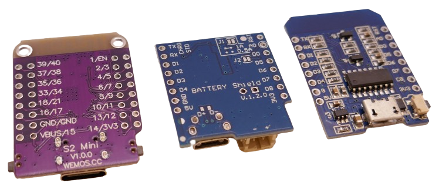

 
# S2 Mini

> Powerful ESP32-S2 Board That Works With ESP8266 Shields


The pink [S2 Mini microcontroller board](https://www.wemos.cc/en/latest/s2/s2_mini.html) (aka *LOLIN S2 Mini* or *Wemos S2 Mini*) uses the **single-core** *ESP32-S2 microcontroller*. It is a *cheap* but extremely powerful board that is very small and *extremely flat* and features *30* freely available *GPIOs* that can be used for *input* and *output*.

## Pin-Compatible To Wemos D1 Mini (ESP8266)

This board is preserving pin compatibility with the *ESP8266 D1 Mini*. Its additional capabilities are exposed via two additional pin header rows. 

It can serve as an ideal replacement for *ESP8266*-based projects. Like the *ESP8266*, the *ESP32-S2* does not support *bluetooth*, and you can continue to use *shields* originally designed for the *D1 Mini* (i.e. *battery shields*).


## 27 Safely Usable GPIOs

*ESP32-S2* comes with *43 GPIOs* of which typically a maximum of [30 GPIOs are safely usable as input and output](https://done.land/components/microcontroller/families/esp/esp32/s2). Since *ESP32-S2 Mini* uses the ESP32-S2FN4R2 chip with integrated flash memory, it does not require to communicate with external flash memory, freeing additional GPIOs. Due to the form factor restraints (aiming to be pin-compatible to *D1 Mini*), the *S2 Mini* does not provide access to all *GPIOs*: 27 *GPIOs* are more than enough for most projects, though:


| GPIO | Remark |
| --- | --- |
| 1-18 | *input and output, pullup and pulldown resistors* |
| 21 | *input and output, pullup and pulldown resistors* |
| 33-40 | *input and output, pullup and pulldown resistors* |


All *GPIOs* support internal *pullup* and *pulldown resistors*.


### Built-In LED
The built-in *blue LED* is connected to *GPIO15* and *high-active*.

## Caveats

The *ESP32-S2* is **exceptional value for the money**, and an awesome board: with a record-number of *30 freely usable GPIO* and a *very small and flat form factor*, this board rocks. You can get it at *AliExpress* for well under EUR 2.00.

However, there are a few strings attached. They are all workable, but you need to know about them:

### Breadboard / Prototyping

The *pin-compatibility* with the *D1 Mini* made it necessary to add dual header rows. Because of this, not only can you reuse *shields* made for *ESP8266 D1 Mini*. The board also has an excellently flat and very space-efficient form factor. 

At the same time, the dual-row headers make it impossible to use it on a standard breadboard.

### Strange USB Design
The most limiting caveat is the way how the *S2 Mini* implemented its *USB interface*: it exposes ***two** different COM ports*: one in *normal mode*, and *another* one in *firmware upload mode*. 

#### ESPHome Incompatibility (And Workaround)
Many tools like [ESPHome Web Tool](https://web.esphome.io/) cannot handle this and are **incompatible** with this board (as of this writing). Using *ESP32-S2 Mini* with *ESPHome* is impossible unless you know a simple but largely unknown [workaround](https://done.land/tools/software/esphome/introduction/manualprovisioning).  

*Classic IDEs* work flawlessly. You may have to manually press and hold the *Boot* button while trying to flash the chip via *USB cable* in *ArduinoIDE* or *platformio*.

### Bluetooth
*ESP32-S2* comes with *WiFi* support but has **no bluetooth support**. This is completely ok as the majority of DIY microcontroller projects do not need *bluetooth*, and you also save some energy this way.

### Incomplete Support
The *ESP32-S2 microcontroller* in general does not seem to be as *mainstream* as other microcontrollers, resulting in incomplete documentation. 

The *pins_arduino.h* file shipped with the *Espressif ESP32 Kit* for example needs manual tweaking to be able to use common pin labels like *D0* or *D1* in your code. 

If this hits you, either edit the *pins_arduino.h* file for your *IDE*, define the missing constants directly in your code and assign them free *GPIO* numbers, or use *GPIO numbers* in the first place.


## S2 Mini Technical Data


| Item | Value |
| --- | --- |
| CPU | ESP32-S2FN4R2 WiFi SoC, Xtensa single-core 32-bit LX7 microprocessor |
| Speed | 240MHz |
| Coprocessor | RISC-V ULP Coprocessor |

> [!TIP]
> The relatively new ESP32-S2FN4R2 chip integrates flash and psram into the S2 silicon.


Due to its form factor, the *S2 Mini* does not expose *all available hardware pins*. With *27 GPIOs*, this board is most sufficient for most *DIY projects*.


| Item | Value |
| --- | --- |
| Digital IO Pins | 27 |
| Clock Speed | 240MHz |
| Flash | 4MB |
| PSRAM | 2MB |
| SRAM | 320KB |
| SRAM in RTC | 16KB (8KB accessible by ULP coprocessor) |
| Temperature Sensor | -20-+110C |
| eFuse | 1792bit for user data |
| SAR ADC | 2x13bit, up to 20 channels, best for voltages <2.45V |
| DAC | 2x8bit, second DAC [has fixable issues](https://vuknikolic.rs/en/posts/esp32/dac_fix/) |
| Touch | 12xtouch sensing IOs |
| SPI | 4x, SPI2 and SPI3 usable: HSPI and VSPI |
| I2S | 1x |
| I2C | 2x |
| UART | 2x |
| DVP 8/16 camera interface | 1x |
| LCD interface | 1x8bit serial, 1x8/16/24bit parallel |
| TWAI (CAN-Bus) | 1x, ISO11898-1 (CAN Specification 2.0) |
| PWM controller | 8x |
| USB OTG 1.1/PHY | host and device support |
| Cryptographic | Hardware accelerators for AES, ECB/CBC/OFB/CFB/CTR, GCM, SHA, RSA, ECC (Digital Signature) |
| Size | 34.4x25.4mm |
| Weight | 2.4g |

Power consumption in its sleep modes is lower compared to classic *ESP32*:

| Operation | Current |
| --- | --- |
| Normal (WiFi) | 310mA peak |
| Modem-Sleep | 12-19mA |
| Light-Sleep | 450uA |
| Deep-Sleep | 20-190uA |

Power regulation is done by a *ME6211C33* regulator:

| Item | Value |
| --- | --- |
| Input voltage | 4.7-6.5V |
| Operating Voltage | 2-6V |
| Max current | 500mA@4.3Vin/3.3Vout |


## Hardware I2C Interface
Any pin can *emulate* a *I2C* interface (or define additional ones). Only the *hardware I2C interface* uses optimized hardware that does not put load on the microcontroller and is faster. 

| Pin | Label | Description |
| --- | --- | --- |
| 33 | SCA | Data |
| 35 | SDL | Clock |

## Hardware SPI Interface
Any pin can *emulate* a *SPI* interface (or define additional ones). Only the *hardware SPI interface* uses optimized hardware that does not put load on the microcontroller. When connecting components with high data rates (i.e. *displays*), try and use *hardware SPI* for much higher frame rates.


| Pin | Label | Alternate Labels | Description |
| --- | --- | --- | --- |
| 11 | MOSI | SDO, SDA | Master Out SLave In |
| 9 | MISO | SDI | Master In Slave Out |
| 7 | CLK | SCL, SCLK |Clock |
| 12 | SS | Chip Select |


> [!TIP]
> Since the *S2 Mini* is pin-compatible to *D1 Mini*, you can simply look up pins for the *D1 Mini* if you can't find documentation for *ESP32-S2*. Documentation for *D1 Mini* is much more readily available.


### Pins And Compatible Shields

The board comes with 32 pins in 2x2 rows of 8. The *outer* pins are *compatible with ESP8266 D1 Mini* pins. *D1 Mini-compatible shields* can therefore be used with the *S2 Mini* as well:


In an effort to maintain *maximum backwards compatibility*, the *S2 Mini* board designers changed the order of some *pin pairs*: pins *2-11* are always located on the board in *pairs*, i.e. *2/3*, *4/5*, *6/7*, *8/9*, *10/11*. For some pins, this scheme is reversed: pins *12* and *13* are located as *13/12* instead of *12/13* to preserve pin compatibility to the *D1 Mini*:

Only the *outer* pins match the *D1 Mini* pins (as the two inner lines of pins were added). Both pin *11* and *12* are used for the *hardware SPI interface* though. If the board designers would not have switched pins *12* and *13* around, then pin *12* would have been located on the *inner* lines of pins and thus become inaccessible for *D1 Mini*-compatible shields.


This allows users to continue to use i.e. *battery shields* to add *charging* and battery power supply via existing *D1 Mini Shields* for *portable projects*:


> [!CAUTION]
> *Software-configurable* pins (such as *GPIOs* and the pin for the built-in *LED*) are **not compatible** with *ESP8266 D1 Mini*. Since these pins can be adjusted freely in software in the *S2*, converting software from *ESP8266 D1 Mini* to *S2 Mini* is a matter of checking and potentially reassigning pin numbers.

### S2 Mini Pinout


The pin numbers printed on the backside of the breakout board represent the exposed *GPIO* numbers. I.e., pin marked *1* represents *GPIO1*.


| Pin |  Remark | Description |
| --- |  --- | --- |
| EN | | Reset button |
| 3V3 | | direct power supply to CPU |
| VBUS | | connected to ME6211C33 voltage regulator |
| 0 | not exposed | Boot button pulls it low |
| 1-6 |  | general purpose: analog input (ADC1) and digital in/output |
| 7 | SPI SCK | general purpose: analog input (ADC1) and digital in/output |
| 8 | | general purpose: analog input (ADC1) and digital in/output |
| 9 | SPI MISO | general purpose: analog input (ADC1) and digital in/output |
| 10 | | general purpose: analog input (ADC1) and digital in/output |
| 11 | SPI MOSI | general purpose: analog input (ADC2) and digital in/output |
| 12 | SPI SS | general purpose: analog input (ADC2) and digital in/output |
| 13-14 | | general purpose: analog input (ADC2) and digital in/output |
| 15 | internal LED | general purpose: analog input (ADC2) and digital in/output |
| 16 | | general purpose: analog input (ADC2) and digital in/output |
| 17 | DAC1 | general purpose: analog input (ADC2) and digital in/output |
| 18 | DAC2 | general purpose: analog input (ADC2) and digital in/output |
| 19, 20 | not exposed | *USB D1/D2*, connected to the *USB C* connector | 
| 21 | | general purpose digital in/output |
| 33 | I2C SDA | general purpose digital in/output |
| 34 | | general purpose digital in/output |
| 35 | I2C SCL | general purpose digital in/output|
| 36-40 | | general purpose digital in/output |


> [!CAUTION]
> The *ADC2* (and thus *analog inputs* at *GPIO11-GPIO18*) can only be used when *WiFi* is *disabled*.




## Prototyping

The *S2 Mini* uses *dual line header pins* (2x8 pins on both sides for a total of 32 pins).


This design was necessary to keep the *hardware compatibility* to the predecessor *ESP8266 D1 Mini* board: the *outer* 8-pin headers match the header pins in a *ESP8266 D1 Mini* (for power and *GND* pins at least).

You cannot of course use *dual line header pins* with a prototyping bread board as this would *short circuiting* both header pin lines.

### Soldering Header Pins

For prototyping, it makes most sense to solder the *outer* header pins normally for a *ESP8266 D1 Mini*-compatible foot print. 


The *inner* header pins should *not be connected* to the bread board. Instead, solder the header pins *on top*: this way, the additional pins can be connected using *female DuPont cables*.


## Fixing Missing Pins

When programming the *S2 Mini* in *platform.io*, the translation between true *hardware pins* and *common pin labels* is performed automatically: the *IDE* looks up the appropriate version of the file *pins_arduino.h* in the folder *%USERPROFILE%\\.platformio\packages\framework-arduinoespressif32\variants\lolin_s2_mini*.

### Pin Declarations Missing

At the time of this writing, the appropriate file *pins_arduino.h* does exit but is incomplete. It does not define the *common pin labels* for all *digital pins*. 

Whenever you try and compile source code that refers to a **D*x*** pin, compilation files with an exception.

There does not seem to exist an *officially updated version* of this file. To fix, you have two choices:

* **Quick Fix:** Replace the *common pin labels* in the code with the actual *hardware pin* numbers. Since with *S2 Mini* the numbers are identical, you would i.e. change *D2* by *2*. If you do this, the code will compile but is now *specific* for *S2 Mini* and will no longer work on different microcontroller boards.
* **Permanent Fix:** Open the file *%USERPROFILE%\.platformio\packages\framework-arduinoespressif32\variants\lolin_s2_mini\pins_arduino.h* in a text editor, and add the missing declarations. You find an example below. When you do this, you might lose your changes with the next update of the *espressif32 arduino framework*, though.

````c++
#ifndef Pins_Arduino_h
#define Pins_Arduino_h

#include <stdint.h>

// Default USB Settings
#define USB_VID 			0x303a
#define USB_PID 			0x80C2
#define USB_MANUFACTURER 	"WEMOS.CC"
#define USB_PRODUCT 		"LOLIN-S2-MINI"
#define USB_SERIAL 			"0"


// Default USB FirmwareMSC Settings
#define USB_FW_MSC_VENDOR_ID 		"ESP32-S2" 		//max 8 chars
#define USB_FW_MSC_PRODUCT_ID 		"Firmware MSC"	//max 16 chars
#define USB_FW_MSC_PRODUCT_REVISION	"1.23" 			//max 4 chars
#define USB_FW_MSC_VOLUME_NAME 		"S2-Firmware" 	//max 11 chars
#define USB_FW_MSC_SERIAL_NUMBER 	0x00000000

#define EXTERNAL_NUM_INTERRUPTS 46
#define NUM_DIGITAL_PINS        48
#define NUM_ANALOG_INPUTS       20

#define analogInputToDigitalPin(p)  (((p)<20)?(analogChannelToDigitalPin(p)):-1)
#define digitalPinToInterrupt(p)    (((p)<48)?(p):-1)
#define digitalPinHasPWM(p)         (p < 46)

static const uint8_t LED_BUILTIN = 15;
#define BUILTIN_LED  LED_BUILTIN // backward compatibility

static const uint8_t TX = 39;
static const uint8_t RX = 37;

static const uint8_t SDA = 33;
static const uint8_t SCL = 35;

static const uint8_t SS    = 12;
static const uint8_t MOSI  = 11;
static const uint8_t MISO  = 9;
static const uint8_t SCK   = 7;

static const uint8_t A0 = 1;
static const uint8_t A1 = 2;
static const uint8_t A2 = 3;
static const uint8_t A3 = 4;
static const uint8_t A4 = 5;
static const uint8_t A5 = 6;
static const uint8_t A6 = 7;
static const uint8_t A7 = 8;
static const uint8_t A8 = 9;
static const uint8_t A9 = 10;
static const uint8_t A10 = 11;
static const uint8_t A11 = 12;
static const uint8_t A12 = 13;
static const uint8_t A13 = 14;
static const uint8_t A14 = 15;
static const uint8_t A15 = 16;
static const uint8_t A16 = 17;
static const uint8_t A17 = 18;
static const uint8_t A18 = 19;
static const uint8_t A19 = 20;

static const uint8_t D1 = 1;
static const uint8_t D2 = 2;
static const uint8_t D3 = 3;
static const uint8_t D4 = 4;
static const uint8_t D5 = 5;
static const uint8_t D6 = 6;
static const uint8_t D7 = 7;
static const uint8_t D8 = 8;
static const uint8_t D9 = 9;
static const uint8_t D10 = 10;
static const uint8_t D11 = 11;
static const uint8_t D12 = 12;
static const uint8_t D13 = 13;
static const uint8_t D14 = 14;
static const uint8_t D15 = 15;
static const uint8_t D16 = 16;
static const uint8_t D17 = 17;
static const uint8_t D18 = 18;
static const uint8_t D33 = 33;
static const uint8_t D34 = 34;
static const uint8_t D35 = 35;
static const uint8_t D36 = 36;
static const uint8_t D37 = 37;
static const uint8_t D38 = 38;
static const uint8_t D39 = 39;
static const uint8_t D40 = 40;

static const uint8_t T1 = 1;
static const uint8_t T2 = 2;
static const uint8_t T3 = 3;
static const uint8_t T4 = 4;
static const uint8_t T5 = 5;
static const uint8_t T6 = 6;
static const uint8_t T7 = 7;
static const uint8_t T8 = 8;
static const uint8_t T9 = 9;
static const uint8_t T10 = 10;
static const uint8_t T11 = 11;
static const uint8_t T12 = 12;
static const uint8_t T13 = 13;
static const uint8_t T14 = 14;

static const uint8_t DAC1 = 17;
static const uint8_t DAC2 = 18;

#endif /* Pins_Arduino_h */
````

## Uploading Firmware
These are the steps to upload new firmware to *S2 Mini* using *platformio*:

1. Connect *S2 Mini* to computer using USB-C cable. Make sure to use a *data cable* and not just a *power cable*.
2. Hold button *0*, then short-press button *RST*. Once you release button *RST*, the computer should play the sound for *new USB device discovery*.
3. Upload the firmware in *platformio* by clicking *Upload*. *Platformio* will search for a port, then force the *S2 Mini* in reset, and then find a port and upload the sketch.
4. Once the upload is done, short-press *RST* again. Now, the sketch should execute.

If the *S2 Mini* is *not recognized* by your computer (no "new USB device" sound plays after you pressed the keys as described above), make sure the *USB cable* is fully plugged in, try and reverse the plugs, and use a different cable. Apparently, the *USB connectors* on this board do not always have proper contact. Trying with a different *USB cable* often solve the issue.

> [!TIP]
> If changing the *USB cable* does not help, *reboot* your *PC*. It is *frequently* the case that *USB communications* fail over time, or that other running software blocks *USB discovery*. *Rebooting* the *PC* can then solve the issue which is not at all related to this particular board. It is related to *USB* and can occur with (any) microcontroller board/type that is using *USB*.

If the issue still persists, check to see whether the board gets warmer as usual. The build quality of these boards is not always great, and there have been instances where solder residue was short-circuiting CPU contacts. Closely inspect the board and all solderings.

### ESPHome
For flashing *S2 Mini* in [ESPHome](https://done.land/tools/software/esphome), the [ESPHome Web Tool](https://web.esphome.io/) is **incompatible** with this board and does not work (as of this writing). Use this [workaround](https://done.land/tools/software/esphome/introduction/manualprovisioning) instead to upload *ESPHome firmware* or to provision the board with the generic *ESPHome firmware*. 

Once you have successfully uploaded *ESPHome firmware* at least **once** via *USB cable*, you can then use *OTA* to wirelessly upload any future firmware updates, effectively bypassing the *S2 Mini USB incompatibilities*.

## Materials

[S2 Mini Datasheet](materials/esp32-s2_datasheet.pdf)   
[S2 Mini Schematics](materials/s2_mini_schematic.pdf)   
[S2 Mini Dimensions](materials/s2mini_dimensions.pdf)   
[ME6211 voltage regulator](materials/me6211_datasheet.pdf)   


> Tags: Microcontroller, ESP32, S2, ESP32 S2, Shield, Pin, I2C, SPI

[Visit Page on Website](https://done.land/components/microcontroller/families/esp/esp32/s2/s2mini?273412051205244129) - created 2024-05-04 - last edited 2024-07-16
