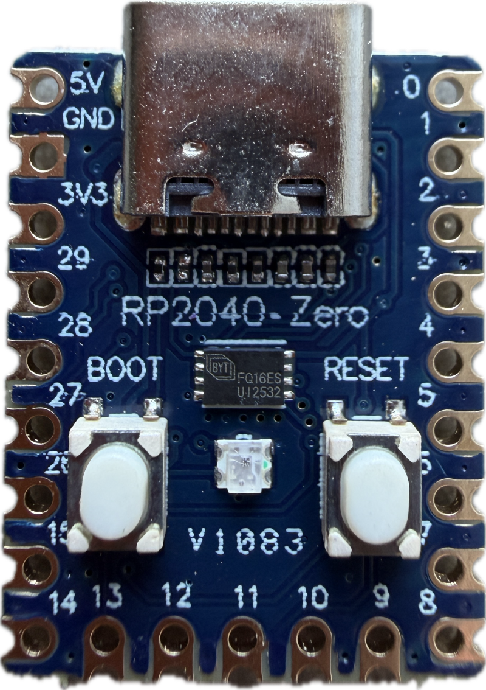
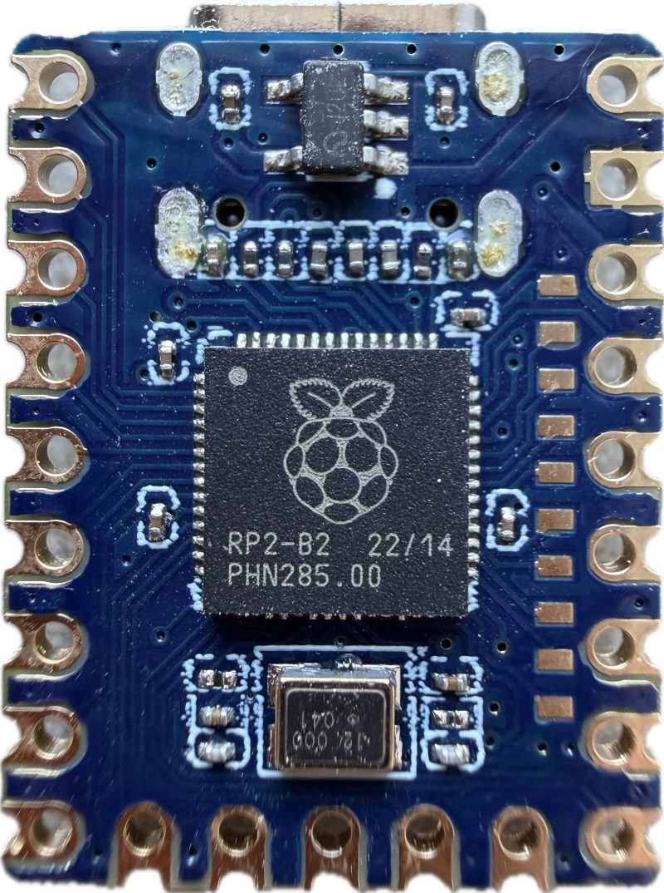
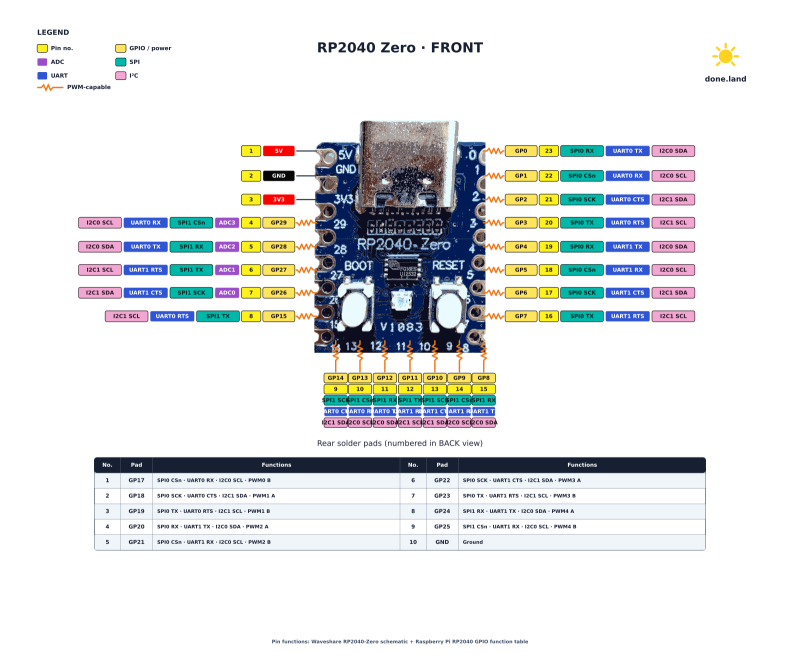
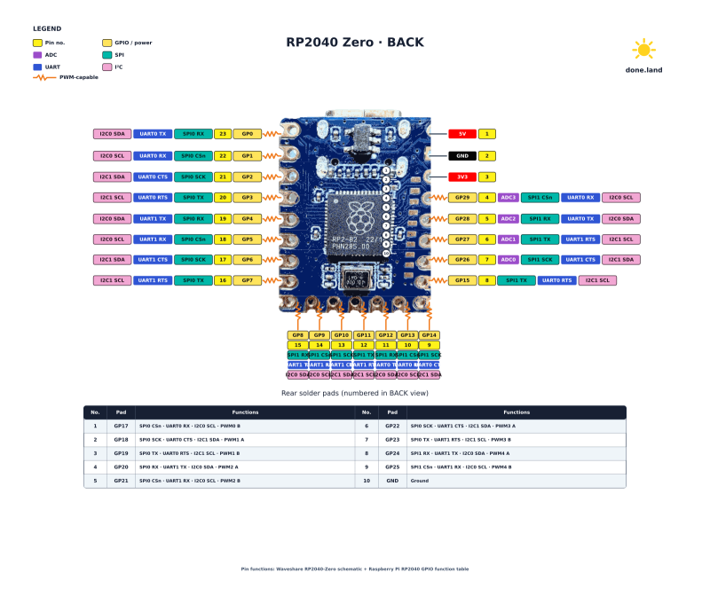

 
# RP2040

> Dual Cortex-M0+ at 133 MHz, no radio, excellent PIO, very deterministic GPIO timing.  

RP2040 is Raspberry Pi’s inexpensive dual-core ARM Cortex-M0+ microcontroller, running up to 133 MHz, with 264 kB SRAM, external QSPI flash, USB, ADC, SPI/I²C/UART/PWM, and its distinctive programmable PIO blocks. It powers the original Raspberry Pi Pico and many third-party boards.




The RP2040 is a great middle ground between classic Arduinos and ESP32s: it offers much more speed, RAM, and flexible I/O than typical Arduino MCUs, while remaining simpler, cheaper, more deterministic, and lower-overhead than an ESP32 when you don’t need Wi-Fi or Bluetooth.





## Overview

The RP2040 is a very affordable general-purpose microcontroller, and you can get complete breakout boards often for less than €2 at places like AliExpress. 


[](materials/rp2040_zero_pin_diagram_front.svg)

[](materials/rp2040_zero_pin_diagram_back.svg)

### Drag&Drop Firmware Upload
Beginners like the easy flashing procedure: when plugged into USB-C, RP2040 boards act like a USB drive, and to re-flash the firmware, simply drag the new firmware file into this USB drive.


The RP2040 also has distinct technical features that make it much more suitable for certain tasks than many more expensive and much faster microcontrollers (like ESP32-S3).

### Memory
The RP2040 has 264 KB of on-chip SRAM and no internal flash.  

Program storage is provided by an external QSPI flash chip, typically 2 MB on the Raspberry Pi Pico, though boards can use larger flash devices. It also has 16 KB of ROM containing boot code and utility routines.

### Programmable I/O
The RP2040’s standout advantage is its unusually deterministic and programmable I/O subsystem: its two PIO (Programmable I/O) blocks, with 8 independent **state machines**, can sample or generate GPIO signals cycle-by-cycle with precise timing, shift bits into FIFOs, and stream them via DMA with almost no CPU involvement. 

That makes it exceptionally good for things like I²C/SPI/UART sniffing, protocol decoding, logic-analyzer-style capture, unusual serial protocols, pulse measurement, waveform generation, and multiple simultaneous buses.

Compared with an ESP32-S3, the RP2040 can actually be better for low-level signal work despite its much slower CPU: an ESP32-S3 has far more processing power, but much of its I/O is handled by fixed-function peripherals, interrupts, caches, and an RTOS environment, whereas PIO behaves almost like a tiny dedicated hardware engine attached directly to the pins, giving highly predictable timing independent of what the main CPUs are doing.

### Speed
The RP2040 has two Cortex-M0+ cores at 133 MHz. Here is a very rough comparison with other popular mcirocontrollers in a similar price range:

* **Arduino:**   
  Compared with a typical Arduino, it is dramatically faster, has much more RAM, dual cores, DMA, and vastly more capable I/O.   
* **ESP32-S2:**    
  Single Xtensa LX7-class core at up to 240 MHz, Wi-Fi, much stronger general CPU performance than RP2040.    
* **ESP32-C3:**     
  Single RISC-V core at up to 160 MHz, Wi-Fi + Bluetooth LE, generally faster per core than RP2040 for normal code.
* **ESP32-S3:**    
  Much faster as a general-purpose CPU with its **two** Xtensa LX7 cores at up to 240 MHz, with a more capable instruction set and hardware optimized for DSP/vector-style workloads. For computation, networking, image processing, larger UI work, etc., the ESP32-S3 wins by a wide margin.

### Conclusion
RP2040 is an excellent choice for general-purpose automation as long as you can live with its memory constraints and the lack of built-in radio.

Where RP2040 really shines are signal analysis and related tasks. Assume for example you want to create an I²C analyzer to sniff on I²C transactions on an unknown device.

With RP2040, a PIO state machine can simply watch SDA/SCL edges, detect START/STOP conditions, sample bits at exactly the required points, and push captured data into RAM through DMA while the CPUs are free to decode or display it. 

This combination of cheap MCU + deterministic PIO + DMA + dual cores is probably the RP2040's most distinctive advantage over both classic Arduinos and much faster ESP32-class chips.

## Platform.IO
Here is the `platformio.ini` for my generic RP2040 Zero Clone board:

````
[platformio]
default_envs = rp2040_zero

[env:rp2040_zero]
platform = https://github.com/maxgerhardt/platform-raspberrypi.git
board = waveshare_rp2040_zero
framework = arduino
monitor_speed = 115200
upload_protocol = mbed  # automatically upload firmware via USB mass storage device
````

### RGB LED
The RP2040 Zero board comes with an on-board WS2812 RGB LED attached to `GPIO 16`. To use it, use any WS2812-compatible library.

## Uploading Firmware

There are two ways of uploading new firmware to a RP2040 board: either drag a compiled binary `UF2` file onto the USB drive that the board opens once it is plugged into the PC. Or let platformio do this automatically.

### Dragging UF2 File
This is the most reliable way. Once you compiled (built) your source code in platformio, identify the binary `UF2` file. It can be found inside your project folder in this relative folder: `.pio/build/rp2040_zero/firmware.uf2`.

Next, connect the RP2040 board to the USB port of your PC. A new USB drive should appear. If it does not open automatically, hold button `BOOT` and short-press `RESET` to open it. Then, drag the `firmware.uf2` file onto this drive. The folder window closes, the RP2040 reboots and now runs the new firmware.

### Automatic Upload
To have platformio automatically upload a new firmware, add this to platformio.ini under `[env:rp2040_zero]`:

````
upload_protocol = mbed
````

Then put the RP2040-Zero into bootloader mode by plugging it into the PC's USB-C so the USB drive appears, and click *Upload* again in platformio. PlatformIO should copy the UF2 to the mounted drive instead of using picotool.

> [!NOTE]
> The automatic upload isn't as robust as the manual drag&drop. If platform.io cannot recognize the board, try and invoke bootselect mode by holing the button `BOOT`, then shortly pressing the button `RESET`. If this doesn't help, switch to the manual drag&drop approach.


> Tags: Raspberry Pi, RP2040, State Machine

[Visit Page on Website](https://done.land/components/microcontroller/families/raspberry/rp2040?956455101205262617) - created 2026-10-04 - last edited 2026-10-04
