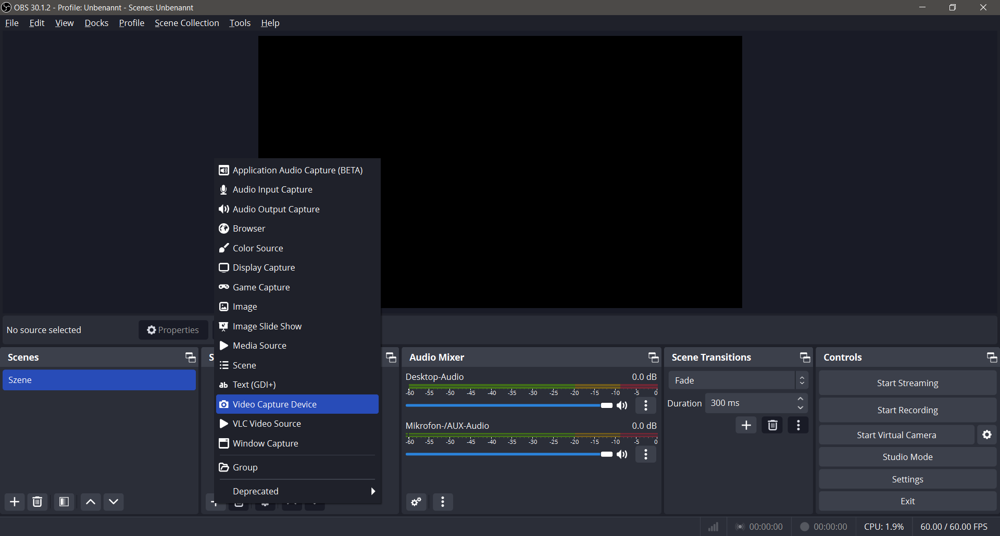
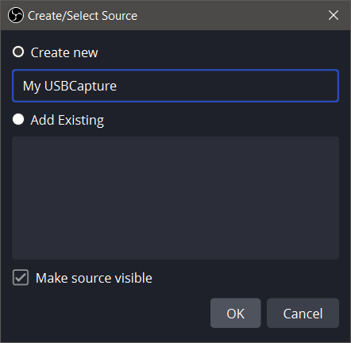
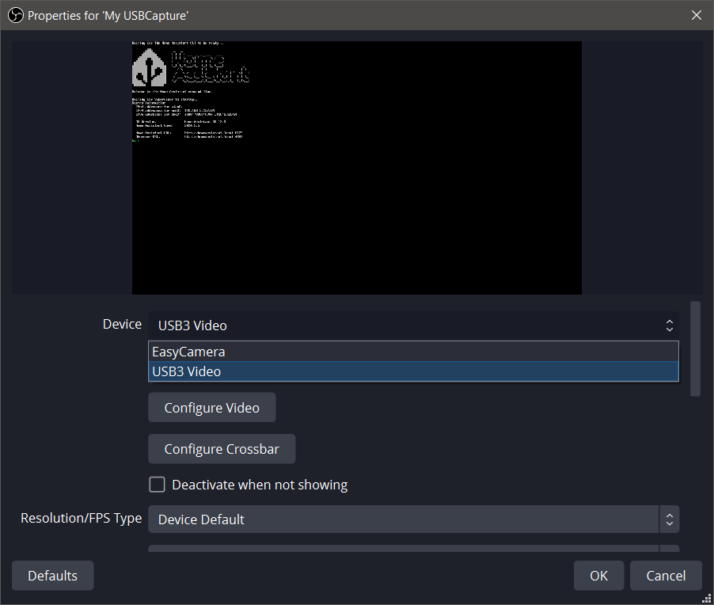
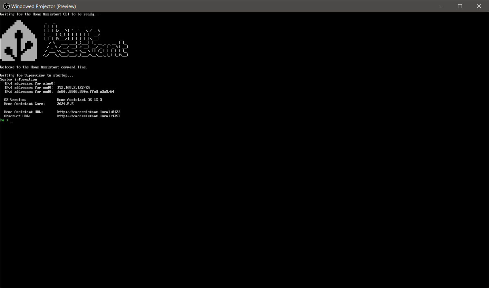
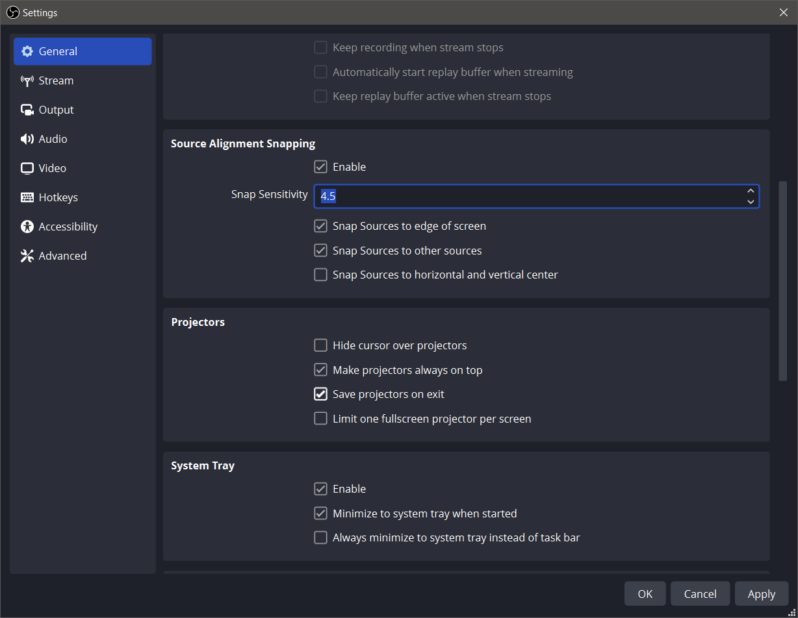
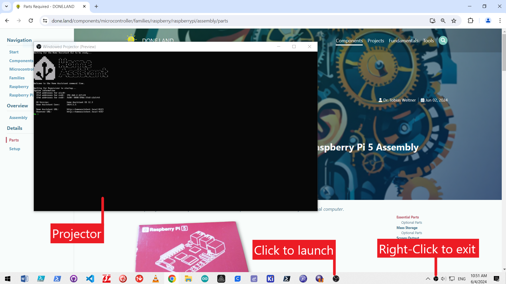
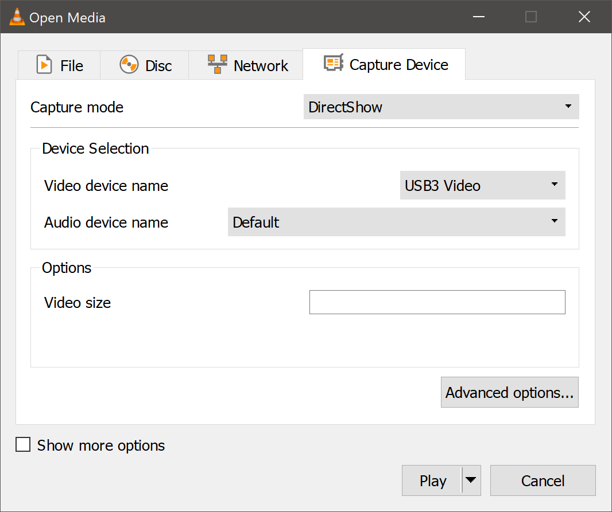
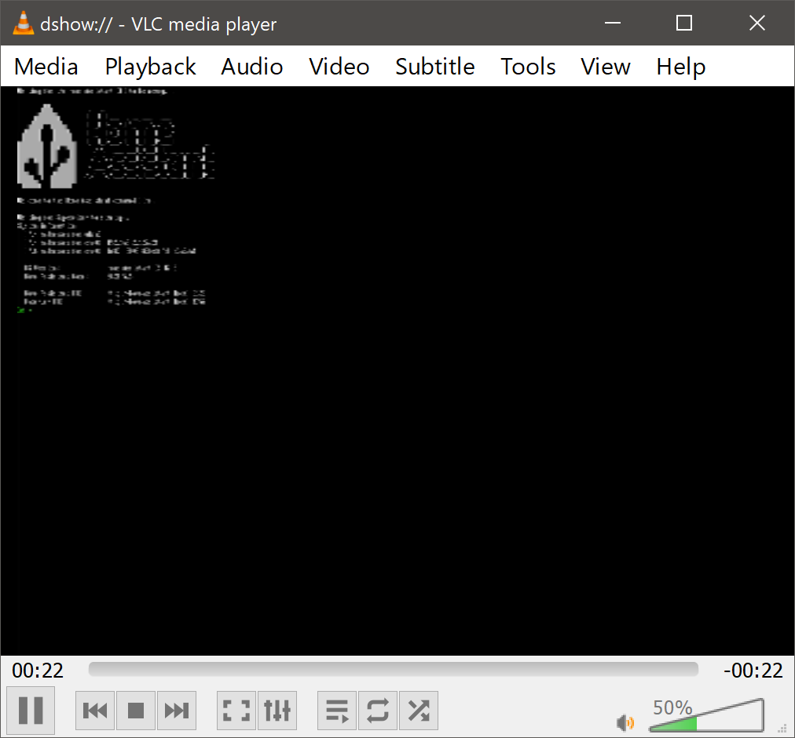
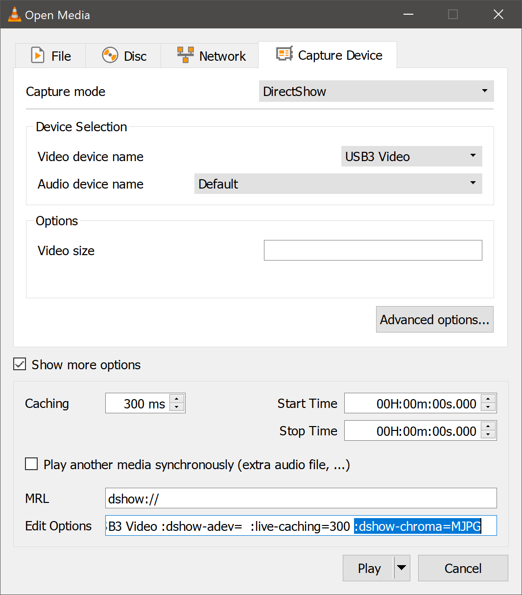
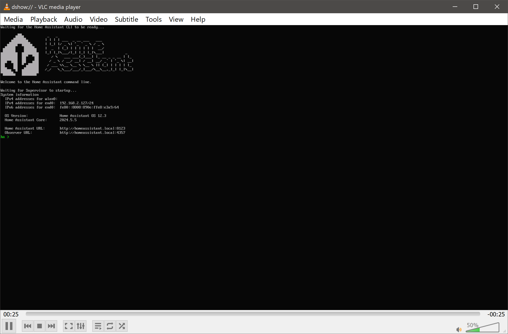

 
# Adding Display

> Showing The Local Raspberry Pi Screen As PiP Window

In *automation scenarios*, the *Raspberry Pi* is typically managed *remotely* via *Web Interfaces* and the browser. There are valid reasons though why it makes sense to hook up the *local HDMI outputs*, too.

## Overview
Like any other computer, the *Raspberry Pi* has *Micro HDMI* connectors for up to *two computer displays*. This way, you can work *locally* (directly) with the *Raspberry* and see its direct output. Here are some reasons why you would want to do this:

* **Use As Regular Computer:** *Raspberry Pi* is a full-fledged computer and can run *Debian* distributions or even a *graphical user interface*. If you want to use it this way, you need *displays*.
* **Bug Fixing:** A *Web Interface* requires that you can actually *connect* to the *Raspberry*. If you need to know its currently assigned *IP address* in order to connect, or if anything else is amiss, a *display* helps because it does not rely on remote connections.
* **Advanced Configuration:** most fundamental configuration tasks (i.e. setting or changing the *boot loader order*) can only be done locally, in which case you need a display and a *USB keyboard*.

### Regular Computer Display
If you opt to connect a *regular computer display*, then there is not much special to know. All you need is a *Micro USB HDMI cable*, or better yet *two* of them for both *Micro HDMI* connectors.


Plug the *Micro HDMI* end of it into one of the *Raspberry Pi HDMI connectors*, and the other end with the regular-sized *HDMI plug* into any *computer display* or *TV set* of your choice.

> [!TIP]
> Using a *HDMI Switch Box* is the simplest option: when needed, simply switch the *Raspberry HDMI output* to your regular *computer display*.


## Virtual Displays
If you need the *Raspberry Pi Display* only *occasionally*, or you want to keep an eye on it while working with your normal computer, then get a simple *USB HDMI Grabber*.


Connect the *HDMI cable* to the *Grabber connector*, and plug in the *USB adapter* into your computer. Use an *adapter plug* to convert *USB-C* and *USB-A* when needed.

> [!CAUTION]
> The *grabber* needs to be connected to a high speed *USB port*. Typically it suffices to plug it *directly into one of the computer USB ports*. If you use external *USB switches*, some are low quality: when the grabber is plugged in here, it will be discovered and installed but does not produce a picture.   


Now you just need *software* to show the screen output delivered by the *USB HDMI Grabber*. There are a couple of free options that work well.

### OBS Studio
[OBS Studio](https://obsproject.com/) is an open-source *streaming* and *recording* solution available for *Windows*, *macOS*, and *Linux*.

After download and install, the software asks whether you *record only* or also plan to *stream*. Choose *record only* (unless you do want to use *OBS** for other purposes, too).

Next, add a new *video source*, and choose *Video Capture Device*:



A dialog opens. Choose *Create new*, and assign a name to it:



Once you choose your *USB HDMI Grabber* in the *Device* combo box, you already start to see the *Raspberry Pi Screen* in the upper part. Click *OK*




By *right-clicking* into the screen, choose *Windowed Projector (Preview)*. This opens a separate monitor window (a so-called *Projector*) showing only the *Raspberry Pi Screen Cast*:



Right-click the *OBS* icon in the taskbar and *Pin it to Taskbar* (on *Windows*) so you can later easily open *OBS* when you need it.

#### Strip Down
Since you do not need the *feature-packed OBS* studio UI, click *Settings* in its lower right area. This opens the *Settings* dialog.

Scroll down to the section *Projectors*, and *enable* these options:

* **Make projectors always on top:** makes sure the *screen window* is never obscured by other windows.
* **Save projectors on exit:** re-opens all *projector windows* that were open when you exited *OBS*. So next time you open *OBS*, it automatically opens your *projector window* again. Just make sure there was indeed a *projector window* open when you exit *OBS*: never close the *projector window* when you are done. Always close the *OBS Studio* window instead.

In the next section *System Tray*, enable this option:

* **Minimize to system tray when started:** when you launch *OBS*, the main *studio UI* is not visible. Instead, *OBS* places just an icon into the *system tray* area of the *OS taskbar*. 




Then click *OK*.

#### Test Drive
Make sure you opened a *Projector Window* as illustrated above, and it is showing the *Raspberry Pi Screen*. 

Now close the *OBS studio* window (do *not* close the *projector window*; it will be closed automatically).

When you now click the pinned *OBS* icon in your taskbar, *OBS* starts quietly, and you only get the *projector window* with the *Raspberry Pi screen cast*.





### VLC Media Player
You can also use the popular [VLC Media Player](https://www.videolan.org/vlc/) to connect to the *USB HDMI grabber*.


> [!TIP]
> Before you proceed: *VLC* has caused significant *CPU load* in my experiments. It works great to have a quick peek but it is not recommended as a *computer display* replacement for longer use.     

Launch *VLC*, then choose *Media*/*Open Capture Device*. This opens a dialog. In *video device name*, select the name of the *USB HDMI grabber* you use, then click *Play*.



#### Fixing Low Resolution
*VLC* immediately displays the *Raspberry Pi* screen, however the resolution may be extremely poor. 

This is the consequence of using a *cheap HDMI grabber* that is not able to support *USB3* standards (even if it claims to):



To fix this, go back to *Media*/*Open Capture Device*, and check *Show more options*. At the bottom, you now see a textbox labeled *Edit Options* with default options: ` :dshow-vdev=USB2 Video :dshow-adev=  :live-caching=300`.




*Add* these options to the end of the line, and click *Play*:

````
:dshow-chroma=MJPG  :dshow-aspect-ratio=16:9
````

Now the display looks good and is using the original resolution and aspect ratio.




#### Creating Shortcut
You can launch *VLC* with all required setting via this command line:

````
"C:\Program Files\VideoLAN\VLC\vlc.exe" dshow://  ":dshow-vdev=USB3 Video" :dshow-adev=  :live-caching=300 :dshow-chroma=MJPG  :dshow-aspect-ratio=16:9
````

Make sure you *adjust* the path where you store *vlc.exe*. Also make sure to **change the video source name** from *USB3 Video* to whatever name your *grabber* uses. **Important:** this setting *must be quoted* if the *grabber name* contains spaces or other special characters.


> [!CAUTION]
> When using *VLC* this way, unfortunately you may now hear your computer fan spin up frequently. *Task manager* reveals: *VLC* is hogging one CPU core. It's ok to have an occasional peek at the *Raspberry Pi screen* but won't work well for continuous use. This is the downside of using the *MJPEG* mode. Using a *grabber* with better hardware acceleration can fix this. Or use the *OBS Studio* solution shown first. It handles the video processing superbly without noticeable strain on the CPU.


> Tags: Raspberry Pi, Display, Grabber, OBS Studio, VLC, PiP, Resolution, Capture Device, Video Capture

[Visit Page on Website](https://done.land/components/microcontroller/families/raspberry/raspberrypi/assembly/addingdisplay?762622061104240629) - created 2024-06-03 - last edited 2024-06-03
