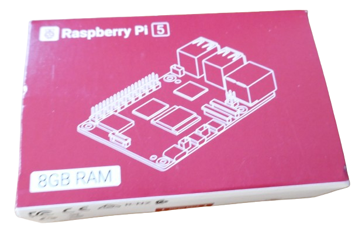
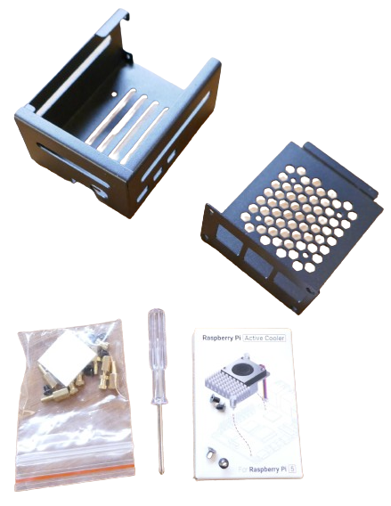
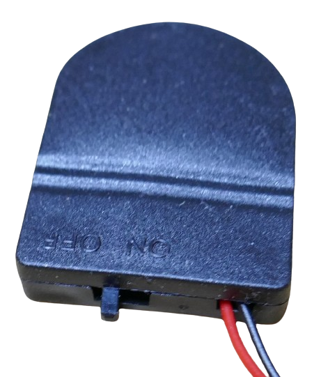

 
# Parts Required

> Essential And Optional Components For Raspberry Pi 5 Assembly

The *Raspberry Pi 5* board requires a few external components to turn it into a fully functional *computer*.

## Essential Parts
Here is the list of *essential* parts you need to assemble a *Raspberry Pi 5*:

* **Raspberry Pi 5 Board:** Available with *4GB* and *8GB RAM*. If you have the choice, always opt for *8GB*.   
* **Housing:** Metal housing specifically dimensioned to host a *Raspberry Pi 5* including *a mounted shield*. **IMPORTANT:** there are official *housings* available that come bundled with the official *cooler board*. If you cannot get such a bundle, you need to purchase the *cooler board* separately.

* **Official Raspberry Pi 5 Cooler Board:** Shield that can easily be plugged onto the motherboard and provides a *heat sink* and an *active cooler fan*. It comes with a plug that easily interfaces with the motherboard. Sold bundled with a *housing*, and *separately*. 

* **Power Adapter:** *Raspberry Pi 5* is powered via *USB C*. Any *USB C* power adapter will do, provided it can output at least *30W*. You do not necessarily need to purchase the (often overpriced) original *Raspberry* power supply if you have a suitable *USB C* power supply already at hand.

### Optional Parts
While not required, here is an optional component I recommend to add to your shopping list:

* **RTC Clock Battery Case:** While *Raspberry Pi 5* comes with a built-in *real-time clock*, an *external battery case* is required to keep *time and date* when the power is turned off. A *Raspberry Pi 5* battery case takes a *CR2032 button cell* and plugs directly into the *Raspberry Pi 5* board.

## Mass Storage
The *Raspberry Pi 5* obviously needs at least *one mass storage device* from where it can load *software* and *store information*.

While you technically *can* run a *Raspberry Pi 5* from an *SD Card* (it comes with a fast *Micro-SD Card reader*), this is *not* recommended if you plan to do anything *serious* with it. 

The recommendation is to add a *SSD drive* (*solid state drive*) which isn't costly and provides abundant and fast storage:

* **SSD M.2 Shield:** *Hat* that fits the motherboard and can host a *SSD mass storage drive* (*Solid State Disk*).

* **M.2 PCIe NVMe SSD Drive:** Serves as the primary mass storage device. In the example below, I am using a *256GB SSD*. **IMPORTANT:** SSD drive must be *Key-M* or *Key-B&M*. A SSD in **Key-B does not fit** the shield.

### Optional Parts
In addition to the *SSD drive*, you may want to also add this:

* **M.2-to-USB Adapter:** Takes a *M.2 SSD Drive* and connects it to *USB*. This way, the *SSD* can be plugged into any *USB port* on your computer and appears there are a generic *USB drive*. This way, you can easily download and preload software on the *SSD* before mounting it to the *Raspberry Pi 5*.

* **Micro-SD Card:** an optional *32GB Micro-SD Card* is useful as *primary partition* to configure *boot load order settings* in case you want to load different *OS* or *software* when booting. 

## Screen Output
When you use the *Raspberry Pi 5* as a *home automation server*, i.e. by running *HomeAssistant*, you do not need any screen output device: you interact remotely via *network* and *browser*.

However, if you *do* want to use the *Raspberry Pi 5* directly from a *command line*, or add additional software such as a *graphical OS*, or if things *do not work at first attempt*, and you need a way to *debug* things, then a *screen* directly attached to the *Raspberry Pi 5* becomes essential.

### Connecting Displays

The *Raspberry Pi 5* features *two HDMI outputs*. Since these are *Micro HDMI plugs*, and most computer displays and TV sets require *regular HDMI plugs*, here is what you should get:

While you can always hook up one or two *computer displays* (or TV sets), this requires

* **Micro-HDMI Cable:** Connects to one of the *HDMI outputs* and enables you to connect the *Raspberry Pi* to a *display*. This is not necessarily needed if you use *Raspberry Pi* solely as a *HomeAssistant* server because all configuration is done via remote *browser interfaces*. However, the cable is still recommended so you can *debug* issues directly at the *Raspberry Pi*. 

### Using Virtual Display
If you need to access the *Raspberry Pi 5 display* only *occasionally*, i.e. for *debugging* or *configuration*, you may want to get this component as well:

* **USB HDMI Grabber:** Unless you are planning to hook up the *Raspberry Pi 5* to a *dedicated computer monitor* or operate it entirely *remotely*, a cheap *USB HDMI Grabber Stick* is a great alternative for anyone who *occasionally* needs access to the *Raspberry Pi 5 Screen Output*: the *Raspberry Pi 5* screen opens in a window on your "real" computer screen. Added benefit: you can now *record* any screen content as well.

> Tags: Raspberry Pi, Assembly, Parts

[Visit Page on Website](https://done.land/components/microcontroller/families/raspberry/raspberrypi/assembly/parts?468278061603242831) - created 2024-05-30 - last edited 2024-06-02
