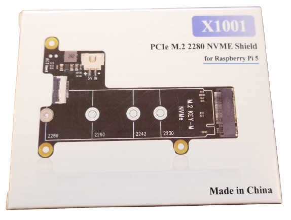

 
# Selecting OS 

> Preparing SSD Drive And Preloading Desired Operating System

A *Raspberry Pi* needs an operating system to run. However, there is no need to find downloads and spend hours installing it. 

Thanks to the *Raspberry Imager* tool, you simply select the *operating system* of your choice, and specify a drive to install it on.

> [!TIP]
> Aside from *classic* operating systems, you can also install *specialized* operating systems such as *Home Assistant OS*.

## Selecting Drive Type
*Raspberry Pi* can use almost *any* drive to boot from. Here are two popular choices:

* **SSD:** A solid-state disk drive is a great choice to install an operating system on. *SSDs* are cheap, very fast, and provide almost unlimited storage.
* **SD-Card:** *SD-Cards* are also cheap and provide fairly large storage capacities, however they are *much slower* than *SSD*. They can still be a great option for installing environments that you may need only temporarily.

The steps below are identical for both drive types.

### Temporary USB Access For SSD
If you opt for a *SSD*, you need a way to temporarily mount the *SSD* so you can use it like a *USB drive*.

That's required because when you transfer the operating system to the drive, you are going to use a regular *PC* or *Apple computer*. So you need a way to temporarily access the *SSD* from it. Plugging it into the computer as a *USB drive* is the easiest way.

> [!NOTE]
> For *SD-Cards*, you just need a *SD Card Reader*. Many computers have them built-in (search for an appropriate slot). Else, get yourself a cheap *USB SD Card reader*.

The image shows how the pins of the *SSD drive* align with the pins of the *USB adapter*:

To *mount* the *SSD drive* to the adapter, firmly press the *SSD drive* towards the contacts on the adapter. Always make sure the pins align.

Once the *SSD drive pins* snap into place, do not be surprised to see the *SSD drive* tilt upwards.

Gently move the *SSD drive* downwards until the screw holes at the end of both *SSD drive* and *adapter* align. Fix them with the screw that came with the adapter.

## Preparing Drive
Since this *Raspberry Pi 5* is intended to become a *HomeAssistant server*, next you should download and install all necessary software on the *SSD drive*. This is done on your regular PC.

For this you need your *SSD drive* and the *USB adapter*. 

#### Raspberry Pi Imager
The actual pre-loading is done by [Raspberry Pi Imager](https://www.raspberrypi.com/software/). The tool is available for *Windows*, *macOS*, and *Ubuntu*.

Once you installed and opened *Raspberry Pi Imager*, you can choose what software you want to preload onto the *SSD drive*.

#### Picking Operating System

Since *Raspberry Pi 5* is going to be *HomeAssistant server* in this example, the choices are *Raspberry Pi 5*, *Home Assistant OS*, and the storage device that represents the mounted *SSD drive*.

> [!TIP]
> To select *Home Assistant* as *Operating System*, click on the combo box and select *Other specific-purpose OS*, then *Home assistants and home automation*, and finally *Home Assistant*, and the version you want.

Once you click *Next*, you see a number of warnings that all data on the selected storage device will be deleted. Once you proceed, the tool starts to write the requested image to disk.

Once this is done, *unmount* the *SSD drive* from the *USB adapter*.

## Adding SSD To Raspberry

To add the *SSD drive* to the *Raspberry Pi, you need the *M.2 Shield for Raspberry Pi* which looks fairly similar to the *USB adapter* you just used. The board is slightly bigger and has *three* mounting holes.

> [!CAUTION]
> When you unpack the *shield*, make sure you identify a *small ribbon cable* that comes with it. 

### Mounting Ribbon Cable
In a first step, connect the *ribbon cable* to the *shield*. The connector on the shield has a plastic lock that can be turned up (*unlock*) and down (*lock*).

Turn it *up*, then place one side of the *ribbon cable* into the connector, and secure the cable by turning the plastic lock *down*.

Next, place the *SSD drive* with its *contacts* into the matching connector, and push it in. This procedure is *identical* to previously mounting the *SSD drive* to the *USB adapter*.

In fact, the *SSD drive* will again tilt upwards until you push it gently down and secure its end with a screw.

### Mounting Spacer Bolts

In order to mount the *M.2 Shield* to the *Raspberry Pi 5*, you need to first add *three spacer bolts* to the board. The bolts come with the *metal housing*. One of the mounting holes remains untouched for now:

> [!TIP]
> Do not use the black screws to secure the bolts to the board. Use the smaller bolts that came with the *metal housing*. They serve as *feet* and are required to later mount the board to the metal housing.

### Mounting M.2 Shield
Now you can place the *M.2 Shield* on top of the *spacer bolts* and screw it to the *Raspberry Pi 5*.

The final step is connecting the *ribbon cable* to the connector on the *Raspberry Pi 5* board. This is a bit fiddly but the connector works similar to the other one and has a plastic lock. *Pull it up* to *unlock* the connector, and *press it back into place* to secure the cable.

> Tags: Raspberry Pi, Drive, SSD, SD Card, Operating System, Imager, Installation

[Visit Page on Website](https://done.land/components/microcontroller/families/raspberry/raspberrypi/assembly/selectingos?301263071808242445) - created 2024-05-31 - last edited 2024-07-07
