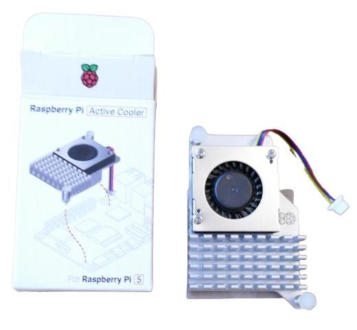
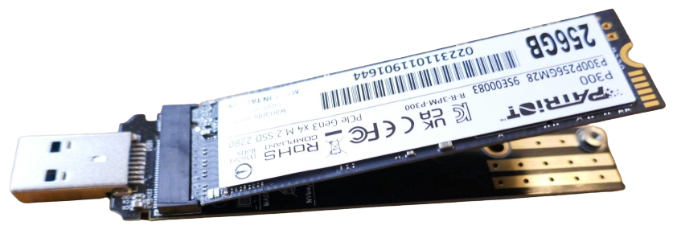
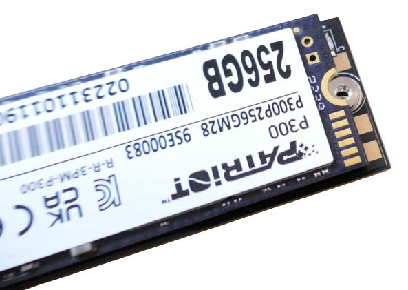
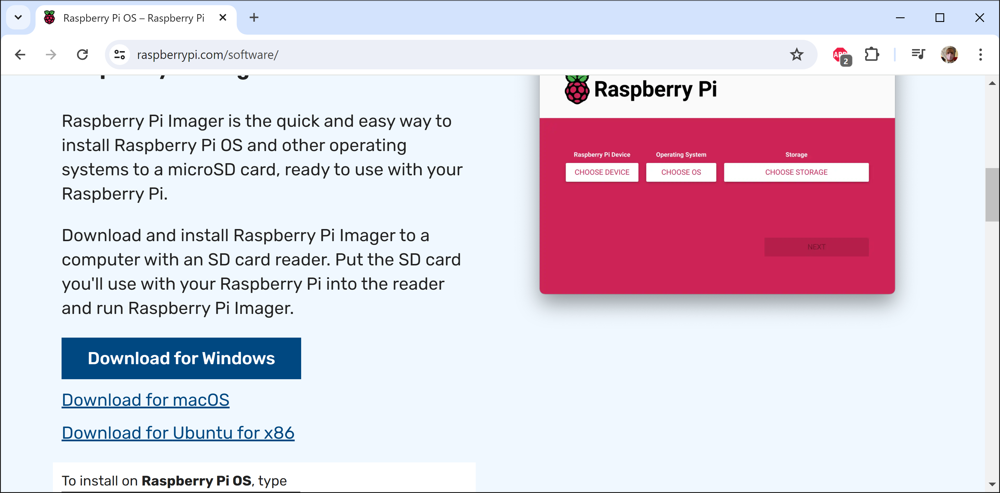
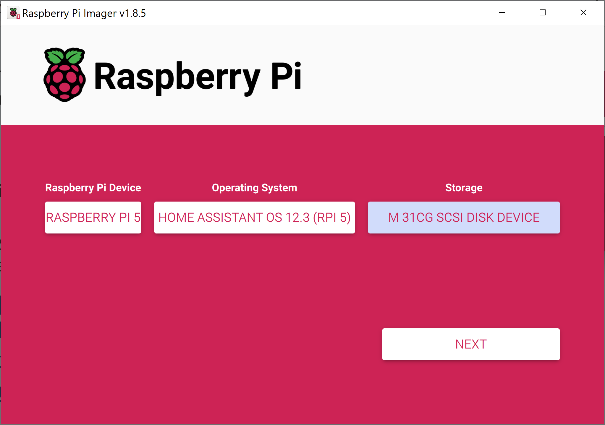
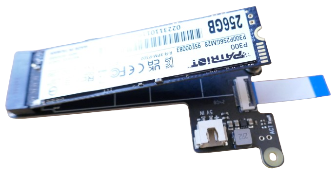
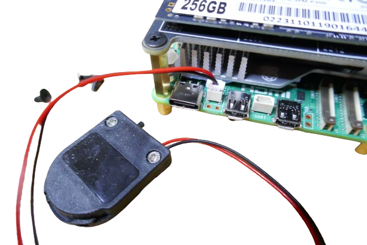

 
# Assembling Raspberry Pi 5

> Step By Step Guide To Assemble A Raspberry Pi 5

Assembling a *Raspberry Pi 5* is a matter of just 10 minutes. Here are the steps required.

## Mounting Active Cooler
For this you need the *Raspberry Pi 5 board* and the *Raspberry Pi 5 Active Cooler* kit:

### Two Mounting Holes

First, identify the two mounting holes on the *Raspberry Pi 5* board. The *active cooler* fan has two *snap-connectors* that fit tightly into these holes.

Also indentify the major components on the board that emit heat and need cooling: the *processor*, the *I/O controller*, the *memory*, and the *power management chip*.

### Thermal Adhesive

On the back side of the *active cooler*, *thermal adhesive* can be seen. Peel off the cover, then place the fan onto the board so that the spring-loaded pins fit into the two mounting holes.

> [!TIP]
> Do not confuse the *two* mounting holes with the *four* holes that are used to mount a *hat* (extension board). You may want to *practice* first and get a good understanding how the *fan* needs to be positioned before you peel off the adhesive cover and *firmly* press the pins into the mounting holes until they snap into place.    

Next, connect the plug from the *active cooler* to the connector on the board - done.

## Preparing SSD
Since this *Raspberry Pi 5* is intended to become a *HomeAssistant server*, next you should download and install all necessary software on the *SSD drive*. This is done on your regular PC.

For this you need your *SSD drive* and the *USB adapter*. 

### Temporary Mount as USB Drive

By mounting your *SSD drive* to a *USB adapter*, you turn it into a *USB drive* that can be plugged into any computer. This way, you can *preload* the necessary files.

The image shows how the pins of the *SSD drive* align with the pins of the *USB adapter*:

To *mount* the *SSD drive* to the adapter, firmly press the *SSD drive* towards the contacts on the adapter. Always make sure the pins align.

Once the *SSD drive pins* snap into place, do not be surprised to see the *SSD drive* tilt upwards.

Gently move the *SSD drive* downwards until the screw holes at the end of both *SSD drive* and *adapter* align. Fix them with the screw that came with the adapter.

### Preloading Software

To *preload software* onto the *SSD drive*, plug it into your PC. Thanks to the *USB adapter* that you mounted the *SSD drive* on, it should appear as a regular *USB drive*.

The actual pre-loading is done by [Raspberry Pi Imager](https://www.raspberrypi.com/software/). The tool is available for *Windows*, *macOS*, and *Ubuntu*.

Once you installed and opened *Raspberry Pi Imager* as *Administrator*, you can choose what software you want to preload onto the *SSD drive*.

Since *Raspberry Pi 5* is going to be *HomeAssistant server* in this example, the choices are *Raspberry Pi 5*, *Home Assistant OS*, and the storage device that represents the mounted *SSD drive*.

> [!TIP]
> To select *Home Assistant* as *Operating System*, click on the combo box and select *Other specific-purpose OS*, then *Home assistants and home automation*, and finally *Home Assistant*, and the version you want.

Once you click *Next*, you see a number of warnings that all data on the selected storage device will be deleted. Once you proceed, the tool starts to write the requested image to disk.

Once this is done, *unmount* the *SSD drive* from the *USB adapter*.

## Adding SSD To Raspberry

To add the *SSD drive* to the *Raspberry Pi, you need the *M.2 Shield for Raspberry Pi* which looks fairly similar to the *USB adapter* you just used. The board is slightly bigger and has *three* mounting holes.

> [!CAUTION]
> When you unpack the *shield*, make sure you identify a *small ribbon cable* that comes with it. 

### Mounting Ribbon Cable
In a first step, connect the *ribbon cable* to the *shield*. The connector on the shield has a plastic lock that can be turned up (*unlock*) and down (*lock*).

Turn it *up*, then place one side of the *ribbon cable* into the connector, and secure the cable by turning the plastic lock *down*.

Next, place the *SSD drive* with its *contacts* into the matching connector, and push it in. This procedure is *identical* to previously mounting the *SSD drive* to the *USB adapter*.

In fact, the *SSD drive* will again tilt upwards until you push it gently down and secure its end with a screw.

### Mounting Spacer Bolts

In order to mount the *M.2 Shield* to the *Raspberry Pi 5*, you need to first add *three spacer bolts* to the board. The bolts come with the *metal housing*. One of the mounting holes remains untouched for now:

> [!TIP]
> Do not use the black screws to secure the bolts to the board. Use the smaller bolts that came with the *metal housing*. They serve as *feet* and are required to later mount the board to the metal housing.

### Mounting M.2 Shield
Now you can place the *M.2 Shield* on top of the *spacer bolts* and screw it to the *Raspberry Pi 5*.

The final step is connecting the *ribbon cable* to the connector on the *Raspberry Pi 5* board. This is a bit fiddly but the connector works similar to the other one and has a plastic lock. *Pull it up* to *unlock* the connector, and *press it back into place* to secure the cable.

## Adding RTC Battery
If you got yourself an external *battery case* to power the *RTC* (*real time clock*), make sure you push the small switch to the *on* position.

Open the case, and insert a *CR2032* button cell. Next, plug it into the designated connector on the *Raspberry Pi 5 board*.

## Housing
Finally, get the *metal housing parts* ready.

Insert the assembled *Raspberry Pi 5* into the main housing component with the network connectors facing to its open side.

Screw it to the metal housing using the *larger* four screws.

If you added an *external battery case*, use double-sided tape to fix it to the ethernet jack. Make sure the battery case is not blocking the ventilation.

Slide in the top cover, and use the *smaller* four screws to screw it to the larger part of the housing - done.

## Connecting Wires
To test-drive the *Raspberry Pi*, you need a *network cable* and a *USB C* power supply capable of at least *30W*.

Connect the network cable to the network jack, and connect the power supply to the *USB C* connector.

Once you power on the *Raspberry Pi*, you see *LED lights* blinking as the *SSD drive* is accessed by the *Raspberry Pi 5*.

> [!TIP]
> If you don't like being blind-folded, connect the *Micro HDMI cable* to the display connector right next to the *USB C* connector, and connect the cable to a *computer display*. This was you can see what the *Raspberry Pi 5* is doing.

Let the device work for a few minutes: it is automatically booting from your *SSD drive* and installing the software that you *preloaded* before. This part can take up to 10 minutes to complete.

In the end, *Home Assistant* should be up and running. If you have connected a *computer display*, it tells you the assigned IP address:

You do not need to know this IP address to access *Home Assistant* through a web browser. Open a browser, and enter `homeassistant.local.8123`.

> Tags: Raspberry Pi, Assembly, Active Cooler, Fan,

[Visit Page on Website](https://done.land/components/microcontroller/families/raspberry/raspberrypi/assembly/setup?341188060004241323) - created 2024-06-03 - last edited 2024-06-03
