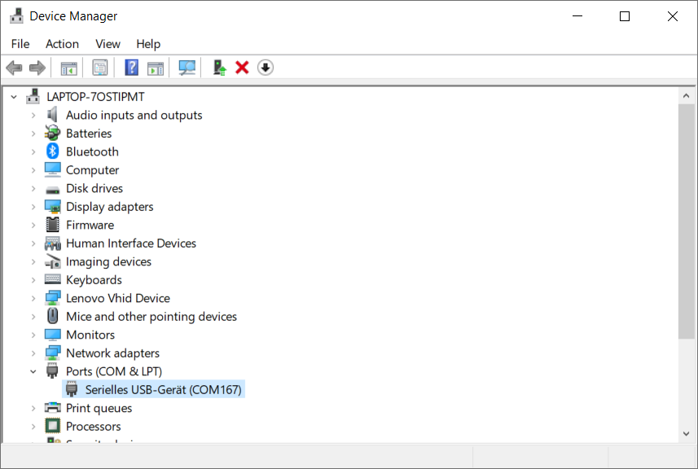
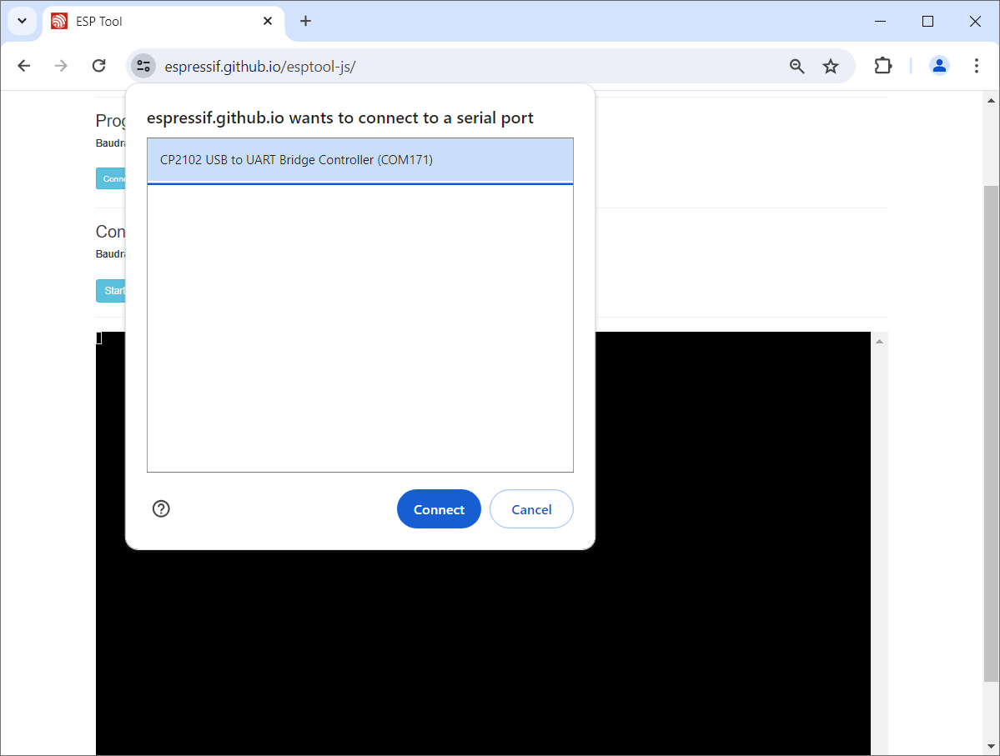
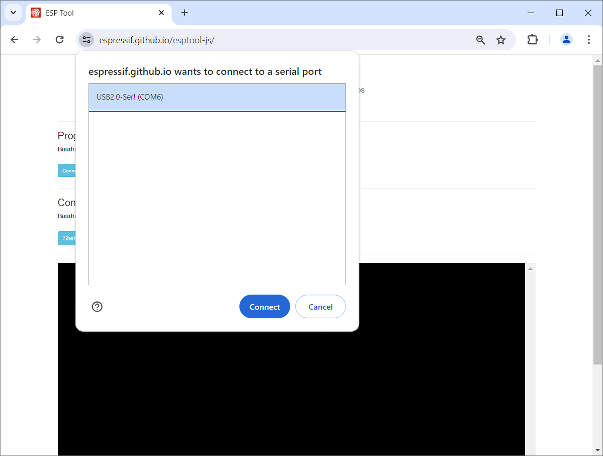

# Bootloader

> Builtin Service Interface Available In Every Microcontroller

The *COM port* that surfaced in *Device Manager* once you [connected a *development board* to an *USB port*](https://done.land/components/microcontroller/firststeps/connecttopc/#connecting-to-computer) of your computer is used to *communicate* with the microcontroller:

* **Terminal Window:** during normal operation, your microcontroller could for example send sensor information or other data to a terminal window on your PC
* **Firmware Upload:** in *boot loader* mode, your PC can send new *firmware* to your microcontroller to reprogram it.

## Overview
Every *microcontroller* has built-in code: the [boot loader](https://done.land/components/microcontroller/firststeps/introduction/#boot-loader) that was covered before. In this article, we have a closer look at how the *boot loader* mode is invoked, and how you can upload new firmware.

### Bootloader Mode

If you'd like to manage the microcontroller, i.e. *query its hardware specs* or *upload new firmware*, it needs to be *switched to boot loader mode*.

> [!TIP]
> In *boot loader mode*, you not only can upload new firmware. You can also query your microcontroller and i.e. find out how much flash ram is installed. 

### Switching To Bootloader Mode
When it is time to upload new firmware or query its status, you want the microcontroller to *stop executing its normal firmware* and  *start executing the boot loader code*. This is called *switching to bootloader mode*.

Many microcontroller boards switch *automatically* once a few special signals are sent to the serial interface. This way, *IDEs* that are ready to upload new firmware can trigger a microcontroller *reset* and then have it automatically start in *bootloader mode*. If this  *automatic bootloader switch* does not work, your *IDE* starts complaining about *connection errors*. 

> [!TIP]
> If automatic boot loader switching does not work, it typically is caused by your development board. The development board must implement automatic switching.  

You can always invoke *bootloader mode* manually. That's what the two buttons are for that can be found on most *development boards*:

1. Keep the button *Boot* pressed.
2. Press the *Reset* button and release it (while keepin *Boot* pressed)
3. Release *Boot*

<details><summary>How invoking the boot loader works behind the scenes</summary><br/>

The buttons soldered to a *ESP32 development board* are just for convenience:

* *Boot* is connected to *GPIO0* and pulls it *low*. *GPIO0* has an internal pullup resistor, so if it is left unconnected then it will pull high. 
* *Reset* is wired to the pin *Rst* and pulls it *high*, invoking a *reset*. 

When *GPIO0* is *low* during *reset* (either by holding the button *Boot* or by connecting it to *GND*), the *ESP32* will enter the serial bootloader. Otherwise it runs the program in flash.

Other *microcontrollers* behave similarly (though the implentation differs).

</details>

## Test-Driving the Bootloader
*Anyone* can talk to a boot loader. You just need to know its *protocol* (its sequence of signals that it uses for serial communication).

For *ESPxxx* microprocessors, its manufacturer *Espressif* has released two tools that can talk to any *ESPxxx* microprocessor (including *ESP8266*):

* [esptool](https://docs.espressif.com/projects/esptool/en/latest/esp32/installation.html): A *Python* script that is used internally by all *IDEs* to upload firmware to an *ESPxxxx* microcontroller. Requires extensive install but provides the full set of functionality.
* [esptool-js](https://espressif.github.io/esptool-js/): A *JavaScript*-based port of the tool that runs in a *Chrome* browser and uses *WebSerial* to connect to your *USB* port. Requires no install but has only limited functionality. It can essentially upload new firmware, plus it reports the most important microcontroller specs (like its *type* and *memory size*).

> [!CAUTION]
> The *JavaScript*-based version *esptool-js* uses *WebSerial* and requires a *Chrome* or *Edge* browser.

### Testing Hardware Specs
Identifying the actual type and size of the flash RAM is a useful scenario. This way, you can easily verify that the seller has in fact shipped the kind of microcontrollers you have ordered. Let's see how you can use the *EspTool* to figure out this information.


I am starting the example with a [ESP32 C3 SuperMini](https://done.land/components/microcontroller/families/esp/esp32/developmentboards/esp32-c3/c3supermini/) and then repeat the procedure with a [ESP32 DevKitC V4](https://done.land/components/microcontroller/families/esp/esp32/developmentboards/esp32s/esp32devkitcv4/), and finally with a [ESP32-S2 Mini](https://done.land/components/microcontroller/families/esp/esp32/developmentboards/esp32-s2/s2mini/). 

Pay close attention how the general procedure is the same, but how these microcontroller models and boards differ in subtle details. This helps you understand why some boards are very easy to use, while other boards can cause a lot of headaches.

The general principles illustrated below are same that occur in your *IDE* (or any similar tool) when you are trying to upload new firmware. The examples will illustrate the two most severe issues you can run into:

* **Manual Invocation of Boot Loader Mode:** some development boards cannot automatically switch to boot loader mode, and you'll see the errors this can cause, and what to do about it.
* **Bad Native USB Implementation:** modern microcontrollers no longer need *UART* chips and support USB natively, however there are different USB standards they support. You'll see how some standards work just fine (like with the *ESP32-C3* or *ESP32-S3*), while others can cause a lot of issues and workarounds (*ESP32-S2*).

#### Web Interface
Let's start with the web-based version of *EspTool* which requires no installation, just a *Chrome* browser:

1. Connect your development board to your PC using a USB cable. A new COM Port surfaces. In my case, it was numbered *167*, but this number may vary. **Remember the name of the COM port, i.e. COM167**. You will need it later.

    

2. Open [esptool-js](https://espressif.github.io/esptool-js/) in a *Chrome* browser and click *Console*.  *esptool-js* connects fine.

    

3. You should now see a few hardware details:

    

3. Click *Stop*, then click *Program* to enter the much more capable *Programmer*:

    

At this point, you can already specify a local binary *firmware image* to upload, or *clear the flash memory* as these two functionalities of *ESPTool* are hard-wired into the JavaScript.

#### Using ESPTool Locally
To access additional commands (i.e. query hardware details), you need to run *EspTool* locally yourself:

1. First *release* a *COM port* used inside *Chrome*, you need to click the symbol with the *two sliders* at the left side of the *address bar*.

    

2. This opens a menu with all active connections and blocked resources. Click on the *x* icon right of the *USB connection* you want to release, then click inside the browser window. It shows a ribbon asking to reload the page. Now the *USB resource* is unassigned again, and other tools can use it.

3. Open a terminal window (i.e. *PowerShell*) where you can access your local *ESPTool binary*, and issue the command below **using the exact COM port name that you figured out in device manager**:


    ````
    PS> esptool --port COM167 flash_id
    esptool.py v4.7.0
    Serial port COM167
    Connecting...
    Detecting chip type... ESP32-C3
    Chip is ESP32-C3 (QFN32) (revision v0.4)
    Features: WiFi, BLE, Embedded Flash 4MB (XMC)
    Crystal is 40MHz
    MAC: 70:04:1d:31:10:54
    Uploading stub...
    Running stub...
    Stub running...
    Manufacturer: 20
    Device: 4016
    Detected flash size: 4MB
    Hard resetting via RTS pin...
    ````

### Manual Invocation of Boot Loader Required
Let's repeat the steps for a [classic ESP32](https://done.land/components/microcontroller/families/esp/esp32/developmentboards/esp32s/esp32devkitcv4/) board. As you will see, the overall behavior is the same, but there are *subtle differences*.

On first connect, *Device Manager* shows a new COM Port 171. The name indicates the *USB-to-Serial* chip used: a Silicon Labs CP210x:


*esptool-js Console* connects fine.



It shows some hardware details that are pretty much useless though:


Click *Stop*, then *Program*, to enter the much more capable *programmer*. 

The *programmer* immediately starts working, however it is *waiting for something* and meanwhile outputting ````Connecting.........._______......._______......._______......._______````. 

As it turns out, this board does not *automatically* switch to *boot loader mode*. Only when *boot loader mode* is invoked *manually* by *holding **Boot** while pressing **Reset*** will it connect:


Once the *COM port* is released on the *esptool-js* webpage (as described above), the local *esptool* can access the *ESP32* and display its hardware information. 

> [!CAUTION]
> Just like before with *esptool-js*, the microcontroller needs to again be *manually switched to boot loader mode*


````
PS> esptool --port COM171 flash_id
esptool.py v4.7.0
Serial port COM171
Connecting...............
Detecting chip type... Unsupported detection protocol, switching and trying again...
Connecting....
Detecting chip type... ESP32
Chip is ESP32-D0WD-V3 (revision v3.0)
Features: WiFi, BT, Dual Core, 240MHz, VRef calibration in efuse, Coding Scheme None
Crystal is 40MHz
MAC: b0:a7:32:f1:a2:d4
Uploading stub...
Running stub...
Stub running...
Manufacturer: 5e
Device: 4016
Detected flash size: 4MB
Hard resetting via RTS pin...
````

### ESP8266
Now let's try and test an old *ESP8266*. When connecting it to *USB*, *Device Manager* assigns *COM6*, and the *USB-to-Serial* chip used by this board is a *CH340*.


*esptool-js Console* connects fine.



However it shows strange output and is effectively unusable:


Click *Stop*, then *Program*, to enter the much more capable *programmer*. 

The *programmer* works well:


Once the *COM port* is released on the *esptool-js* webpage (as described above), the local *esptool* can access the *ESP8266* and display its hardware information.


````
PS> esptool --port COM6 flash_id
esptool.py v4.7.0
Serial port COM6
Connecting....
Detecting chip type... Unsupported detection protocol, switching and trying again...
Connecting....
Detecting chip type... ESP8266
Chip is ESP8266EX
Features: WiFi
Crystal is 26MHz
MAC: 08:3a:8d:cc:dd:a9
Uploading stub...
Running stub...
Stub running...
Manufacturer: 5e
Device: 4016
Detected flash size: 4MB
Hard resetting via RTS pin...
````

### Modern Microcontrollers With Built-In USB Support
Modern *ESP boards* do not need a dedicated *USB-to-Serial* chip anymore. They can *understand USB directly*, however there are different standards they support.

* **USBCDC:** the microcontroller is implementing the *USB port* in software using software libraries like [TinyUSB](https://docs.tinyusb.org/en/latest/). This is what a *S2* does.
* **HWCDC:** the *USB functionality* is implemented in *hardware*.
* **JTAG over USB:** to make matters more complex, some microcontrollers (i.e. *C3*) support *JTAG over USB* which can also access the boot loader.

In the example above, using a *ESP32-C3* caused no headaches; the [Supermini](https://done.land/components/microcontroller/families/esp/esp32/developmentboards/esp32-c3/c3supermini/) connected flawlessly to the *EspTool*. That's because this chip uses the *HWCDC* mode, just like the *ESP32-S3*.

### ESP32-S2 / USBCDC Causes Problems

The *ESP32-S2* works differently and serves as an example how built-in USB support is not always great. It can cause severe headaches when the *USBCDC* mode is used.

These microcontrollers actually expose **two COM ports**:

* **TinyUSB:** when in normal mode while being connected to the PC, the COM port is labeled *TinyUSB*. This COM port can be used from your firmware, i.e. send sensor information to a terminal window.
* **Additional COM Port:** when the boot loader is invoked - either manually or automatically by the *EspTool* - it opens a second COM port with a different number. This is the COM port that is managing the microcontroller and needs to be used for firmware uploads.

Because of this strange behavior, *ESP32-S2* can initially be extremely hard to use. Frequently, the *IDE* (or similar tools) fail to address the correct COM port, and thus cannot upload new firmware.

There are [clever strategies to work around this](https://done.land/tools/software/esphome/introduction/manualprovisioning/) and install new firmware on *ESP32-S2*. If you'd like to see the strange behavior in more detail, I provided a walkthrough with screen shots in the expandable section below:


<details><summary>How ESP32-S2 Exposes Two COM Ports And Causes Chaos</summary><br/>
To illustrate the special behavior of *ESP32-S2*, take a look at how the [ESP32-S2 Mini](https://done.land/components/microcontroller/families/esp/esp32/developmentboards/esp32-s2/s2mini/) works:

1. Connect it to your PC using a USB cable. On first connect, *Device Manager* shows a new COM Port 77:

    

2. In *esptool-js*, it appears as *TinyUSB*:

    

3. When you try and connect via *Console*, simply *nothing happens*. When you click *Stop* and *Program* to enter the *programmer*, an *error* is reported:

    

4. Watch device manager closely. The error triggers a reconfiguration of *COM Ports*. The *microcontroller* is now assigned to *COM 76*, and a new *Other Device* named *ESP32-S2* appears.

    

5. Click *Disconnect* and *Connect* to connect again to the *programmer*. This time, it reports a *ESP32-S2* on *COM76*:

    

When you try and access the microcontroller via the *local esptool*, and *Device Manager* after you connected it to *esptool-js*, this fails with a *permission issue* after which the *COM Port* vanishes from *Device Manager*:


````
PS> esptool --port COM76 flash_id
esptool.py v4.7.0
Serial port COM76
Connecting...

A serial exception error occurred: Cannot configure port, something went wrong. Original message: PermissionError(13, 'A device attached to the system is not functioning.', None, 31)
Note: This error originates from pySerial. It is likely not a problem with esptool, but with the hardware connection or drivers.
For troubleshooting steps visit: https://docs.espressif.com/projects/esptool/en/latest/troubleshooting.html
````
You need to manually *disconnect* the *S2* from the *USB port*, wait a few seconds, then connect it again. *Device Manager* now again shows a *generic serial device* on a COM port.


Trying to connect to this port yields an error, similarly to the initial connection request with *esptool-js*:


````
PS> esptool --port COM77 flash_id
esptool.py v4.7.0
Serial port COM77
Connecting...

A serial exception error occurred: Cannot configure port, something went wrong. Original message: PermissionError(13, 'A device attached to the system is not functioning.', None, 31)
Note: This error originates from pySerial. It is likely not a problem with esptool, but with the hardware connection or drivers.
For troubleshooting steps visit: https://docs.espressif.com/projects/esptool/en/latest/troubleshooting.html
````

Now again, the *COM Port* assignments in *Device Manager* magically change:


Trying again with *COM76* works as expected:

````
PS> esptool --port COM76 flash_id
esptool.py v4.7.0
Serial port COM76
Connecting...
Detecting chip type... Unsupported detection protocol, switching and trying again...
Detecting chip type... ESP32-S2
Chip is ESP32-S2FNR2 (revision v1.0)
Features: WiFi, Embedded Flash 4MB, Embedded PSRAM 2MB, ADC and temperature sensor calibration in BLK2 of efuse V2
Crystal is 40MHz
MAC: 80:65:99:fc:f4:d0
Uploading stub...
Running stub...
Stub running...
Manufacturer: 20
Device: 4016
Detected flash size: 4MB
Flash type set in eFuse: quad (4 data lines)
Hard resetting via RTS pin...
```` 
After the tool emitted its information, the *microcontroller* again vanishes from *Device Manager*.


</details>


> Tags: Microcontroller, USB, esptool, esptool-js, JTA, HWCDC, USBCDC, Flash Size, ESP32, C3, S2, ESP8266

[Visit Page on Website](https://done.land/components/microcontroller/firststeps/bootloader?553361051225241424) - created 2024-05-06 - last edited 2025-01-04
