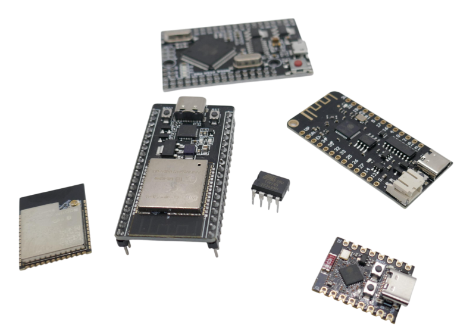
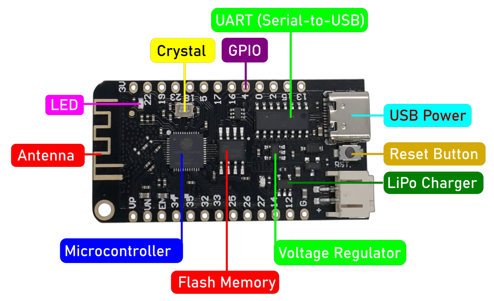

 
# Introduction

> Understanding Microcontrollers, Terminology, And Common Components

Let's start by clarifying some basic *terminology* and shedding light on fundamental *components*. This way, we will all be on the same page.

## Microcontroller

A *microcontroller* is essentially just another *chip*. From the outside, it doesn't look much different from other chips. Depending on the *complexity* of the microcontroller, the chip might come in various forms: a regular *DIP8* package, a large, flat, sophisticated *SMD* package, a shielded PCB, or it could be embedded on a PCB alongside a variety of related components. This latter setup is referred to as a *development board*.

On the left, the picture shows an *ESP32* [microcontroller module](https://done.land/components/microcontroller/firststeps/introduction/#microcontroller-modules), which is part of the [development board](https://done.land/components/microcontroller/firststeps/introduction/#development-board) to its right.

In the middle, you can see an [ATTiny](https://done.land/components/microcontroller/families/attiny/) microcontroller in a *DIP* package. It resembles other simple ICs, like operational amplifiers or logic gates. The remaining items are various other *development boards*, each with a large, flat black chip at their core: their microcontroller.

> [!NOTE]
> The largest development board with the largest microcontroller (at the back of the picture) is also the slowest, most power-hungry, the oldest design, and the most expensive of all: an *[Arduino](https://done.land/components/microcontroller/families/arduino/) Mega* with an *Atmel* microcontroller. So size doesn't always matter.

### External Components

For a *microcontroller* to function, it requires a few *external components*:

Only *some* boards come with battery support and include a *LiPo* charger, like the [Lolin32 Lite](https://done.land/components/microcontroller/families/esp/esp32/developmentboards/esp32s/lolin32lite/) in the picture. Most of the other components can be found on every development board: 

- **Crystal:** A *crystal* provides a stable *clock signal* unless it is a *very simple microcontroller* running at low clock speeds, such as an *ATtiny* that uses an *internal oscillator* instead.
- **Voltage Regulator:** Since microcontrollers are sensitive to *voltage* and can be damaged if too high a voltage is supplied, a *voltage regulator* ensures that the required voltage is delivered.
- **Capacitors:** *Decoupling capacitors* are placed close to the power pins of the microcontroller to filter out noise and stabilize the power supply.
- **Reset Circuitry:** A *button* and a *pull-up resistor* are needed to ensure that the *reset pin* is *disabled* unless the button is pressed.

Typically, you won't work with bare microcontroller chips. Most users opt for development boards instead, which include all the required external components, allowing you to start using the microcontroller immediately.

### Microcontroller Modules

To simplify development, companies like *Espressif* ship their microcontrollers as *modules* that come with most of the required *external components* pre-installed.

These *modules* often include:
- A *crystal* for clocking.
- *Flash memory* for program storage.
- An *antenna* or *antenna jack* (if the microcontroller is WiFi-enabled).
- Sometimes, a *metal cap* that shields RF interference.

Since these modules already integrate most of the required external components, designing development boards becomes significantly easier. Typically, the development board just needs to add a *voltage regulator* and a *UART chip* for the USB connector. This simplicity is one reason why *ESP32* development boards are so affordable.

> [!TIP]
> You can use *ESP32 modules* in your DIY projects directly. Since they contain most of what is required to run the microcontroller, all you need is an external UART tool to upload your firmware and an external power supply with the required voltage (e.g., *3.3V*) or a *LiFePo4* battery cell. Using modules directly can be especially cost-effective and space-saving.

### Development Board

*Development boards* simplify the lives of *developers* and *hobbyists*. These are small *PCBs* that include *everything needed* to safely run a microcontroller *out-of-the-box*. They add the following to the microcontroller chip:

- **USB Connector:** Allows the microcontroller to connect to a computer (e.g., to upload new *firmware* or *communicate* with it).
- **USB-to-Serial Chip (UART):** Microcontrollers internally use a *two-wire serial interface* for communication. Since most modern computers lack *serial connectors* but have *USB ports*, a *USB-to-Serial Chip* translates *USB signals* into *serial signals*. Modern microcontrollers such as [ESP32-C3](https://done.land/components/microcontroller/families/esp/esp32/developmentboards/esp32-c3/) and [ESP32-S3](https://done.land/components/microcontroller/families/esp/esp32/developmentboards/esp32-s3/) directly support USB and do not need UART chips anymore.
- **Voltage Regulator:** Ensures the microcontroller is not damaged by an incorrect voltage. The valid input voltage depends on the type of *voltage regulator*. At minimum, it converts the *USB-delivered 5V* to the voltage the microcontroller requires.
- **Anti-Noise Components:** A variety of *capacitors* and other discrete components stabilize the voltage and minimize electrical *noise* on the lines.
- **Buttons:** Development boards often include a *Reset* button (connected to the microcontroller's *Reset* pin). Some boards also have a *Boot* button. On *ESP32* boards, holding the *Boot* button while resetting launches the internal *bootloader*.
- **LEDs:** Most development boards include a *power LED* (indicating when the board is powered via the internal *voltage regulator*) and a *user-programmable LED* connected to one of the *GPIOs*. This LED can be a simple *LED* or a *WS2812 programmable RGB LED* for status indication and user feedback. Some development boards, such as the *DevKitC V4*, do not include this feature.
- **Crystal:** If the microcontroller requires an *external crystal*, the development board supplies it to drive the *clock*.

### NodeMCU

Some *development boards* include the term *NodeMCU* in their name. On the *hardware side*, they are typical *development boards*. However, they come preloaded with special *firmware*. Here's what you need to know about *NodeMCU*:

- **ESPxxx Microcontroller:** *NodeMCU* development boards always use an *ESP8266* or one of the *ESP32* family microcontrollers because the bundled *firmware* is designed specifically for them.
- **eLUA Interpreter:** The preloaded firmware includes an *eLUA Interpreter*. By connecting to the board via *USB*, you can send *scripts* written in *LUA* to control the microcontroller, bypassing the need to create and upload custom firmware.

> [!NOTE]
> Many users are unaware that *NodeMCU development boards* come with bundled LUA firmware. They often overwrite this firmware with their own, treating *NodeMCU boards* as generic development boards.

## Power Supply

Microcontrollers require precise supply voltages and can easily be damaged if supplied with *too much voltage*. Most development boards include a *voltage regulator*, allowing flexibility while ensuring the microcontroller receives the correct voltage.

### Maximum Input Voltage

Most development boards can be powered via USB or a voltage range of *4.8–6.0V*. The built-in voltage regulator adjusts the voltage as needed. While older microcontrollers typically require *5V*, most modern ones use *3.3V* or less.

Some boards include voltage regulators capable of handling *12V* or even *15V* input. Always verify the safe input voltage range in the voltage regulator's datasheet if in doubt. 

Even if the regulator supports high input voltages, try to keep it close to *5V*. Linear regulators dissipate excess voltage as heat, causing unnecessary energy loss and heating the board.

> [!TIP]
> For higher input voltages, consider using a *buck* converter (step-down converter). These are more efficient and minimize energy loss.

### Power Supply Options

Here are the typical ways to supply power to a development board:

- **USB:** The easiest and safest method. Simply connect the board to a *5V USB power* source.
- **External 5V Power:** Connect a safe voltage directly to the *5V pin*. For example, an external *buck* converter can lower *12V* to *5V*, allowing the internal voltage regulator to ensure the correct voltage reaches the microcontroller.
- **3.3V Directly:** For *3.3V microcontrollers* like the *ESP32*, bypass the internal voltage regulator and connect a power source directly to the *3.3V pin*. This approach is efficient but risky, as you must ensure the supplied voltage is stable and within the acceptable range.
- **Li-Ion Battery:** Some boards support *Li-Ion* batteries, often including a dedicated connector for a single cell.
- **LiFePO₄ Battery:** These batteries are ideal for *3.3V microcontrollers* like the *ESP32*. With a nominal voltage of *3.2V* and an operating range of *2.5V–3.65V*, they can directly power the board efficiently. However, if a charger is used, its output voltage might exceed the safe range. Either charge the batteries separately or use a protection diode to cap the voltage at *3.6V*.

> [!IMPORTANT]
> Only use **one** power supply option at a time. Avoid connecting both USB and an external power source simultaneously.
## Memory
Most microcontrollers come with various types and sizes of *memory* built-in. 

### Flash Memory
The *flash memory* is the most important type of memory as it is the place where *code* can be stored. *Flash memory* is *non-volatile* (data stays intact when power is turned off) and works very similar to ordinary *SD Memory Cards*.

In *DIY*, microcontrollers today should have at least *4MB* Flash memory, or else they can only be used for very simple tasks and might not integrate well in *DIY Home Automation* solutions.

If you plan to use a large *display*, aim for more flash memory as large displays require a lot of screen memory, especially when showing animations or multi-page dialogs.

> [!TIP]
> Some vendors specify flash memory in the unit *MiB* (bits instead of bytes). Divide this value by *8*: a *32MiB* board really has just *4MB* of flash memory.

### PSRAM
*PSRAM* (*Pseudo Static Random Access Memory*) is a type of RAM that combines features of static RAM (SRAM) and dynamic RAM (DRAM) to offer a cost-effective, high-capacity memory solution.

*PSRAM* can be viewed as *super-fast flash RAM* that does not wear over time as flash ram does. It is ideal for applications that need to manipulate memory content frequently at high speeds, i.e. video or audio streaming, signal processing, graphics rendering, data buffering, etc.

Since *PSRAM* is not needed for the majority of DIY applications, only some microcontrollers support it:

| Microcontroller Family | Models that support PSRAM |
| --- | --- |
| ESP | [ESP32S WROVER](https://done.land/components/microcontroller/families/esp/esp32/developmentboards/esp32s/) (not **WROOM**), [ESP32-S2](https://done.land/components/microcontroller/families/esp/esp32/developmentboards/esp32-s2/), [ESP32-S3](https://done.land/components/microcontroller/families/esp/esp32/developmentboards/esp32-s3/) |
| Raspberry | *RP2040* (some models) |
| STMicroelectronics | *STM32F7*, *STM32H7*, *STM32L4+* |

> [!IMPORTANT]
> Note that the models listed typically *support external PSRAM*. It *may or may not* be present. Always check with the vendor whether a particular development board comes with *PSRAM* installed. *ESP32 WROVER* **always** comes with *PSRAM* whereas *ESP32 WROOM* **never** has *PSRAM*.     

## Firmware and Boot Loader
A microcontroller needs to know what it should do. There are actually **two** pieces of software in each microcontroller:

* **Firmware:** custom software (called **firmware**) which resides in non-volatile *Flash memory*. It can be uploaded and overwritten to re-program the microcontroller. When you power on the microcontroller, it automatically starts executing this code.
* **Bootloader:** built-in code that allows you to talk to it and upload new firmware. The boot loader is either safely stored in *ROM* (as in *ESP32*) or in a protected section of its *Flash memory* (as in most *Arduinos*).

> [!NOTE]
> When the boot loader code is stored in write-protected ROM (like with *ESP32*), it is protected and can never be damaged. When the boot loader code is stored in flash memory (like in many *Arduinos*), even though it is normally write-protected, when things go wrong it can be overwritten. When this occurs, the microcontroller is said to be *bricked* because it can no longer respond to the outside world and effectively rendered useless.     

### Invoking Boot Loader
By default, development boards run the custom *firmware code*. When you are ready to upload new firmware, the microcontroller must be instructed to switch to *boot loader* mode.

Well-designed development boards can switch *automatically* to boot loader mode when they detect that new firmware is to be uploaded. Less well-designed boards require manual user intervention.

The procedure to manually force a microcontroller to *boot loader mode* varies by type. For example, on *ESP32*-based microcontrollers, you need to *pull GPIO0 low* while *resetting* the microcontroller. 

For this, *ESP32 development boards* typically have two buttons:

* **BOOT:** when pressed, this button pulls GPIO0 low.
* **RESET/EN:** when pressed, the microcontroller performs a reset.

So the complete procedure to manually force a *ESP32* into boot loader mode is to keep *BOOT* pressed while shortly pressing *RESET/EN*.

> [!NOTE]
> Like mentioned, many boards do not require you to fiddle with these buttons as they contain logic to detect a pending firmware upload and then automatically perform the procedure just described. If you do need to switch the microcontroller manually into boot mode, **do not forget** to press *RESET/EN* (without holding *BOOT*) once the firmware upload has completed in order to switch back to normal mode and execute the newly uploaded firmware.    

## Clock
All *microcontrollers* internally use a *clock*. This is not a *regular clock* to tell the time but rather an *oscillator* with a certain frequency. The microcontroller executes one command at a time, and the *clock* sets the rate at which this occurs.

Some *microcontrollers* use an *internal oscillator* while others require an external *crystal* to ensure a stable clock frequency.

### Clock Speed
The clock speed sets the frequency at which a microcontroller executes commands, so it correlates to its execution speed, but also to its power consumption. 

That's why you can adjust the clock speed by your firmware. This can make sense for battery-operated devices where low energy consumption is a priority. It only makes sense for scenarios in which the microcontroller isn't busy most of the time (i.e. reading sensors in intervals). 

For computationally intense applications, lowering the clock speed to conserve energy does not make sense: at a lower clock speed, the microcontroller takes longer to execute a task, thus it can less frequently use power-efficient deep sleep periods.

## GPIOs (General Input Output)
A *GPIO* (*general-purpose input/output*) is a pin on a microcontroller that can be programmed to function as either an input or an output. When in *input* mode, it can read signals (i.e. *button states*) and often even voltages in a given range. In *output* mode, it works like a *switch* and can switch between *low* and *high* (i.e. to relais, lamps, transistors).

> [!NOTE]
> *GPIOs* can be switched *on* and *off* at very high frequency. This can be used as *PWM* (*pulse-width modulation*) to *dim LEDs* (using *PWM*), or to implement control protocols such as *I2C* or *SPI*. Control protocols can be used to transfer information to and from peripherals, i.e. to work with *displays* or *storage*, and works roughly like a high-speed morse code.

In a nutshell, the more *GPIOs* a microcontroller exposes the more peripherals can you control simultaneously.

> Tags: Microcontroller, Module, Crystal, Voltage Regulator, USB-to-Serial

[Visit Page on Website](https://done.land/components/microcontroller/firststeps/introduction?097890051627245006) - created 2024-05-01 - last edited 2025-01-04
