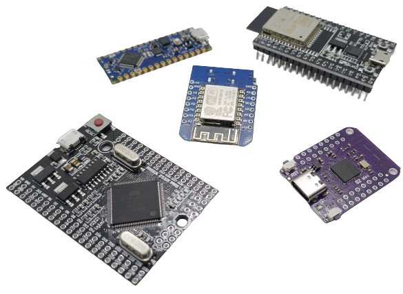
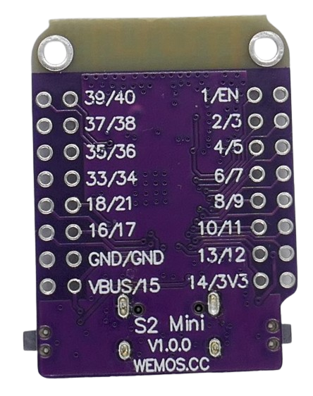
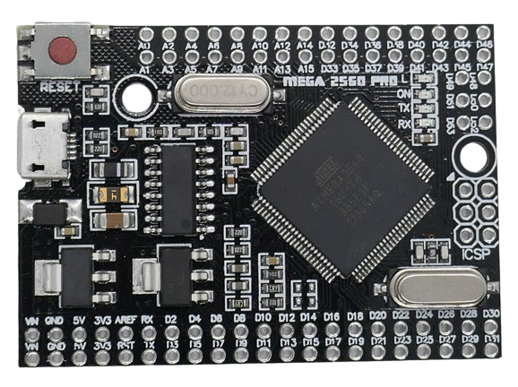
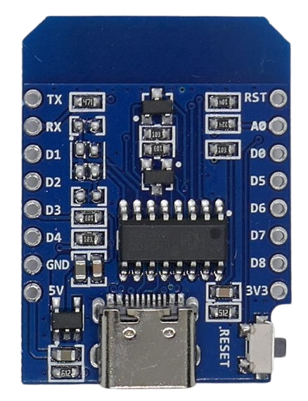
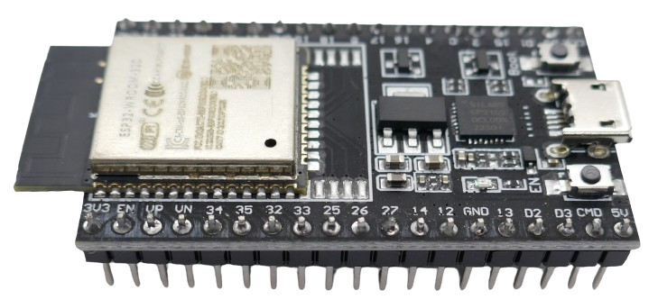

 
# GPIO

> General Purpose Input Output (GPIO)


*GPIO* (*General-Purpose Input/Output*) pins enable microcontrollers to interact with the external world. That's why *GPIOs* are among the most important microcontroller features.

The *number of available GPIOs* is an important consideration when selecting a particular microcontroller for a project.

The same applies to the *microcontroller board*: in most *DIY projects*, *microcontrollers* are not used directly. Instead, ready-to-use *microcontroller boards* come with a particular *microcontroller* plus its essential external components such as voltage regulator and boot buttons:



Both the *board* **and** the type of microcontroller determine *how many GPIOs* you will be able to use: some boards do not expose all available *GPIOs* and instead focus on a *small footprint*.

> [!NOTE]
> The trade-off is *size* versus *numer of GPIOs*: if you just need a few *GPIOs* in your project, then wasting a few *GPIOs* in exchange for a much smaller *board* makes sense.   


## Understanding Microcontroller Pins
The first thing to understand is that **not every header pin** exposed by a microcontroller board **is a GPIO**, and that not every *GPIO* **may be used by you**.

### Power Supply

Some pins handle *power*, so they are no *GPIOs* in the first place:

* **GND** connects to *ground*
* **3V3** provdes access to the *regulated voltage* that is also powering the microcontroller
* **VBUS/5V** provides access to the raw *input voltage*.




### Special Functions
Then there may be some specialty pins exposed, i.e. **EN**: which can be used to *reset* the microcontroller and also puts it in various *deep sleep* modes, or **RESET**, which provides a direct way of resetting the microcontroller.

### Reserved GPIOs

The remaining pins typically are all *GPIOs*, however you can *still* not just pick one of these remaining pins, and use it. 

Some of the exposed *GPIOs* may be used for *internal purposes*:

* **Strapping:** Some *GPIOs* may play a crucial role during *booting*. They can be used freely after booting but are off limits initially. When you use these *GPIOs* during booting, your microcontroller may not boot correctly anymore or expose unexpected behavior.
* **Flash:** Some microcontrollers use *external flash memory* (which is integrated into the microcontroller module but still not part of its silicon). Since this memory is treated like an external component, some *GPIOs* are required to communicate with it. These GPIOs are permanently off-limits for you.

> [!TIP]
> When you start wporking with a particular microcontroller board, one of the first things you should do is make yourself at home with its *safely usable GPIOs*.

## Pin Labels
Beginners are easily confused by *GPIO pin labels*: code may refer to *GPIOs* using labels that start with **D** (i.e. *D4*), or **A** (i.e. *A1*). Other code may address *GPIOs* by using raw numbers, or labels like **GPIO** plus a number (i.e. *4*, or *GPIO4*).

> [!IMPORTANT]
> The *numbers* are **not interchangeable**. **D4** and **GPIO4** are typically not the same thing. Often, **D4** refers to **GPIO2**.

* **Pure Numbers:** these designate the hardware pin numbers of a particular microcontroller
* **GPIOxx:** same as pure numbers. *GPIO4* and *4* both refer to pin **4** on a microcontroller
* **Dxx:** arbitrary definition by a *board manufacturer*. Your *IDE* (*programming editor*) must know the *microcontroller board* and the pin label translation to translate **Dxx** pin labels back to the hardware pin numbers at compile time.

Why is this? 

### Hardware-Neutral Code
The different pin label notations determine whether your code will be *hardware-neutral*, or whether your code is tied to a particular microcontroller type:

* **Hardware-Specific:** raw pin numbers are *hardware-specific* and apply only to a given *microcontroller type*. *GPIO4* or pin *4* would always refer to the same pin on any *ESP32 board*, but pin *4* could serve a completely different purpose on an *Arduino ATMega* board.
* **Hardware-Neutral:** **D***x* pin numbers are an *abstraction*: **D2** always refers to the *second usable digital gpio*, regardless of how a particular microcontroller board organizes its pins. This however requires that your *IDE knows the pin mapping* for the particular microcontroller and board you are using, and can translate the abstracted labels back to the real hardware pin numbers at compile time.

So when your code is using pin labels that start with **D** or **A**, the code is *hardware-neutral* and can be used with any microcontroller type. The price you pay for this is that your *IDE* must know your *microcontroller board*, and must be able to *translate* the abstract pin labels back to the real microcontroller pin numbers.

When your code is using specific pin numbers, it can only be compiled for the microcontroller type it was written for. Your *IDE* though no longer needs to translate labels to pin numbers.

## Historic Context On GPIO Labels

It may not be entirely up to you whether you use hardware-neutral pin labels like **D4**, or raw pin numbers like **2** or **GPIO2**: some board manufacturers stopped using the **D***x*- and **A***x*-notation altogether, so with these, you **must** use the hardware pin numbers.

### Less Capable Microcontrollers

Older (or less capable) microcontrollers like early *Arduinos* used dedicated *GPIOs* that weren't *general purpose* but instead *hard-wired*, and could be used *exclusively* in *digital* **or** in *analog* mode.


That's why *historically*, the early *Arduino boards* labeled its *GPIOs* with **D***x* (for *digital GPIOs*) and **A***x* (for *analog GPIOs*):




For users, this simplified a lot of things because it was clear on first sight which pins represented usable *GPIOs*, and what their capabilities were.

### Modern Microcontrollers

With modern *microcontrollers*, *GPIOs* truly became *general purpose* and could route any pins to *ADCs* and *DACs* as needed. Almost any *GPIO* could now be set to *input*, *outut*, *digital*, and *analog* mode, and digital interfaces like *I2C* and *SPI* weren't necessarily fixed to dedicated pins anymore, either.


The old pin notation was still often continued, i.e. the popular *ESP8266 D1 Mini* labels its pins **D***x* - even though these labels weren't accurate anymore since the pins could now also be used in *analog* mode:




### ESP32 And Hardware Pin Numbers
As microcontrollers became even more capable, some board designers started to dump the abstracted **D***x*- and **A***x*-labels altogether.

The *ESP32 S2 Mini* for example uses just its raw hardware pin numbers:


With the appropriate *board translation tables* in your *IDE*, your code could still remain *hardware-neutral*: since *GPIOs* were now truly *general purpose*, the hardware pin *4* could now be mapped to the abstracted pin label *D4* without issues.

Other board manufacturers started to *mix* labels: the *ESP32 DevKitC V4* uses the old **D***x* notation for some of its pins (to provide code compatibility) but uses raw numeric hardware pin numbers for the majority of its remaining *GPIOs*:



### Conclusion


If you are trying to use code examples written by someone else, look closely at how the code author has referenced its *GPIO pins*:

* **Numbers:** if the code is using *raw numbers* or labels like *GPIO**x***, then make sure the code was written for the same microcontroller type you are using. If the types differ, you may have to replace the numbers with valid *GPIO pin numbers* that are available on your microcontroller.
* **Dx Labels:** if the code is using pin labels like **D***x* and/or **A***x*, make sure your microcontroller board has defined these labels. If not, replace them with the hardware pin number of an available *GPIO* on your microcontroller board.

### Your Own Code 
If you're writing code just for yourself to be used privately in your own devices, then sticking to the hardware pin numbers of your microcontroller hardware is the easiest and most robust approach.

> [!TIP]
> In fact, some *ESP32 boards* such as the *ESP32 S2 Mini* do no yet seem to be fully supported by *Arduino IDE*/*platformio*: pin labels like **D2** aren't defined for these boards, and when you use them in your code, you run into compile errors.


If however you are planning to publicly share your code, or use it on different microcontroller platforms, you may want to use abstract *GPIO labels* - provided your microcontroller board has defined them.


## GPIO Modes

*GPIOs* are *general purpose*, so they can be used in *four different ways*:

| Mode | Use Case |
| --- | --- |
| Digital Output | can *source* and *sink* current. This is the most common type to *invoke an action*, i.e. to turn on an *LED*, and can be used to **send** *digital information* to devices like *displays* using digital interfaces such as *I2C* or *SPI*. |
| Digital Input | differentiates a *high* (*VCC*) from a *low* (*GND*) signal. This is the most common type used to interface buttons and other digital components, i.e. *rotary encoders*. It is also used to **receive** *digital data*. |
| Analog Input | senses a *voltage range*, for example the readings from an analog *sensor*, or a *potentiometer*. This mode requires the *GPIO* to internally route to an *ADC* (*Analog-Digital-Converter*), and the type of *ADC* determines the allowable input voltage range and the voltage resolution that the *GPIO* can distinguish. |
| Analog Output | can provide a variable output voltage, i.e. to produce *sounds* or modulate wave forms. This mode requires the *GPIO* to internally route to a *DAC* (*Digital-Analog-Converter*). The type of *DAC* determines the output voltage range and its resolution. |

Whether your microcontroller hardware actually supports all four modes for a given *GPIO* is a different question.

### Setting Mode
A *GPIO* can always only work in *one* of these modes, and the mode must be set in your code.

````c++
pinMode(4, OUTPUT);
pinMode(13, INPUT);
````

#### Digital Output: Blinking LED
Here is a simple example illustrating how a *LED* connected to *GPIO13* can blink. Make sure you add an appropriate current limiting resistor to the *LED* (i.e. 150 ohms):

````c++
void setup() {
  pinMode(13, OUTPUT); // Set digital pin 13 as an output
}

void loop() {
  digitalWrite(13, HIGH); // Turn on the LED connected to pin 13
  delay(1000);            // Wait for 1 second
  digitalWrite(13, LOW);  // Turn off the LED
  delay(1000);            // Wait for 1 second
}
````

#### Digital Input: Button Press
Here is an example using a *GPIO* as an input that can be connected to a momentary button in order to let a user invoke some action:

````c++
void setup() {
  pinMode(4, INPUT); // Set digital pin 4 as an input
}

void loop() {
  int buttonState = digitalRead(4); // Read the state of the button connected to pin 4
  if (buttonState == HIGH) {
    // Do something when the button is pressed
  }
}

````

#### Analog Input

To read *analog* input, simply use `analogRead()` instead of `digitalRead()`.

> [!IMPORTANT]
> Not every *GPIO* may be used to read *analog input* (*analog voltage ranges*): this requires the *GPIO* to be internally routed to a *ADC* (*Analog-Digital-Converter*). 
Modern microcontrollers support this for almost all *GPIOs* whereas older microcontrollers provide distinct *GPIOs* for this which are often labeled **A***x*.

````c++
void setup() {
  // // No need to set pinMode() for inputs, but you can for clarity
  pinMode(A0, INPUT);
}

void loop() {
  int sensorValue = analogRead(A0); // Read the value from analog pin A0
  // Do something with the sensor value
}
````

> [!IMPORTANT]
> Older microcontrollers like *ATMega* expose dedicated *analog input GPIOs* (typically labeled **A***x* on the boards) that do not support any other mode. That's why for such pins, no `pinMode()` needs to be set. Any truly *general purpose GPIO* that supports multiple modes **must be explicitly set** to either *input* or *output* mode using `pinMode()`.

## Pull-Up And Pull-Down Resistors
When a *GPIO* is used as **input**, you may run into an issue where the *GPIO* can have a *floating* (or *random*/*indetermine*) state.

Here is such a scenario:

When you connect a push button to a *GPIO*, and the user now presses the push button, all is good: the button connects the *GPIO* to whatever you wired it to, most typically either *VCC* (*high*) or *GND* (*low*). 

However when the user is **not pressing** the button, the *GPIO* is **not connected to anything**, and its state is *floating*: it can now have a *random value*, either *high* or *low*.

### Pulling Up Or Down
The solution to this dilemma is to add a way to set the *GPIO* to a *defined level* when not connected to anything else. For this, a *high impedance resistor* is connecting the *GPIO* to either *high* (*VCC*) or *low* (*GND*), essentially providing it with a *default value* that is used when no other signal is received.

Since this resistor has a *high impedance*, it can be easily *over-ruled* by any other signal, i.e. when the user presses the button and connects the *GPIO* to *VCC* or *GND* **directly** (without a high-impedance resistor).

* **Pull-Up Resistor:** *GPIO* gets a *high* value by default. A high-impedance resistor connects the *GPIO* to *VCC* so it is *high* unless you connect it to *GND*.
* **Pull-Down Resistor:** This works the other way around: connects the *GPIO* to *GND* via a high-impedance resistor. The *GPIO* is now *low* by default. Only when you connect it to *VCC* will it change to *high*.

In modern microcontrollers, *GPIOs* come with *built-in pullup- and pulldown-resistors* that can be enabled by code. *ESP32 microcontrollers* for example use internal *45kOhm* resistors.

#### Pull-Up (active low)

This code assumes that the push button is connected to *GND*. When the push button is **not pressed**, the *GPIO* has a defined *high* state. When the button is pressed, it connects the *GPIO* to *GND* and goes *low*. The *high impedance* of the pull-up resistor prevents a short-circuit:

````c++
void setup() {
  pinMode(4, INPUT_PULLUP); // Set digital pin 4 as an input with internal pull-up resistor
}

void loop() {
  int buttonState = digitalRead(4); // Read the state of the button
  if (buttonState == LOW) {
    // Do something when the button is pressed
  }
}

````

The *GPIO* is said to be *active low:* when it is considered to be *active* (the user is pressing the button), the *GPIO* is *low*.

#### Pull-Down (active high)

If you'd rather like to connect the push button to *VCC* (positive voltage), you need a *pull-down resistor* instead that ensures that the *GPIO* by default is *low*, and only switches to *high* when the push button is pressed and connecting the *GPIO* to *VCC*:


````c++
void setup() {
  pinMode(4, INPUT_PULLDOWN); // Set digital pin 4 as an input with internal pull-down resistor
}

void loop() {
  int buttonState = digitalRead(4); // Read the state of the button
  if (buttonState == HIGH) {
    // Do something when the button is pressed
  }
}

````

#### External Resistors
Built-in *pull-up* and *pull-down* resistors may not be available for every *GPIO* (visit your microcontroller datasheet). In this case, simply add an external resistor (*10-100kOhm*) to the *GPIO*, and connect it to *GND* (*pull-down*) or *VCC* (*pull-up*).


*GPIOs* may or may not have built-in *pull-up* and *pull-down* resistors that can be activated by code. If they are missing, add an *external* *pull-up* or *pull-down* resistor. *ESP32 microcontrollers* use *45kOhm* for their internal resistors. *10kOhm* resistors work just as well.

> [!TIP]
> *Pull-up* and *pull-down* resistors must be *high impedance* because you do not want to create a *short-circuit* when the *GPIO* is connected to *VCC* or *GND*. The lower the resistor, the faster can it set the pin state but the more current will it draw. Unless you are using special *high frequency* setups, a resistor value in the range of *10-100kOhm* seems like a good compromise. 


## Source And Sink
When a *GPIO* operates in *digital output* mode, it can *source* current, and it can *sink* current. Both terms basically descibe the *direction* of current flow.

### Sourcing Current (high active)
The most common type of circuitry is *sourcing* current: the *GPIO* is set to *high*, and the load is connected to *GND*.

In this mode, the *voltage* is always determined by the microcontroller. With a *ESP32*, for example, the *high* voltage is *3.3V*.

### Sinking Current (low active)
A lesser known but very flexible alternate way of wiring up your loads is *sinking* current: the *GPIO* is set to *low*, and the load is connected to *VCC* (or *any other voltage source*).

In this case, the *GPIO* acts as *GND* (when *low*), and *sinks any voltage* that you supply to it.

> [!TIP]
> With *sinking*, you are free to use any *voltage supply* at hand (provided it shares *GND* with the microcontroller). For example, when powering an *ESP32* with *5V USB*, you could power a *5V LED* directly from the power supply, and connect it to the *low active GPIO*.

> [!IMPORTANT]
> With *sinking*, GPIO **current and voltage limitations** still apply: i.e., the *ESP32 datasheet* states that *GPIOs* can handle voltages of up to only *3.3V*. In real world projects, many users successfully interface *ESP32 GPIOs* directly with *5V components* and use *sinking* with up to *5V*. Apparently *ESP32 GPIOs* are *5V tolerant*. Exceeding official datasheet specifications is entirely *on your own risk*, though.

### Sourcing And Sinking
Here is a great example illustrating how flexible *sinking* can be: a *digital output GPIO* needs a way for users to know whether the output is *on* or *off*. For this, two *LED* (one *green*, one *red*) should light up, depending on *GPIO state*.

Here is a very simple solution that uses *two LED*:


* **Sinking (green):** the *green* LED is connected in *sinking* configuration: when the *GPIO* is *low*, it is connected to *GND*. The other end of the *LED* is connected to *VCC*. 
* **Sourcing (red):** the *red* LED is connected in *sourcing* configuration: when the *GPIO* is *high*, it provides *VCC*, and the other end of the *LED* is connected to *GND*.

This way, when the *GPIO* is *high*, the *red LED* is *on*, and when *GPIO* is *low*, the *green LED* is *on*.

## Absolute Limits
When working with *GPIO*, these pins must **always be operated within their specifications**:

* **Current:** in **output** mode, the maximum current for *ESP8266* is *12mA*, and for *ESP32* (depending on *GPIO*) either *20mA* or *40mA*. Other microcontrollers may have different limits, however they are similar. *GPIO* cannot directly drive high loads like *mechanical relais*, *power LED*, or *motors*. Use a MosFet for this.
* **Voltage:** in **digital input** mode, the maximum input value is *VCC*. A *3.3V ESP32 GPIO* should not be directly connected to a *5V component*. Use a *level shifter*, or at least add a current-limiting resistor.
* **Analog Voltages:** with **analog input**, the maximum voltage depends on the microcontroller *and* the PCB design. Exceeding the maximum analog voltage almost certainly destroys the *ADC* within milliseconds.


| Board | Analog Input Max Voltage |
| --- | --- |
| Arduino | 5V |
| ESP8266 | 1V |
| ESP32 | 3.3V |
| STM32 | 3.3V |
| RP2040 | 3.3V |

> [!NOTE]
> Some board manufacturers add voltage dividers in an effort to mimick *Arduino* behavior. *ESP8266 D1 Mini* boards often accept *5V* due to internal voltage dividers.

## ESP32 Current Limits

To provide you with some typical values, below are the specs for *ESP32 microcontrollers*:

| GPIO | Mode | Current |
| --- | --- | --- |
| 1,5,18,19,21,22,23| Source | 40mA |
| 0,2,4,12,13,14,15,25,26,27,32,33| Source | 40mA |
| 6,7,8,9,10,11,16,17| Source | 20mA |
| all of above | Sink | 28mA |

* *ESP32* use *three power domains* internally (that service groups of GPIOs), one of which has a lower *sourcing* limit than the other two.
* In early *ESP32 documentation*, *ESP8266 current limits* were published (*12mA*). This value applies to *ESP8266* only. *ESP32 GPIO* can source *20mA* and *40mA* (depending on GPIO).

> [!CAUTION]
> The sum of the total I/O current may not exceed *1.200mA*. Typically, the *voltage regulator* on your microcontroller board is a limiting factor that is kicking in much earlier: some types provide just *500mA*.

> Tags: Microcontroller, GPIO, Pull-Up, Pull-Down, Resistor, Sourcing, Sinking, LED
