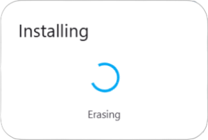
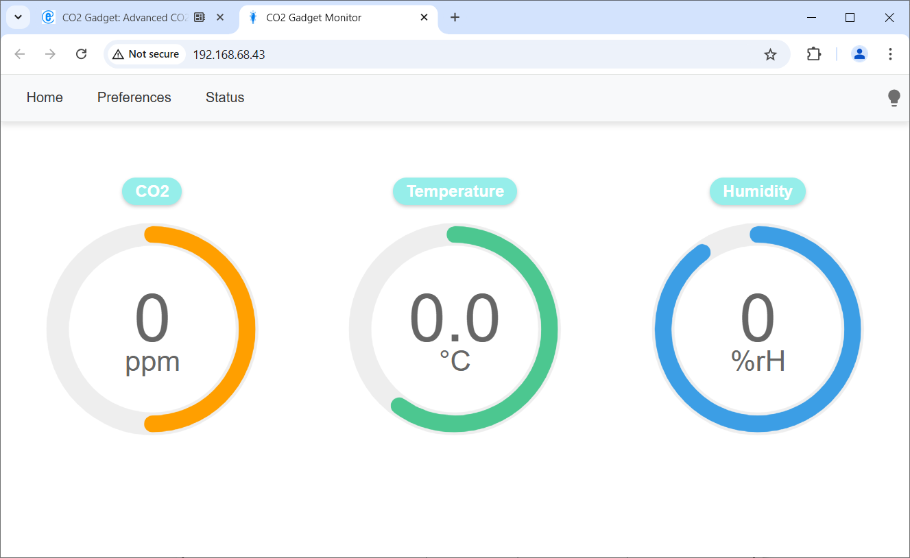
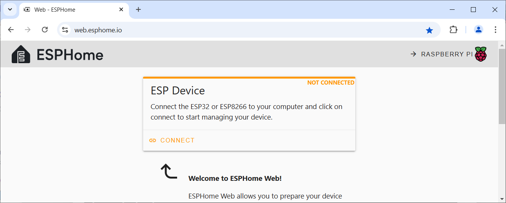
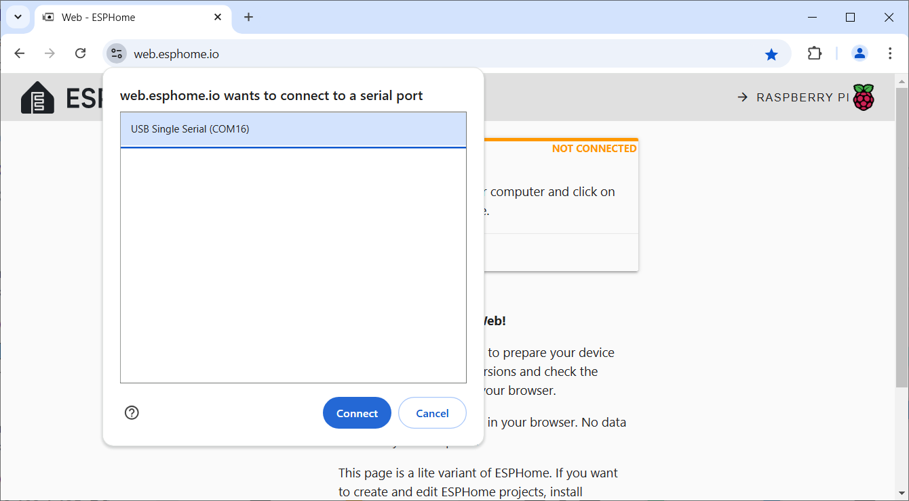
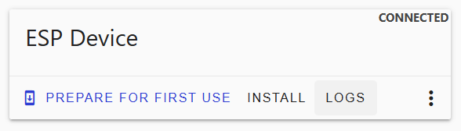
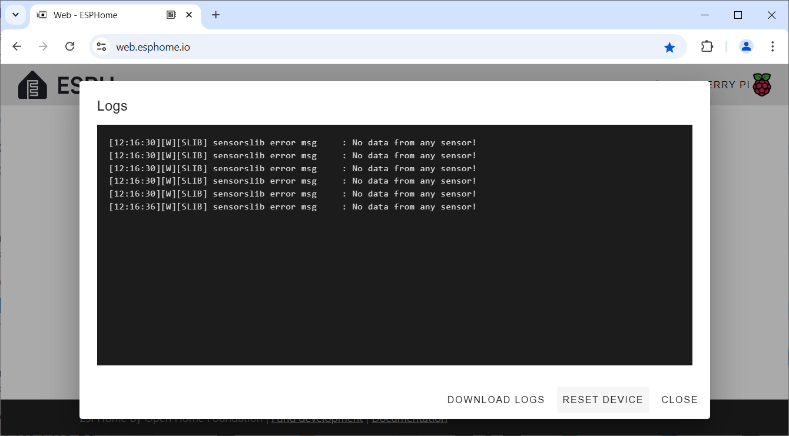
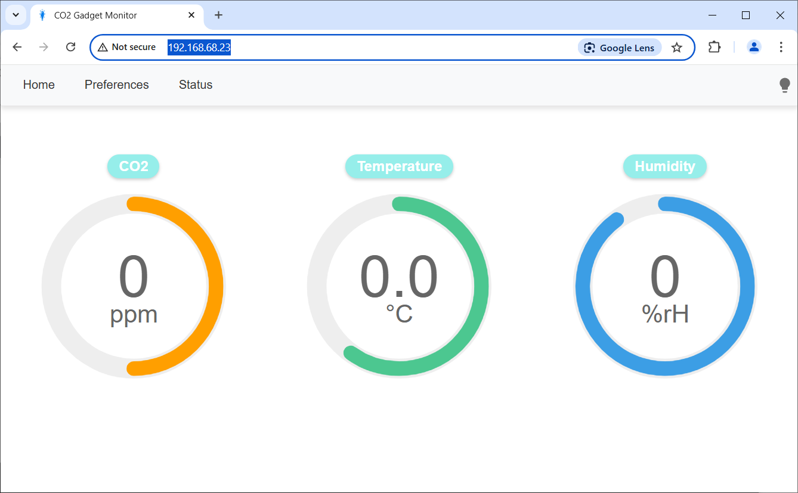

 
# CO2 Gadget

> Building A High-Quality Air Quality Monitoring Device

[CO2 Gadget](https://emariete.com/en/co2-meter-gadget/) is a free [open-source firmware](https://github.com/melkati/CO2-Gadget) that you can upload to an *ESP32S* or *ESP32-S3* microcontroller right from inside your browser - no special tools required. This transforms your microcontroller into a sophisticated CO2 sensor capable of monitoring air quality.

The firmware supports a [variety of CO2 sensors](https://done.land/components/microcontroller/howtouse/firmware/fromsomeoneelse/co2gadget/#supported-sensors) and can interface with additional sensors for *particles*, *temperature*, *humidity*, *atmospheric pressure*, and more. With minimal effort, this firmware enables you to build your own high-quality, affordable air monitor.

> [!NOTE]
> When you buy commercial *air quality monitors*, be aware that the affordable ones typically rely on [cheap, relatively inaccurate MOS sensors](https://done.land/components/data/sensor/airquality/#cheap-mos-sensors). Devices based on professional [CO2 NDIR sensors](https://done.land/components/data/sensor/airquality/#expensive-ndir-sensors) often cost a fortune. With parts in the range of just €20-30, your DIY air quality monitor rivals professional-grade equipment.

## Overview

[CO2 Gadget](https://emariete.com/en/co2-meter-gadget/) is a long-standing community project with a mature, feature-rich firmware for *ESP32* microcontrollers. It supports a [wide range of sensors](https://done.land/components/microcontroller/howtouse/firmware/fromsomeoneelse/co2gadget/#supported-sensors) and offers great versatility.

The [project website](https://emariete.com/en/co2-meter-gadget/) provides essential resources, though its organization can be challenging to navigate.

> [!NOTE]
> The firmware does not natively support [Home Assistant](https://powershell.one/doneland_test/tools/software/homeassistant/). You can  [use MQTT](https://www.home-assistant.io/integrations/mqtt/) to import sensor data into *Home Assistant*, though.

### What You Need

These are the parts required to build your own CO2 monitor:

1. **ESP32 Development Board:** Choose a board **with a built-in display**, such as the [LilyGO T-Display](https://done.land/components/microcontroller/families/esp/esp32/lilygot-display/t-display/). If you opt for a board without a display, you’ll need to add an external one or rely on alternative outputs like LEDs or buzzers. While the firmware supports these options, having a display significantly enhances usability.

    

2. **Sensor:** Invest in a reliable [NDIR CO2 sensor](https://done.land/components/data/sensor/airquality/#expensive-ndir-sensors) such as the [Sensirion SCD30](https://done.land/components/data/sensor/airquality/scd30/). Prices vary widely, but you should be able to find an *SCD30* for under €20. Shop carefully for the best deal.

    

3. **Optional Add-ons:** The firmware supports normal and [programmable WS2812 RGB LEDs](https://done.land/components/light/led/programmable/ws2812/) as well as buzzers. These can complement or even replace a display, providing alternative ways to convey air quality information.
 > [!IMPORTANT]  
> [NDIR CO2 sensors](https://done.land/components/data/sensor/airquality/#expensive-ndir-sensors) can be expensive, but prices vary significantly. For instance, a [Sensirion SCD30](https://done.land/components/data/sensor/airquality/scd30/) may cost anywhere from €15 to €80, depending on the retailer. Be cautious with very low prices, as they may indicate [counterfeit sensors](https://emariete.com/en/sensors-co2-mh-z19b-false/). Ultimately, you’ll need to assess the risk yourself. I opted to purchase mine on *AliExpress* at the best price available, and the sensors I received worked flawlessly.

### Next Steps

Here are the steps to build your own CO2 Gadget:

1. **Upload Firmware:** Get an *ESP32 development board* and upload the *CO2 Gadget* firmware. No special tools are required—just a *Chromium-based browser* (e.g., Chrome, Edge, Opera, or Brave).
2. **Connect:** Wirelessly connect to your microcontroller and access its web interface.
3. **Configure Firmware:** Use its web interface to configure your options.
4. **Add Sensor(s):** Connect your chosen CO2 sensor to the microcontroller. Optionally, add additional sensors for *temperature*, *humidity*, or other air quality parameters, and add optional hardware like LEDs, a buzzer, or buttons.

The first three steps require only an *ESP32 board*, so you can start immediately with any *ESP32 development board* you may have at hand. 

This guide will walk you through each step, helping you configure the firmware and connect the sensors. Once your microcontroller successfully runs the *CO2 Gadget firmware* and you can access its web interface, you’ll move on to connecting sensors and fitting the components into a housing.

## 1. Uploading Firmware

The first step is to *program* your microcontroller by uploading the *CO2 Gadget firmware*. There are options both for beginners and experienced users:

* **No Experience Needed:** Upload [pre-made firmware](https://emariete.com/en/co2-meter-gadget/#Instalacion_de_CO2_Gadget_Advanced) through your *Chrome* browser directly onto your microcontroller board - no special tools or programming required. 
* **Know-How Required:** [Download the source code](https://github.com/melkati/CO2-Gadget), make any adjustments you may need, then compile and upload your own firmware version to your microcontroller, using tools like [ArduinoIDE](https://www.arduino.cc/en/software) or [platformio](https://platformio.org/).

### Connect Microcontroller To PC

Either way, start by ensuring that your microcontroller connects properly to your PC: 

When connected via USB, the microcontroller board should power up, and your PC should emit a chime indicating a new USB device has been recognized.

> [!IMPORTANT]
> If the device is not detected, check for issues such as a faulty USB cable or missing drivers. Resolve these problems first by following [this guide](https://done.land/components/microcontroller/howtouse/connecttopc/).

### Browser-Based Firmware Upload

This is the easiest way to program your microcontroller: upload pre-made firmware to your microcontroller using a *Chrome* browser. Just make sure you have successfully connected your microcontroller board to your PC via a USB cable.

1. Open a **Chromium-based browser** and navigate to the [CO2 Gadget homepage](https://emariete.com/en/co2-meter-gadget/#Instalacion_de_CO2_Gadget_Advanced). Look for the **Installation of CO2 Gadget Advanced** section. Scroll down to find a table listing various *ESP32 development boards*. 

    

2. Identify the board you are using in the table:

    
    | **Variant** | **Microcontroller** | **Display** | **Controller** | **SDA** | **SCL** | **Remark** |
    |-------------|----------------------|-------------|----------------|---------|---------|-----------------------------------------------------------------------------------------------------------------------------------------------------|
    | **esp32dev_OLED** | [ESP32S](https://done.land/components/microcontroller/families/esp/esp32/classicesp32/) | OLED 0.96/1.3" 128x64 | [SH1106](https://done.land/components/humaninterface/display/oled/sh1106/) | 21 | 22 | uses 0.96"/1.3" I2C OLED displays |
    | **esp32dev_ST7789_240×320** | [ESP32S](https://done.land/components/microcontroller/families/esp/esp32/classicesp32/) | TFT 240x320 | [ST7789](https://done.land/components/humaninterface/display/tft/st7789/) | 21 | 22 | [320x240 TFT display](https://done.land/components/humaninterface/display/tft/st7789/1.9inch320x240/) |
    | **ttgo-t7-WEACT_GDEH0154D67** | [ESP32S](https://done.land/components/microcontroller/families/esp/esp32/classicesp32/) | e-Ink 1.54" 200x200 | GDEH0154D67 | 21 | 22 | uses *WeAct Studio e-Ink display GDEH0154D67* |
    | **ttgo-t7-WEACT_DEPG0213BN** | [ESP32S](https://done.land/components/microcontroller/families/esp/esp32/classicesp32/) | e-Ink 2.13" 104x212 | DEPG0213BN | 21 | 22 | uses *WeAct Studio e-Ink display DEPG0213BN* |
    | **ttgo-t7-WEACT_GxEPD2_290_BS** | [ESP32S](https://done.land/components/microcontroller/families/esp/esp32/classicesp32/) | e-Ink 2.9" 128x296 | GDEM029T94 | 21 | 22 | uses *WeAct Studio e-Ink display GDEM029T94BS* |
    | **esp32dev** | [ESP32S](https://done.land/components/microcontroller/families/esp/esp32/classicesp32/) | none | none | 21 | 22 | [classic ESP32S](https://done.land/components/microcontroller/families/esp/esp32/classicesp32/esp32devkitcv4/) |
    | **TTGO_TDISPLAY** | [TTGO Display](https://done.land/components/microcontroller/families/esp/esp32/lilygot-display/t-display/) (using *ESP32S*) | TFT 1.14" 240x135 |  [ST7789](https://done.land/components/humaninterface/display/tft/st7789/) | 21 | 22 | specifically designed for *TTGO T-Display* development board |
    | **TTGO_TDISPLAY_SANDWICH** | [TTGO Display](https://done.land/components/microcontroller/families/esp/esp32/lilygot-display/t-display/) (using *ESP32S*) | TFT 1.14" 240x135 |  [ST7789](https://done.land/components/humaninterface/display/tft/st7789/) | 22 | 21 | **special build:** GPIO21 and GPIO22 (I2C) are **reversed** for compactness with a piggy-backed sensor PCB |
    | **TDISPLAY_S3** | **Lilygo T-Display S3** (using *ESP32-S3*) | TFT 1.9" 320x170 |  [ST7789](https://done.land/components/humaninterface/display/tft/st7789/) | 42 | 43 | do not confuse with *Lilygo T-Display AMOLED*. This firmware may target other boards using the *ESP32-S3*. |
    | **ttgo-t5-EINKBOARDGDEM0213B74** | **Lilygo TTGO T5** (using *ESP32S*) | e-Ink 2.13" 104x212 | GDEM0213B74 | 21 | 22 | specifically designed for *TTGO T5* development boards using a [ESP32S](https://done.land/components/microcontroller/families/esp/esp32/classicesp32/). |
    | **ttgo-t5-EINKBOARDDEPG0213BN** | **Lilygo TTGO T5** (using *ESP32S*) | e-Ink 2.13" 104x212 | DEPG0213BN | 21 | 22 | similar to the previous entry but with a different e-Ink driver |
    | **ttgo-t5-EINKBOARDGDEW0213M21** | **Lilygo TTGO T5** (using *ESP32S*) | e-Ink 2.13" 104x212 | GDEW0213M21 | 21 | 22 | similar to the previous entry but with a different e-Ink driver |
    | **ttgo-t7-EINKBOARDGDEM029T94** | **Lilygo TTGO T7** (using *ESP32S*) | e-Ink 2.9" 128x296 | GDEM029T94 | 21 | 22 | specifically designed for *TTGO T7* development boards using a [ESP32S](https://done.land/components/microcontroller/families/esp/esp32/classicesp32/). |

    

3. Click the **INSTALL** button for your chosen board. A dialog will appear to select your connected microcontroller. Click *Install CO2-Gadget*. 

    > If no devices are listed, ensure your microcontroller is connected via USB. Close and reopen your browser, or reboot your PC if necessary. Verify [your microcontroller’s connection](https://done.land/components/microcontroller/howtouse/connecttopc/) and check that drivers are installed.

4. Check the option to erase the flash memory, then click *Next*. 

    

5. Confirm your selection by clicking *Install*. 

    

6. The installation process begins: first, the flash memory is erased, and then the new firmware is uploaded.

    

7. After 1–2 minutes, the installation completes. Click *Next*. 

    

8. Configure your device for WiFi. Select your WiFi SSID, enter the password, and click *Connect*. 

    

9. Once connected, click *Visit Device* to access its web interface. 

    

Now, two things should happen:

* **Display:** the firmware now runs on your microcontroller. If your device is using a display, it should come to life and show some icons and values.
* **Web Interface:** on your PC, in your browser, the web interface should open. The gauges will display zero values since no sensors are connected yet. 

You’re now ready to move on to configuring your device which you should do immediately: you may not (easily) be able to return to the web interface later.

> [!TIP]
> Before we proceed with the configuration, here is a note about some peculiar behavior: When you remove power from the microcontroller, the screen may remain blank when you re-power the board later. If this happens to you, press the *Reset* button on the board. It looks like there is a minor glitch with some energy saving features.         

## 2. Connecting To Microcontroller
In order to configure *CO2 Gadget*, you need access to its web interface. If you followed the steps above, this web interface has just opened in your browser. Else, you can open it using its *mDNS host name*: [**http://co2-gadget.local/**](http://co2-gadget).

> [!IMPORTANT]
> The default *mDNS host name* is set to *CO2-Gadget*. You can change the host name in the device settings. In any case, you must add the extension **.local** to this name. The default url to your device is [http://**co2-gadget**.local/](http://co2-gadget.local/)    

### mDNS Caveats

If you cannot open the device web interface, first make sure:

* you powered the device on
* you added *.local* to the host name
* you used the prefix *http://*, not *http**s**://*

Here is the default link that should work for your device (unless you changed its host name):     

[**http://co2-gadget.local/**](http://co2-gadget)

If you *still* cannot reach the web interface, then *mDNS* may not work for you. *mDNS* is relatively sensitive and cannot communicate across different networks. Especially when you have combined a wired and a wireless network, *mDNS* may become unavailable.

In this case, you can still access the device via its currently assigned IP address. Here is how you find out its currently assigned IP address:

How do I know the currently assigned IP address of my device?
 

### Recovering IP Address
Here are the steps to recover the current device IP address:

1. Connect the microcontroller to your PC via USB cable, and navigate to [ESPHome](https://web.esphome.io/) (*CO2 Gadget* is no *ESPHome* software, but you can use the *ESPHome tool chain* to access the device logs).

    

2. Click *CONNECT*. The browser opens a dialog with the connected USB devices. Select your microcontroller, and click *Connect*.

    

    > If you cannot see your board in the list, close all browser windows, then try again. If that does not help, reboot your PC, then try again. This will free any *Web Serial ports* that may have been locked from earlier sessions.

3. In the next dialog, click *LOGS* to open the device log. **ATTENTION:** do **not** click *Prepare for first use*, or else *ESPHome* will overwrite your firmware with its own. Keep in mind: we are just using the *ESPHome* tools to access the device logs, but you do not want to reprogram your microcontroller.

    

4. A console opens and shows the current microcontroller messages. As expected, you can see it complain about missing sensors. Click *RESET DEVICE*.

    

5. The device now conducts a reset, and now the log shows the device initialization in minute detail. As part of this, you see the *IP address* that is assigned to the device:

    

Once you know the IP address (*192.168.68.23* in the example above), open a browser, and navigate to this IP address. Prepend *http://*. Do not use *http**s**://*!

This shows the devices' web interface:

       
       

       

Once you have access to the device settings, you may want to assign a *static IP address*.

## 3. Configuring CO2 Gadget

With the web interface open, click the menu *Preferences* to see all available settings:

Here are the settings that you should review:

* **Connectivity:** Check the wireless technologies you want the device to use. If you do not need *Bluetooth*, for example, uncheck *BLE*.
    > Better not deactivate *BLE* though, or else you miss out on the built-in *app support*: a *Sensirion* app exist both for [Android](https://play.google.com/store/apps/details?id=com.sensirion.myam&hl=es) and [iPhone](https://apps.apple.com/us/app/sensirion-myambience/id1529131572). With this app, you can conveniently view the sensor information via *Bluetooth* on your smartphone - provided you use a *Sensirion* sensor.
* **Networking:** In the text box *Host Name*, set the *mDNS host name* that the device should use. By default, the *mDNS* host name is **CO2-Gadget**. If *mDNS* does not work for you, then you may want to check *Use Static IP*, and assign a static IP address to your device.
    > In order to use a static IP address, you need to know your valid IP address range and the range of IP addresses assigned by *DHCP*. You must ensure that the IP address you pick is *reachable* (within your subnet mask), but not assigned to other devices (outside the DHCP range).     
* **Sensors:** You can define offset values for your sensors (if they are always off by a given value), and you can define the CO2 levels that should be reached for the *orange* and *red* LEDs to light up (if you decided to connect such LEDs to your microcontroller). The predefined values work well in most cases.
* **Outputs:** if you use optional components such as normal or programmable *WS2812 LEDs*, or a buzzer, then you can customize their behavior, i.e. control *LED brightness* and *buzzer tones*.
* **Battery:** even though CO2 sensors are not running well on battery power due to their relatively high current consumption, you can add a battery to your setup and define the battery capacity.
* **Display Preferences:** control which sensor readings should appear on the display. You can also turn off the display after a grace period, and limit power saving features for when the device is battery powered only.

Once you have adjusted your settings, click *Save*.

## 4. Connecting Peripherals

With your microcontroller configured, you can now add peripherals: power off your board and connect a suitable CO2 sensor, such as the [Sensirion SCD30](https://done.land/components/data/sensor/airquality/scd30/). 

Once you power the board back on, you now see actual sensor readings on your display.

To actually connect peripherals, you need to know the *GPIOs* at which the firmware expects to find them:

### I2C Interface

Most sensors, and many other peripherals such as external displays, use the two-wire *I2C interface*. The required GPIOs for connecting external *I2C* components (e.g., sensors and displays) depend on your microcontroller type:

| Microcontroller | SDA | SCL |
| --- | --- | --- |
| **ESP32S** | 21 | 22 |
| **ESP32-S3** | 43 | 44 |

> [!NOTE]  
> The firmware **TTGO_TDISPLAY_SANDWICH** swaps the GPIOs for *SDA* and *SCL*. It is a specifically-tailored firmware enabling you to mount the *Sensirion SCD30 PCB* piggyback-style onto a *ESP32S PCB*.

### Buttons

You can optionally add *up* and *down* buttons to enable user interaction and navigation. The GPIOs for these two buttons vary considerably in the different firmware versions. That's because some of the specifically supported development boards come with built-in buttons connected to specific GPIOs, while generic development boards have no designated buttons.

| **Firmware Version**       | **UP/DWN** | **Development Board** |
|----------------------------|------------|----|
| **esp32dev_OLED SSH1106**  | 15 / 0     | generic [ESP32S](https://done.land/components/microcontroller/families/esp/esp32/classicesp32/) board |
| **esp32dev**               | 15 / 0     |generic [ESP32S](https://done.land/components/microcontroller/families/esp/esp32/classicesp32/) board |
| **esp32dev-ST7789_240x320** | 19 / 0     |generic [ESP32S](https://done.land/components/microcontroller/families/esp/esp32/classicesp32/) board |
| **TTGO_TDISPLAY**          | 35 / 0     | [TTGO T-Display](https://done.land/components/microcontroller/families/esp/esp32/lilygot-display/t-display/) |
| **TTGO_TDISPLAY_SANDWICH** | 35 / 0     |[TTGO T-Display](https://done.land/components/microcontroller/families/esp/esp32/lilygot-display/t-display/) |
| **TDISPLAY_S3**            | 14 / 0     | **TTGO T-Display S3** |

### LEDs & Buzzer

The optional buzzer is always wired to *GPIO2*.

The firmware supports both *regular* and *programmable* ([WS2812](https://done.land/components/light/led/programmable/ws2812/), aka *"NeoPixel"*) LEDs. The LED GPIOs vary by microcontroller type:

| **Microcontroller Type**   | **GPIO Orange** | **GPIO Red** | **GPIO WS2812 LED** | 
|----------------------------|------------------|--------------|----------------------|
| **ESP32S**                 | 32              | 33           | 26                   |
| **ESP32-S3**               | 03              | 01           | 16                   |
### Battery

To monitor the state of charge (voltage) of an external battery, the voltage sensing GPIO depends on your microcontroller type:

| **Microcontroller Type**   | **Battery Voltage GPIO** |
|----------------------------|--------------------------|
| **ESP32S**                 | 34                       |
| **ESP32-S3**               | 04                       |

This functionality is only available if the development board includes battery support and has the GPIO properly connected to the battery input pin. Otherwise, it’s up to you to route your external battery voltage to the specified GPIO.

> [!IMPORTANT]  
> If you add battery support yourself, ensure you understand the allowable voltage range for analog input pins. *ESP32* analog inputs have a maximum input voltage of *3.3V*. Some development boards include voltage dividers to handle higher input voltages; if not, you’ll need to add a voltage divider circuit yourself.
### NDIR Sensor Power Consumption  

Many [CO2 NDIR sensors](https://done.land/components/data/sensor/airquality/#expensive-ndir-sensors) require substantial power to operate. For instance, the widely used [Sensirion SCD30](https://done.land/components/data/sensor/airquality/scd30/) consumes *75mA* during measurements and averages *19mA*.  

These sensors are designed for continuous operation, meaning you cannot easily power off your device to save energy and take CO2 samples intermittently. Turning the sensor off and on at regular intervals can interfere with its functionality. As a result, most CO2 measurement devices depend on stationary power supplies.  

### Sensirion SCD41  

Power-optimized CO2 sensors, such as the *Sensirion SCD41*, are specifically designed for battery-operated devices. (*Note:* The similar-looking *SCD40* is **not** power-optimized.)  

The *SCD41* supports *snapshot measurements* and requires just *0.5mA* on average when measuring at 5-minute intervals, making it ideal for battery-operated devices.  

> [!NOTE]  
> The *SCD41* is more affordable and significantly smaller than the *SCD30*, making it better suited for consumer applications. The relevant CO2 range for typical consumer use (*400–2,500 ppm*) is well within the range of both sensors (*SCD41*: up to *5,000 ppm*, *SCD30*: up to *10,000 ppm*).

### Adjustments

If none of the premade firmware versions match the GPIO configuration of your development board, you can [download and modify the source code](https://github.com/melkati/CO2-Gadget) to compile and upload a custom firmware tailored to your setup.

> [!TIP]  
> Sensor support is based on the [CanAirIO](https://github.com/kike-canaries/canairio_sensorlib) library, which supports *ESP32S*, *ESP32-C3*, *ESP32-S3*, *ESP8266*, and *Atmel*. Note that the *ESP32-S2* is not explicitly supported.

## Supported Sensors

Sensors are supported through the [CanAirIO](https://canair.io/) library. Check their [GitHub repository](https://github.com/kike-canaries/canairio_sensorlib) for the latest list of supported sensors.

### CO2 Sensors

| Sensor Model          | UART | I2C | Detection Mode | Status       |
|-----------------------|:----:|:---:|:--------------:|:------------:|
| Sensirion SCD30       | ---  | Yes | Auto           | STABLE       |
| Sensirion SCD4x       | ---  | Yes | Auto           | TESTING      |
| MHZ19                 | Yes  | --- | Select         | STABLE       |
| CM1106                | Yes  | --- | Select         | STABLE       |
| SenseAir S8           | Yes  | --- | Select         | STABLE       |

### Environmental Sensors

| Sensor Model          | Protocol  | Detection Mode | Status       |
|-----------------------|:---------:|:--------------:|:------------:|
| AM2320               | I2C       | Auto           | STABLE       |
| SHT31                | I2C       | Auto           | STABLE       |
| AHT10                | I2C       | Auto           | STABLE       |
| BME280               | I2C       | Auto           | STABLE       |
| BMP280               | I2C       | Auto           | STABLE       |
| BME680               | I2C       | Auto           | STABLE       |
| DfRobot SEN0469 NH3  | I2C       | Auto           | TESTING      |
| DfRobot SEN0466 CO   | I2C       | Auto           | TESTING      |
| Geiger CAJOE         | GPIO      | Select         | TESTING      |
| DHTxx                | TwoWire   | Select         | DISABLED     |

> [!NOTE] 
> *DHT22* is supported but is not recommended.     

### PM Sensors

| Sensor Model          | UART | I2C | Detection Mode | Status       |
|-----------------------|:----:|:---:|:--------------:|:------------:|
| Honeywell HPMA115S0   | Yes  | --- | Auto           | DEPRECATED   |
| Panasonic SN-GCJA5L   | Yes  | Yes | Auto           | STABLE       |
| Plantower Models      | Yes  | --- | Auto           | STABLE       |
| Nova SDS011           | Yes  | --- | Auto           | STABLE       |
| IKEA Vindriktning     | Yes  | --- | Select         | STABLE       |
| Sensirion SPS30       | Yes  | Yes | Select / Auto  | STABLE       |

> [!NOTE]    
> Panasonic via UART on ESP8266 may require manual selection in detection.    

> Tags: Sensirion SCD30, SCD40, SCD41, NDIS, Air Quality, Firmware, CanAirIO, Sensor, ESP32

[Visit Page on Website](https://done.land/components/microcontroller/howtouse/firmware/fromsomeoneelse/co2gadget?641318011502254120) - created 2025-01-01 - last edited 2025-01-02
