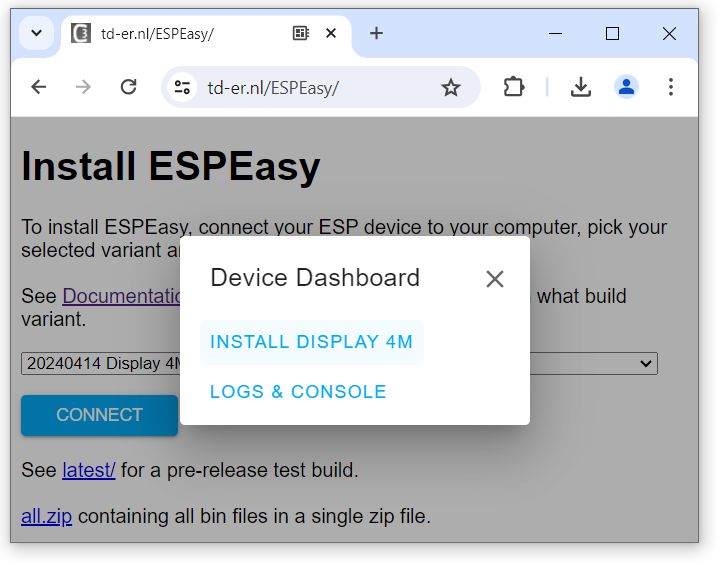
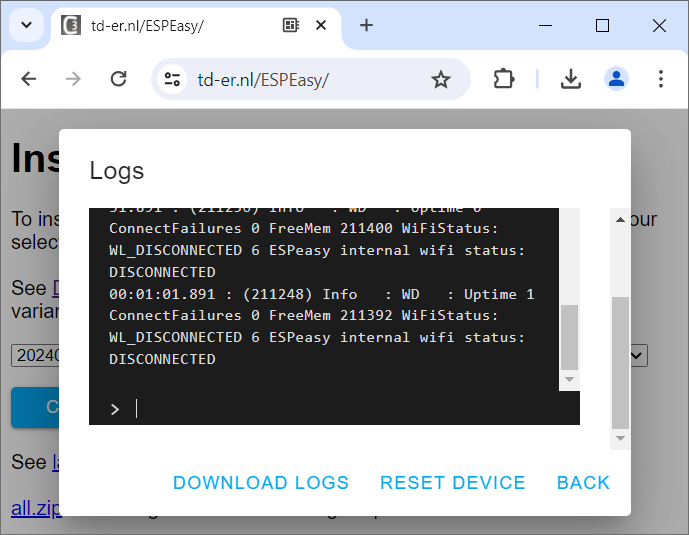
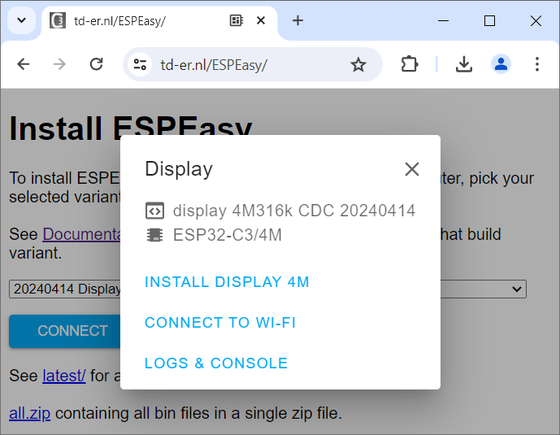
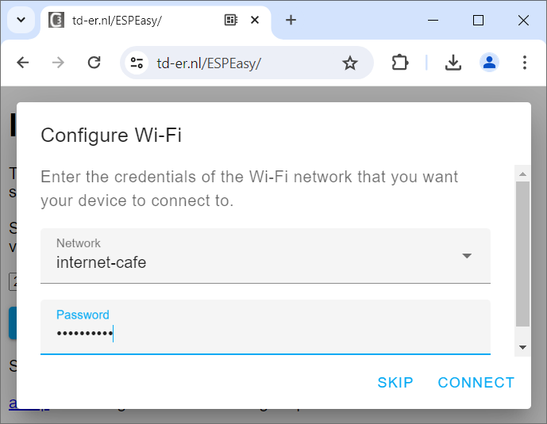

 
# Firmware From Someone Else

> Uploading Pre-Made Firmware To Your Microcontroller

You don't necessarily be a *programmer* to play with *microcontrollers*. Simply grab some *pre-made* firmware from someone else, and use it on your microcontroller - done!

## Overview
Using *firmware* that was made by someone else obviously puts *someone else* in full *control*: the *firmware* you choose does whatever its author *programmed it to do*.

However, that's by far not as limiting as you might think:

* **Special Purpose Firmware:** Firmware like *WLED* is *highly specific* and controls *LED strips*. If you wanted your microcontroller to do something different, then you are out of luck. But: the author tailored such as great and versatile *firmware* that you can manage it via *web interface* and adapt it to all kinds of *LED strips* and *LED devices*. If controlling *LED* is your thing, then even if you invested months in writing your own *firmware*, you'd probably not outperform *WLED*.
* **Adjustable Firmware:** Firmware like *ESPEasy* and *EspHome* takes care of all the hard stuff like implementing a *web interface* or sending *over-the-air updates* (*OTA*). The firmware isn't tailored to a specific *action* or *task*. Instead, you can *program it graphically* or via *yaml files*. This way, you can create *very specific solutions* without touching *C++*. *ZeroCode* is another example presented below that shows how the *industry* tackles the problem: by clicking, you compose *firmware* that is *matter*-compliant and can be controlled by *smartphones*.
* **Interpreters:** If you are fundamentally into programming but using the very low level language *C++* is a bit over your head, then upload one of the many *Interpreter firmwares*. They let you *program* your microcontroller via *scripts*. Whether you prefer *LUA*, *Basic*, *Python*, *JavaScript*, or whatnot, the *Interpreter firmware* does the hard part and translates your script into *assembly language* that the microcontroller can understand.

### Uploading New Firmware
There are a variety of *awesome projects and services* that all provide you with *ready-to-run* firmware. They use *two separate* ways of *uploading the firmware* to your board:

* **WebSerial:** firmware can be uploaded directly from within a *Chrome* browser - no special tools or prerequisites needed. You just need a *USB cable* to connect your development board to your computer.
* **Manual Upload:** download a *firmware file* from its author, and *flash* it to your microcontroller *manually*. This requires *quite a lot know how* and also the proper *tools* for the *microcontroller platform* you use.

## Special Purpose Firmware
*Special Purpose Firmware* targets a *highly specific use case*. Within this use case, the firmware let you *customize and tailor* the solution *to your needs* using a variety of *web interfaces* and/or *smartphone apps*.

### WLED LED Controller

[WLED](https://kno.wled.ge/) for example is an *open source* project for controlling *LED Strips*. You can get ready-to-go firmware for *ESP8266* and *ESP32* microcontrollers.

All you need to do is [wire up](https://kno.wled.ge/basics/getting-started/) the *LED Strip* to the microcontroller.

Next, *upload the firmware* (software) to the microcontroller. This can be done [right from within your browser](https://install.wled.me/).

### CO2 Sensor

There are plenty of *awesome open source projects* like this one. [CO2 Gadget](https://emariete.com/en/co2-meter-gadget/) is another one that turns a *CO2 sensor* into a *smartphone app*. It runs on any *ESP32* microcontroller, and it comes with a web browser-based *firmware flashing tool*.

The hardest part often is finding the correct links: the [authors' web page](https://emariete.com/en/co2-meter-gadget/) is huge and not structured well. Links to the browser-based firmware uploads can be found somewhere in the middle of it.

There are different *firmware versions*, targeting *ESP32* microcontrollers with different *displays* attached to them.

> [!CAUTION]
> *Source code* is *hardware neutral*. Once it gets *compiled into a binary* by an *IDE*, it is converted into a *hardware-specific* firmware. This *firmware* can now only be used on the particular hardware (microcontroller board) that was specified during compile time. When you take the shortcut and directly upload *pre-fabricated firmware*, you must be certain that it was indeed made for *your particular microcontroller and board*. Else, the firmware will not run (correctly).

## Adjustable Firmware
This type of firmware provides just a *basic framework* that lets you *manage your microcontroller*.

The *specific work* you want your microcontroller to do for you can be programmed in various ways. You don't have to be a *programmer* for this nor do you need to write a line of code (if you don't like).

### ESPEasy
[ESPEasy](https://github.com/letscontrolit/ESPEasy) supports *ESP32* microcontrollers only. It supports a [wide range of sensors and components](https://letscontrolit.com/wiki/index.php?title=Devices) and adds all the default code that is typically required to *remote control* a hardware device or integrate it into home automation frameworks like *ioBroker*, *openHAB*, *Domoticz*, *FHEM*.

#### Know Your Microcontroller

Since *firmware* is always *hardware specific*, you need to know a few things about your microcontroller board:

* **Type:** What type of microcontroller are you using? Is it a *ESP32*, a *S2*, a *C3*, or maybe an *ESP8266*?
* **Memory:** How much *flash memory* do you have? Most typical *ESP32* microcontrollers come with *4MB*. If in doubt, in the article about the *boot loader* you learned how you can use *esptool* to query the memory size.
* **Libraries:** What do you intend to *do* with the microcontroller? Is there any specific *library support* you may need?

> [!NOTE]
> Regardless of *how* you want to program a *microcontroller*, the questions above need to *always* be answered. Don't be put off by them. If you used an *IDE* to write your own *firmware*, it would be *no different*, just happening at later steps in the process. Don't worry too much. Just *play with ESPEasy* a bit. If a firmware doesn't work out, you can always try another one.

#### Web Downloader

Navigate to [https://td-er.nl/ESPEasy/](https://td-er.nl/ESPEasy/) in a *Chrome* browser (other browser types do not support connecting to microcontrollers via *USB*).

In the combo box, select the firmware image you want to use. This list is *huge*, but here are the steps to tackle it:

1. I want to upload firmware to a *ESP32-C3 Mini*. Each entry in the combo box lists the microcontroller type in square brackets at the end. So I can choose any firmware image that lists the *C3*.
2. All images are grouped by available memory size. Since my *ESP32-C3 Mini* has *4MB flash memory*, I can use any firmware image in groups that show *4MB*.
3. Each firmware image lists additional support, i.e. for *climate sensors*, *energy meters*, *neopixel RGB LEDs*, or specific library collections. Since I want to hook up an OLED display, I looked for images with *display* support. Eventually, I ended up with *20240414 Display 4M [ESP8266,ESP32,ESP32-S2/S3/C3].

4. Connect the microcontroller board to the USB port of the computer, and click *Connect*. The typical *WebSerial dialog* opens and shows the connected microcontroller board. If the list is empty, check the *USB connection* as described in full detail in a previous article. Select your USB connection in the list, and click *Connect*.

5. Once the connection is established, you can now upload the selected firmware image to your microcontroller board. Click *Install Display 4M*.

6. The tool asks whether you want to *erase* the *flash memory* before proceeding. Check the option, then click *Next*. 

7. After a few warnings and confirmations, the memory is cleared. This can take up to a minute. Don't worry: erasing the memory cannot damage anything. *ESP* microcontrollers keep their crucial *boot loader* in write-protected *ROM*.

8. Once the memory is cleared, the firmware image is uploaded. All of this happens automatically, and you can lean back a while and watch.

9. After a while, the installation is completed, and you see a confirmation message. Your microcontroller is now executing the new firmware. Click *Next*.

10. You can now view the logs. When you click on *Logs & Console*, you see a detailed log of the installation process. You also see that your microcontroller is not yet connected to your WiFi. This is expected because it cannot know the logon credentials. Click *Back*.

11. You now see a new option: *Connect To Wi-Fi*. Click on it to complete the configuration by adding your microcontroller to your *WiFi Network*.

> [!NOTE]
> If you do not see the option to connect to *WiFi*, you can always later configure it. Without access to your *WiFi*, the firmware will start its own *WiFi access point* named *ESP_Easy_0*. You can use any browser or even your smartphone to connect to it and complete the configuration.

12. The tool searches for all available *WiFi Networks* which can take a couple of seconds. Then you can select the *WiFi Network* you want it to connect to, and enter the password for it.

13. Now the microcontroller is connected to your *WiFi*. To test it, open the new *web interface* that the firmware added to your microcontroller by clicking *Visit Device*.

14. A sophisticated web interface opens in your browser. Make a note of the *IP address* that was assigned to your microcontroller board. In my case it is *192.168.68.118*. Via its web interface, you now can manage the microcontroller and tell it what to do.

> [!CAUTION]
> Make sure you write down the assigned IP address. You'll need it later to access the microcontroller web interface. If you forgot the IP address (or if it changed), you can always reconnect the microcontroller board to your computer USB and visit [https://td-er.nl/ESPEasy/](https://td-er.nl/ESPEasy/) again in *Chrome*. This opens a dialog with the option *Visit Device* which automatically figures out the current *IP address*, and opens the web interface again.

## ZeroCode (Industrial)
Microcontroller manufacturers such as *Espressif* want to convince the *industry* that using *their microcontrollers* is the most cost-effective deal. 

That's why projects like *ZeroCode* exist: It *targets industrial customers planning to develop smart devices*. *Hobbyists* are **not** their target - but can use the same clever tools as well.

> [!NOTE]
> I include *ZeroCode* to provide a good picture of how modern *firmware development* has changed, and how our ecosystem of free tools will probably change in the future, too. In order to use *ZeroCode*, you need to sign up (*free*). *ZeroCode* is a work-in-progress: while some examples worked for me, others failed. 

[ZeroCode](https://zerocode.espressif.com/) targets *ESP32* microcontrollers and probably is one of the *easiest* and *most amazing* tool chains to program *microcontrollers*. 

Once you *registered for free* and logged in, you click to *Create a new product* (aka *create a new project*), and assign it a name (i.e. *test1*).

Next, you can choose from a variety of *template devices*. For illustration, I choose a simple *Plug* that uses a *GPIO* as *indicator*:

Scroll to the bottom of the page, and click *Next step>*. Now you can select the *microcontroller* you want to use. I decided to use a *ESP32-C3 DevKit M1*:

Again, scroll to the bottom of the page, and click *Next step>*. The web page now illustrates the *wiring* of your board. In the bottom region, you can configure the active elements like *Input Button*, *Output Relay*, and *Indicator LED*.

Since I do not actually to plan soldering *anything* to my breakout board at this time, I only want the *built-in LED* to be *remotely controllable*. So I do not care much about the *GPIO assignment* for *Input Button* and *Output Relais*. What I want to set is the *GPIO* for the indicator *LED*. It is set to *GPIO8* by default - which happens to be the correct *Pin Assignment* anyway. I have to adjust - *nothing at all*.

Again, scroll down to the bottom, and click *Next step>*.

To actually transfer and upload the *firmware* to my local *ESP32-C3 board*, click *Evaluate now in ESP Launchpad*.

After a few seconds, the *firmware image* is tailored to your needs and ready to be uploaded. Click *Connect Your Device*.

Now the exact same thing happens that was discussed in the *Bootloader* chapter: the webpage uses *WebSerial* to connect to the device on your *USB port*. Click on your board, and connect.

## Interpreters
In the case of *Interpreters*, the firmware is *not doing anything specific*. Instead, it waits for commands (typically *scripts* or *interactive user commands*) in a *higher level programming language*. 

This way, users do not have to write programs in *C++* to control hardware. Instead, they use *easier* programming languages that are *interpreted* by the firmware and *translated* into the machine commands that a microcontroller can understand. 

While programming is much easier, *interpreters* add overhead which degrades performance. This is why *interpreters* require more performat microcontrollers (like *ESP32*).

Here are the *Interpreter firmware* advantages:

* **Versatile:** Since the user can easily change commands or scripts, the microcontroller can do all kinds of things without the need of creating and uploading firmware each time.
* **Easy:** Interpreters support different *high level* programming languages like *LUA*, *Python*, *Basic*, *JavaScript*, etc. These languages feel more natural to *non-programmers*.

And here is the price you pay:

* **Overhead:** Interpreters add *computational effort* and introduce *bottlenecks*. That's why they need (much) more *RAM* and more performant microcontrollers. 
* **Energy:** Since the *microcontroller* has more work to do, *interpreters* increase the power consumption which can be prohobitive in battery-driven devices.

> [!TIP]
> *Interpreter firmware* can be great in *educational* scenarios where you can easily reprogram the microcontroller to cater different needs, and if you just can't wrap your head around the *C++* programming language that is required to write *firmware*. If however you want a microcontroller to run the *same code all the time* (i.e. inside a device you created), then do avoid *Interpreter firmware* and instead build your own *firmware* directly.

### Interpreter Languages
Free pre-compiled and ready-to-use *Interpreter firmware* is available for many *high level programming languages*:

#### LUA
* [Lua (eLUA)](https://eluaproject.net/overview/status/) *Embedded Lua* is a lightweight implementation of the *Lua* programming language for embedded systems.
* [NodeMCU](https://github.com/nodemcu/nodemcu-firmware) *NodeMCU* is a project that develops *ESP8266*- and *ESP32*-based *microcontroller boards* bundled with an adaption of *eLUA* that is guaranteed to match the hardware. The preinstalled (bundled) firmware can easily be replaced with any other firmware, including individual firmware written by yourself, if you are interested in the *hardware board* but not in *LUA*.

#### Python
* [MicroPython](https://github.com/micropython/micropython/): The *MicroPython* firmware can execute scripts written in *Python 3* and also supports *interactive console operation* (*REPL*, *read-eval-print loop*). It includes a small subset of the Python standard library and is optimized to run on microcontrollers with limited resources (RAM and storage).
* [CircuitPython](https://learn.adafruit.com/circuitpython-with-esp32-quick-start/installing-circuitpython): a derivative of *MicroPython*, designed by the company *Adafruit* to make learning and using Python on microcontrollers simpler. It focuses on ease of use and education.

#### JavaScript
* [Espruino](https://www.espruino.com/Download): *JavaScript* interpreter for microcontrollers to develop embedded applications using JavaScript with an interactive JavaScript environment.
* [JerryScript](https://github.com/nkolban/jerryscript-esp32) lightweight JavaScript engine intended for microcontrollers with constrained resources. It features a very low memory usage and can run on microcontrollers with less than 64KB of RAM. It supports a subset of the ES5.1 standard.

#### BASIC
* [ESPBasic](https://www.esp8266basic.com/): BASIC for ESP8266 microcontrollers. Allows easy and wireless programming.
* [TinyBASIC](https://github.com/slviajero/tinybasic): minimalistic version of the BASIC programming language designed for resource-constrained systems. 

#### Others
* [Squirrel](https://github.com/EternityForest/Acorns): high-level scripting language, somewhat inspired by Lua, designed to be lightweight and embeddable, with object-oriented approach.
* [TinyGo](https://tinygo.org/): *Go* compiler translating *Go* code into machine code that can run on microcontrollers.
* [WASM3](https://github.com/wasm3/wasm3) *WebAssembly* interpreter designed for small devices and microcontrollers that can run WebAssembly bytecode on microcontrollers.

> Tags: Firmware, Interpreter, NodeMCU, WLED, CO2 Gadget, ESPHome, ZeroCode, LUA, eLUA, Squirrel, TinyGo, WASM3, ESPBasic, TinyBasic, Espruino, JerryScript

