 
# WLED 8x32 LED Matrix

> Remote-Controllable 8x32 Matrix That Can Display Scrolling Text, Too

This project demonstrates how to create a flexible **8x32 LED matrix panel** powered by the free [WLED](https://done.land/components/microcontroller/howtouse/firmware/fromsomeoneelse/wled/) firmware.

This panel has more real-estate than a [simple 8x8 panel]() so in addition to colorful LED animations, it is also suited for displaying scrolling or static text.

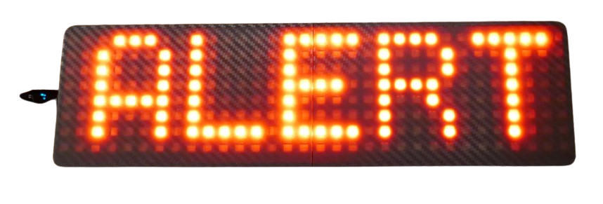

## The Project

Before starting, ensure your ESP microcontroller is [provisioned](https://done.land/components/microcontroller/howtouse/firmware/fromsomeoneelse/wled/):

1. [Upload](https://done.land/components/microcontroller/howtouse/firmware/fromsomeoneelse/wled/#1-uploading-firmware) the *WLED* firmware directly from your browser.
2. [Configure](https://done.land/components/microcontroller/howtouse/firmware/fromsomeoneelse/wled/#3-configuring-wled) the *WLED settings* to match your microcontroller and GPIO(s).

### Parts List

The total cost of this project is under €15:

- **Microcontroller:** I used an [ESP32 C3 SuperMini](https://done.land/components/microcontroller/families/esp/esp32/c3/c3supermini/), which is very affordable (<€2) and has a small footprint. You can also use any ESP32 microcontroller or even an old [ESP8266](https://done.land/components/microcontroller/families/esp/esp8266/).  

    

- **8x32 Flexible RGB Matrix Panel:** This project uses a [WS2812](https://done.land/components/light/led/programmable/ws2812/) **8x32 Matrix** on a flexible (bendable) PCB. 

    

- **USB Connector:** A separate USB adapter PCB is recommended, as most microcontroller boards cannot handle the high current demands (*1.8A or more*) of the LED matrix. Use a USB adapter PCB with traces rated for at least *2A*.  

    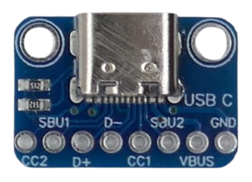

> [!TIP]
> Ensure the USB adapter PCB includes two resistors to support *USB-C*-to-*USB-C* cables. Adapters without these resistors may only work with *USB-A* cables and older power supplies.

- **6 Cables:**  
    * 3 wires (26AWG) to connect the microcontroller.  
    * 2 two-wire cables (15cm, 20AWG) for the LED matrix power rail.  
    * 1 two-wire cable (5cm, 20-18AWG) for the external USB plug.

    

- **Housing:** if you have access to a *3D printer*, I also provide you with ready-to-use *STL files* to print a neat housing and cover.

    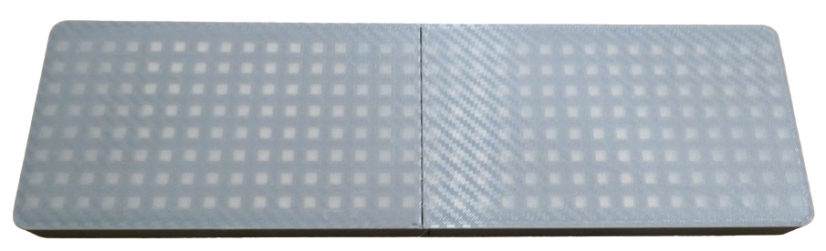

### Wiring

Below is the schematic for wiring the components:

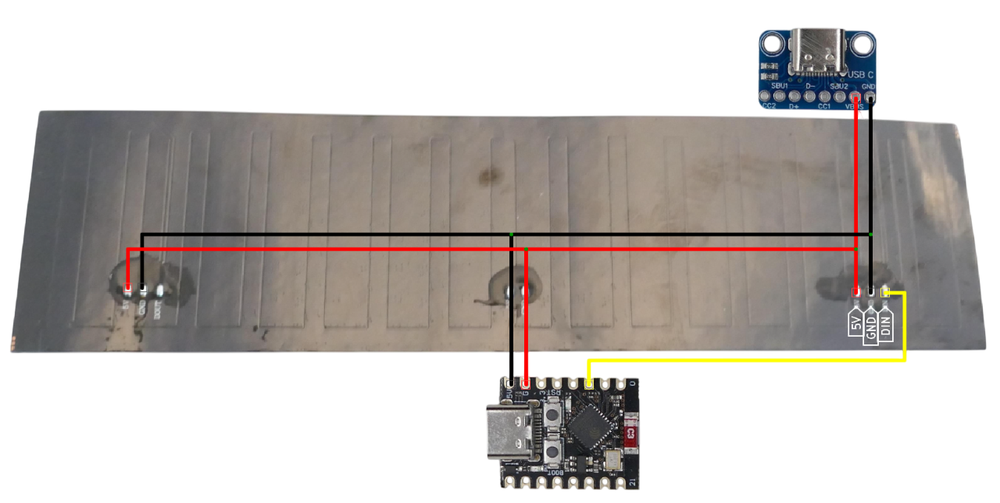

You can vary this simple schematic and connect microcontroller and USB-C connector to the power rail at any place. Just make sure:

* **DIN, not DOUT:** connect the control wire (yellow) to **DIN** on the panel, not **DOUT**! 
* **Configure GPIO:** connect the other end of the control wire to the *GPIO* you designated in *WLED settings*. By default, this is *GPIO2* (as seen in the schematics). Frequently, *GPIO4* is used instead (I did this in this project, too) since *GPIO4* is located closer to the power pins which I liked. If you want to use *GPIO4* (or any other GPIO other than *GPIO2*), you **must** [change the GPIO number](https://done.land/components/microcontroller/howtouse/firmware/fromsomeoneelse/wled/matrix8x8/#led-preferences) in *WLED settings*.

### Next Steps

Follow these detailed steps to assemble the LED Matrix Panel:

1. **Firmware Configuration:** Fine-tune the *WLED firmware settings* to match your microcontroller GPIO, and your LED panel.  
2. **LED Matrix Panel Preparation:** Remove any existing wiring from the panel and solder new wires according to the schematic above.  
3. **Assembly:** Connect the microcontroller and external USB plug to the matrix.  
4. **Housing:** Mount all components into a 3D-printed housing for a clean and sturdy build.

## 1. Firmware Configuration

First, let's *finalize* the [basic microcontroller configuration](https://done.land/components/microcontroller/howtouse/firmware/fromsomeoneelse/wled) to account for the microcontroller you are using, and the kind of LEDs you are going to control with it:

> [!IMPORTANT]
> Make sure you have [uploaded](https://done.land/components/microcontroller/howtouse/firmware/fromsomeoneelse/wled/) the *WLED* firmware successfully to your microcontroller, [connected to its web interface](https://done.land/components/microcontroller/howtouse/firmware/fromsomeoneelse/wled/#2-connecting-to-microcontroller), and performed the [basic initial configuration](https://done.land/components/microcontroller/howtouse/firmware/fromsomeoneelse/wled/#3-configuring-wled).    

[Connect to your microcontroller](https://done.land/components/microcontroller/howtouse/firmware/fromsomeoneelse/wled/#2-connecting-to-microcontroller), for example using your smart phone or PC, and navigate to its settings. Then click *LED Preferences*.

### LED Preferences

1. Check *Enable automatic brightness limiter*, and limit the maximum PSU current to *1800mA* (*850mA* by default). USB connections can safely provide at least *2A*, and with a large matrix like the one we are using here, *850mA* would limit the maximum brightness considerably.

    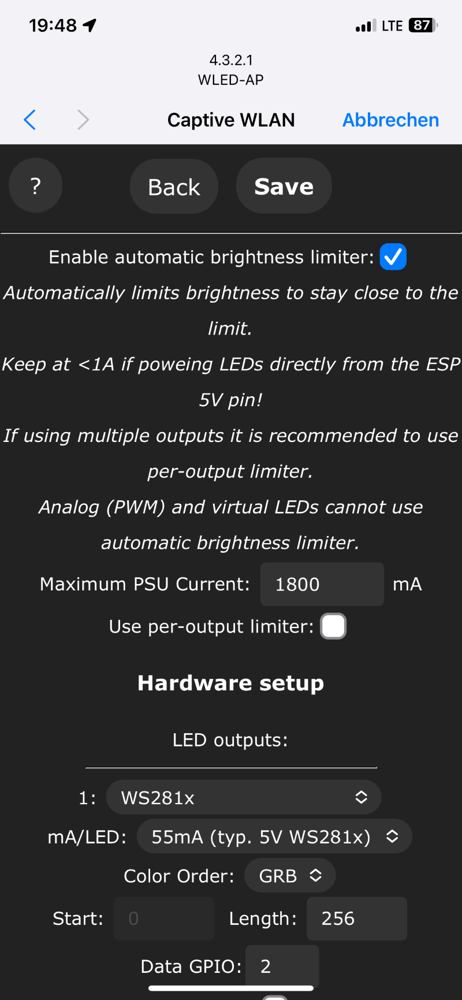

2. Tell *WLED* the number of *LEDs* you want to control (field *Length*). For a *8x32 LED Matrix*, that's **256 LEDs**:

    

3. Adjust *Data GPIO* to match the pin that you later want to use to control the *LED Matrix*. By default, this is set to *GPIO 2*. If you are using an *ESP32 C3 SuperMini*, you may want to change it to *GPIO 4* because this pin is closer to the power supply pin, making assembly easier.

Click *Save* at the top or bottom of the page to store your settings. You’ll then return to the main settings menu. Then, back in the main menu, click *2D Configuration* to proceed with the final step.

### 2D Configuration

*WLED* controls any number of programmable LEDs, whether they are laid out as a single strip or wrapped as a matrix. In order for the light effects to look right, you need to tell *WLED* the layout of your matrix:

1. Change the *2D Configuration* settings: under *Strip or panel*, select *2D Matrix*.

    

2. Scroll down to the section *LED panel layout*. Since the matrix we are using is **not symmetrical** (width and height are different), in *Orientation* choose *Vertical*. Check **Serpentine**. In the section below, you now see how the LEDs are expected to be connected. The serpentine style matches most commercially available LED matrix panels.

3. In *Dimensions*, specify the size of your panel: *32x8*. Then click *Save*.

    

> [!TIP]
> Make sure the panel layout in the picture below the settings matches your panel. On the backside of your panel, you can typically see the traces and how they are oriented. Each panel really is just a LED strip placed on the PCB, and WLED needs to know how the strip is layed out to correctly show light effects, especially *Scrolling Text*.

## LED Matrix Panel Preparation

Most *8x32 LED Matrix Panels* come with some wires and plugs preassembled:

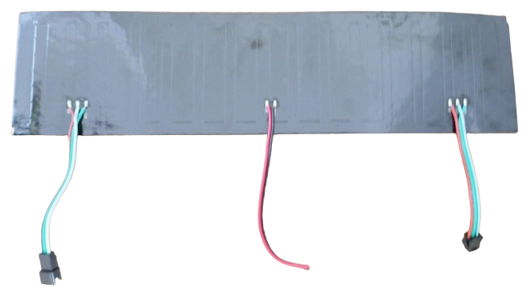

These cables need to be desoldered first. 

> [!TIP]
> Desoldering works best when you use some *flux*. Set your soldering iron to a high temperature (such as *430°C*), but only touch the pads for a few seconds so you don't damage the panel.  

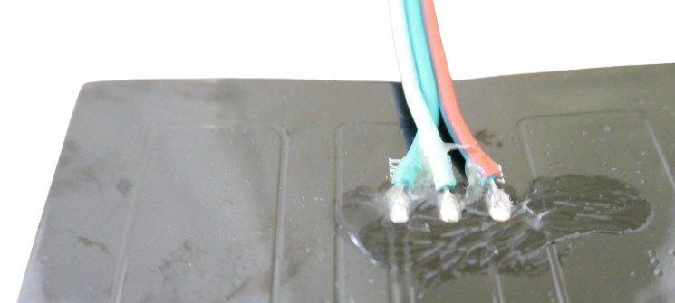

Once the old cables are removed, generously apply fresh solder to the pads. The matrix panel now should look similar to this:

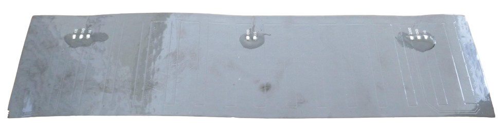

> [!IMPORTANT]
> Some sellers offer "water-proof" panels. Do not buy these, and save the considerably higher cost! They are using the very same LED panels and only add silicone to the soldering pads, making desoldering a lot harder.

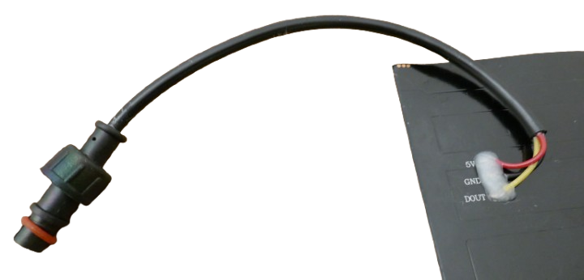

### Adding New Wires

Now, add the new wiring to your matrix panel according to the schematics above, and connect all *5V* pads with one wire, and all *GND* pads with another.

Do not forget to add the cables to connect the microcontroller and external USB plug. 

> [!TIP]
> Twisting together the wire ends before tinning them makes assembly a lot easier.     

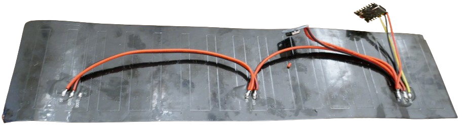

If you have a cutter knive, you can also use just one long cable and remove the insulation mid-span:

### Data Cable

Solder one data cable to **DIN** (do not confuse it with **DOUT**). This is the control wire that later controls the LED (color, brightness).

## 3. Assembly

Now add the microcontroller and external USB plug:

1. Connect the smaller spare power wires that you soldered to the LED matrix panel to the *5V* and *G* pins of your microcontroller.

    

2. Connect the data cable that you soldered to **DIN** (**not DOUT!**) to the pin labeled **2** on your microcontroller board (unless you changed the GPIO number in the WLED settings).
3. Connect the larger spare power wires that you soldered to the LED matrix panel to the pins *VBUS* and *GND*.

    

Here is a picture of the complete wiring:

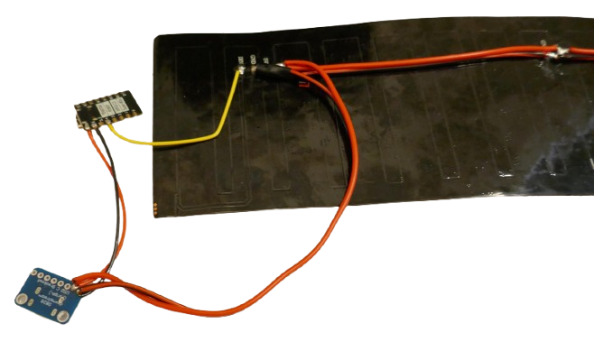

### Test Run

Once you connect the microcontroller to power by plugging in a USB cable, the LED matrix should start to glow orange. This is the default behavior. If the LED matrix stays dark, something is amiss.

> [!TIP]
> If the LED panel does not light up, measure the voltage at pins **5V** and **G**, and verify that you can measure **5V**. Ensure the data cable is connecting pin **2** on the microcontroller to the **DIN** pin on the LED panel. Double-check that you did not accidentally connect to **DOUT**. Finally, connect to the device and access the WLED configuration (see the initial section). Ensure you did not change the *GPIO assignment*, and if you did intentionally, confirm your assigned GPIO matches the GPIO that you connected the data cable to. Keep in mind that pin labels like **D2** on some microcontrollers are not identical to **GPIO 2**.

Refer to the [WLED](https://done.land/components/microcontroller/howtouse/firmware/fromsomeoneelse/wled/) article for more information on how to change colors, effects, etc.

## 4. Housing

For increased ruggedness and safety, mount your components in a housing. 

If you have a *3D printer*, you can print the housing I used below. Since the matrix dimensions are too large to print with most 3D printers, I split the housing into two parts that later snap together. You may want to use some glue to secure the parts for extra stability:

### STL Files

Here are the STL files for the housing and its cover:

- **Housing**: [Part 1](materials/mount1.stl) and [Part 2](materials/mount2.stl)
- **Cover**: [Part 1](materials/cover1.stl) and [Part 2](materials/cover2.stl)

For the cover, print it with a transparent material—either fully transparent or a translucent white or gray. This ensures the LEDs shine through effectively. 

> [!TIP]
> *PLA* works best for the housing body, while *PETG* is generally more translucent for covers. Gray PETG worked best as a cover material, while black matte PLA provided an excellent finish for the body.

### Combining Both Parts

Since the housing is too large for most 3D printers, it consists of two parts that snap together:

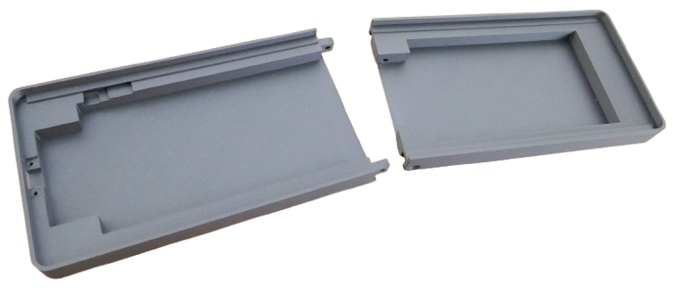

One part can be inserted into the other:

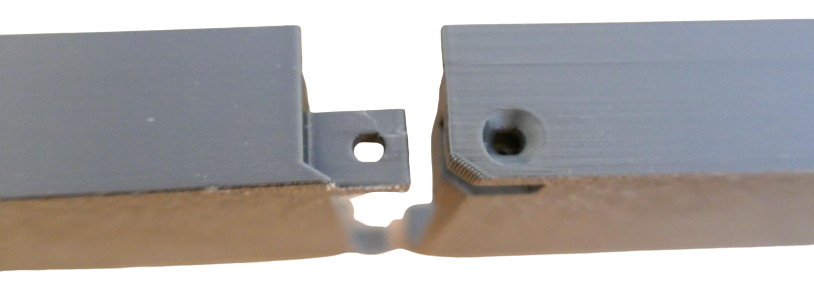

To assemble, place the right part on top of the left part, and apply pressure from the top to snap them together. Secure both parts permanently with an *M3* screw:

When screwed together, the housing becomes rock solid. The screw head will sink neatly into the wall of the part:

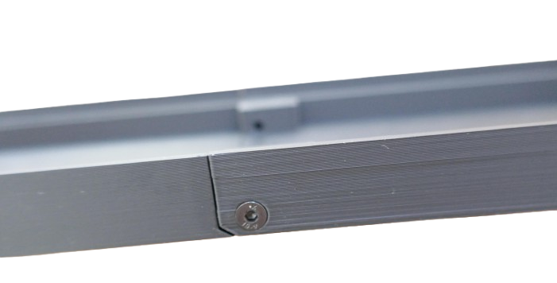

### Adding Components

Insert the USB adapter PCB into the designated recess and secure it with two *M2* screws. Then slide the [ESP32 C3 SuperMini](https://done.land/components/microcontroller/families/esp/esp32/c3/c3supermini/) into its compartment. Secure it with glue or tape:

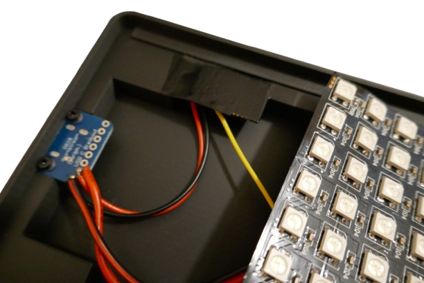

> [!NOTE]
> If you decide to use different components, the housing offers plenty of room for customization. Secure your components with glue, tape, or other fasteners as needed.

### Securing LED Panel

Apply double-sided tape to the designated areas inside the housing. Carefully place the LED panel, align it with the housing, and press it firmly onto the tape:

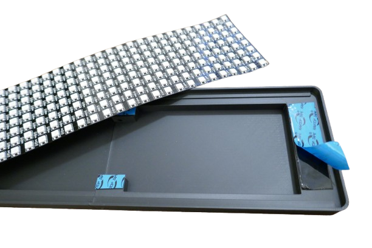

The panel also acts as a cover for the components beneath it, keeping everything secure and protected.

### Adding Covers

The cover, like the housing, is split into two parts. Ensure you print it using a transparent material:

Fit the cover onto the housing. It should snap into place easily. Before securing it, perform a test to ensure the cover aligns with the LEDs and provides sufficient transparency. Once satisfied, secure it with glue:

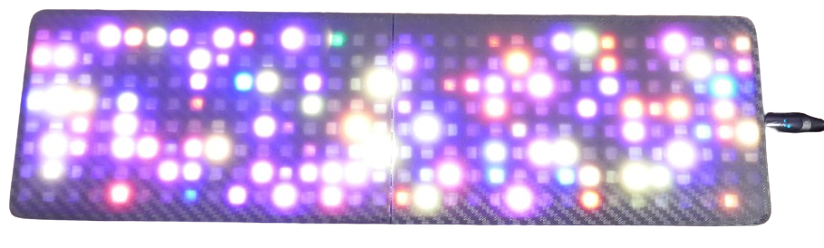

> [!TIP]
> The cover in the picture has a neat carbon-like pattern. You can achieve similar finishes on your 3D-printed parts by using a textured *print plate*. Affordable print plates with great patterns can be found on *AliExpress* or similar online stores, compatible with most 3D printers.
## Scrolling Text

Large LED panels like the one in this example are perfect not just for light effects but also for displaying text. *WLED* includes the *Scrolling Text* effect, which displays the current date and time when selected. (You may want to review the time zone settings in your WLED configuration to ensure accuracy):

The *Scrolling Text* effect is an excellent test to verify whether your *2D Layout Settings* in the *WLED settings* are configured correctly. If the text does not scroll horizontally or appears distorted, return to the [2D Configuration](https://done.land/components/microcontroller/howtouse/firmware/fromsomeoneelse/wled/matrix8x32/#2d-configuration) and double-check your settings. Pay close attention to the schematic display of your panel below the settings, and compare it to the physical wiring layout of your panel.

### Customizing Text with Static and Scrolling Options

*WLED* offers a variety of options for customizing text, accessible through sliders at the bottom of the effect settings. For example, you can adjust scroll speed and font size to suit your display needs:

#### Displaying Custom Text

You can also display *custom text*, but the process to set this up is not immediately intuitive. Follow these steps:

1. At the bottom of the *WLED settings*, click *Segments*. Then, click the pencil icon and rename the segment to the text you want to display. 
2. Remember to click the save icon at the bottom-right of the box to save your changes:

    

3. After saving, *WLED* will reset. You'll need to reselect the *Scrolling Text* effect, and your custom text will now be displayed.

### Static Text

If your text fits entirely on the LED panel, it will be shown as *static text*, and no scrolling will occur. However, when the text exceeds the display area, *WLED* automatically scrolls it. 

There is no separate setting to toggle between static and scrolling text—the length of your text determines the behavior.

### Limitations

Unfortunately, *WLED* does not support variable-width fonts. This limitation leads to wasted space and inconsistent appearance, particularly when displaying numbers or narrow letters. 

As a result, an *8x32* display like the one in this project is not ideal for displaying *static text*. The text would need to be very small to fit completely and avoid scrolling. 

For professional or practical use cases requiring static text, such as "DOCTOR," "EMERGENCY," or "POLICE," an *8x32* display often falls just short of the required space or lacks an efficient font. If this is your goal, consider the following options:

- **Expand Your Display:** Programmable LED panels can be easily daisy-chained to increase size. The flexible panel used in this project is also available as an *8x8* matrix. To extend your display, connect the *DIN* pin of an additional panel to the *DOUT* pin of the first panel. This allows you to create configurations like *8x40* or larger. Alternatively, you can start with *8x8 panels on solid PCBs*, as seen in [this project](https://done.land/components/microcontroller/howtouse/firmware/fromsomeoneelse/wled/matrix8x8/), and daisy-chain them to achieve your desired dimensions.
- **Use Better Firmware:** While *WLED* is an excellent multi-purpose firmware, it is not optimized for displaying static text. If static text in a crisp and space-efficient font is your priority, consider writing your own firmware. The [Adafruit NeoMatrix](https://learn.adafruit.com/adafruit-neopixel-uberguide/neomatrix-library) library simplifies rendering custom text and offers complete control over your display. You can use the same hardware presented here and simply upload your custom firmware to the microcontroller.

## Materials

[STL file for WLED Matrix Mount Part 1](materials/mount1.stl) 
[STL file for WLED Matrix Mount Part 2](materials/mount2.stl)     
[STL file for Cover (Part1)](materials/cover1.stl)
[STL file for Cover (Part2)](materials/cover2.stl) 

> Tags: WLED, WS2812, C3 SuperMini, Matrix, LED Matrix

[Visit Page on Website](https://done.land/components/microcontroller/howtouse/firmware/fromsomeoneelse/wled/matrix8x32?709278121124245211) - created 2024-12-23 - last edited 2024-12-23
