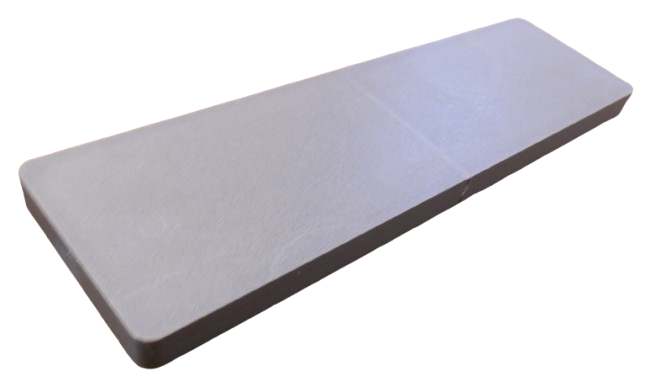
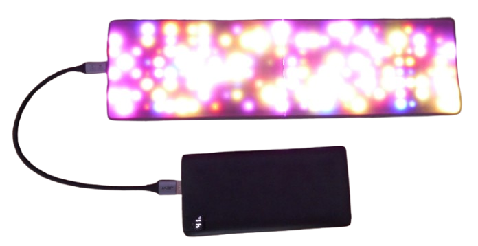

 
# WLED 8x32 LED Matrix

> Remote-Controllable 8x32 Matrix That Can Display Scrolling Text, Too

This project demonstrates how to create a flexible **8x32 LED matrix panel** powered by the free [WLED](https://done.land/components/microcontroller/howtouse/firmware/fromsomeoneelse/wled/) firmware.

## The Project

Before starting, ensure your ESP microcontroller is [provisioned](https://done.land/components/microcontroller/howtouse/firmware/fromsomeoneelse/wled/):

1. [Upload](https://done.land/components/microcontroller/howtouse/firmware/fromsomeoneelse/wled/#1-uploading-firmware) the *WLED* firmware directly from your browser.
2. [Configure](https://done.land/components/microcontroller/howtouse/firmware/fromsomeoneelse/wled/#3-configuring-wled) the *WLED settings* to match your microcontroller and GPIO(s).

### Parts List

The total cost of this project is under €15:

- **Microcontroller:** I used an [ESP32 C3 SuperMini](https://done.land/components/microcontroller/families/esp/esp32/c3/c3supermini/), which is very affordable (<€2) and has a small footprint. You can also use any ESP32 microcontroller or even an old [ESP8266](https://done.land/components/microcontroller/families/esp/esp8266/).  

    

- **8x32 RGB Matrix:** This project uses a [WS2812](https://done.land/components/light/led/programmable/ws2812/) **8x32 Matrix PCB**. A custom 3D-printable mount was designed to accommodate the panel’s dimensions.

    

- **USB Connector:** A separate USB adapter PCB is recommended, as most microcontroller boards cannot handle the high current demands (*1.8A or more*) of the LED matrix. Use a USB adapter PCB with traces rated for at least *2A*.  

    

> [!TIP]
> Ensure the USB adapter PCB includes two resistors to support *USB-C*-to-*USB-C* cables. Adapters without these resistors may only work with *USB-A* cables and older power supplies.

- **6 Cables:**  
    * 3 wires (26AWG) to connect the microcontroller.  
    * 2 two-wire cables (15cm, 20AWG) for the LED matrix power rail.  
    * 1 two-wire cable (5cm, 20-18AWG) for the external USB plug.

    

### Wiring

Below is the schematic for wiring the components:

### Next Steps

Follow these detailed steps to assemble the LED Matrix Panel:

1. **Firmware Configuration:** Fine-tune the *WLED firmware settings* to match your microcontroller and LED panel.  
2. **LED Matrix Panel Preparation:** Remove any existing wiring from the panel and solder new wires according to the schematic above.  
3. **Assembly:** Connect the microcontroller and external USB plug to the matrix.  
4. **Housing:** Mount all components into a 3D-printed housing for a clean and sturdy build.
## 1. Firmware Configuration

First, let's *finalize* the [basic microcontroller configuration](https://done.land/components/microcontroller/howtouse/firmware/fromsomeoneelse/wled) to account for the microcontroller you are using, and the kind of LEDs you are going to control with it:

> [!IMPORTANT]
> Make sure you have [uploaded](https://done.land/components/microcontroller/howtouse/firmware/fromsomeoneelse/wled/) the *WLED* firmware successfully to your microcontroller, [connected to its web interface](https://done.land/components/microcontroller/howtouse/firmware/fromsomeoneelse/wled/#2-connecting-to-microcontroller), and performed the [basic initial configuration](https://done.land/components/microcontroller/howtouse/firmware/fromsomeoneelse/wled/#3-configuring-wled).    

[Connect to your microcontroller](https://done.land/components/microcontroller/howtouse/firmware/fromsomeoneelse/wled/#2-connecting-to-microcontroller), for example using your smart phone or PC, and navigate to its settings. Then click *LED Preferences*.

### LED Preferences

1. Check *Enable automatic brightness limiter*, and limit the maximum PSU current to *1800mA* (*850mA* by default). USB connections can safely provide at least *2A*, and with a large matrix like the one we are using here, *850mA* would limit the maximum brightness considerably.

    

2. Tell *WLED* the number of *LEDs* you want to control (field *Length*). For a *8x32 LED Matrix*, that's **256 LEDs**:

    

3. Adjust *Data GPIO* to match the pin that you later want to use to control the *LED Matrix*. By default, this is set to *GPIO 2*. If you are using an *ESP32 C3 SuperMini*, you may want to change it to *GPIO 4* because this pin is closer to the power supply pin, making assembly easier.

Click *Save* at the top or bottom of the page to store your settings. You’ll then return to the main settings menu. Then, back in the main menu, click *2D Configuration* to proceed with the final step.

### 2D Configuration

*WLED* controls any number of programmable LEDs, whether they are laid out as a single strip or wrapped as a matrix. In order for the light effects to look right, you need to tell *WLED* the layout of your matrix:

1. Change the *2D Configuration* settings: under *Strip or panel*, select *2D Matrix*.

    

2. Scroll down to the section *LED panel layout*. Since the matrix we are using is **not symmetrical** (width and height are different), in *Orientation* choose *Horizontal*. Check **Serpentine**. In the section below, you now see how the LEDs are expected to be connected. The serpentine style matches most commercially available LED matrix panels.

    

3. In *Dimensions*, specify the size of your panel: *8x32*. Then click *Save*.

> [!TIP]
> If you specify *32x8* instead, or if you do not check *Serpentine* when your panel LEDs are connected in *serpentine style*, you'll notice later when you test-drive effects: they will appear scrambled and incoherent. You can always come back here later and adjust the settings if something seems amiss.

---

## LED Matrix Panel Preparation

Most *8x32 LED Matrix Panels* come with some wires and plugs preassembled:

These cables need to be desoldered first. 

> [!TIP]
> Desoldering works best when you use some *flux*. Set your soldering iron to a high temperature (such as *430°C*), but only touch the pads for a few seconds so you don't damage the panel.  

Once the old cables are removed, generously apply fresh solder to the pads. The matrix panel now should look similar to this:

> [!IMPORTANT]
> Some sellers offer "water-proof" panels. Do not buy these, and save the considerably higher cost! They are using the very same LED panels and only add silicone to the soldering pads, making desoldering a lot harder.

### Adding New Wires

Now, add the new wiring to your matrix panel according to the schematics above, and connect all *5V* pads with one wire, and all *GND* pads with another.

Do not forget to add the cables to connect the microcontroller and external USB plug. 

> [!TIP]
> Twisting together the wire ends before tinning them makes assembly a lot easier.     

### Data Cable

Solder one data cable to **DIN** (do not confuse it with **DOUT**). This is the control wire that later controls the LED (color, brightness).

---

## 3. Assembly

Now add the microcontroller and external USB plug:

1. Connect the smaller spare power wires that you soldered to the LED matrix panel to the *5V* and *G* pins of your microcontroller.

    

2. Connect the data cable that you soldered to **DIN** (**not DOUT!**) to the pin labeled **2** on your microcontroller board (unless you changed the GPIO number in the WLED settings).
3. Connect the larger spare power wires that you soldered to the LED matrix panel to the pins *VBUS* and *GND*.

    

### Test Run

Once you connect the microcontroller to power by plugging in a USB cable, the LED matrix should start to glow orange. This is the default behavior. If the LED matrix stays dark, something is amiss.

> [!TIP]
> If the LED panel does not light up, measure the voltage at pins **5V** and **G**, and verify that you can measure **5V**. Ensure the data cable is connecting pin **2** on the microcontroller to the **DIN** pin on the LED panel. Double-check that you did not accidentally connect to **DOUT**. Finally, connect to the device and access the WLED configuration (see the initial section). Ensure you did not change the *GPIO assignment*, and if you did intentionally, confirm your assigned GPIO matches the GPIO that you connected the data cable to. Keep in mind that pin labels like **D2** on some microcontrollers are not identical to **GPIO 2**.

Refer to the [WLED](https://done.land/components/microcontroller/howtouse/firmware/fromsomeoneelse/wled/) article for more information on how to change colors, effects, etc.

---

## 4. Housing

For increased ruggedness and safety, mount your components in a housing. 

If you have a *3D printer*, you can print the housing I used below. Since the matrix dimensions are too large to print with most 3D printers, I split the housing in two parts that later snap together (you may want to use some glue to secure the parts):

Here are the STL files:

- Housing: [Part 1](materials/mount1.stl) and [Part 2](materials/mount2.stl)
- Cover: [Part 1](materials/cover1.stl) and [Part 2](materials/cover2.stl)

For the cover, make sure you print with a transparent material, either fully transparent, or a translucent white or gray. 

> [!TIP]
> It turned out that *PLA* works best for the body, while *PETG* is generally more translucent. Gray PETG worked best for me as a cover, and for the body I used black matte PLA.

### Notes

The housing was designed for the components I used, i.e., the particular external USB plug PCB, and an [ESP32 C3 SuperMini](https://done.land/components/microcontroller/families/esp/esp32/c3/c3supermini/) microcontroller. 

If you use other components, you may have to adjust the housing a bit (or design your own). The housing reserves a lot of space for the cabling underneath the panel, so you can easily fit other microcontroller types here instead.

### Mounting USB Connector

Place the external USB connector into the reserved space so that you can access its *USB C* connector from the outside. If you managed to get the same PCB I used, it should snap into place with a firm press.

Make sure you secure the USB plug with two screws, and/or use glue: this component will be under physical stress when users plug in USB cables and should be secured extra well.

### Mounting Microcontroller

Place the microcontroller board into the designated recess in the mount. It is designed for an [ESP32 C3 SuperMini](https://done.land/components/microcontroller/families/esp/esp32/c3/c3supermini/).  

### Mounting LED Panel

The *8x32 LED matrix panel* serves as a cover and secures the microcontroller. Place some double-sided tape on the surfaces where the panel is going to rest, then press the panel on the tape to secure it.

### Mounting Covers

Place the two cover parts onto the body without securing it yet. Then, test drive the LED matrix, and double-check that your cover is translucent enough.

If all works for you, press the cover into place. Depending on the type of 3D printer and materials you use, you may have to use some force, or the covers may be a bit too loose. In the latter case, use glue to fix the cover. This is what the display should look like when mounted:

Once the LED panel is securely fastened, you’ll have a solid and rugged device. Plug in a USB-C cable to test it.

## Materials

[STL file for WLED Matrix Mount Part 1](materials/mount1.stl) 
[STL file for WLED Matrix Mount Part 2](materials/mount2.stl)     
[STL file for Cover (Part1)](materials/cover1.stl)
[STL file for Cover (Part2)](materials/cover2.stl) 

> Tags: WLED, WS2812, C3 SuperMini, Matrix, LED Matrix

[Visit Page on Website](https://done.land/components/microcontroller/howtouse/firmware/fromsomeoneelse/wled/matrix8x32?709278121124245211) - created 2024-12-23 - last edited 2024-12-23
