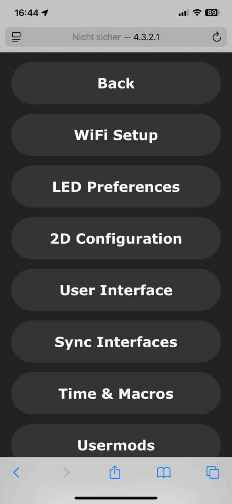
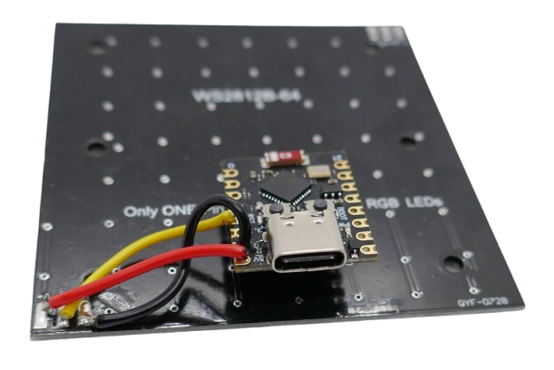
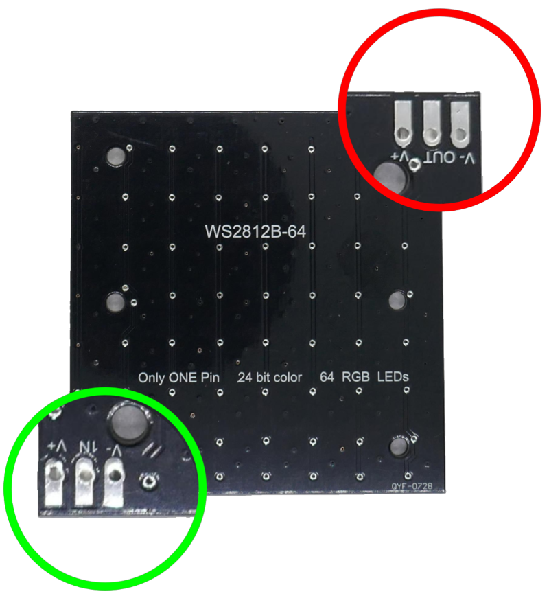
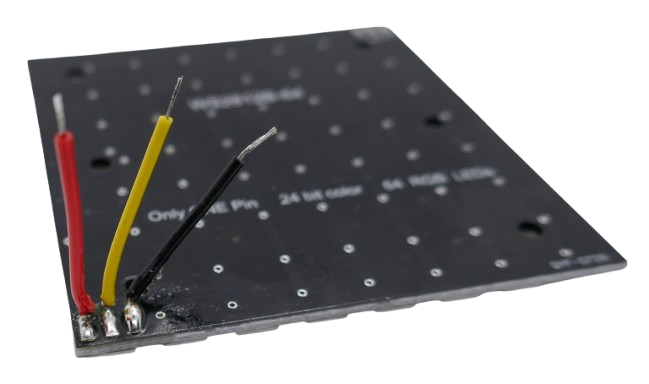
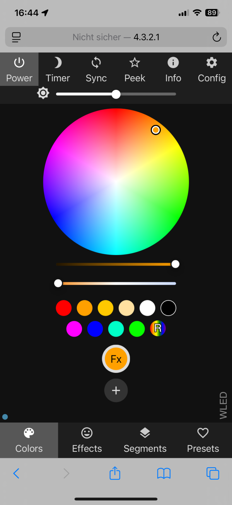

 
# WLED 8x8 LED Matrix

> Remote-Controllable 8x8 LED Cube

This project is putting the free [WLED](https://done.land/components/microcontroller/howtouse/firmware/fromsomeoneelse/wled/) firmware to work: your are going to create a neat 8x8 LED matrix cube.

## The Project

Before you start this project, make sure you [provisioned your ESP microcontroller](https://done.land/components/microcontroller/howtouse/firmware/fromsomeoneelse/wled/#1-uploading-firmware):

1. [Upload](https://done.land/components/microcontroller/howtouse/firmware/fromsomeoneelse/wled/#1-uploading-firmware) the *WLED* firmware to your microcontroller right from your browser.
2. [Configure](https://done.land/components/microcontroller/howtouse/firmware/fromsomeoneelse/wled/#3-configuring-wled) the *WLED settings* to match your microcontroller and your GPIO(s).

### Parts List

The parts for this project cost less than €5 in total:

- **Microcontroller:** I use a [ESP32 C3 SuperMini](https://done.land/components/microcontroller/families/esp/esp32/c3/c3supermini/) which is very affordable (<€2) and has a tiny footprint, but you can use any type of *ESP32* microcontroller (or even an old [ESP8266](https://done.land/components/microcontroller/families/esp/esp8266/)):

    

- **8x8 RGB Matrix:** I use a [WS2812](https://done.land/components/light/led/programmable/ws2812/) **8x8 Matrix PCB** and made a [3D-printable mount](materials/led_matrix_mount_for_wled.stl) for it:

    

    These PCB are currently available for cheap (<€1.50) at *AliExpress*, but any other matrix made of programmable LED will work.

* **3 Wires:** In addition, you'll just need three simple wires.

    

## 1. Configuration

First, let's *finalize* the [microcontroller configuration](https://done.land/components/microcontroller/howtouse/firmware/fromsomeoneelse/wled) to account for the microcontroller you are using, and the kind of LEDs you are going to control with it:

> [!IMPORTANT]
> Make sure you have [uploaded](https://done.land/components/microcontroller/howtouse/firmware/fromsomeoneelse/wled/) the *WLED* firmware successfully to your microcontroller, [connected to its web interface](https://done.land/components/microcontroller/howtouse/firmware/fromsomeoneelse/wled/#2-connecting-to-microcontroller), and performed the [basic initial configuration](https://done.land/components/microcontroller/howtouse/firmware/fromsomeoneelse/wled/#3-configuring-wled).    

[Connect to your microcontroller](https://done.land/components/microcontroller/howtouse/firmware/fromsomeoneelse/wled/#2-connecting-to-microcontroller), for example using your smart phone or PC, and navigate to its settings:

1. From the main menu, click *WIFI SETTINGS*, then click the *back* button. Alternatively, click *TO THE CONTROLS*, then select the *gear* icon in the top-right corner:

    

2. This brings you to the main settings menu, which organizes options into several categories. Click *LED Preferences*.

    

### LED Preferences

1. Tell *WLED* the number of *LEDs* you want to control (field *Length*). For a *8x8 LED Matrix*, that's **64 LEDs**:

    

2. Adjust *Data GPIO* to match the pin that you later want to use to control the *LED Matrix*. By default, this is set to *GPIO**2***. If you are using a *ESP32 C3 SuperMini*, you may want to change it to *GPIO**4*** because this pin is closer to the power supply pin, making assembly easier.

    

3. Click *Save* at the top or bottom of the page to store your settings. You’ll then return to the main settings menu. Then, back in the main menu, click *2D Configuration* to proceed with the final step.

### 2D Configuration

*WLED* controls any number of programmable LED, whether they are layed out as a single strip, or wrapped as a matrix. In order for the light effects to look right, you need to tell *WLED* the layout of your matrix:

1. Change the *2D Configuration* settings: under *Strip or panel*, select *2D Matrix*

    

2. Click *Save*.

> [!TIP]
> If you daisy-chain more than one matrix panel, in the lower part of the page you can define the physical arrangement of these panels (i.e. **horizontally** or **vertically**). With one symmetrical panel, you don't need to bother.

## 2. Assembly

Let’s now connect the microcontroller to the LEDs. This process is straightforward and requires only three wires:

In this setup, the microcontroller’s USB connection powers the entire device. The *data output* from the microcontroller’s **GPIO2** is connected to the **IN** pin on the LED panel (**do not confuse** this with the **OUT** pin, which serves a different purpose).

> [!TIP]
> Changing the data pin from GPIO **2** to **4** in the device settings (see above) eases the assembly as pin **4** is located much closer to the power supply pins.

### Caveats

This simple setup works well for the current configuration due to some helpful simplifications:

- **Power Supply:** A small number of LEDs (like the 64 in this example) can be powered directly from the USB port. For larger setups, such as daisy-chaining multiple matrix panels or using longer LED strips, a *dedicated 5V power supply* is required. This power supply should deliver adequate current and may need to be connected at multiple points on the LED strip to prevent voltage drops. Refer to the [WLED site](https://kno.wled.ge/basics/getting-started/) for advanced circuit designs.

- **Level Shifter:** While the *ESP32* uses *3.3V logic* and programmable LEDs typically require *5V logic*, a level shifter isn’t necessary in this case. This is because the *ESP32 GPIOs* are generally *5V tolerant*, and most LEDs can operate with slightly lower voltages. Ensure the data line is short (no more than *50cm*). For longer data lines, you’ll need a level shifter to prevent the data signal voltage from dropping below the LED’s requirements. Alternatively, place at least one programmable LED close to the microcontroller, as each LED re-amplifies the signal to *5V* for the next LED in the chain.

#### Do Not Confuse IN and OUT

Most LED panels have **two contact ports**, each exposing **three pins**:

Although the two ports look identical at first glance, one is the **input** port (**IN**) while the other is the **output** port (**OUT**) for daisy-chaining additional panels:

| Pin Label | Description                          | Connect to ESP32 C3 SuperMini Pin |
|-----------|--------------------------------------|------------------------------------|
| **IN**    | Data line coming from microcontroller | *GPIO2*                           |
| **OUT**   | Data line going to the next panel    | No connection                     |

Always connect the microcontroller’s *GPIO2* (or the GPIO configured in your *WLED settings*) to the **IN** pin on the LED panel. If connected to **OUT**, the panel will not respond to commands.

> [!TIP]
> The **OUT** pin is useful for daisy-chaining multiple matrix panels. Essentially, a *2D LED panel* functions as a long *LED strip* folded into slopes. Connect the **OUT** pin of the first panel to the **IN** pin of the second. Update your *WLED settings* to increase the total LED count (e.g., from 64 to 128 for two panels) and adjust the *2D Configuration* for the desired geometry (e.g., stacked horizontally or vertically).

### Wiring

Start by soldering three wires to the three pins of the programmable *LED Matrix* or *LED Strip*. Make sure you solder them *to the beginning* of the strip, not the end. In the case of a matrix, make sure you use the pins with the *IN* connection, not the *OUT* connection.

> [!TIP]
> Adjust the lengths of the cables to match the location where you want to mount the microcontroller board. You can glue the board directly to the LED panel. Just make sure you use some kind of insulation so that no contacts from the microcontroller board can connect to the many contact holes on the LED panel's backside. Plan ahead and consider the type of housing you intend to use. If you plan to use the *3D printed housing below*, the microcontroller needs to be placed halfway between the solder pads.

Next, connect the other ends of the wires to your microcontroller board according to the table and schematics above.

### Test Run

Once you connect the microcontroller to power by plugging in a USB cable, the LED matrix should start to glow orange. This is the default behavior. If the LED matrix stays dark, something is amiss.

> [!TIP]
> If the LED panel does not light up, measure the voltage at pins **5V** and **G**, and verify that you can measure **5V**. Ensure the data cable is connecting pin **2** on the microcontroller to the **IN** pin on the LED panel. Double-check that you did not accidentally connect to **OUT** instead. Finally, connect to the device and access the WLED configuration (see the initial section). Ensure you did not change the *GPIO assignment*, and if you did intentionally, confirm your assigned GPIO matches the GPIO connected to the data cable. Keep in mind that pin labels like **D2** on some microcontrollers are not identical to **GPIO 2**.

In the *WLED control panel*, you can now use the color wheel to change the color:

When you click *Effects* in the bottom icon bar, you’ll see a long list of predefined animated effects to choose from.

> [!TIP]
> After selecting an effect, return to the *Colors* page. You can now set the color(s) of the effect. If the effect has just one adjustable color, you’ll see the round icon "Fx" only. If the effect supports a secondary color, you’ll also see an icon labeled "Bg" (for *Background*). Click either one to assign a color.

Once you turn off the device (by unplugging the USB cable), it "forgets" all settings and starts with a solid orange color again the next time. To have it start with a specific effect, save your effect settings by clicking *Presets* and adding a new preset.

Each preset gets a number, and the first preset you define has ID *1*. By default, this preset is launched after boot. In the settings, you can adjust this behavior.

### Housing

For increased ruggedness and safety, mount your components in a housing. If you have a *3D printer*, you can [print the housing I used](materials/led_matrix_mount_for_wled.stl):

> [!TIP]
> I used *Sunlu PLA* in *black matte* which produced a beautiful housing. *PETG* turned out to be too shiny. It generally has an inferior print quality when compared to *PLA*, with much more visible layer lines.

Place the microcontroller board into the designated recess in the mount. Use insulation tape to cover the flat backside of the microcontroller board, ensuring none of its exposed areas can contact the LED panel's backside. Then, carefully place the LED panel on top of it. The panel serves as a protective cover and secures the microcontroller board in place.

The LED panels I’ve used have six mounting holes, and the 3D-printed mount has corresponding screw holes. Use six *M2* screws to secure the LED panel to the mount (probably two screws will also work).

Once the LED panel is securely fastened, you’ll have a solid and rugged device. Plug in a USB-C cable to test it.

### Transparent Cover

The *WS2812* LEDs look best uncovered, but tastes vary, and you may prefer extra protection. That’s why I have designed an optional [clickable cover plate](materials/led_matrix_mount_for_wled_cover.stl).

Depending on which material you use to print it, you can achieve different effects:

* **Transparent:** Transparent *PETG* or *PLA* produces a semi-transparent "milky" cover. With simple FDM 3D Printers, it is nearly impossible to print fully transparent objects. You may be able to improve transparency by tweaking settings and polishing. Note that *PLA* looked marginally better than *PETG*.

    

* **PVB:** This relatively new material can be smoothened with alcohol, and users report that this can create almost transparent objects. I experimented with *PVB* filament which led to my P1S printer becoming clogged in almost every possible place: I had to disassemble the entire print head, remove hardened PVB residue from the nozzle, and clean the extruder gearbox, which had glued-down gears. The printed result was more transparent than *PETG* but far from any "acrylic effect".
* **Resin Printers:** If you have access to a *3D Resin Printer*, you may be able to print acrylic-like fully transparent covers. I don’t have such a printer. 
* **Gray:** By accident, I printed one cover with *gray PETG*. To my surprise, this material was highly translucent even though it looks solid when the LEDs are off. You need to experiment as translucent effects are highly material-dependent. When I tried the same with *black PETG* from the same vendor, almost no light passed the cover. The *gray PETG* cover turned out to be my favorite choice: the device looks elegant when turned off, and once the LEDs are on, there is an awesome smoothing effect.

    

* **Holes:** By aligning circular holes in the cover with the LEDs, you get a cover that preserves full brightness.

    

I provide you with two *STL* files for the cover: a [solid cover](materials/led_matrix_mount_for_wled_cover.stl), and a [cover with 8x8 3.5mm holes](materials/led_matrix_mount_for_wled_cover_hole.stl).

> [!NOTE]
> The cover with holes is hand-tailored to the particular 8x8 LED matrix PCB I used, and aligns perfectly with the LEDs. Since the placement of the LEDs on that PCP isn't perfectly concentric, make sure you snap on the cover in the right orientation: check to see that the LEDs and holes align. If your LED matrix has a different layout, you may want to use the solid cover.

## Materials

[STL file for WLED Matrix Mount](materials/led_matrix_mount_for_wled.stl)     
[STL file for WLED Matrix Mount Clickable Cover (Solid)](materials/led_matrix_mount_for_wled_cover.stl)    
[STL file for WLED Matrix Mount Clickable Cover (8x8 Holes)](materials/led_matrix_mount_for_wled_cover_hole.stl)    

> Tags: WLED, WS2812, C3 SuperMini, Matrix, LED Matrix

[Visit Page on Website](https://done.land/components/microcontroller/howtouse/firmware/fromsomeoneelse/wled/matrix8x8?081850121218241152) - created 2024-12-17 - last edited 2024-12-20
