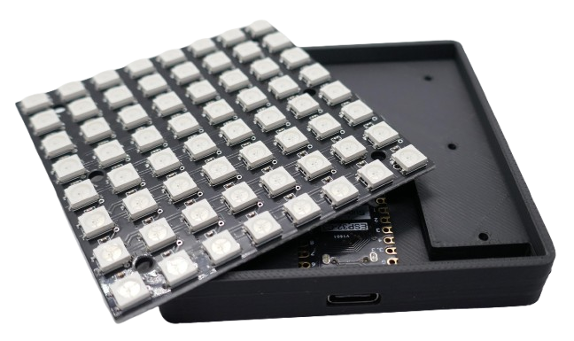

 
# WLED

> Controlling LED Strips and Matrices Using WLED and an ESP32

WLED is an open-source firmware designed to control LED strips, offering a wide range of effects, colors, and brightness adjustments via a web interface, app, or external integrations like [Home Assistant](https://done.land/tools/software/homeassistant/).

It runs on [ESP8266](https://done.land/components/microcontroller/families/esp/esp8266/) or [ESP32](https://done.land/components/microcontroller/families/esp/esp32/) microcontrollers and supports popular LED types like [WS2812](https://done.land/components/light/led/programmable/ws2812/) and [SK6812](https://done.land/components/light/led/programmable/sk6812/). With features like timers, presets, and synchronization with other devices, WLED is a versatile and user-friendly solution for creating dynamic lighting setups.

You do not need to have any programming experience or specialized tools. A web-based uploader can install the **ready-to-use WLED firmware** on your microcontroller. All you need is a compatible browser (e.g., **Chrome**).

## The Project

In this project, I demonstrate the power of cheap **ESP32** microcontroller boards and guide you through all the steps to convert an **ESP32 C3 SuperMini** and an **8x8 WS2812 RGB Matrix Panel** into a fun light-effect cube.

> [!TIP]
> You can use any other **ESP32** development board and hook up any programmable RGB light source, including **LED strips**. Just follow the same steps, and swap in the components you want to use instead.

### Parts List

The parts for this project cost less than €5 in total:

- **Microcontroller:** I use a [ESP32 C3 SuperMini](https://done.land/components/microcontroller/families/esp/esp32/c3/c3supermini/) which is very affordable (<€2) and has a tiny footprint:

    

- **RGB Light Source:** I use a [WS2812](https://done.land/components/light/led/programmable/ws2812/) **8x8 Matrix Panel** that fits nicely into a [3D-printed mount](materials/led_matrix_mount_for_wled.stl):

    

### Steps

Here is a quick overview of what to expect in this project:

1. **Install WLED Firmware:** Learn how to upload the **WLED** firmware easily using a USB cable and your browser.
2. **Configure WLED:** Connect to the **WLED access point** with a smartphone and adjust the most important settings. This includes how to adapt for different **ESP boards**, **LED light sources**, or **LED strips**.
3. **Soldering:** Learn how to connect programmable LEDs to your microcontroller board using just three wires.
4. **Final Product:** Use the provided **STL files** to 3D-print a housing and assemble the components. If you don’t have a 3D printer, you can mount the setup on any surface.

---

## 1. Uploading Firmware

Before proceeding, ensure [your microcontroller is recognized](https://done.land/components/microcontroller/howtouse/connecttopc/) by your PC when connected via USB cable. When you plug in the USB cable, the microcontroller board should power up, a **red LED** should light up (in the case of an ESP32 C3 SuperMini), and your PC should play the typical chime indicating a new USB device was successfully connected.

> [!IMPORTANT]
> If nothing happens when you connect the microcontroller or the PC doesn’t detect it, check for issues like a faulty USB cable or missing USB drivers. [Resolve these issues](https://done.land/components/microcontroller/howtouse/connecttopc/) before moving forward.

### Browser-Based Firmware Upload

1. Connect your microcontroller to your PC via USB.
2. Open a **Chromium-based browser** (e.g., Chrome, Edge, Opera, or Brave) and navigate to [install.wled.me](https://install.wled.me/).

> [!NOTE]
> The browser-based upload requires support for the **Web Serial API**. Browsers like **Firefox** and **Safari** may not work. If you can’t use a supported browser, refer to [other techniques](https://kno.wled.ge/basics/install-binary/), though they are more complex.

On the WLED website:

1. Select the firmware version you want to install.
2. Click **Install**. A popup appears, showing connected microcontroller boards. Select your device and click **Connect**:

    

> [!NOTE]
> If no devices are listed, close all browser instances and try again. If the problem persists, reboot your PC. Sometimes USB ports are locked by other applications, and a reboot clears these locks. If the list is still empty, verify [your microcontroller’s connection](https://done.land/components/microcontroller/howtouse/connecttopc/) and ensure drivers are installed.

Next:

1. Confirm you want to install the **WLED firmware**, overwriting any existing firmware:

    

2. The installation process begins:
   - The flash memory is erased (this takes a few seconds).
   - The new firmware is uploaded:

    

3. Once completed, click **Next**:

    

4. The wizard will offer to connect the microcontroller to a WLAN. **Skip this step** for now, allowing the device to use its own **WiFi Access Point**. You can connect it to a WLAN later:

    

5. Close the wizard when it offers additional services. Your microcontroller is now ready to use:

    

## 2. Connecting Wirelessly to the Microcontroller

Now that the *WLED firmware* is running on your microcontroller, you can connect to it wirelessly to review and edit all of its settings.

### Connect to WLED-AP

Take your smartphone and open its WLAN settings. After a few seconds, a new *WLAN hotspot* named **WLED-AP** should appear in the list:

Select **WLED-AP** and connect. After a short while, you will be prompted to enter a password. The default password is **wled1234**. Enter the password and establish the connection:

### Navigate to 4.3.2.1

Once connected, you will be redirected to a website with the IP address **http://4.3.2.1**. This may happen automatically as part of the connection process, often displayed under a header like *Captive WLAN*:

Alternatively, you can manually navigate to **http://4.3.2.1** using your smartphone's browser:

> [!TIP]
> If the *Captive WLAN* window appears, you can close it and manually navigate to **4.3.2.1** in your browser for a better interface. Note that the website will be marked as "not secure" because it uses *http* instead of *https*. This is intentional since encryption would unnecessarily burden the microcontroller, and the data transferred is not sensitive.

## 3. Configure WLED

Now that you're connected to the microcontroller, let's review the key settings. You can access these settings in two ways:

1. From the main menu, click *WIFI SETTINGS*, then click the *back* button.
2. Alternatively, click *TO THE CONTROLS*, then select the *gear* icon in the top-right corner:

This brings you to the main settings menu, which organizes options into several categories:

### WiFi Setup

In this section, you can rename the *WLAN access point* from **WLED-AP** to a custom name. Additionally, you can replace the default password (**wled1234**) with a more secure one:

> [!IMPORTANT]
> Since communications are unencrypted, avoid using sensitive passwords that you also use for other purposes.

### LED Preferences

Here, you define the type of *LEDs* connected to your microcontroller. For this project, we’re using a *8x8 LED Matrix Panel* with 64 programmable *WS2812* LEDs.

Although a matrix is laid out in 2D, it functions like a wrapped *LED strip*. Therefore, the total number of LEDs (64) should be entered in the *Length* field.

> [!TIP]
> If the LED colors don’t match the expected output, experiment with the *LED Type* and *Color Order* settings. For different ESP32 boards, adjust *Data GPIO* to match the pin controlling the LEDs. By default, this is set to *GPIO2*, which remains unchanged here.

Click *Save* at the top or bottom of the page to store your settings. You’ll then return to the main settings menu.

### 2D Configuration

When using a matrix instead of a simple LED strip, configure the *2D Configuration* settings:

Under *Strip or panel*, select *2D Matrix*, then click *Save*.

### Security & Update

Finally, navigate to the *Security & Update* section. Ensure you enable *Lock wireless (OTA) software updates* to prevent unauthorized firmware uploads. When this option is unchecked, others could potentially upload new firmware to your device:

## 4. Connecting the Microcontroller and LEDs

Let’s connect the microcontroller to the LEDs. This process is straightforward and requires only three wires:

In this setup, the microcontroller’s USB connection powers the entire device. The *data output* from the microcontroller’s **GPIO2** is connected to the **IN** pin on the LED panel (**do not confuse** this with the **OUT** pin, which serves a different purpose).

### Caveats

This simple setup works well for the current configuration due to some helpful simplifications:

- **Power Supply:** A small number of LEDs (like the 64 in this example) can be powered directly from the USB port. For larger setups, such as daisy-chaining multiple matrix panels or using longer LED strips, a *dedicated 5V power supply* is required. This power supply should deliver adequate current and may need to be connected at multiple points on the LED strip to prevent voltage drops. Refer to the [WLED site](https://kno.wled.ge/basics/getting-started/) for advanced circuit designs.

- **Level Shifter:** While the *ESP32* uses *3.3V logic* and programmable LEDs typically require *5V logic*, a level shifter isn’t necessary in this case. This is because the *ESP32 GPIOs* are generally *5V tolerant*, and most LEDs can operate with slightly lower voltages. Ensure the data line is short (no more than *50cm*). For longer data lines, you’ll need a level shifter to prevent the data signal voltage from dropping below the LED’s requirements. Alternatively, place at least one programmable LED close to the microcontroller, as each LED re-amplifies the signal to *5V* for the next LED in the chain.

#### Do Not Confuse IN and OUT

Most LED panels have **two contact ports**, each exposing **three pins**:

Although the two ports look identical at first glance, one is the **input** port (**IN**) while the other is the **output** port (**OUT**) for daisy-chaining additional panels:

| Pin Label | Description                          | Connect to ESP32 C3 SuperMini Pin |
|-----------|--------------------------------------|------------------------------------|
| **IN**    | Data line coming from microcontroller | *GPIO2*                           |
| **OUT**   | Data line going to the next panel    | No connection                     |

Always connect the microcontroller’s *GPIO2* (or the GPIO configured in your *WLED settings*) to the **IN** pin on the LED panel. If connected to **OUT**, the panel will not respond to commands.

> [!TIP]
> The **OUT** pin is useful for daisy-chaining multiple matrix panels. Essentially, a *2D LED panel* functions as a long *LED strip* folded into slopes. Connect the **OUT** pin of the first panel to the **IN** pin of the second. Update your *WLED settings* to increase the total LED count (e.g., from 64 to 128 for two panels) and adjust the *2D Configuration* for the desired geometry (e.g., stacked horizontally or vertically).

## Materials

[STL file for WLED Matrix Mount](materials/led_matrix_mount_for_wled.stl)

> Tags: WLED, WS2812, C3 SuperMini, Matrix, LED Matrix

[Visit Page on Website](https://done.land/components/microcontroller/howtouse/firmware/fromsomeoneelse/wled?081850121218241152) - created 2024-12-17 - last edited 2024-12-17
