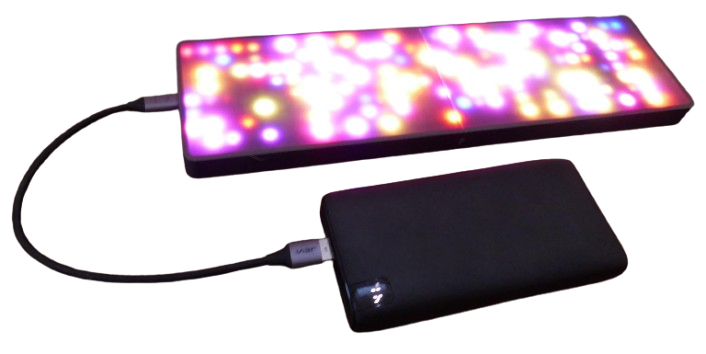
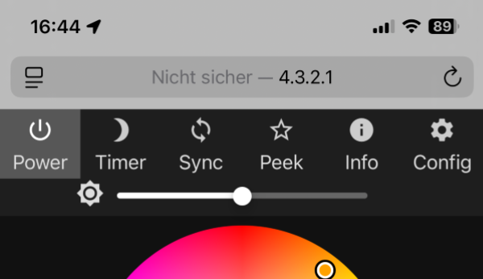
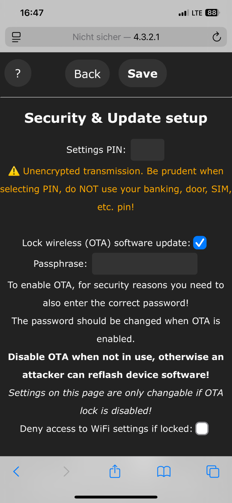

 
# WLED

> Controlling LED Strips and Matrices Using WLED and an ESP32

[WLED](https://kno.wled.ge/) is a free open-source firmware that you can upload to any *ESP32* microcontroller in less than 2 minutes. This turns your microcontroller into a LED controller for LED strips and LED matrix displays.

It offers a wide [range of effects](https://kno.wled.ge/features/effects/), colors, and brightness adjustments via a web interface, app, and even integrates with frameworks like [Home Assistant](https://done.land/tools/software/homeassistant/).

With a minimum of effort, you can build awesome yet affordable *LED devices* and illuminations:

## Overview

WLED runs on [ESP8266](https://done.land/components/microcontroller/families/esp/esp8266/) or [ESP32](https://done.land/components/microcontroller/families/esp/esp32/) microcontrollers and supports popular LED types like [WS2812](https://done.land/components/light/led/programmable/ws2812/) and [SK6812](https://done.land/components/light/led/programmable/sk6812/). With features like timers, presets, and synchronization with other devices, WLED is a versatile and user-friendly solution for creating dynamic lighting setups.

You do not need to have any programming experience or specialized tools. A web-based uploader can install the **ready-to-use WLED firmware** on your microcontroller. All you need is a compatible browser (e.g., **Chrome**).

### What You Need
Working with the *WLED* firmware is exceptionally easy and rewarding: you can use affordable and readily available hardware:

* **Microcontroller:** any *ESP32* will do, even the tiny [ESP32 C3 SuperMini](https://done.land/components/microcontroller/families/esp/esp32/c3/c3supermini/) works great. Avoid [ESP8266](https://done.land/components/microcontroller/families/esp/esp8266/) unless you want to control only a small number of *LED*.
* **Programmable LEDs:** almost any *programmable LED type* will work (you can adjust LED type and color assignments inside the *WLED* settings): use a classic *light strip*, or use one or more two-dimensional matrix panels (which essentially are just wrapped strips). Strips and matrix panels can be *daisy-chained* to create almost any shape or form.

### Steps

When you start a *WLED project*, these are the typical two steps:

1. **Microcontroller Provisioning:**
    - [Install WLED Firmware:](#1-uploading-firmware) Learn how to upload the **WLED** firmware easily using a USB cable and your browser.
    - [Connect to Microcontroller:](#2-connecting-to-microcontroller) connect to your microcontroller with a smartphone or PC. The microcontroller running *WLED* can be configured to either spawn its own WiFi access point (in which case you switch to this access point in your WiFi settings with the default password **wled1234**), or joined to your home *WiFi network* (in which case you directly navigate to its *mDNS device name* or its *IP address*)
    - [Configure WLED:](#3-configuring-wled) Adjust the basic WLED settings. 
2. **Implementing Your Project Idea:**    
    With your microcontroller running *WLED*, you can now fine-tune its settings to reflect your project idea, and add the wiring:

    * **Finalize Configuration:** Revisit the microcontrollers' WLED settings, and at minimum configure the number, type, and layout of LEDs you want to control. 
    * **Special Options:** Set the *GPIO* that you want to use to control the *LEDs* (if you don't want to use the default *GPIO2*). Set any other option you want to use, i.e. enabling special button presses.
    * **Wiring:** Connect the LED control GPIO (by default GPIO2 unless you changed it) to the data **IN***PUT* pin of your matrix panel, or the **Start** of your LED strip. Connect microcontroller and LEDs to power, and make sure both share the same *ground*.

In *this* article, I am walking you through the *Provisioning* part: you learn how to provision any *ESP32 microcontroller* so it runs the *WLED firmware*.

Once that is done, you can dive right into the many *WLED example projects* I have also prepared for you.

## 1. Uploading Firmware

The first and most important step is to successfully connect your microcontroller to your PC: ensure [your microcontroller is recognized](https://done.land/components/microcontroller/howtouse/connecttopc/) by your PC when connected via USB cable: the microcontroller board should power up, and your PC **should play the typical chime** signalling a newly discovered USB device.

> [!IMPORTANT]
> If nothing happens when you connect the microcontroller or the PC doesn’t detect it, check for issues like a faulty USB cable or missing USB drivers. [Resolve these issues first](https://done.land/components/microcontroller/howtouse/connecttopc/) before moving on.

### Browser-Based Firmware Upload
Once your microcontroller is connected and recognized by your PC, here are the steps to upload the *WLED firmware* to it:

1. Open a **Chromium-based browser** (e.g., Chrome, Edge, Opera, or Brave) and navigate to [install.wled.me](https://install.wled.me/).

    > [!NOTE]
    > The browser-based upload requires support for the **Web Serial API**. Browsers like **Firefox** and **Safari** may not work. If you can’t use a supported browser, refer to [other techniques](https://kno.wled.ge/basics/install-binary/), though they are more complex.

2. On the WLED website, select the firmware version you want to install.
3. Click **Install**. A popup appears, showing connected microcontroller boards. Select your device and click **Connect**:

    

> [!NOTE]
> If no devices are listed, close all browser instances and try again. If the problem persists, reboot your PC. Sometimes USB ports are locked by other applications, and a reboot clears these locks. If the list is still empty, verify [your microcontroller’s connection](https://done.land/components/microcontroller/howtouse/connecttopc/) and ensure drivers are installed.

Next:

1. Confirm you want to install the **WLED firmware**, overwriting any existing firmware:

    

2. The installation process begins:
   - The flash memory is erased (this takes a few seconds).
   - The new firmware is uploaded:

    

3. Once completed, click **Next**:

    

4. The wizard will offer to connect the microcontroller to a WLAN. **Skip this step** for now, allowing the device to use its own **WiFi Access Point**. You can connect it to a WLAN later:

    

5. Close the wizard when it offers additional services. Your microcontroller is now ready to use:

    

## 2. Connecting to Microcontroller

Now that the *WLED firmware* is running on your microcontroller, you can connect to it wirelessly to review and edit all of its settings.

### Connect to WLED-AP

Take your smartphone and open its WLAN settings. After a few seconds, a new *WLAN hotspot* named **WLED-AP** should appear in the list:

Select **WLED-AP** and connect. After a short while, you will be prompted to enter a password. The default password is **wled1234**. Enter the password and establish the connection:

### Navigate to IP Address 4.3.2.1

Once connected, you will be redirected to a website with the IP address **http://4.3.2.1**. This may happen automatically as part of the connection process, often displayed under a header like *Captive WLAN*:

Alternatively, you can manually navigate to **http://4.3.2.1** using your smartphone's browser:

> [!TIP]
> If the *Captive WLAN* window appears, you can close it and manually navigate to **4.3.2.1** in your browser for a better interface. Note that the website will be marked as "not secure" because it uses *http* instead of *https*. This is intentional since encryption would unnecessarily burden the microcontroller, and the data transferred is not sensitive.

## 3. Configuring WLED

Now that you're connected to the microcontroller, let's review the key settings. You can access these settings in two ways:

1. From the main menu, click *WIFI SETTINGS*, then click the *back* button.
2. Alternatively, click *TO THE CONTROLS*, then select the *gear* icon in the top-right corner:

This brings you to the main settings menu, which organizes options into several categories:

### WiFi Setup
Here you control how the device can later be reached.

You can rename its *WLAN access point* (default is **WLED-AP**). You can also replace the default password (**wled1234**) with a more secure one:

> [!IMPORTANT]
> Since communications are unencrypted, avoid using sensitive passwords that you use for sensitive purposes elsewhere.

#### Robust: Use Device WiFi Hotspot
If you do not connect your device to your home *WiFi*, it automatically opens its own *WiFi Hotspot*. This works best: Temporarily connecting to this hotspot when you need to change settings is robust and simple.

> [!TIP]
> When you change the *WiFi connection* in your smartphone, it may take up to a minute until the settings page shows the new access point. It is called *WLED-AP** by default and uses the default password **wled1234**.

#### Convenient but Wacky: Integrating Into Home WiFi
Should you want to connect more frequently to your *WLED device*, i.e. because you want to change the light effects frequently, then you can permanently join the device to your home *WiFi* network. This way, you don't need to change *WiFi hotspots*.

Instead, you now need to know the devices' *name* or *IP address* (since now no automatic captive portal opens).

By default, *WLED* uses *mDNS* device names and assigns a random name like *wled-dXXXXX.local* ("X" being numbers) unless you assign a better name. You can enter this name directly into your browsers' address bar, for example: *http://wled-d35288.local*.

The sad fact is though that *mDNS device names* often do not work. Most problems arise once your *WiFi* network is connected to a wired network in which case *mDNS* name resolution can fail. 

If this occurs, assign a *fixed IP address* to your device so it won't randomly change, and you always know its address when you want to connect to it. 

> [!NOTE]
> If you assign a static IP address, make sure the IP address you pick matches your networks' subnet mask (else it might be unreachable for other devices), and is not covered by your *DHCP address range* (else the IP address may be assigned to other devices as well and cause address conflicts).

### Security & Update

Enable *Lock wireless (OTA) software updates* to prevent unauthorized firmware uploads. When this option is **un**checked, others could potentially upload new firmware to your device:

## What's Next
Once you have configured your microcontroller as suggested, it is now ready to be used in your *WLED projects*.

When you connect its designated *GPIO* (*GPIO2* by default) to the *data in* pin of your LED strip or matrix panel, and power both from the same *ground*, you should see the first 32 LEDs turn *orange* (*32* is the default LED *length*, and *orange* is the default color effect).

The next steps now are (a) fine-tuning your *WLED settings* to match number and type of LEDs you want to control, and (b) wiring up the components.

### Power Supply

With small projects like a short LED strip or a simple 8x8 matrix panel, things are very easy, and you can power both microcontroller and LEDs conveniently from USB: connect the LED *GND* to the microcontrollers' *GND*, and connect the LED *5V* pin to the microcontrollers *5V* pin.

### USB: 2A (5A) Maximum Current

When you use *USB* as your power supply, you need to make sure the total current stays below *2A*, and here is why:

* **Traces:** The dimensions of the traces on the microcontroller board (leading from the USB connector to the *5V* and *Ground* pins) typically are small. They heat up when using more than *2A* of current. Higher currents can destroy your microcontroller board.
* **USB Standards:** normal USB cables can supply a maximum of *3A* by definition, and high performance USB power supplies **in combination with** appropriate high-power USB cables can supply up to *5A*. 

For any LED project that goes beyond these limits, you will need a dedicated external power supply.

#### LED Current Requirements
Each programmable RGB LED can typically draw a maximum of *60mA* (RGBW *80mA*). This would theoretically limit the number of LEDs to only *33* in order to keep below the *2A maximum current*.

This maximum current will be drawn only when all three colors are set at full brightness, and all LEDs are turned on like this at the same time, though - which hardly ever happens.

That's why you can get away with the *2A* limit even for *8x32 matrix panels* (256 LEDs). 

As a safe guard, the *WLED settings* allow you to define a *maximum current threshold* (by default *850mA*): the firmware automatically monitors and restricts the LEDs from ever consuming more than this in total. With effects that turn on a large number of LEDs simultaneously, maximum brightness is then reduced.

> [!TIP]
> Less is more: effects look best at low total brightness. Janking up brightness to *100%* doesn't improve the looks. It just turns the LED strip into a heater, and makes complex and expensive external power supply designs mandatory. Running effects with *10-20% brightness* typically looks just as good, while keeping the device cool - and you can conveniently supply it from USB power.

### Power Supplies, Fuses, Capacitors
If you *do* want to use the fullest possible brightness, and/or need to control very long strips or huge matrix displays with more than *256 LEDs*, this is entire possible but designing a safe and sufficient circuit is a lot more complex now.

You now [may need *fuses*, *capacitors*, *level-shifters*, and sophisticated wiring](https://kno.wled.ge/basics/getting-started/). The same is true when you plan on using programmable LED other than *5V types*, i.e. *12V strips*.

[Here](https://kno.wled.ge/basics/top5_mistakes/) are the top 5 wiring and configuration mistakes.    

> Tags: WLED, WS2812, Provision, Firmware, Configuration

[Visit Page on Website](https://done.land/components/microcontroller/howtouse/firmware/fromsomeoneelse/wled?103448121723241333) - created 2024-12-22 - last edited 2024-12-22
