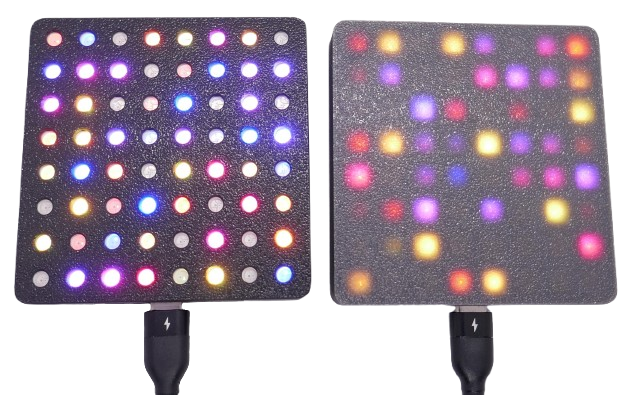

 
# WLED

> Controlling LED Strips and Matrices Using WLED and an ESP32

WLED is an open-source firmware designed to control LED strips, offering a wide range of effects, colors, and brightness adjustments via a web interface, app, or external integrations like [Home Assistant](https://done.land/tools/software/homeassistant/).

It runs on [ESP8266](https://done.land/components/microcontroller/families/esp/esp8266/) or [ESP32](https://done.land/components/microcontroller/families/esp/esp32/) microcontrollers and supports popular LED types like [WS2812](https://done.land/components/light/led/programmable/ws2812/) and [SK6812](https://done.land/components/light/led/programmable/sk6812/). With features like timers, presets, and synchronization with other devices, WLED is a versatile and user-friendly solution for creating dynamic lighting setups.

You do not need to have any programming experience or specialized tools. A web-based uploader can install the **ready-to-use WLED firmware** on your microcontroller. All you need is a compatible browser (e.g., **Chrome**).

## The Project

In this project, I demonstrate the power of cheap **ESP32** microcontroller boards and guide you through all the steps to convert an **ESP32 C3 SuperMini** and an **8x8 WS2812 RGB Matrix Panel** into a fun light-effect cube.

> [!TIP]
> You can use any other **ESP32** development board and hook up any programmable RGB light source, including **LED strips**. Just follow the same steps, and swap in the components you want to use instead.

### Parts List

The parts for this project cost less than €5 in total:

- **Microcontroller:** I use a [ESP32 C3 SuperMini](https://done.land/components/microcontroller/families/esp/esp32/c3/c3supermini/) which is very affordable (<€2) and has a tiny footprint:

    

- **RGB Light Source:** I use a [WS2812](https://done.land/components/light/led/programmable/ws2812/) **8x8 Matrix Panel** that fits nicely into a [3D-printed mount](materials/led_matrix_mount_for_wled.stl):

    

### Steps

Here is a quick overview of what to expect in this project:

1. **Install WLED Firmware:** Learn how to upload the **WLED** firmware easily using a USB cable and your browser.
2. **Configure WLED:** Connect to the **WLED access point** with a smartphone and adjust the most important settings. This includes how to adapt for different **ESP boards**, **LED light sources**, or **LED strips**.
3. **Soldering:** Learn how to connect programmable LEDs to your microcontroller board using just three wires.
4. **Assembly:** Use the provided **STL files** to 3D-print a housing and assemble the components. If you don’t have a 3D printer, you can mount the setup on any surface.

---

## 1. Uploading Firmware

Before proceeding, ensure [your microcontroller is recognized](https://done.land/components/microcontroller/howtouse/connecttopc/) by your PC when connected via USB cable. When you plug in the USB cable, the microcontroller board should power up, a **red LED** should light up (in the case of an ESP32 C3 SuperMini), and your PC should play the typical chime indicating a new USB device was successfully connected.

> [!IMPORTANT]
> If nothing happens when you connect the microcontroller or the PC doesn’t detect it, check for issues like a faulty USB cable or missing USB drivers. [Resolve these issues](https://done.land/components/microcontroller/howtouse/connecttopc/) before moving forward.

### Browser-Based Firmware Upload

1. Connect your microcontroller to your PC via USB.
2. Open a **Chromium-based browser** (e.g., Chrome, Edge, Opera, or Brave) and navigate to [install.wled.me](https://install.wled.me/).

> [!NOTE]
> The browser-based upload requires support for the **Web Serial API**. Browsers like **Firefox** and **Safari** may not work. If you can’t use a supported browser, refer to [other techniques](https://kno.wled.ge/basics/install-binary/), though they are more complex.

On the WLED website:

1. Select the firmware version you want to install.
2. Click **Install**. A popup appears, showing connected microcontroller boards. Select your device and click **Connect**:

    

> [!NOTE]
> If no devices are listed, close all browser instances and try again. If the problem persists, reboot your PC. Sometimes USB ports are locked by other applications, and a reboot clears these locks. If the list is still empty, verify [your microcontroller’s connection](https://done.land/components/microcontroller/howtouse/connecttopc/) and ensure drivers are installed.

Next:

1. Confirm you want to install the **WLED firmware**, overwriting any existing firmware:

    

2. The installation process begins:
   - The flash memory is erased (this takes a few seconds).
   - The new firmware is uploaded:

    

3. Once completed, click **Next**:

    

4. The wizard will offer to connect the microcontroller to a WLAN. **Skip this step** for now, allowing the device to use its own **WiFi Access Point**. You can connect it to a WLAN later:

    

5. Close the wizard when it offers additional services. Your microcontroller is now ready to use:

    

## 2. Connecting to Microcontroller

Now that the *WLED firmware* is running on your microcontroller, you can connect to it wirelessly to review and edit all of its settings.

### Connect to WLED-AP

Take your smartphone and open its WLAN settings. After a few seconds, a new *WLAN hotspot* named **WLED-AP** should appear in the list:

Select **WLED-AP** and connect. After a short while, you will be prompted to enter a password. The default password is **wled1234**. Enter the password and establish the connection:

### Navigate to 4.3.2.1

Once connected, you will be redirected to a website with the IP address **http://4.3.2.1**. This may happen automatically as part of the connection process, often displayed under a header like *Captive WLAN*:

Alternatively, you can manually navigate to **http://4.3.2.1** using your smartphone's browser:

> [!TIP]
> If the *Captive WLAN* window appears, you can close it and manually navigate to **4.3.2.1** in your browser for a better interface. Note that the website will be marked as "not secure" because it uses *http* instead of *https*. This is intentional since encryption would unnecessarily burden the microcontroller, and the data transferred is not sensitive.

## 3. Configuring WLED

Now that you're connected to the microcontroller, let's review the key settings. You can access these settings in two ways:

1. From the main menu, click *WIFI SETTINGS*, then click the *back* button.
2. Alternatively, click *TO THE CONTROLS*, then select the *gear* icon in the top-right corner:

This brings you to the main settings menu, which organizes options into several categories:

### WiFi Setup

In this section, you can rename the *WLAN access point* from **WLED-AP** to a custom name. Additionally, you can replace the default password (**wled1234**) with a more secure one:

> [!IMPORTANT]
> Since communications are unencrypted, avoid using sensitive passwords that you also use for other purposes.

If you do not connect your device to your home *WiFi*, it automatically opens its own *WiFi Hotspot*. This works best for me: when I really need to contact the device, I temporarily connect to this hotspot. This works great.

Should you want to connect more frequently, switching *WiFi networks* may be cumbersome, in which case you can join the device to your home *WiFi* network (go to *WiFi Settings*).

Now you need to know either the *IP address* or the *device DNS name* to reach it, though. By default, *WLED* uses *mDNS* device names and assigns a random name like *wled-dXXXXX.local* ("X" being numbers). You can change the device name in the devices' *WiFi Settings*. That's a good thing because in most *WiFi networks*, *IP addresses* are dynamically assigned via *DHCP* and can change.

However ingenious the idea of *mDNS* is, the sad fact is that *mDNS* often does not work. Most problems arise once your *WiFi* network is connected to a wired network in which case *mDNS* name resolution simply fails. 

If this occurs, assign a *fixed IP address* to your device so it won't randomly change and you always know its address when you want to connect to it.

### LED Preferences

Define the type of *LEDs* connected to your microcontroller. 

For this project, we’re using a *8x8 LED Matrix Panel* with 64 programmable *WS2812* LEDs. Although a matrix is laid out in 2D, it functions like a wrapped *LED strip*. Therefore, the total number of LEDs (64) should be entered in the *Length* field.

If you want to control a classic LED strip instead, enter the number of LEDs on that strip.

> [!TIP]
> If the LED colors don’t match the expected output, experiment with the *LED Type* and *Color Order* settings. 

For different ESP32 boards, adjust *Data GPIO* to match the pin controlling the LEDs. By default, this is set to *GPIO2*, which remains unchanged here.

You may want to change the *GPIO* to optimize later assembly: with the *ESP32 C3 SuperMini*, for example, using GPIO **4** instead of the default **2** ensures that all three cables can be soldered close to each other to the microcontroller board. The picture below illustrates how the yellow data cable is soldered to pin **4** which is located much closer to the power supply pins. 

Click *Save* at the top or bottom of the page to store your settings. You’ll then return to the main settings menu.

### 2D Configuration

When using a matrix instead of a simple LED strip, change the *2D Configuration* settings:

Under *Strip or panel*, select *2D Matrix*, then click *Save*.

> [!TIP]
> If you daisy-chain more than one matrix panel, in the lower part of the page you can define the physical arrangement of these panels (i.e. horizontally or vertically). With just one panel, you don't need to bother.

### Security & Update

Ensure you enable *Lock wireless (OTA) software updates* to prevent unauthorized firmware uploads. When this option is unchecked, others could potentially upload new firmware to your device:

## 4. Assembly

Let’s now connect the microcontroller to the LEDs. This process is straightforward and requires only three wires:

In this setup, the microcontroller’s USB connection powers the entire device. The *data output* from the microcontroller’s **GPIO2** is connected to the **IN** pin on the LED panel (**do not confuse** this with the **OUT** pin, which serves a different purpose).

> [!TIP]
> Changing the data pin from GPIO **2** to **4** in the device settings (see above) eases the assembly as pin **4** is located much closer to the power supply pins.

### Caveats

This simple setup works well for the current configuration due to some helpful simplifications:

- **Power Supply:** A small number of LEDs (like the 64 in this example) can be powered directly from the USB port. For larger setups, such as daisy-chaining multiple matrix panels or using longer LED strips, a *dedicated 5V power supply* is required. This power supply should deliver adequate current and may need to be connected at multiple points on the LED strip to prevent voltage drops. Refer to the [WLED site](https://kno.wled.ge/basics/getting-started/) for advanced circuit designs.

- **Level Shifter:** While the *ESP32* uses *3.3V logic* and programmable LEDs typically require *5V logic*, a level shifter isn’t necessary in this case. This is because the *ESP32 GPIOs* are generally *5V tolerant*, and most LEDs can operate with slightly lower voltages. Ensure the data line is short (no more than *50cm*). For longer data lines, you’ll need a level shifter to prevent the data signal voltage from dropping below the LED’s requirements. Alternatively, place at least one programmable LED close to the microcontroller, as each LED re-amplifies the signal to *5V* for the next LED in the chain.

#### Do Not Confuse IN and OUT

Most LED panels have **two contact ports**, each exposing **three pins**:

Although the two ports look identical at first glance, one is the **input** port (**IN**) while the other is the **output** port (**OUT**) for daisy-chaining additional panels:

| Pin Label | Description                          | Connect to ESP32 C3 SuperMini Pin |
|-----------|--------------------------------------|------------------------------------|
| **IN**    | Data line coming from microcontroller | *GPIO2*                           |
| **OUT**   | Data line going to the next panel    | No connection                     |

Always connect the microcontroller’s *GPIO2* (or the GPIO configured in your *WLED settings*) to the **IN** pin on the LED panel. If connected to **OUT**, the panel will not respond to commands.

> [!TIP]
> The **OUT** pin is useful for daisy-chaining multiple matrix panels. Essentially, a *2D LED panel* functions as a long *LED strip* folded into slopes. Connect the **OUT** pin of the first panel to the **IN** pin of the second. Update your *WLED settings* to increase the total LED count (e.g., from 64 to 128 for two panels) and adjust the *2D Configuration* for the desired geometry (e.g., stacked horizontally or vertically).
### Wiring

Start by soldering three wires to the three pins of the programmable *LED Matrix* or *LED Strip*. Make sure you solder them *to the beginning* of the strip, not the end. In the case of a matrix, make sure you use the pins with the *IN* connection, not the *OUT* connection.

> [!TIP]
> Adjust the lengths of the cables to match the location where you want to mount the microcontroller board. You can glue the board directly to the LED panel. Just make sure you use some kind of insulation so that no contacts from the microcontroller board can connect to the many contact holes on the LED panel's backside. Plan ahead and consider the type of housing you intend to use. If you plan to use the *3D printed housing below*, the microcontroller needs to be placed halfway between the solder pads.

Next, connect the other ends of the wires to your microcontroller board according to the table and schematics above.

### Test Run

Once you connect the microcontroller to power by plugging in a USB cable, the LED matrix should start to glow orange. This is the default behavior. If the LED matrix stays dark, something is amiss.

> [!TIP]
> If the LED panel does not light up, measure the voltage at pins **5V** and **G**, and verify that you can measure **5V**. Ensure the data cable is connecting pin **2** on the microcontroller to the **IN** pin on the LED panel. Double-check that you did not accidentally connect to **OUT** instead. Finally, connect to the device and access the WLED configuration (see the initial section). Ensure you did not change the *GPIO assignment*, and if you did intentionally, confirm your assigned GPIO matches the GPIO connected to the data cable. Keep in mind that pin labels like **D2** on some microcontrollers are not identical to **GPIO 2**.

In the *WLED control panel*, you can now use the color wheel to change the color:

When you click *Effects* in the bottom icon bar, you’ll see a long list of predefined animated effects to choose from.

> [!TIP]
> After selecting an effect, return to the *Colors* page. You can now set the color(s) of the effect. If the effect has just one adjustable color, you’ll see the round icon "Fx" only. If the effect supports a secondary color, you’ll also see an icon labeled "Bg" (for *Background*). Click either one to assign a color.

Once you turn off the device (by unplugging the USB cable), it "forgets" all settings and starts with a solid orange color again the next time. To have it start with a specific effect, save your effect settings by clicking *Presets* and adding a new preset.

Each preset gets a number, and the first preset you define has ID *1*. By default, this preset is launched after boot. In the settings, you can adjust this behavior.

### Housing

For increased ruggedness and safety, mount your components in a housing. If you have a *3D printer*, you can [print the housing I used](materials/led_matrix_mount_for_wled.stl):

> [!TIP]
> I used *Sunlu PLA* in *black matte* which produced a beautiful housing. *PETG* turned out to be too shiny. It generally has an inferior print quality when compared to *PLA*, with much more visible layer lines.

Place the microcontroller board into the designated recess in the mount. Use insulation tape to cover the flat backside of the microcontroller board, ensuring none of its exposed areas can contact the LED panel's backside. Then, carefully place the LED panel on top of it. The panel serves as a protective cover and secures the microcontroller board in place.

The LED panels I’ve used have six mounting holes, and the 3D-printed mount has corresponding screw holes. Use six *M2* screws to secure the LED panel to the mount (probably two screws will also work).

Once the LED panel is securely fastened, you’ll have a solid and rugged device. Plug in a USB-C cable to test it.

### Transparent Cover

The *WS2812* LEDs look best uncovered, but tastes vary, and you may prefer extra protection. That’s why I have designed an optional [clickable cover plate](materials/led_matrix_mount_for_wled_cover.stl).

Depending on which material you use to print it, you can achieve different effects:

* **Transparent:** Transparent *PETG* or *PLA* produces a semi-transparent "milky" cover. With simple FDM 3D Printers, it is nearly impossible to print fully transparent objects. You may be able to improve transparency by tweaking settings and polishing. Note that *PLA* looked marginally better than *PETG*.

    

* **PVB:** This relatively new material can be smoothened with alcohol, and users report that this can create almost transparent objects. I experimented with *PVB* filament which led to my P1S printer becoming clogged in almost every possible place: I had to disassemble the entire print head, remove hardened PVB residue from the nozzle, and clean the extruder gearbox, which had glued-down gears. The printed result was more transparent than *PETG* but far from any "acrylic effect".
* **Resin Printers:** If you have access to a *3D Resin Printer*, you may be able to print acrylic-like fully transparent covers. I don’t have such a printer. 
* **Gray:** By accident, I printed one cover with *gray PETG*. To my surprise, this material was highly translucent even though it looks solid when the LEDs are off. You need to experiment as translucent effects are highly material-dependent. When I tried the same with *black PETG* from the same vendor, almost no light passed the cover. The *gray PETG* cover turned out to be my favorite choice: the device looks elegant when turned off, and once the LEDs are on, there is an awesome smoothing effect.

    

* **Holes:** By aligning circular holes in the cover with the LEDs, you get a cover that preserves full brightness.

    

I provide you with two *STL* files for the cover: a [solid cover](materials/led_matrix_mount_for_wled_cover.stl), and a [cover with 8x8 3.5mm holes](materials/led_matrix_mount_for_wled_cover_hole.stl).

> [!NOTE]
> The cover with holes is hand-tailored to the particular 8x8 LED matrix PCB I used, and aligns perfectly with the LEDs. Since the placement of the LEDs on that PCP isn't perfectly concentric, make sure you snap on the cover in the right orientation: check to see that the LEDs and holes align. If your LED matrix has a different layout, you may want to use the solid cover.

## Materials

[STL file for WLED Matrix Mount](materials/led_matrix_mount_for_wled.stl)     
[STL file for WLED Matrix Mount Clickable Cover (Solid)](materials/led_matrix_mount_for_wled_cover.stl)    
[STL file for WLED Matrix Mount Clickable Cover (8x8 Holes)](materials/led_matrix_mount_for_wled_cover_hole.stl)    

> Tags: WLED, WS2812, C3 SuperMini, Matrix, LED Matrix

[Visit Page on Website](https://done.land/components/microcontroller/howtouse/firmware/fromsomeoneelse/wled?081850121218241152) - created 2024-12-17 - last edited 2024-12-17
