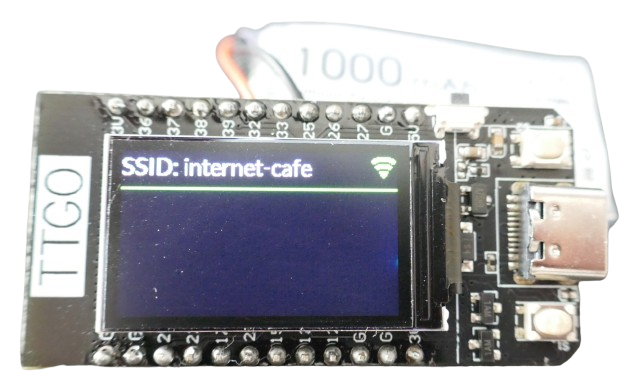

 
# Programming Microcontrollers

> Successfully Get Started With Microcontrollers

The first step in starting with microcontrollers is choosing an appropriate *development board*. A development board is a *ready-to-use PCB* with a specific microcontroller and all necessary peripherals (like USB connectors, UART, crystal, and power supply).

## Choosing a Microcontroller Board

Your microcontroller board should be *easy to use*, especially when you are new to microcontrollers. Consider these aspects:

* **Popular:** Choose a microcontroller type that is *popular* in the community. This ensures you can find plenty of example code, good advice, and documentation. The two most popular options are [Arduinos](https://done.land/components/microcontroller/families/arduino/) and the [ESP32 family](https://done.land/components/microcontroller/families/esp/esp32/) of microcontrollers.
* **Future-Proof:** Make sure the board is powerful enough and has sufficient memory. While most boards can run basic *blink* sketches, you'll quickly need more capability for advanced projects. Additionally, the board's voltage regulator must handle connected sensors and peripherals. When comparing [ESP32 and Arduinos](https://done.land/components/microcontroller/families/comparison/arduinovsesp32/), it becomes clear that *ESP32* boards are far more powerful and future-proof than typical *Arduino* boards.
* **Affordable:** Instead of spending €10-20 on a single branded *Arduino* board, you can buy 10-20 *ESP32* boards for the same cost from *AliExpress*. Boards may get damaged during experiments, or you may want to dedicate boards to specific projects. Having spares is highly recommended.

### ESP32 Works Best

The clear recommendation is to **avoid getting an Arduino**. Instead, start with an *ESP32* board. Here is why:

* **Easier:** When *Arduinos* first appeared, they were renowned for their ease of use. However, *Arduino* is not a microcontroller but a *company name*. Over time, various *Arduino board types* have emerged, using different microcontrollers and pin layouts. Today, getting an *Arduino code example* to work can be frustrating: you may need extra drivers, pin configuration changes, and more. In contrast, the *ESP32* family of microcontrollers is much easier to use.
* **Affordable:** Arduino boards are often overpriced, with branded models costing €20-30. By comparison, *ESP32* boards offer much more memory, faster processors, and built-in wireless capabilities at a fraction of the cost.
* **Same Toolchain:** Both *Arduinos* and *ESP32* use the same toolchains. If you prefer the *ArduinoIDE* to write firmware, you can use it for either board.
* **Better Examples and Projects:** The *ESP32* ecosystem has extensive support, with projects like [ESPHome](https://esphome.io/) for firmware development and integration with [Home Assistant](https://www.home-assistant.io/) for smart home automation. Similarly, [WLED](https://kno.wled.ge/) provides tools to control LED strips directly with an *ESP32*. Arduinos often miss out on these modern capabilities.

> [!NOTE]
> One reason *ESP32* is superior may be its origins in the *smart device industry*. Originally designed for professional hardware producers, *ESP32* microcontrollers are affordable and frequently updated. Arduino, by contrast, is a private company that struggled to stay modern after its early success.

> [!TIP]
> Another option is the [ESP8266](https://done.land/components/microcontroller/families/esp/esp8266/). Don't buy it. It is the *ESP32*'s predecessor, and today you can get a *ESP32* for the same price. *ESP32* boards are faster, have more memory, and use better peripherals. *ESP8266* boards were also notorious for poor voltage regulators, leading to instability when peripherals were connected.

### Recommended ESP32 Development Boards

One of the best beginner boards is the [ESP32 C3 SuperMini](https://done.land/components/microcontroller/families/esp/esp32/c3/c3supermini/): it is highly affordable (around €1.50 on AliExpress), easy to handle, and small enough to fit on a breadboard. It features *4MB* flash memory, *WiFi* and *Bluetooth*, and a programmable on-board LED, making it perfect for entry-level and advanced projects. This board uses the new *ESP32-C3* microcontroller, which is *single-core*. While not as fast as classic *ESP32* boards, it is much faster than most *Arduino* boards and sufficient for most projects.

Another excellent beginner option is the [T-Display LilyGO](https://done.land/components/microcontroller/families/esp/esp32/classicesp32/t-display/) board, often available for under €5 on *AliExpress*. It features a classic *dual-core ESP32*, capable of handling compute-intensive tasks and compatible with the vast *ESP32* ecosystem. It includes a color display, two programmable buttons, and a *LiIon battery* connector, making it ideal for portable and wireless battery-powered projects. Its *deep sleep* power consumption is better than average, and you can [reduce it to below 300uA](https://done.land/components/microcontroller/families/esp/esp32/classicesp32/t-display/programming/usingesphome/addingdeepsleep/), which is excellent for general use.

### Where To Buy

Don't hesitate to buy from sources like *AliExpress*. Prices are lower because you buy almost directly from manufacturers, avoiding middlemen.

When shopping on *Amazon*, *eBay*, or local dealers, you may pay substantially higher prices for the same boards.

> [!TIP]
> *AliExpress* affordability stems from factors like fewer middlemen and less strict quality control. Based on experience, about 1 in 300 boards may have a defect or poor soldering. To account for this, purchase in bulk (packs of 5 or 10). Even when a single board should be defective, you will still save significantly compared to buying single boards at a national (re)seller.

## Next Steps

Once you've selected and purchased a microcontroller board, the next step is *connecting it to your PC* via USB cable, then *programming* it.

### Connect the Board to Your PC

Regardless of whether you plan to write firmware or use pre-made firmware, the first step is to [connect your microcontroller board to your PC](https://done.land/components/microcontroller/howtouse/connecttopc/) via USB. Verify that your PC recognizes the board.

### Firmware

Once your board is connected, you can upload *firmware*. *Firmware* basically is the software program that runs on a microcontroller.

#### Pre-Made Firmware via Browser Upload

If you chose an *ESP32* board, you don't need to write firmware yourself. Here are two examples of pre-made *ESP32* firmware that can be uploaded directly from your browser:

* **[WLED](https://install.wled.me/):** Visit [install.wled.me](https://install.wled.me/) to install WLED firmware. It lets you control programmable *LED strips* or matrix displays.
* **[ESPHome](https://web.esphome.io/):** Visit [web.esphome.io](https://web.esphome.io/) to install [ESPHome](https://done.land/tools/software/esphome/introduction/) firmware. With ESPHome, you can create firmware using simple text configurations and upload it wirelessly to your *ESP32* board.

For more options, explore [additional pre-made firmware](https://done.land/components/microcontroller/howtouse/firmware/fromsomeoneelse/).

> [!IMPORTANT]
> Pre-made firmware **must match your microcontroller type**. That's why above examples work for *ESP32* boards but cannot be used on *Arduino*.

#### Programming Your Own Firmware 

If you have programming skills or sample code, you can use a [development environment to compile the source code](https://done.land/components/microcontroller/howtouse/firmware/writingownfirmware/) into firmware. Once compiled, the firmware can be uploaded to your microcontroller.

During compilation, you specify the target microcontroller type. That's why source code originally written for *Arduino* can be compiled to run on an *ESP32* as well.

> [!NOTE]
> If the source code uses hard-coded GPIO pins, you may need to adjust the pin numbers to match your microcontroller. While microcontrollers are abstracted by development tools, specific pin numbers and layouts can differ. 

> Tags: Microcontroller, First Steps, Beginner, Board, Recommendation

[Visit Page on Website](https://done.land/components/microcontroller/howtouse?343890051021241839) - created 2024-05-20 - last edited 2024-12-15
