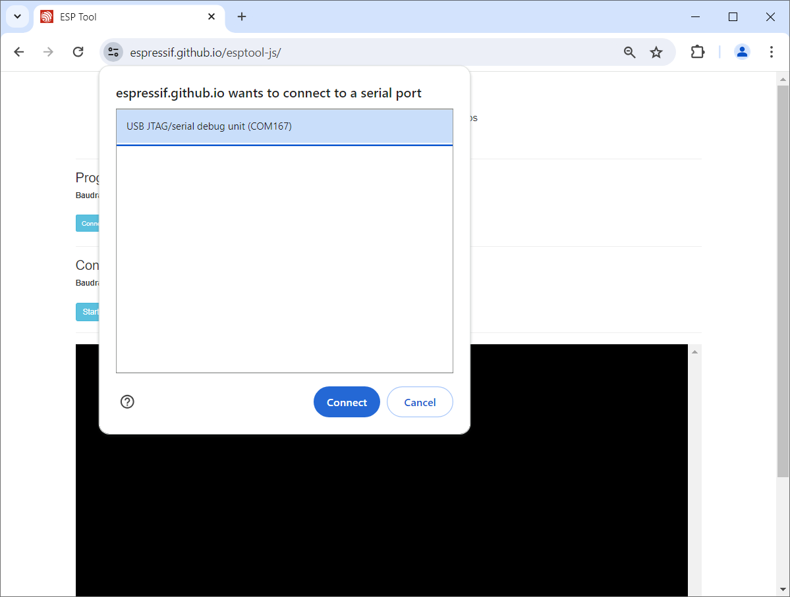
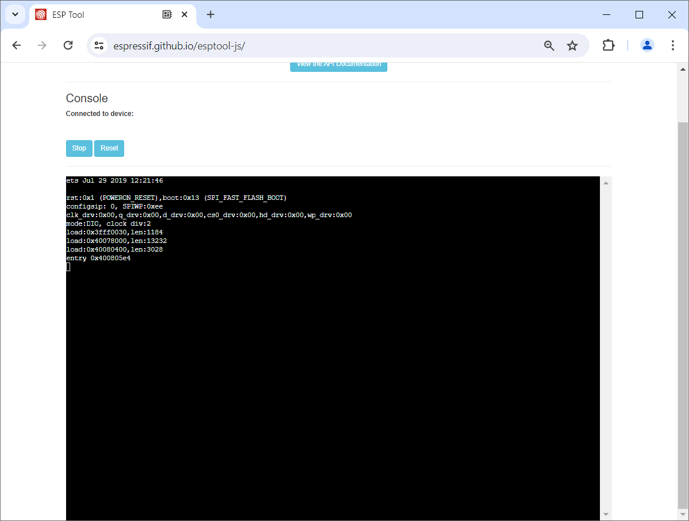
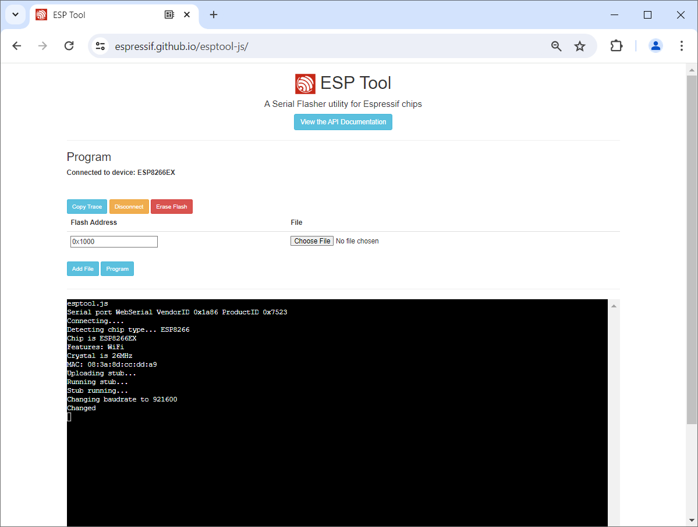
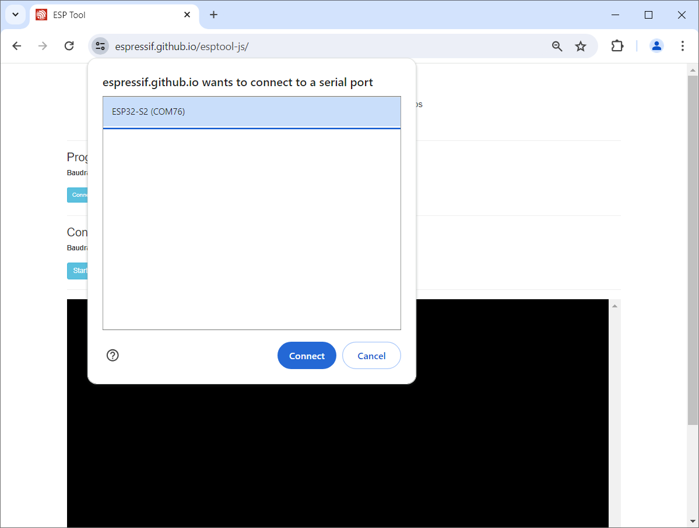

 
# Bootloader

> Builtin Service Interface Available In Every Microcontroller

The *COM port* that surfaced in *Device Manager* once you connected a *development board* to an *USB port* of your computer can be used to *communicate* with the microcontroller.

That's important because you need a way to tell the *microcontroller* what it should do for you. You need a way to *upload new firmware* to it.

Such firmware uploads are done by the *boot loader*: a special software inside of every microcontroller that acts like its *Service Interface*.

## Overview
Every *microcontroller* has built-in code: the *boot loader*. This code is safely put aside in a *ROM* (as in *ESP32* microcontrollers) or resides in a protected area of the *flash memory* (as with most *Arduino* boards) until you need it.

> [!NOTE]
> Since *ESP32* store the boot loader in write-protected *ROM*, they can never get *bricked*: A *bricked* microcontroller lost its boot loader and is effectively destroyed. *Bricking* can occur with microcontrollers that store boot loaders in *writeable flash memory*: if updating the boot loader goes wrong, or if some other error was made during firmware uploads, the microcontroller can stop working, and since the boot loader is its only way of communicating with the outside world, it typically cannot be recovered (easily).

### Bootloader Mode
The microcontroller can only execute *either the bootloader* or *your sketch* (your firmware). 

In normal operations mode, *your sketch runs* and *owns the serial port, too*. Your sketch could for example use the serial port to output information like sensor data to a terminal.

If you'd like to manage the microcontroller, i.e. *query its hardware specs* or *upload new firmware*, it needs to be *switched to boot loader mode*.

### Switching To Bootloader Mode
When it is time to upload new firmware or query its status, you want the microcontroller to *stop executing its normal firmware* and instead *start executing the boot loader code*. This is called *switching to bootloader mode*.


Many microcontroller boards can switch *automatically* to *bootloader mode* when a few special signals are sent to the serial interface. This way, *IDEs* that are ready to upload new firmware can trigger a microcontroller *reset* and then have it start in *bootloader mode*.


If the *automatic bootloader switch* does not work, your *IDE* starts complaining about *connection errors*. 

If this happens, you can always invoke *bootloader mode* manually. That's what the two buttons are for that can be found on most *development boards*:

1. Keep the button *Boot* pressed.
2. Press the *Reset* button and release it (while keepin *Boot* pressed)
3. Release *Boot*


<details><summary>How invoking the boot loader actually works</summary><br/>

The buttons soldered to a *ESP32 development board* are just for convenience. 

Actually, on *ESP32* microcontrollers, the button labeled *Boot* is connected to *GPIO0* and pulls it *low*. *GPIO0* has an internal pullup resistor, so if it is left unconnected then it will pull high. The button labelled *Reset* is wired to the pin *Rst* and pulls it *high*, invoking a *reset*. When *GPIO0* is *low* during *reset* (either by holding the button *Boot* or by connecting it to *GND*), the *ESP32* will enter the serial bootloader. Otherwise it runs the program in flash.

Other *microcontrollers* behave similarly (though the implentation differs).

</details>


## Playing With Bootloaders
*Anyone* can talk to a boot loader. You just need to know its *protocol* (its sequence of signals that it uses for serial communication).

For *ESPxxx* microprocessors, its manufacturer *Espressif* has released two tools that can talk to any *ESPxxx* microprocessor (including *ESP8266*):

* [esptool](https://docs.espressif.com/projects/esptool/en/latest/esp32/installation.html): A *Python* script that is used internally by all *IDEs* to upload firmware to an *ESPxxxx* microcontroller. Requires extensive install but provides the full set of functionality.
* [esptool-js](https://espressif.github.io/esptool-js/): A *JavaScript*-based port of the tool that runs in a *Chrome* browser and uses *WebSerial* to connect to your *USB* port. Requires no install but has only limited functionality. It can essentially upload new firmware, plus it reports the most important microcontroller specs (like its *type* and *memory size*).


> [!CAUTION]
> The *JavaScript*-based version *esptool-js* uses *WebSerial* and requires a *Chrome* or *Edge* browser.

### Testing Hardware Specs
To walk you through both tools and illustrate some of the differences, quirks, and tricks, my goal was to find out the *Flash memory size* of a variety of microcontroller boards to check whether their sizes matched the sizes promised by the sellers.


#### ESP32 C3
I started with an *ESP32 C3 Mini* board. Once connected to *USB*, *Device Manager* shows a new COM Port 167:


Next, I open [esptool-js](https://espressif.github.io/esptool-js/) in a *Chrome* browser and click *Console*.  *esptool-js* connects fine.




It shows some hardware details:


Next I click *Stop*, then click *Program* to enter the much more capable *Programmer*:


On this page, you could specify a local binary *firmware image* and upload it to the microcontroller, or *clear the flash memory*.

However, *esptool-js* functionality is *hard wired*, and there is no interactive *shell* that would enable you to issue *esptool commands* on your own.

So if you want to query specific information like the *hardware details* about the built-in *flash memory*, you need to switch to the local *esptool* command in order to *issue the appropriate command* (`esptool --port COM167 flash_id`).

Unsurprisingly though, the local *esptool* cannot yet access the *COM port*. *COM ports* cannot be shared, and when one software uses it, all others are blocked. Currently, the browser (*esptool-js*) is still using the port:

````
PS> esptool --port COM167 flash_id
esptool.py v4.7.0
Serial port COM167

A fatal error occurred: Could not open COM167, the port is busy or doesn't exist.
(could not open port 'COM167': PermissionError(13, 'Access is denied.', None, 5))

Hint: Check if the port is not used by another task
````

To *release* a *COM port* used inside *Chrome*, you need to click the symbol with the *two sliders* at the left side of the *address bar**.


This opens a menu with all active connections and blocked resources. Click on the *x* icon right of the *USB connection* you want to release, then click inside the browser window. It shows a ribbon asking to reload the page. Now the *USB resource* is unassigned again, and the *local esptool* can grab it:

````
PS> esptool --port COM167 flash_id
esptool.py v4.7.0
Serial port COM167
Connecting...
Detecting chip type... ESP32-C3
Chip is ESP32-C3 (QFN32) (revision v0.4)
Features: WiFi, BLE, Embedded Flash 4MB (XMC)
Crystal is 40MHz
MAC: 70:04:1d:31:10:54
Uploading stub...
Running stub...
Stub running...
Manufacturer: 20
Device: 4016
Detected flash size: 4MB
Hard resetting via RTS pin...
````

#### ESP32 WROOM
Let's repeat the steps for a *classic ESP32* board. As you will see, the overall behavior is the same, but there are *subtle differences*.

On first connect, *Device Manager* shows a new COM Port 171. The name indicates the *USB-to-Serial* chip used: a Silicon Labs CP210x:


*esptool-js Console* connects fine.


It shows some hardware details that are pretty much useless though:



Click *Stop*, then *Program*, to enter the much more capable *programmer*. 

The *programmer* immediately starts working, however it is *waiting for something* and meanwhile outputting ````Connecting.........._______......._______......._______......._______````. 

As it turns out, this board does not *automatically* switch to *boat loader mode*. Only when *boot loader mode* is invoked *manually* by *holding **Boot** while pressing **Reset*** will it connect:


Once the *COM port* is released on the *esptool-js* webpage (as described above), the local *esptool* can access the *ESP32* and display its hardware information. 

> [!CAUTION]
> Just like before with *esptool-js*, the microcontroller needs to again be *manually switched to boot loader mode***


````
PS> esptool --port COM171 flash_id
esptool.py v4.7.0
Serial port COM171
Connecting...............
Detecting chip type... Unsupported detection protocol, switching and trying again...
Connecting....
Detecting chip type... ESP32
Chip is ESP32-D0WD-V3 (revision v3.0)
Features: WiFi, BT, Dual Core, 240MHz, VRef calibration in efuse, Coding Scheme None
Crystal is 40MHz
MAC: b0:a7:32:f1:a2:d4
Uploading stub...
Running stub...
Stub running...
Manufacturer: 5e
Device: 4016
Detected flash size: 4MB
Hard resetting via RTS pin...
````


#### ESP8266
Now let's try and test an old *ESP8266*. When connecting it to *USB*, *Device Manager* assigns *COM6*, and the *USB-to-Serial* chip used by this board is a *CH340*.


*esptool-js Console* connects fine.


However it shows strange output and is effectively unusable:


Click *Stop*, then *Program*, to enter the much more capable *programmer*. 

The *programmer* works well:



Once the *COM port* is released on the *esptool-js* webpage (as described above), the local *esptool* can access the *ESP8266* and display its hardware information. 


````
PS> esptool --port COM6 flash_id
esptool.py v4.7.0
Serial port COM6
Connecting....
Detecting chip type... Unsupported detection protocol, switching and trying again...
Connecting....
Detecting chip type... ESP8266
Chip is ESP8266EX
Features: WiFi
Crystal is 26MHz
MAC: 08:3a:8d:cc:dd:a9
Uploading stub...
Running stub...
Stub running...
Manufacturer: 5e
Device: 4016
Detected flash size: 4MB
Hard resetting via RTS pin...
````

#### ESP32 S2 (And TinyUSB Hassle)
Modern *ESP boards* do not use a dedicated *USB-to-Serial* chip anymore. They can *understand USB directly*. 

ESP32-S3 can be used with both the USBCDC and HWCDC classes.
ESP32-C3 only can be used with HWCDC (at least I couldn't get it to work with USBCDC)
ESP32-S2 only can be used with USBCDC.
When using USBCDC, the serial port will be enumerated as "TinyUSB CDC"
And those are solely software serial ports via USB.

However there are differences in *how* these microcontrollers provide a *USB connection*:

* **USBCDC:** the microcontroller is implementing the *USB port* in software using software libraries like [TinyUSB](https://docs.tinyusb.org/en/latest/).This is what a *S2* does.
* **HWCDC:** the *USB functionality* is implemented in *hardware*
* **JTAG over USB:** to make matters more complex, some microcontrollers (i.e. *C3*) support *JTAG over USB* which can also access the boot loader.

The *S2* is an example of a microcontroller that can only use *USBCDC* and does not support *JTAG over USB*. When you initially connect it to a computer, it will always surface as *TinyUSB* device, but then apparently the *S2* adds its own specific *USB port* on top of *Tiny USB*. 

But just look for yourself. You will witness some weird COM port changes.

On first connect, *Device Manager* shows a new COM Port 77:


In *esptool-js*, it appears as *TinyUSB*:


When you try and connect via *Console*, simply *nothing happens*. When you click *Stop* and *Program* to enter the *programmer*, an *error* is reported:


This error triggers a reconfiguration of *COM Ports* though:


The *microcontroller* is now assigned to *COM 76*, and a new *Other Device* named *ESP32-S2* appears.

Click *Disconnect* and *Connect* to connect again to the *programmer*. This time, it reports a *ESP32-S2* on *COM76*:




When you try and access the microcontroller via the *local esptool*, and *Device Manager* after you connected it to *esptool-js*, this fails with a *permission issue* after which the *COM Port* vanishes from *Device Manager*:

````
PS> esptool --port COM76 flash_id
esptool.py v4.7.0
Serial port COM76
Connecting...

A serial exception error occurred: Cannot configure port, something went wrong. Original message: PermissionError(13, 'A device attached to the system is not functioning.', None, 31)
Note: This error originates from pySerial. It is likely not a problem with esptool, but with the hardware connection or drivers.
For troubleshooting steps visit: https://docs.espressif.com/projects/esptool/en/latest/troubleshooting.html
````

You need to manually *disconnect* the *S2* from the *USB port*, wait a few seconds, then connect it again. *Device Manager* now again shows a *generic serial device* on a COM port.


Trying to connect to this port yields an error, similarly to the initial connection request with *esptool-js*:

````
PS> esptool --port COM77 flash_id
esptool.py v4.7.0
Serial port COM77
Connecting...

A serial exception error occurred: Cannot configure port, something went wrong. Original message: PermissionError(13, 'A device attached to the system is not functioning.', None, 31)
Note: This error originates from pySerial. It is likely not a problem with esptool, but with the hardware connection or drivers.
For troubleshooting steps visit: https://docs.espressif.com/projects/esptool/en/latest/troubleshooting.html
````

Now again, the *COM Port* assignments in *Device Manager* magically change:


Trying again with *COM76* works as expected:

````
PS> esptool --port COM76 flash_id
esptool.py v4.7.0
Serial port COM76
Connecting...
Detecting chip type... Unsupported detection protocol, switching and trying again...
Detecting chip type... ESP32-S2
Chip is ESP32-S2FNR2 (revision v1.0)
Features: WiFi, Embedded Flash 4MB, Embedded PSRAM 2MB, ADC and temperature sensor calibration in BLK2 of efuse V2
Crystal is 40MHz
MAC: 80:65:99:fc:f4:d0
Uploading stub...
Running stub...
Stub running...
Manufacturer: 20
Device: 4016
Detected flash size: 4MB
Flash type set in eFuse: quad (4 data lines)
Hard resetting via RTS pin...
```` 
After the tool emitted its information, the *microcontroller* again vanishes from *Device Manager*.


> Tags: Microcontroller, USB, esptool, esptool-js, JTA, HWCDC, USBCDC, Flash Size, ESP32, C3, S2, ESP8266


