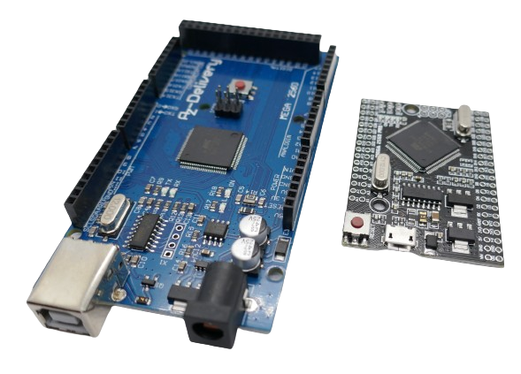

 
# Microcontrollers

> They Manage Sensors, LEDs And Other Components Much Cheaper Than Implementations With Discrete Elements Only.

What started in *PCs* and carried over to devices like *Smartphones* is now common-place even for *DIY projects*: instead of trying to implement features exclusively with *discrete elements* like transistors and some *ICs*, it is much easier and more *cost-effective* to add a **microcontroller**.

In this section you learn more about the typical microcontrollers used in *DIY projects*, how they differ, and what they can do for you.

> [!TIP]
> Programming a microcontroller today is fundamentally the same, regardless of vendor and microcontroller type you choose, thanks to the *Arduino Framework*: all microcontrollers listed below understand the same code.

> [!CAUTION]
> There are hardware differences of course, and while *code examples* will run on all microcontrollers, there may be minor hardware adjustments needed, i.e. you might need to review and adjust the GPIO pins used.
> Be aware that *Arduinos* are **5V** devices whereas *ESPs* use **3.3V**.

## Originals and Clones

At the heart of any microcontroller board is always a *CPU* which is  the only truly *unique* part.

The supporting boards can come from a variety of sources. Aside from the *original company* that came up with a particular design, there are numerous *clones* available that *copied* the (open-source) design. These *clones* are *much cheaper* and typically work very well, too.

**Nano Every**, a clone (*left*) and the original (*right*)

### Power Regulator Trap

*Clones* are no perfect copy. Typically, they save money and production cost by using cheaper components. That's ok for most cases except one: **power regulators**.

**ESP8266** *clones* are known for commonly using inferior or outright unsuitable *power regulators*: they can hardly provide the power for the *CPU* alone. Once you start adding additional components like sensors or displays, you may run into issues, and the board may stop working. With a more expensive *original*, you may get a higher component quality (if that's worth the price difference for you).

> [!TIP]
> I'll examine the *power regulator* issue with **ESP8266** clones in a separate article in more detail and show how you can tell whether your board may have a power issue, and ways to resolve this.

Clones for *other* microcontrollers are typically flawless. This issue affects predominantly **ESP8266** clones. To reiterate: **ESP32** clones are not affected.

### Innovation Through Clones

Sometimes, clones can be highly *innovative*, too. Have a look at these two microcontroller boards. They are functionally identical yet the left (clone) has a dramatically smaller footprint:

**Arduino Mega**, a clone in the original form factor (*left*) and a clone in a much smaller form factor with the same feature set (*right*, called **Arduino Mega Pro**)

> [!NOTE]
> Because of unclear copyright arrangements, in 2015 one of the original inventors started a new brand name called **Genuino** and new partnerships with *Adafruit*, *Seeed* and others to produce the hardware. Today, *Arduino* as a brand and as a hardware producer has lost a lot of its impact. Over time, boards became technically outdated and relatively over-priced. The market today is dominated by much cheaper *clones* that base on the *open-sourced* designs.

## Arduino Family

Around 2005, the *Arduino family of microcontrollers* started to open up the world of microcontrollers to the general public. From the start, they were *very easy to use*. The free *development environment*, **Arduino IDE**, works out of the box for *Arduinos*, no configuration needed. The *entry level* for *Arduinos* is very low.

*Arduinos* were originally based on *ATMega* microcontrollers, and the boards were developed and produced by *Arduino LLC*. The name *Arduino* was borrowed from a bar where the founders liked to hang out.

The first boards were bulky, slow (using *ATMega8*), and came with very limited memory and only a few *GPIO* pins. 

Resources were improved over time, and footprint cut down. 

This *original* **Arduino Nano Every** has a relatively small form factor and plenty of GPIOs

Today, there is a vast [Arduino Ecosystem](https://docs.arduino.cc/hardware/) with a variety of boards and processors.

### Software Development for Microcontrollers

It may appear a bit displaced to talk about the software to program microcontrollers in the middle of this *Arduino* section - after all, this is a general topic that is important to all microcontrollers.

#### Arduino IDE...

Since *Arduinos* started the journey, their *programming software* called **Arduino IDE**, too, initially was a one-kind-of-its-own. Many users know, love and hate just this one software for programming microcontrollers.

While this software is tailored towards *Arduinos* (for which it was created), it can be extended to other microcontrollers as well. You can use it to program any of the microcontrollers listed here. Still, non-Arduino boards are often second-class citizen and require manual configuration.

#### ...and platformio

*Arduino* hardware today often feels stale, out-dated and over-priced. The *Arduino IDE*, too, is not up-to-date anymore and lacks modern editing capabilities. 

Many users move to the free [platformio](https://platformio.org/install/ide?install=vscode) development environment which can be plugged into the free Microsoft *VSCode* editor.

*Platformio* is hardware-agnostic and treats all microcontroller families the same. It may require a bit more time to get it up and running but once you are there, you never want to go back.

> [!TIP]
> There are many more *development environments* available for microcontrollers, for example *Expressif*, the company that produces the **ESP** family of microcontrollers, offers its own free dev environment [ESP-IDF](https://idf.espressif.com/) specifically tailored towards **ESP** microcontrollers.

### Arduino Mega and Nano

The two most popular *Arduino* family members illustrate the evolution: 

Arduino Mega (*right*) and Arduino Nano (*left*, almost the same features in a much smaller form factor)

### Pros and Cons

The biggest **PROS** for *Arduinos* are the *huge community*, the vast number of *code examples*, and the *ease of use*. 

There are important **CONS**, too:

* **No Wireless:** *Arduinos* do not come with any wireless support. You cannot connect them to the Internet, your home WiFi, or use *Bluetooth*.
* **Limited Memory:** modern *Arduinos* have added more memory and *GPIO* pins, but memory is still limited. When you create more sophisticated firmware, it is not unusual to run into compilation errors due to lack of memory.
* **High Energy Consumption:** Should you plan to run your devices on solar or battery power then *power consumption* becomes an issue, and *Arduinos* typically need relatively much power.
* **Expensive:** The *original Arduinos* and even most *clones* are relatively expensive compared to other microcontrollers.
* **Big:** some *Arduinos* like the *Nano* are comparably small, yet compared to other microcontroller boards they are still *huge* and make your devices bigger.

> [!NOTE]
> I started my first steps with *Arduino*, like so many others. Because of the *cons* listed above, I soon switched to other microcontrollers, though. That is why the examples on this site are focused on **ESP8266** and **ESP32**.

## ESP8266 and ESP32 Family from Expressif

Another very popular family of microcontroller boards is based on the *CPUs* from *Expressif*, namely the **ESP8266** that surfaced in 2014, and the **ESP32** that followed in 2016 - roughly at the same time when the *Arduino* star started to sink due to internal disputes and copyright issues.

Expressifs' **ESP** *cPUs* are much more powerful than the *ATMegas* used by *Arduino*. They come with *WiFi* capabilities built-in, and the **ESP32** adds **Bluetooth-Support**. 

> [!TIP]
> The *Expressif* **ESP32** microcontrollers are so powerful and popular that in fact *Arduino* has switched horses, too, and released its first **ESP32** board in 2023: the [Nano ESP32](https://docs.arduino.cc/hardware/nano-esp32/).

from *left to right ordered by size*: **ESP32 C3** from *Seeed*, **ESP8266** *D1 Mini clone*, **ESP32 WROOM 32D** *dev board*.

These are industrial-grade CPUs used in many commercial devices. They have very low energy consumption and effective *sleep modes*, making them suitable for battery-driven devices as well.

In addition, they come with plenty of *memory*. Todays' *entry level* **ESP8266** typically come with *4MB* memory on board (check before you buy though, there are also 512KB variants).

## ESP8266

**ESP8266** is the most popular (and cheapest) *CPU*. You get clone boards for less than EUR 2. It was introduced in 2014.

It is very well suited for the vast majority of *DIY projects*. 

### ESP8266EX

The **D1 Mini** (including clones) probably is the most popular board design: it is *cheap*, *compact*, comes with *WiFi* capabilities, has sufficient *memory* (tyically 4MB), provides enough *GPIO* pins for most projects (9 of which 5 are freely usable), has one *ADC* and supports *SPI* and *I2C* interfaces.

The *ESP8266 D1 Mini* is one of the most popular **ESP8266** boards in use.

It is based on the *Expressif ESP8266EX* chip, basically the only *ESP8266* chip widely used.

### ESP8266 Pro

The **Pro** version of **ESP8266** appears to be merely a marketing gag and refers to a different board layout. Its most visible "advantages* are a *ceramic antenna* instead of the simple *PCB antenna* and more memory: most **ESP8266 Pro** come with *16MB* instead of *4MB* memory (but watch out, some feature just 8MB or just 4MB).

The **ESP8266 Pro** is almost as expensive as a full-fledged **ESP32** and not a good choice.

On the negative side is an *unshielded* version of **ESP8266** (not covered by a shiny silver metal box) that has no *FCC ID*, and the same lame *voltage regulator* you find on the cheapest **ESP8266 clones*.

> [!TIP]
> *ESP8266 Pro* is a product from the past when the price difference between *ESP8266* and *ESP32* was still huge. Anyone in need of more memory could try and use the *ESP8266 Pro*.
> Today with price differences diminishing, either the basic *ESP8266* features are sufficient for your project (in which case you should get an *ESP8266*), or you need more (memory or better specs or a better voltage regulator). In which case you should get an *ESP32*.
> For the price of a *ESP8266 Pro* you can get a *ESP32* as well when you look around a bit.

## ESP32

**ESP32** is the *big brother* of an **ESP8266**, and comparing them is like comparing a middle class car to a luxury car.

The **ESP32** is only marginally more expensive, and you get clone boards for less than EUR 3.

### Comparing to ESP8266

Compared to the **ESP8266**, in a nutshell it **doubles** everything:

Double the *CPU cores*, double the *WiFi Speed*, (roughly) double the *internal memory*, double the *GPIO pins*, double the *I2C* and *SPI* interfaces, double the *ADCs*, double the *Infrared support*

In addition, it *adds* many interfaces and capabilities: built-in support for *Bluetooth*, *CAN*, *LCDs*, *SD Cards*, *Ethernet*, *Camera*, *Touch*, you name it.

> [!TIP]
> Whether the sheer power and capabilities of **ESP32** are actually *needed* is a different question. 
> **ESP32** have yet another *killer feature* that most users overlook: a *decent voltage regulator*. Most **ESP8266** boards use *extremely weak* regulators that can lead to hangs, reboots and overheating once you connect additional components.

### Same Form Factor

Despite its many additional features, **ESP32** are not necessarily bigger in size. The raw chip size did not change from **ESP8266*.

The **ESP32 C3**-based board from **Seeed** for example is tiny:

**ESP32** boards can be extremely small yet very powerful

If you do not need a *USB Connector*, you can further cut board size. The picture below shows an **ESP8266** on such a board. The same form factor is available for **ESP32**, effectively reducing the board size to the size of the actual microcontroller and a few supporting elements like a *ceramic WiFI antenna*:

Boards without USB connector and UART are even smaller but require an external programmer to transfer the firmware.

### ESP Processor Family

There is no *one* **ESP32** microcontroller. It's a family with considerable *feature differences*. Below are the most important facts. The [Expressif Product Comparison](https://products.espressif.com/#/product-comparison) provides even more details and models.

| Feature | ESP32 | S2 | S3 | C3 | C6  | ESP8266 |
| --- | --- | --- | --- | --- | --- | --- |
| Launch | 2016 |  2019 | 2020 | 2020 | 2021 | 2014 |
| Core Type | LX6 | LX7 | LX7 | RISC-V | RISC-V | L106
| Cores | 2 | 1 | 2 | 1 | 1 | 1 | 
| Frequency | 240 | 240 | 240 | 160 | 160 | 160 |
| GPIOs | 34 | 43 | 45 | 22 | 30 | 17 |
| SRAM KB | 520 | 320 | 512 | 400 | 512 | 160 |
| RTC/LP SRAM KB | 16 | 16 | 16 | 8 | 16 | 1 |
| ext RAM MB | 8 | 1024 | ? | ? | 0 | 0 |
| int Flash MB | 0/2/4 | 0/2/4 | ? | 0/4 | ? | 0 |
| ext Flash MB | 16 | 1024 | ? | 16 | ? | ? |
| Cache KB | 64 | 8/16 | 16 | 16 | 16 | 32 |
| ROM KB | 448 | 128 | 384 | 384 | 320 | 0 |
| ADC | 2x12bit 18ch | 2x13bit 20ch | ? | 2x12bit 6ch | ? | 1x10bit 1ch |
| DAC | 2x8bit | 2x8bit | ?  | 0 | 0  | 0  |
| Timers | 4x64bit | 4x64bit | ? | 2x54bit/1x52bit | ? | 2x23bit |
| Watchdog | 3 | 3 | ? | 3 | ? | ? |
| I2C | 2 | 2 | 2 | 1 | 2 | 1 |
| I2S | 2 | 1 | 2  | 1 | 1 | 1 |
| SPI | 4 | 4 | 4 | 3 | 1 | 2 |
| LCD Interface | 1 | 1 | 1 | 0 | 0 | 0 |
| Temperature | 0 | 1 | 1 | 1 | 1 | 0 |
| Touch | 10 | 14 | 14 | 0 | 0 | 0 |
| UART | 3  | 2 | 3 | 2 | 3 | 2 |
| Ethernet | 1 | 0 | 0 | 0 | 0 | 0 |
| IR/RMT | 8  | 4 | 8 | 4 | 4 | 1 |
| Hall Sensor | 1 | 0 | ? | 0 | ? | 0 |
| LED PWM | 16  | 8 | 8 | 6 | 6 | 5 |
| Motor PWM | 6 | 0 | 2| 0 | 0 | 0 |
| Wifi | 4 | 4 | 4 | 4 | 6 | 4 | 
| Wifi Mbps | 150 | 150 | 150 | 150 | 150 | 75 |
| Bluetooth | 4.2  | BLE5.0 | BLE5.0 | BLE5.0 | BLE5.3 | 0 |
| USB OTG | 0 | 1 | 1 | 0 | 0 | 0 |
| Camera Interface | 1  | 1 | 1 | 0 | 0 | 0 |
| TWAI (CAN 2.0) | 1 | 1 | 1 | 1 | 2 | 0 |
| SD Host | 1 | 0 | 2 | 0 | 0 | 0 |
| SD Slave | 1 | 0 | 0 | 0 | 1 | 1 |
| Size mm | 5x5/6x6 | 7x7 | 7x7 | 5x5 | 5x5 | 5x5 |

To better understand the different models and their evolution, it is helpful to see them in historic context.

### 2016 - WROOM and WROVER

The *original **ESP32*** was launched in 2016 and raised the *feature bar* as outlined before.

The original **ESP32** was called *WROOM*. A variant with extra *pSRAM* was called *WROVER*. There are dev boards with a built-in *PCB antenna*, and boards with an *IPX connector* to connect a *real external antenna* for more reach.

**ESP32 WROOM-32D**

When you purchase **ESP32** dev boards, look for the fine print in the type:

* **WROOM-32:** First version of **ESP32**
* **WROOM-32D:** Revised version of **ESP32** with PCB antenna
* **WROOM-32E:** Same as *WROOM-32D* but with an IPX antenna jack for connecting an external antenna
* **WROVER:** Same as *WROOM-32* but with additional 4/8 MB *pSRAM*
* **WROVER-B:** Same as *WROOM-32D* but with additional 8MB *pSRAM*
* **WROVER-IB:** Same as *WROVER-B* but with an IPX antenna jack instead of a built-in PCB antenna

### 2020 - S- and C-Series

In 2020, *Expressif* released both the *S-Series* and the first member of the *C-Series*.

#### S2 - Low Power Consumption

The **S2** is focused on *low energy consumption* and comes with just one core, less *SRAM* and no *Bluetooth* support. This reduces energy consumption from 100uA of a regular **ESP32** to just 22uA.

A powerful **ESP32 S2 Mini** sharing the **ESP8266 D1 Mini** form factor. Note the dual-row terminals.

Differences between **S2** and the original **ESP32**:

| Feature | Removal |
| --- | --- |
| Cores | one core instead of two |
| Size  | 7x7 instead of 5x5 |
| Memory | SRAM reduced from 520 to 320, ROM reduced from 448 to 128 |
| LED PWM | reduced from 16 to 8 |
| ADC | 2x12bit 18ch instead of 2x13bit 20ch |
| UART  | reduced from 3 to 2 |
| I2C | reduced from 2 to 1 |
| IR/RMT | reduced from 8 to 4 |
| Bluetooth | removed |
| SD Card support | removed |
| Motor PWM | removed |
| Hall Sensor | removed |
| Ethernet  | removed |

Aside from the much lower *energy consumption*, the **S2** got some enhancements:

| Feature | Addition |
| --- | --- |
| Touch | extended from 10 to 14 |
| GPIO  | extended from 34 to 43 |
| USB OTG | added |
| TOF  | added |
| Temperature Sensor | added |

#### S3 - ESP32 with BLE 5.0 and more GPIOs

The **S3** remains more like a **ESP32**. Some infrequently used features like *Hall Sensor* and *DAC* were removed in exchange for 10 more *GPIO* pins, a *temperature sensor*, and *BLE 5.0* support.

Here is the list of removed or reduced features compared to **ESP32**:

| Feature | Removal |
| --- | --- |
| Size  | 7x7 instead of 5x5 |
| SRAM  | reduced from 520 to 512 |
| ROM | reduced from 448 to 384 |
| LED PWM | reduced from 16 to 8 |
| DAC | removed |
| SD Slave | removed |
| Hall Sensor | removed |
| Ethernet | Removed |

This is what's new:

| Feature | Addition |
| --- | --- |
| Bluetooth | BLE v5.0 instead of BLE v4.2 |
| ADC | increased # of channels from 18 to 20 |
| Touch | 14 instead of 10 |
| Temperature Sensor | added |
| GPIO | extended from 34 to 45 |
| SD Host | extended from 1 to 2 |
| USB OTG | added |

In addition, the **S3** comes with *AI Acceleration Support*: the *MCU* (math coprocessor) is tailored towards the kind of vector calculations needed in *AI* applications.

#### C3 - RISC-V Architecture

The **ESP32 C3** marks a fundamental change in processor architecture as it now uses *RISC-V*. The **C3** is a *very fast* one-core microcontroller.

**ESP32 C3** produced by *Seeed*

Here is the list of removed or reduced features compared to **ESP32**:

| Feature | Removal |
| --- | --- |
| Cores  | 1 instead of 2 |
| Frequency  | reduced from 240 to 160 |
| SRAM  | reduced from 520 to 400 |
| ROM | reduced from 448 to 384 |
| RTC RAM | reduced from 16 to 8 |
| GPIOs | reduced from 34 to 22 |
| LED PWM | reduced from 16 to 6 |
| UART  | reduced from 3 to 2 |
| SPI | reduced from 4 to 3 |
| ADC | reduced channels from 18 to 6 |
| Motor PWM | removed |
| Touch | removed |
| DAC | removed |
| SD support | removed |
| Hall Sensor | removed |
| Ethernet | removed |
| Camera support | removed | 

This is what's new:

| Feature | Addition |
| --- | --- |
| Bluetooth | BLE v5.0 instead of BLE v4.2 |
| WiFi | WiFi-Alliance/WPA 3 certified |
| Temperature Sensor | added |
| SD Host | extended from 1 to 2 |
| USB OTG | added |

### 2021 ESP32 C6

The **C6** was announced in *2021*. It took until *2023* before boards were available in quantities and is a *connectivity* update to the **C3** with added support for *Wifi 6*, *Zigbee* and *Thread*.

Here is the list of enhancements compared to the **C3**:

| Feature | Addition |
| --- | --- |
| GPIO | 30 instead of 22 |
| I2C | 2 instead of 1 |
| Bluetooth | BLE v5.0 instead of BLE v4.2 |
| WiFi | WiFi6 added |
| SRAM | 512 instead of 400 |
| ROM | 384 instead of 320 |
| RTC RAM | 16 instead of 8 |
| ADC | 7 instead of 6 channels |
| UART | 3 instead of 2 |
| SD Slave | added  |
| TWAI (CAN 2.0) | 2 instead of 1 |
| Zigbee/Thread | added |

The number of **SPI** was reduced from 3 to 1.

> [!CAUTION]
> As of this writing, the **C6** does not support the *Arduino Framework* yet. You cannot currently program it using the *Arduino IDE* or *platformio*. Instead, you must use the *ESP-IDF* from *Expressif*. This is going to change soonish, and eventually, the **C6**, too, will support the universal *ArduinoIDE*.

> Tags: Microcontroller, Arduino, ESP8266, ESP32, Nano, S2, S3, C2, C3, C6, Clone, Power Regulator,

:eye:&nbsp;[Visit Page on Website](https://powershell.one/doneland_test/components/microcontroller?765626031601243831) - last edited 2024-03-01
