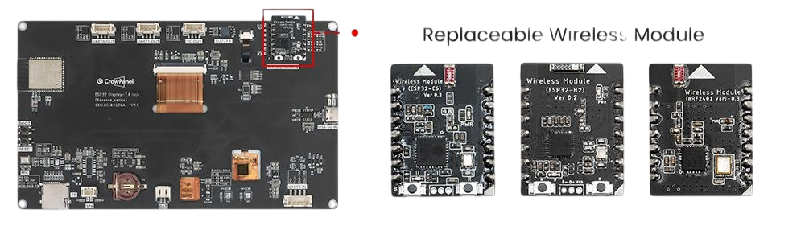

 
# CrowPanel

> All-In-One Boards for Learning and Advanced Projects

*CrowPanel* development boards are highly integrated, *ESP32*-based boards with built-in displays. They stand out for their high quality, excellent documentation, and free YouTube learning videos.

The **basic** series uses the *ESP32S* with *4MB* flash memory and *resistive* touch, while the **advanced** series features the more powerful *ESP32-S3* with *16MB* flash memory and *capacitive* touch. Both are available in multiple display sizes.

This is the backside of a [CrowPanel Advance](https://www.elecrow.com/crowpanel-advance-7-0-hmi-esp32-ai-display-800x480-artificial-intelligent-ips-touch-screen-support-meshtastic-and-arduino-lvgl-micropython.html?idd=5):

The *CrowPanel* lineup is a versatile solution for different audiences:

- **Beginners:** The [CrowPanel Advanced](https://www.elecrow.com/catalogsearch/result/?q=crowpanel+advanced&idd=5) includes a microphone, amplifier, speaker, and touch display, making it easy to explore a wide range of examples without a steep learning curve.
- **Advanced Users:** Many essential peripherals are already integrated, especially in the advanced series, allowing for compact, reliable devices without custom PCB design.
- **Industry:** *CrowPanels* serve as cost-effective, all-in-one modules that are easier to integrate than custom solutions.

## Overview

What sets *CrowPanels* apart from other development boards:

- **Integrated Touch Display:** Every *CrowPanel* includes a built-in touch display, from *2.4"* up to *7"*.
- **Rich Peripherals:** The *CrowPanel Advance* integrates peripherals like a microphone, speaker, RTC, and more, supporting compact designs and hands-on learning right out of the box.
- **Comprehensive Documentation:** Free, detailed [YouTube video tutorials](https://www.youtube.com/playlist?list=PLwh4PlcPx2GcKJ17Z_xcAxQoh-Tmms_X1) make self-learning and exploration straightforward, saving time and frustration.

| Product            | Free Video Learning Tutorial |
|--------------------|-----------------------------|
| CrowPanel Basic    | [YouTube](https://www.youtube.com/playlist?list=PLwh4PlcPx2GcKJ17Z_xcAxQoh-Tmms_X1) |
| CrowPanel Advanced | [YouTube](https://www.youtube.com/playlist?list=PLwh4PlcPx2Gfrtm7TmlARyF4ccTmIy-gK) |

### Battery Support

All *CrowPanel* boards support rechargeable *LiIon* batteries, which can be connected directly. The built-in charger automatically charges the battery when the panel is powered via USB-C.

## Basic Series

The original **basic** [Elecrow CrowPanel Display HMI](https://www.elecrow.com/esp32-display-series-hmi-touch-screen.html?idd=5) uses the classic *ESP32S* microcontroller, *4MB* flash, and resistive touch displays in various sizes.

| Size                | 2.4  | 2.8  | 3.5  | 4.3  | 5.0  | 7.0  | ESP32 Terminal-3.5 RGB Display | ESP32 Terminal-3.5 SPI Display |
|---------------------|------|------|------|------|------|------|-------------------------------|-------------------------------|
| Camera              | -    | -    | -    | -    | -    | -    | -                             | yes                           |
| Resolution          | 320×240 | 320×240 | 480×320 | 480×272 | 800×480 | 800×480 | 480×320 | 480×320 |
| Touch Type          | Resistive | Resistive | Resistive | Resistive | Capacitive | Capacitive | Capacitive | Capacitive |
| Main Processor      | ESP32-WROOM-32-N4 | ESP32-WROOM-32-N4 | ESP32-WROVER-B | ESP32-S3-WROOM-1-N4R2 | ESP32-S3-WROOM-1-N4R8 | ESP32-S3-WROOM-1-N4R8 | ESP32-S3-WROOM-2 | ESP32-S3-WROOM-2 |
| Frequency           | 240MHz | 240MHz | 240MHz | 240MHz | 240MHz | 240MHz | 240MHz | 240MHz |
| Flash               | 4MB   | 4MB   | 4MB   | 4MB   | 4MB   | 4MB   | 16MB  | 16MB  |
| SRAM                | 520KB | 520KB | 520KB | 512KB | 512KB | 512KB | 512KB | 512KB |
| ROM                 | 448KB | 448KB | 448KB | 384KB | 384KB | 384KB | 384KB | 384KB |
| PSRAM               | /     | /     | 8MB   | 2MB   | 8MB   | 8MB   | 8MB   | 8MB   |
| Display Driver      | ILI9341V | ILI9341V | ILI9488 | NV3047 | IL16122 + IL15960 | EK9716BD3 + EK73002ACGB | ILI9488 | ILI9488 |
| Screen              | TFT   | TFT   | TFT   | TFT   | TFT   | TFT   | TFT   | TFT   |
| Type Interface      | 1*UART0, 1*UART1, 1*I2C, 1*GPIO, 1*Battery | 1*UART0, 1*UART1, 1*I2C, 1*GPIO, 1*Battery | 2*UART0, 1*I2C, 1*GPIO, 1*Battery | 1*UART0, 2*UART1, 2*GPIO, 1*Battery | 2*UART0, 2*GPIO, 2*I2C, 1*Battery | 2*UART0, 2*GPIO, 2*I2C, 1*Battery | 1*UART, 1*Analog, 1*IIC, 1*Digital, 1*Battery | 1*UART, 2*Analog, 1*IIC, 2*Digital, 1*Battery |
| Speaker Jack        | YES   | YES   | YES   | YES   | YES   | YES   | NO    | NO    |
| TF Card Slot        | YES   | YES   | YES   | YES   | YES   | YES   | YES   | YES   |
| Active Area         | 36.72×48.96mm | 43.2×57.6mm | 48.96×73.44mm | 95.04×53.8mm | 108×64.8mm | 153.84×85.63mm | 49.79×73.63mm | 49.79×73.63mm |

This series quickly gained popularity among DIY/makers, smart home enthusiasts, and industry users who needed a highly integrated module.

## Advanced Series

With the advent of newer, more powerful processors, *Elecrow* introduced the **advanced** [CrowPanel Advance](https://www.elecrow.com/display/esp-hmi-display/esp32-hmi-display-advance-series.html?idd=5), featuring the *ESP32-S3*, quadrupled flash memory (16MB), and numerous other [significant enhancements](https://www.elecrow.com/blog/crowpanel-advance-what-sets-it-apart-from-the-basic-series.html?idd=5).

| Feature         | Remark                                                                                      |
|-----------------|--------------------------------------------------------------------------------------------|
| Microcontroller | *ESP32-S3* replaces the *ESP32S*                                                           |
| Memory          | 16MB flash memory (up from 4MB)                                                            |
| Display         | Brightness increased from 175 cd/m² to 400 cd/m²                                           |
| Touch           | *Capacitive* panels (true finger touch) instead of *resistive* (stylus required)           |
| Voice/Audio     | Built-in microphone, amplifier, and speaker for AI, speech recognition, hands-free, audio  |
| Wireless        | Supports plug-in modules: *LoRa*/*Meshtastic*, *Thread*, *Zigbee*, *Matter*, WiFi, BT      |
| RTC             | Real-Time Clock included on models 3.5" and larger                                         |

### Caveat: Display Size

There are **two** groups of panels with key functional differences:

| Display Size (Inch) | Resolution | Secondary USB-C Port |
|---------------------|------------|----------------------|
| 2.4, 2.8, 3.5       | 480×320    | **yes**              |
| 4.3, 5.0, 7.0       | 800×480    | **no**               |

- **Higher Resolution:** Starting at *4.3"*, displays offer much better resolution.
- **Secondary USB-C Port:** Only the smaller displays (3.5" and below) include a secondary USB-C port for connecting peripherals (like keyboards or mice), allowing the *ESP32-S3* to act as a USB host or device. This useful connector is missing on larger boards, despite having more space. If you need USB device/host features, choose a 3.5" or smaller model.

### Wireless Plug-In Modules

Optional plug-in wireless modules greatly expand *CrowPanel* capabilities:

- [Meshtastic](https://meshtastic.org/): Turn your panel into a long-range digital mesh text transceiver (firmware adjustments required; the large display enables features like on-screen keyboards).
- **Smart Home:** Add radio modules to create advanced smart home controllers for devices like garage doors or garden lights.
- **Thread/Zigbee/Matter/WiFi6:** Add the appropriate module as a co-processor for the latest wireless protocols.

Currently available add-on modules:

| Driver        | Wireless             | Use Case                                   |
|---------------|----------------------|--------------------------------------------|
| *SX1262*      | LoRa                 | *Meshtastic*, long-range data transmission |
| *nRF24L01+*   | 2.4GHz               | ISM band data transmission                 |
| *ESP32-H2*    | Thread/Zigbee/Matter | Modern connectivity                        |
| *ESP32-C6*    | WiFi 6               | Enhanced wireless connectivity             |

**Important:**

- Radio modules must be selected at order time and are not sold separately.
- All radio modules are optional.
- Only one radio module can be used at a time.

> Tags: ESP32, S3, ESP32-S3, Elecrow, CrowPanel, Panel, Development Board

[Visit Page on Website](https://done.land/components/microcontroller/renownvendors/elecrow/crowpanel?955462051320254448) - created 2025-05-19 - last edited 2025-05-19
