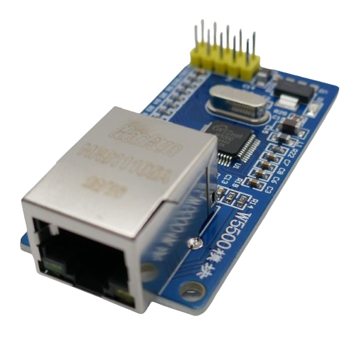
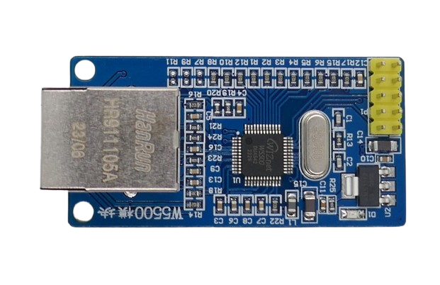

 
# ENC28J60 Ethernet Controller

> A Robust Controller Found On Many Boards To Permanently Wire Your Device To A Network

This is a popular *Ethernet* controller that is used on a number of breakout boards.

## Interface

The boards use the **SPI** interface.

## Operating Voltage

The operating voltage is **3.3V**. 

> [!TIP]
> To operate this breakout board with a **5V** microcontroller like *Arduino*, most microcontroller boards have a dedicated **3.3V** pin that can be used. A separate *level shifter* would be required to translate the **SPI** connections.

## Specs

| Item | Value |
| --- | --- |
| Voltage | 3.3V |
| Frequency | 25Mhz |
| Size | 51x19x16mm |

## Remarks

*MAC address* and *IP configuration* is done in software. A suitable library [can be found here](https://github.com/njh/EtherCard/blob/main/README.md). There are many more libraries for the *ENC28J60* chip.

## Data Sheets

* [ENC28J60 Ethernet Controller](materials/enc28j60_datasheet.pdf)
* [Ethernet Jack](materials/hr911105a_datasheet.pdf)

> Tags: Data, Network, Ethernet, ENC28J60, HR911105A

[Visit Page on Website](https://done.land/components/network/enc28j60?309008031222243356) - created 2024-03-22
