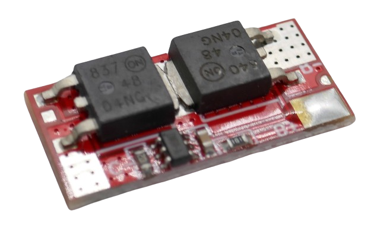

# 1S 10A Battery Management Systems (BMS) 

> BMS For A Single Battery String And 10A Max Current

> [!NOTE]
> **BMS** often ship in *locked state*: *no output voltage* is available at the output pins. *Locked state* is also entered whenever *over-current protection* was triggered. To *unlock* the **BMS**, connect it to a charger. If you did not add a dedicated *charger board*, apply the appropriate charging voltage to its output terminal.

## 5A

[LiIon](https://done.land/fundamentals/battery){:.button.button--success.button--rounded.button--sm}
 [LiPo](https://done.land/fundamentals/battery){:.button.button--success.button--rounded.button--sm}

For currents up to **10A**, you can use a variant of a *BMS* that was originally designed for *2S* configurations.

> [!CAUTION]
> The *1S* and the *2S* version of this board look *very similar*. Make sure you check the *number of solder pads* on the *front side*. The *2S* version has *five* main solder pads. The *1S* version has just *three*.

### Connection

This board is *small* and *rugged* but the solder pads are poorly marked, and since there are only *three* solder pads, one serves as *common +* both for the battery and the output voltage.

#### Battery

When you look very closely and carefully, two solder pads are marked **B+** and **B-** on the *front side*. The **B-** pad is also available on the backside (the **B+** pad is not).

Connect the battery to **B+** and **B-**.

#### Output Voltage

The output voltage is available at the solder pad marked **C-** (which is also available on the backside) and the same **B+** pad that was already used to connect the battery. Both battery and output voltage *share the pad* **B+**.

#### Specs

| Protection | Threshold | 
| --- | --- | 
| Continuous Current | 10A |
| Overcurrent Protection | 60A, delay max. 1.5s |
| Overcharge Protection | 4.25V, recovery <4.18V |
| Discharge Protection | <2.8V, recovery >3V |
| Short-Circuit Protection | yes, 300us delay, release by load disconnect |
| Charging Current | 25A |

> [!CAUTION]
> While you theoretically could *charge* your battery through this *BMS*, its current limiting functionality is useless for most battery types: the current is limited to *25A*. Most power supplies you may use for charging cannot exceed this limit even if they wanted. And many simple 1-cell batteries cannot handle a charging current of 25A (for a 2.500mA cell this is a **10C** charging). Always check the battery specs or better yet use an additional dedicated charger board.

> Tags: Battery, BMS, 1S, 10A

[Visit Page on Website](https://done.land/components/power/bms/1s/10a?111996031824242648) - created 2024-03-26 - last edited 2024-03-28
