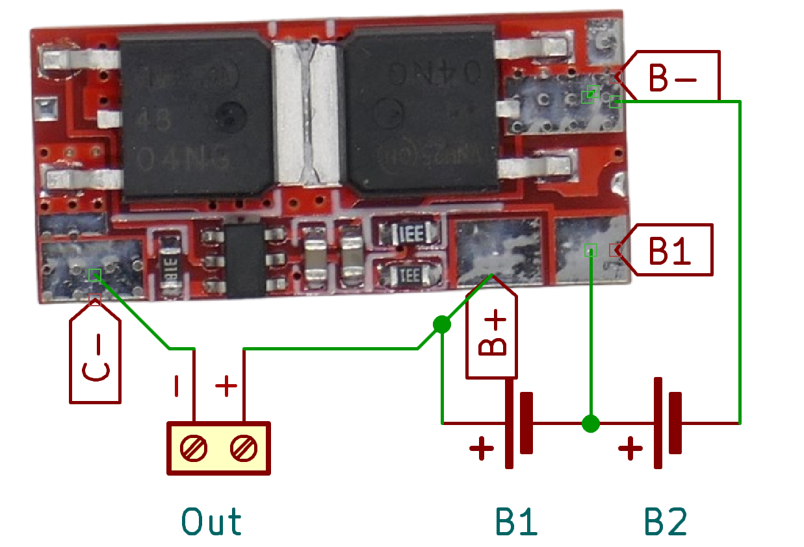
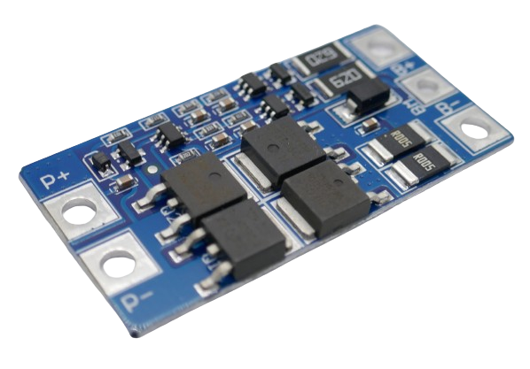

# 2S 10A Battery Management Systems (BMS)

> BMS For Two Battery Strings And 10A Max Current

> [!NOTE]
> **BMS** often ship in *locked state*: *no output voltage* is available at the output pins. *Locked state* is also entered whenever *over-current protection* was triggered. To *unlock* the **BMS**, connect it to a charger. If you did not add a dedicated *charger board*, apply the appropriate charging voltage to its output terminal.

> [!CAUTION]
> When connecting batteries to your **BMS**, make sure to use *wires* with sufficient diameter for the anticipated *high currents*.

> [!CAUTION]
> When designing *battery packs*, use batteries of *same type* and *same state of charge* only. It is recommended you *fully charge* all batteries before connecting. All batteries must have *the same voltage* (voltage difference less than *0.05V*). Do not mix batteries from different vendors, types, capacity, or age. 

## 10A

[LiIon](https://done.land/fundamentals/battery){:.button.button--success.button--rounded.button--sm}
 [LiPo](https://done.land/fundamentals/battery){:.button.button--success.button--rounded.button--sm}

For currents up to **10A**, a number of *BMS* boards are commonly available.

### Compact

Here is a very *compact* board:

Unfortunately, the compactness of the board did not leave room for markings on the front side. Instead, the markings for the soldering pads were printed on the *back side*:

On the other end, the board has a big soldering pad marked as **B-** which is accessible from both sides, and two smaller ones marked **B1** and **B+** on the backside whereas the solder pads are accessible on the front.

#### Connection

Connect the batteries like this:

* First battery string to **B-** (-) and **B1** (+)
* Second battery string to **B1** (-) and **B+** (+)

The output voltage is available at **B+** and **C-**. These two pads are accessible from both sides.

#### Specs

| Protection | Threshold | 
| --- | --- | 
| Over-Charge | >4.3V | 
| Over-Discharge | <2.3-2.5V | 
| Over-Current | 16A | 
| Short Circuit | yes,resettable, 200mS delay | 
| Continuous Current | 10A |
| Size | 24x11x2mm |

#### Charging

When *charging* batteries through this **BMS**, the charging voltage needs to be *8.4V*. The **BMS** limits the charging current to *10A*.

> [!CAUTION]
> This board is available as **1S BMS** also and looks almost the same. The **1S BMS** is lacking the **B1** terminal.

### Regular Size

This is a *regular size* board:

All connections are available both from front and back and are clearly marked on both sides:

#### Connection

Connect the batteries like this:

* First battery string to **B-** (-) and **BM** (+)
* Second battery string to **BM** (-) and **B+** (+)

The output voltage is available at **P+** and **P-**. 

> [!TIP]
> This board often has the model specification *HX-2S-JH20* printed on the back side.

#### Specs

| Protection | Threshold | 
| --- | --- | 
| Over-Charge | >4.3V | 
| Over-Discharge | <2.5-3.0V | 
| Over-Current | 20A | 
| Short Circuit | yes, resettable | 
| Continuous Current | 10A |
| Size | 46.7x23x3.15mm |

#### Charging

When *charging* batteries through this **BMS**, the charging voltage needs to be *8.4V-9.0V*. The **BMS** limits the charging current to *10A*.

> [!CAUTION]
> A *heat sink* may be required with currents exceeding **8A**.

> Tags: Battery, BMS, 2S, 10A, HX-2S-JH20

:eye:&nbsp;[Visit Page on Website](https://done.land/components/power/bms/2s/10a?828179031416241946) - last edited 2024-03-22
