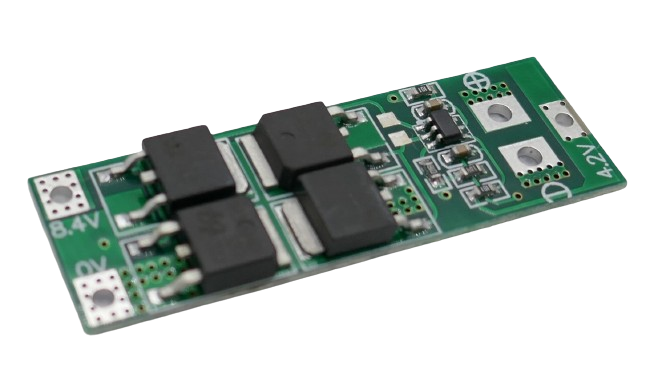
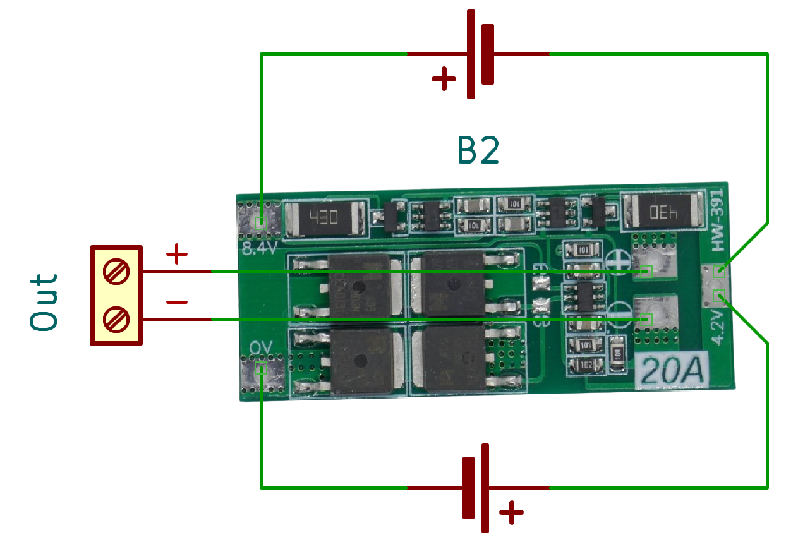

# 2S 20A Battery Management Systems (BMS)

> BMS For Two Battery Strings And 20A Max Current

> [!NOTE]
> **BMS** often ship in *locked state*: *no output voltage* is available at the output pins. *Locked state* is also entered whenever *over-current protection* was triggered. To *unlock* the **BMS**, connect it to a charger. If you did not add a dedicated *charger board*, apply the appropriate charging voltage to its output terminal.

> [!CAUTION]
> When connecting batteries to your **BMS**, make sure to use *wires* with sufficient diameter for the anticipated *high currents*.

> [!CAUTION]
> When designing *battery packs*, use batteries of *same type* and *same state of charge* only. It is recommended you *fully charge* all batteries before connecting. All batteries must have *the same voltage* (voltage difference less than *0.05V*). Do not mix batteries from different vendors, types, capacity, or age. 

## 20A

[LiIon](https://done.land/fundamentals/battery){:.button.button--success.button--rounded.button--sm}
 [LiPo](https://done.land/fundamentals/battery){:.button.button--success.button--rounded.button--sm}

For currents up to **20A**, you need a bigger board with more *MosFETs* that share the load. 

### Balanced

It is recommended to use a *balanced* board when you plan to *charge* your batteries through the *BMS*. *Balanced* boards are slightly larger and cost *very little* more. During charging, they make sure each *battery* is treated *individually*, so when one battery is fully charged while another one still lags behind, it can *balance* the charging and distribute charging power individually to individual cells.

### Unbalanced

*Unbalanced* boards are *physically smaller* and fine when you need a *BMS* for *discharging only*.

> [!NOTE]
> The *unbalanced* version of the particular board presented here goes by the name *HW392* or *X403* whereas the *balanced* version is often labelled *HW391*. These labels may or may not be printed on your boards.

### Terminals

All terminals are accessible both from top and bottom. 

Wiring is similar in both versions. Here is the wiring for the *balanced* board:

This is what the backside of the *unbalanced* board looks like:

### Wiring

Connect the batteries like this:

* First battery string to **0V** (-) and **4.2V** (+)
* Second battery string to **4.2V** (-) and **8.4V** (+)

The output voltage is available at **+** and **-** located in the inside of the board.

### Specs

| Protection | Threshold | 
| --- | --- | 
| Over-Charge | >4.3V | 
| Over-Discharge | <2.3-2.5V | 
| Over-Current | 25A | 
| Short Circuit | yes,resettable, 200mS delay | 
| Continuous Current | 20A (may need heat sink) |
| Size | 48x20x3.4mm |

### Charging

When *charging* batteries through this **BMS**, the charging voltage needs to be *8.4-9.0V*. The **BMS** limits the charging current to *10A*.

> Tags: Battery, BMS, 2S, 20A

[Visit Page on Website](https://done.land/components/power/bms/2s/20a?862063031416241946) - created 2024-03-21
