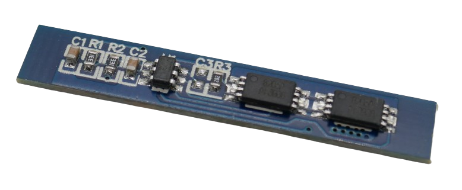

# 2S 3A Battery Management Systems (BMS)

> BMS For Two Battery Strings And 3A Max Current

> [!NOTE]
> **BMS** often ship in *locked state*: *no output voltage* is available at the output pins. 
> *Locked state* is entered whenever *over-current protection* was triggered. 
> To *unlock* the **BMS**, connect it to a charger. If you did not add a dedicated *charger board*, apply the appropriate charging voltage to its output terminal.

> [!CAUTION]
> When connecting batteries to your **BMS**, make sure you use *wires* with sufficient diameter for the anticipated *high currents*.
> Also make sure you only use batteries of *same type* and *same state of charge*. It is recommended you *fully charge* all batteries before connecting. All batteries must have *the same voltage* (voltage difference less than *0.05V*). Do not mix batteries from different vendors, types, capacity, or age. 

## 3A

[LiIon/LiPo](#){:.button.button--success.button--rounded.button--sm}

For currents up to **3A**, you can use a very small **BMS**:

The connectors are located on the back:

Connect the batteries like this:

* First battery string to **B-** (-) and **BM** (+)
* Second battery string to **BM** (-) and **B+** (+)

The output voltage is available at **P+** and **P-**.

### Specs

| Protection | Threshold | 
| --- | --- | 
| Over-Charge | >4.3V |
| Over-Discharge | <2.3V |
| Over-Current | 5A | 
| Short Circuit | yes,resettable | 
| Continuous Current | 3A |
| Size | 6.6x36.2mm |

> Tags: Battery, BMS, 2S, 3A

:eye:&nbsp;[Visit Page on Website](https://done.land/components/power/bms/2s/3a?893974031416241946) - last edited 2024-03-16
