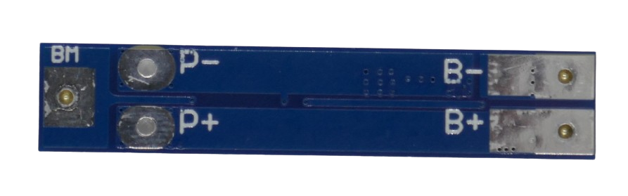

# 2S 8A Battery Management Systems (BMS)

> BMS For Two Battery Strings And 8A Max Current

> [!NOTE]
> **BMS** often ship in *locked state*: *no output voltage* is available at the output pins. *Locked state* is also entered whenever *over-current protection* was triggered. To *unlock* the **BMS**, connect it to a charger. If you did not add a dedicated *charger board*, apply the appropriate charging voltage to its output terminal.

> [!CAUTION]
> When connecting batteries to your **BMS**, make sure to use *wires* with sufficient diameter for the anticipated *high currents*.

> [!CAUTION]
> When designing *battery packs*, use batteries of *same type* and *same state of charge* only. It is recommended you *fully charge* all batteries before connecting. All batteries must have *the same voltage* (voltage difference less than *0.05V*). Do not mix batteries from different vendors, types, capacity, or age. 

## 8A

[LiIon](https://done.land/fundamentals/battery){:.button.button--success.button--rounded.button--sm}
 [LiPo](https://done.land/fundamentals/battery){:.button.button--success.button--rounded.button--sm}

For currents up to **8A**, one of the commonly used boards exists in a simple *unbalanced* and a *balanced* version.

### Unbalanced

The *unbalanced* version is *smaller* and more suitable when space is scarce. If you plan to *charge* the batteries through the *BMS*, you should still aim to use the *balanced* version.

The terminals are accessible both from top and bottom.

### Balanced

The *balanced* version is different only when you *charge* the batteries: now the *balanced* board monitors each individual battery cell and can adjust the charge *individually* to ensure that *all cells* are *fully charged*.

The terminals are accessible both from top and bottom.

### Connections

Connect the batteries like this:

* First battery string to **B-** (-) and **BM** (+)
* Second battery string to **BM** (-) and **B+** (+)

The output voltage is available at **P+** and **P-**.

### Specs

| Protection | Threshold | 
| --- | --- | 
| Over-Charge | >4.3V | 
| Over-Discharge | <2.5V | 
| Over-Current | 15A | 
| Short Circuit | yes,resettable | 
| Continuous Current | 8A |
| Size | 41x16x3.5mm |

> Tags: Battery, BMS, 2S, 8A

:eye:&nbsp;[Visit Page on Website](https://done.land/components/power/bms/2s/8a?927886031416241946) - last edited 2024-03-22
