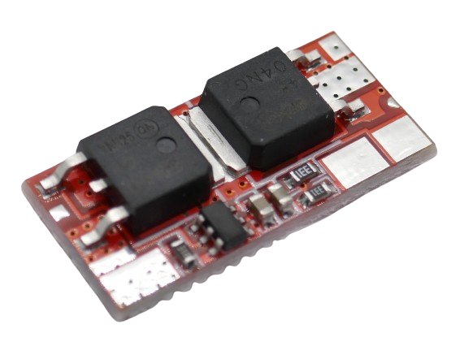

# 2S - Using 2 Batteries in Series

> 2S BMS Protect Two (Groups of) Batteries From Mishap. Combined With Balancing They Are A Perfect Fit For Your Batteries.

A **2S BMS** is needed to protect *two* batteries (or groups of batteries connected *in parallel*) that are connected *in series*. 

Each lithium battery has a voltage between *3.2V*-*4.2V*, depending on state of charge. When you connect two of them *in series*, the **BMS** needs to handle a voltage in the range of *6.4V*-*8.4V*.

> [!IMPORTANT]
> **BMS** often ship in *locked state*: *no output voltage* is available at the output pins. 
> *Locked state* is entered whenever *over-current protection* was triggered. 
> To *unlock* the **BMS**, connect it to a charger. If you did not add a dedicated *charger board*, apply *8.4-9.0V* to its output terminal.

> [!CAUTION]
> When connecting batteries to your **BMS**, make sure you use *wires* with sufficient diameter for the anticipated *high currents*.
> Also make sure you only use batteries of *same type* and *same state of charge*. It is recommended you *fully charge* all batteries before connecting. All batteries must have *the same voltage* (voltage difference less than *0.05V*). Do not mix batteries from different vendors, types, capacity, or age. 

All **BMS** listed below are designed for *LiIon* and *LiPo* batteries. They are not compatible with *LiFePo4* batteries because *LiFePo4* uses different cell voltages.

## 3A

For currents up to **3A**, you can use a very small **BMS**:

The connectors are located on the back:

Connect the batteries like this:

* First battery string to **B-** (-) and **BM** (+)
* Second battery string to **BM** (-) and **B+** (+)

The output voltage is available at **P+** and **P-**.

### Specs

| Protection | Threshold | 
| --- | --- | 
| Over-Charge | >4.3V |
| Over-Discharge | <2.3V |
| Over-Current | 5A | 
| Short Circuit | yes,resettable | 
| Continuous Current | 3A |
| Size | 6.6x36.2mm |

## 8A

For currents up to **8A**, a board with more powerful *MosFET* like this one is necessary:

The terminals are accessible both from top and bottom.

Connect the batteries like this:

* First battery string to **B-** (-) and **BM** (+)
* Second battery string to **BM** (-) and **B+** (+)

The output voltage is available at **P+** and **P-**.

### Specs

| Protection | Threshold | 
| --- | --- | 
| Over-Charge | >4.3V | 
| Over-Discharge | <2.5V | 
| Over-Current | 15A | 
| Short Circuit | yes,resettable | 
| Continuous Current | 8A |
| Size | 41x16x3.5mm |

## 10A

For currents up to **10A**, a very *compact* board is available:

Unfortunately, the compactness of the board did not leave room for markings on the front side. Instead, the markings for the soldering pads were printed on the *back side*:

On the other end, the board has a big soldering pad marked as **B-** which is accessible from both sides, and two smaller ones marked **B1** and **B+** on the backside whereas the solder pads are accessible on the front.

Connect the batteries like this:

* First battery string to **B-** (-) and **B1** (+)
* Second battery string to **B1** (-) and **B+** (+)

The output voltage is available at **B+** and **C-**. These two pads are accessible from both sides.

### Specs

| Protection | Threshold | 
| --- | --- | 
| Over-Charge | >4.3V | 
| Over-Discharge | <2.3-2.5V | 
| Over-Current | 16A | 
| Short Circuit | yes,resettable, 200mS delay | 
| Continuous Current | 10A |
| Size | 24x11x2mm |

### Charging

When *charging* batteries through this **BMS**, the charging voltage needs to be *8.4V*. The **BMS** limits the charging current to *10A*.

> [!CAUTION]
> This board is available as **1S BMS** also and looks almost the same. The **1S BMS** is lacking the **B1** terminal.

## 20A

For currents up to **20A**, you need a bigger board with more *MosFETs* that share the load, like this one:

All terminals are accessible both from top and bottom.

Connect the batteries like this:

* First battery string to **0V** (-) and **4.2V** (+)
* Second battery string to **4.2V** (-) and **8.4V** (+)

The output voltage is available at **+** and **-** located in the inside of the board.

### Specs

| Protection | Threshold | 
| --- | --- | 
| Over-Charge | >4.3V | 
| Over-Discharge | <2.3-2.5V | 
| Over-Current | 25A | 
| Short Circuit | yes,resettable, 200mS delay | 
| Continuous Current | 20A (may need heat sink) |
| Size | 48x20x3.4mm |

### Charging

When *charging* batteries through this **BMS**, the charging voltage needs to be *8.4-9.0V*. The **BMS** limits the charging current to *10A*.

> Tags: Battery, BMS, 2S

:eye:&nbsp;[Visit Page on Website](https://powershell.one/doneland_test/components/power/bms/2s?268282020426240854) - last edited 2024-02-27
